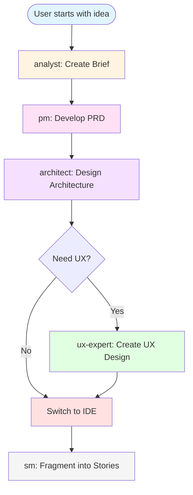
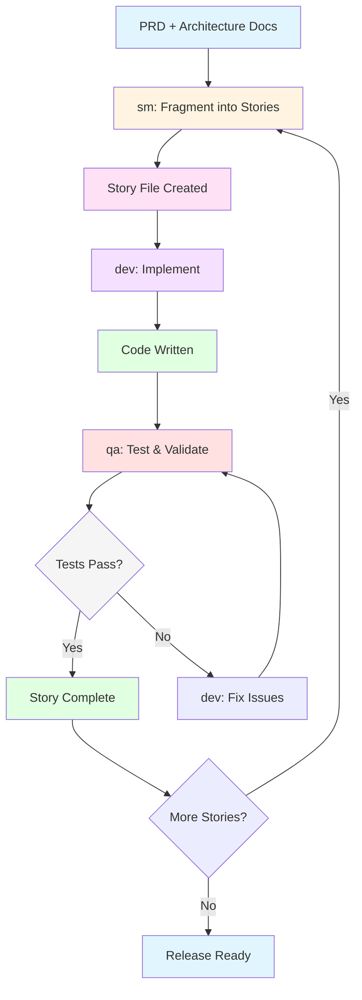

# Guia do Usuário AIOS-FULLSTACK

## Visão Geral

O AIOS-FULLSTACK é um framework de desenvolvimento full stack orientado por agentes de IA que implementa uma metodologia ágil única. Este guia explica como usar o AIOS-FULLSTACK de forma eficaz através de suas duas fases principais: **Planejamento** e **Desenvolvimento**.

### As Duas Inovações Chave

**1. Planejamento Agêntico**: Agentes dedicados (analyst, pm, architect) colaboram com você para criar documentos de PRD (Product Requirements Document) e Arquitetura detalhados e consistentes. Através de engenharia avançada de prompts e refinamento com human-in-the-loop, estes agentes de planejamento produzem especificações abrangentes.

**2. Desenvolvimento Contextualizado por Engenharia**: O agente sm (Scrum Master) transforma estes planos detalhados em histórias de desenvolvimento hiperdetalhadas que contêm tudo que o agente dev precisa - contexto completo, detalhes de implementação e orientação arquitetural incorporada diretamente nos arquivos de histórias.

Esta abordagem de duas fases elimina tanto a **inconsistência de planejamento** quanto a **perda de contexto** - os maiores problemas no desenvolvimento assistido por IA.

## Pré-requisitos

Antes de começar, certifique-se de ter:

- **Node.js** 20.0.0 ou superior instalado
- **npm** ou outro gerenciador de pacotes
- **GitHub CLI** (gh) instalado e configurado (para colaboração em equipe)
- Um **IDE compatível**: Windsurf, Cursor, ou Claude Code
- **Acesso a um agente de IA**: Claude, GPT-4, Gemini, ou similar

## Fluxo de Trabalho de Planejamento e Execução

O AIOS-FULLSTACK usa uma abordagem de duas fases que separa planejamento estratégico de implementação tática:

### Fase 1: Planejamento (Interface Web)

Use o agente de IA na interface web (Claude.ai, ChatGPT, Gemini, etc.) para:

1. **Briefing e Análise** - Trabalhe com o agente **analyst** para criar o briefing inicial
2. **Product Requirements** - Use o **pm** (Product Manager) para desenvolver o PRD completo
3. **Arquitetura do Sistema** - Colabore com o **architect** para design técnico
4. **Design UX** (opcional) - Trabalhe com **ux-expert** para experiência do usuário

### Fase 2: Desenvolvimento (IDE)

Mude para seu IDE (Windsurf, Cursor ou Claude Code) para:

1. **Fragmentação de Histórias** - Use o **sm** (Scrum Master) para criar histórias de desenvolvimento
2. **Implementação** - Trabalhe com o **dev** para codificar as features
3. **Garantia de Qualidade** - Use o **qa** para testes e validação
4. **Gerenciamento de Backlog** - **po** (Product Owner) gerencia prioridades

## O Fluxo de Planejamento (Interface Web)

Este diagrama mostra o fluxo de trabalho de planejamento de alto nível usando agentes na interface web:



### Trabalhando com Agentes de Planejamento

#### 1. analyst - Analista de Negócios

O agente **analyst** ajuda você a:
- Entender e documentar requisitos de negócio
- Identificar stakeholders e suas necessidades
- Criar briefings detalhados do projeto
- Definir objetivos e métricas de sucesso

**Comandos comuns**:
- `*help` - Mostrar comandos disponíveis
- `*create-brief` - Criar novo briefing
- `*analyze-requirements` - Analisar requisitos
- `*exit` - Sair do agente

#### 2. pm - Product Manager

O **pm** (Product Manager) é responsável por:
- Transformar briefings em PRDs estruturados
- Definir features e prioridades
- Criar roadmaps de produto
- Estabelecer critérios de aceitação

**Fluxo típico**:
1. Recebe o briefing do analyst
2. Faz perguntas de esclarecimento
3. Cria PRD fragmentado por seções
4. Refina com feedback do usuário

#### 3. architect - Arquiteto de Sistema

O agente **architect** desenha:
- Arquitetura técnica do sistema
- Escolha de tecnologias e frameworks
- Estrutura de dados e modelos
- Padrões de design e best practices
- Diagramas de componentes e fluxos

**Responsabilidades**:
- Criar documentos de arquitetura técnica
- Definir stack tecnológico
- Estabelecer padrões de código
- Planejar escalabilidade e performance

#### 4. ux-expert - Especialista em UX (Opcional)

O **ux-expert** foca em:
- Design de interface do usuário
- Fluxos de usuário e jornadas
- Wireframes e mockups conceituais
- Princípios de usabilidade

### Documentos Criados na Fase de Planejamento

Ao final da fase de planejamento, você terá:

```
docs/
├── brief/
│   └── project-brief.md           # Briefing inicial do projeto
├── prd/
│   ├── 01-overview.md             # Visão geral do produto
│   ├── 02-features.md             # Especificação de features
│   ├── 03-requirements.md         # Requisitos detalhados
│   └── 04-success-metrics.md      # Métricas de sucesso
├── architecture/
│   ├── 01-system-design.md        # Design do sistema
│   ├── 02-tech-stack.md           # Stack tecnológico
│   ├── 03-data-models.md          # Modelos de dados
│   └── 04-patterns.md             # Padrões e convenções
└── ux/ (opcional)
    ├── 01-user-flows.md           # Fluxos de usuário
    └── 02-wireframes.md           # Wireframes conceituais
```

## O Ciclo Principal de Desenvolvimento (IDE)

Após completar o planejamento, você muda para o IDE onde o trabalho real de implementação acontece:



### Trabalhando com Agentes de Desenvolvimento

#### 1. sm - Scrum Master

O **sm** (Scrum Master) é crucial para organizar o trabalho:

**Responsabilidades principais**:
- Fragmentar PRD e Arquitetura em histórias de desenvolvimento
- Criar arquivos de story em `docs/stories/`
- Definir tarefas e checkboxes para cada story
- Estabelecer critérios de aceitação
- Organizar dependências entre stories

**Estrutura de uma Story**:
```markdown
# Story 1.1: Configuração Inicial do Projeto

## Descrição
Configurar a estrutura inicial do projeto...

## Contexto
[Referências ao PRD e Arquitetura]

## Tarefas
- [ ] Inicializar repositório Git
- [ ] Configurar package.json
- [ ] Instalar dependências base
- [ ] Criar estrutura de diretórios

## Critérios de Aceitação
- [ ] Projeto inicializa sem erros
- [ ] Todas as dependências instaladas
- [ ] Estrutura de pastas criada

## Arquivos Criados/Modificados
[Atualizado pelo dev durante implementação]

## Notas
[Anotações do dev e qa]
```

#### 2. dev - Desenvolvedor

O agente **dev** é responsável pela implementação:

**Fluxo de trabalho**:
1. Lê a story atual
2. Entende o contexto do PRD e Arquitetura
3. Implementa o código seguindo os padrões
4. Atualiza checkboxes conforme completa tarefas
5. Mantém a seção "Arquivos Criados/Modificados"
6. Adiciona notas sobre decisões técnicas

**Boas práticas**:
- Sempre ler a story completamente antes de começar
- Seguir padrões definidos na Arquitetura
- Escrever código limpo e auto-documentado
- Adicionar tratamento de erros
- Documentar decisões importantes nas Notas

**Comandos no IDE**:
- `*read-story {id}` - Ler uma story específica
- `*update-story` - Atualizar progresso da story
- `*complete-task {id}` - Marcar tarefa como completa

#### 3. qa - Quality Assurance

O agente **qa** valida a implementação:

**Responsabilidades**:
- Revisar código implementado
- Executar testes
- Validar critérios de aceitação
- Reportar bugs e problemas
- Sugerir melhorias

**Processo de validação**:
1. Revisar código do dev
2. Executar suite de testes
3. Validar critérios de aceitação
4. Testar edge cases
5. Documentar resultados nas Notas da story

**Tipos de validação**:
- ✅ **Testes unitários** - Funções individuais
- ✅ **Testes de integração** - Componentes juntos
- ✅ **Testes E2E** - Fluxos completos
- ✅ **Code review** - Qualidade do código
- ✅ **Performance** - Métricas de performance

#### 4. po - Product Owner

O **po** (Product Owner) gerencia o backlog:

**Funções**:
- Priorizar stories no backlog
- Clarificar requisitos quando necessário
- Validar que implementação atende o PRD
- Aprovar stories completadas
- Ajustar escopo conforme necessário

## Capacidades do Test Architect (QA Agent)

O agente **qa** do AIOS-FULLSTACK inclui capacidades avançadas de arquitetura de testes:

### 1. Perfil de Risco e Priorização

O QA Agent pode:
- Analisar o código para identificar áreas de alto risco
- Priorizar esforços de teste baseado em complexidade
- Sugerir estratégias de teste apropriadas
- Balancear cobertura vs. recursos

### 2. Geração Automática de Testes

**Testes Unitários**:
```javascript
// Exemplo gerado pelo qa agent
describe('UserService', () => {
  it('should create user with valid data', async () => {
    const userData = { name: 'Test', email: 'test@example.com' };
    const result = await userService.create(userData);
    expect(result).toHaveProperty('id');
    expect(result.name).toBe('Test');
  });

  it('should reject invalid email', async () => {
    const userData = { name: 'Test', email: 'invalid' };
    await expect(userService.create(userData))
      .rejects.toThrow('Invalid email');
  });
});
```

**Testes de Integração**:
- Testes de API endpoints
- Testes de banco de dados
- Testes de serviços externos
- Testes de autenticação/autorização

**Testes E2E**:
- Fluxos completos de usuário
- Navegação entre páginas
- Submissão de formulários
- Validação de estados

### 3. Estratégias de Teste

O QA Agent sugere estratégias baseadas em:

**Complexidade do Código**:
- Código complexo → Testes abrangentes + edge cases
- Código simples → Testes básicos de happy path
- Código crítico → Testes exaustivos + stress tests

**Tipo de Funcionalidade**:
- **CRUD básico** → Testes unitários + integração
- **Lógica de negócio** → Testes unitários extensivos
- **UI/UX** → Testes E2E + acessibilidade
- **APIs** → Testes de contrato + carga

### 4. Cobertura e Métricas

O agente **qa** monitora:
- Cobertura de código (linha, branch, função)
- Cobertura de features (vs. PRD)
- Cobertura de cenários de usuário
- Métricas de qualidade (bugs encontrados, tempo de fix)

## Integração com IDE

### Configuração para Windsurf

1. **Configurar regras globais**:
   - Abrir Settings → Global Rules
   - Copiar conteúdo de `.windsurf/global-rules.md`
   - Salvar configuração

2. **Ativar agentes**:
   ```
   @dev
   *help
   ```

3. **Trabalhar com stories**:
   ```
   @sm
   *create-story "Implementar autenticação"
   ```

### Configuração para Cursor

1. **Configurar user rules**:
   - Abrir Settings → User Rules
   - Copiar conteúdo de `.cursor/global-rules.md`
   - Salvar configuração

2. **Comandos principais**:
   - `@agent-name` - Ativar agente específico
   - `*command` - Executar comando do agente
   - `*exit` - Sair do agente

### Configuração para Claude Code

1. **Automático**:
   - Arquivo `.claude/CLAUDE.md` é carregado automaticamente
   - Nenhuma configuração manual necessária

2. **Recursos especiais**:
   - Reconhecimento automático de comandos AIOS
   - Integração com workflows e tasks
   - Rastreamento automático de checkboxes

## Sistema de Preferências Técnicas

O AIOS-FULLSTACK permite configurar preferências técnicas que influenciam decisões dos agentes:

### Definir Preferências

Crie um arquivo `docs/tech-preferences.md`:

```markdown
# Preferências Técnicas do Projeto

## Stack Principal
- **Backend**: Node.js + Express
- **Frontend**: React + TypeScript
- **Banco de Dados**: PostgreSQL
- **ORM**: Prisma

## Padrões de Código
- **Style Guide**: Airbnb JavaScript Style Guide
- **Linting**: ESLint + Prettier
- **Testing**: Jest + React Testing Library

## Arquitetura
- **Pattern**: Clean Architecture
- **API**: RESTful + GraphQL
- **Auth**: JWT + OAuth2

## DevOps
- **CI/CD**: GitHub Actions
- **Hosting**: Vercel (Frontend) + Railway (Backend)
- **Monitoring**: Sentry + LogRocket
```

### Como os Agentes Usam as Preferências

**architect**:
- Usa preferências para desenhar arquitetura consistente
- Sugere tecnologias alinhadas com o stack definido
- Aplica padrões especificados

**dev**:
- Implementa usando frameworks e bibliotecas preferidos
- Segue style guides e padrões definidos
- Usa ferramentas de desenvolvimento especificadas

**qa**:
- Configura testes com frameworks escolhidos
- Valida conformidade com padrões
- Verifica integração com ferramentas de CI/CD

## Fluxo de Trabalho Completo: Do Conceito à Produção

### 1. Ideação e Planejamento (Interface Web)

**Semana 1**: Trabalhe com agentes de planejamento

```
Dia 1-2: analyst
- Criar briefing inicial
- Identificar stakeholders
- Definir objetivos de negócio

Dia 3-4: pm
- Desenvolver PRD completo
- Definir features e prioridades
- Estabelecer roadmap

Dia 5-6: architect
- Desenhar arquitetura técnica
- Escolher stack tecnológico
- Criar diagramas de sistema

Dia 7 (opcional): ux-expert
- Design de experiência do usuário
- Criar wireframes
- Definir fluxos de usuário
```

### 2. Preparação para Desenvolvimento (IDE)

**Início da Semana 2**: Setup e fragmentação

```
@sm
*fragment-prd

[sm cria stories numeradas baseadas no PRD]

Stories criadas:
- Story 1.1: Setup inicial do projeto
- Story 1.2: Configurar banco de dados
- Story 2.1: Implementar autenticação
- Story 2.2: CRUD de usuários
- Story 3.1: UI de login
...
```

### 3. Desenvolvimento Iterativo (IDE)

**Semanas 2-X**: Ciclo dev → qa

Para cada story:

```
@dev
*read-story 1.1

[dev implementa seguindo a story]
[atualiza checkboxes: [ ] → [x]]
[adiciona arquivos criados]
[documenta decisões nas Notas]

@qa
*validate-story 1.1

[qa revisa código]
[executa testes]
[valida critérios de aceitação]
[reporta issues ou aprova]
```

### 4. Gestão de Backlog (Contínua)

```
@po
*prioritize-backlog

[po reorganiza stories baseado em:]
- Feedback de stakeholders
- Blockers e dependências
- Mudanças de requisitos
- Valor de negócio
```

### 5. Release e Deployment

Quando todas as stories estão completas:

```
@qa
*final-validation

[qa executa:]
- Suite completa de testes
- Testes de regressão
- Validação de performance
- Security audit

@dev
*prepare-release

[dev prepara:]
- Build de produção
- Documentação de deployment
- Migration scripts
- Rollback procedures
```

## Boas Práticas e Dicas

### Para Fase de Planejamento

✅ **Faça**:
- Seja específico e detalhado no briefing inicial
- Responda completamente às perguntas dos agentes
- Revise e refine documentos iterativamente
- Mantenha consistência entre PRD e Arquitetura
- Documente decisões importantes e suas razões

❌ **Evite**:
- Pular etapas do planejamento
- Criar PRDs vagos ou incompletos
- Ignorar considerações de arquitetura
- Misturar requisitos de negócio com detalhes de implementação

### Para Fase de Desenvolvimento

✅ **Faça**:
- Trabalhe uma story por vez, do início ao fim
- Atualize checkboxes imediatamente após completar tarefas
- Mantenha a lista "Arquivos Criados/Modificados" atualizada
- Documente decisões técnicas importantes nas Notas
- Execute testes antes de marcar story como completa
- Siga os padrões definidos na Arquitetura

❌ **Evite**:
- Começar múltiplas stories simultaneamente
- Pular testes ou validação de QA
- Ignorar critérios de aceitação
- Desviar dos padrões sem documentar
- Deixar checkboxes desatualizados

### Comunicação Entre Agentes

As stories servem como **meio de comunicação** entre agentes:

**sm → dev**: Story define o que construir
**dev → qa**: Notas da story explicam como foi construído
**qa → dev**: Notas da story reportam issues
**po → todos**: Priorização e esclarecimentos

**Exemplo de comunicação via Notas**:

```markdown
## Notas

### [dev - 2025-01-15]
Implementei autenticação usando JWT com refresh tokens.
Escolhi bcrypt para hash de senhas (10 rounds).
Tokens expiram em 15min, refresh em 7 dias.

### [qa - 2025-01-16]
✅ Testes unitários passando (12/12)
✅ Testes de integração OK (5/5)
⚠️ Encontrado: Token não é invalidado no logout
   Severity: HIGH
   Precisa fix antes de aprovar

### [dev - 2025-01-16]
✅ Fix aplicado: Implementado blacklist de tokens
✅ Novos testes adicionados para logout
Pronto para nova validação

### [qa - 2025-01-17]
✅ Story aprovada
Todos os critérios atendidos
```

## Trabalhando em Projetos Brownfield

Ao integrar AIOS-FULLSTACK em projetos existentes:

### 1. Análise Inicial

```
@analyst
*analyze-existing-project

[Forneça ao analyst:]
- Visão geral do projeto atual
- Stack tecnológico existente
- Documentação disponível
- Pain points e objetivos de melhoria
```

### 2. Documentação Retroativa

```
@architect
*document-existing-architecture

[architect criará:]
- Mapeamento da arquitetura atual
- Identificação de padrões existentes
- Documentação de tech debt
- Recomendações de melhoria
```

### 3. Planejamento Incremental

```
@pm
*create-migration-plan

[pm desenvolverá:]
- Roadmap de migração
- Stories de refatoração
- Plano de modernização
- Estratégia de rollout
```

## Solução de Problemas

### Agente não está seguindo instruções

**Problema**: Agente ignora parte do PRD ou Arquitetura

**Solução**:
1. Verifique se o documento está fragmentado corretamente
2. Certifique-se de que o contexto está explícito na story
3. Use notas na story para dar contexto adicional
4. Se necessário, fragmente a story em partes menores

### Stories muito grandes

**Problema**: Story tem muitas tarefas e se torna difícil de gerenciar

**Solução**:
```
@sm
*split-story 3.1

[sm dividirá em:]
- Story 3.1a: Primeira parte
- Story 3.1b: Segunda parte
```

### Conflito entre PRD e Arquitetura

**Problema**: PRD pede feature que conflita com arquitetura

**Solução**:
1. Volte para a interface web
2. Trabalhe com pm e architect para resolver
3. Atualize os documentos
4. Notifique o sm para revisar stories afetadas

### Mudança de requisitos

**Problema**: Cliente/stakeholder muda requisitos no meio do projeto

**Solução**:
```
1. @po
   *update-prd "Nova feature X necessária"

2. @architect
   *assess-impact "Nova feature X"

3. @sm
   *create-change-stories

4. @po
   *reprioritize-backlog
```

## Meta-Agentes

O AIOS-FULLSTACK inclui meta-agentes para orquestração:

### aios-master

O **aios-master** é o agente de orquestração principal:

**Capacidades**:
- Coordenar múltiplos agentes
- Executar workflows complexos
- Gerenciar estado do projeto
- Tomar decisões de alto nível

**Quando usar**:
- Operações que envolvem múltiplos agentes
- Workflows automatizados
- Situações que requerem decisões contextuais

### aios-orchestrator

O **aios-orchestrator** gerencia fluxos de trabalho:

**Funções**:
- Sequenciar tarefas entre agentes
- Gerenciar dependências
- Monitorar progresso
- Coordenar handoffs

### aios-developer

O **aios-developer** é o meta-agente para o próprio AIOS:

**Uso**:
- Criar novos agentes
- Modificar workflows
- Estender o framework
- Customizar comportamentos

```
@aios-developer
*create-agent "custom-agent"

[aios-developer guiará você na criação de um novo agente]
```

## Expansão e Customização

### Expansion Packs

O AIOS-FULLSTACK suporta expansion packs para domínios específicos:

**Instalados por padrão**:
- **aios-infrastructure-devops** - DevOps e infraestrutura
- **expansion-creator** - Criar novos expansion packs
- **hybrid-ops** - Operações híbridas humano-agente
- **meeting-notes** - Notas e atas de reuniões

**Instalar novo expansion pack**:
```bash
npx aios-fullstack install
# Selecione expansion packs desejados na interface
```

### Criar Seus Próprios Agentes

Use o **aios-developer** para criar agentes customizados:

```
@aios-developer
*create-agent

[Siga a elicitação interativa:]
Nome do agente: data-scientist
Expertise: Análise de dados e machine learning
Comandos principais: *analyze, *visualize, *predict
Workflows: data-analysis.yml, ml-model.yml
```

### Criar Templates Customizados

Adicione templates próprios em `aios-core/templates/`:

```markdown
---
template: custom-document
category: planning
description: Template personalizado para X
---

# Título do Template

## Seções
...
```

## Checklist de Workflow

Use este checklist para garantir que está seguindo o workflow corretamente:

### Fase de Planejamento (Web UI)
- [ ] Briefing criado com analyst
- [ ] PRD completo desenvolvido com pm
- [ ] Arquitetura técnica definida com architect
- [ ] UX design criado (se aplicável) com ux-expert
- [ ] Todos os documentos revisados e aprovados
- [ ] Preferências técnicas documentadas
- [ ] Pronto para mudança ao IDE

### Fase de Desenvolvimento (IDE)
- [ ] Stories criadas pelo sm
- [ ] Dependências entre stories identificadas
- [ ] Stories priorizadas pelo po
- [ ] Working directory configurado
- [ ] Repositório Git inicializado
- [ ] IDE configurado com regras AIOS

### Para Cada Story
- [ ] Story lida completamente
- [ ] Contexto do PRD/Arquitetura entendido
- [ ] Implementação seguindo padrões
- [ ] Checkboxes atualizados durante trabalho
- [ ] Arquivos criados/modificados documentados
- [ ] Testes escritos e executados
- [ ] Code review realizado
- [ ] Critérios de aceitação validados
- [ ] Notas documentadas com decisões
- [ ] Story aprovada pelo qa

### Antes do Release
- [ ] Todas as stories completas
- [ ] Suite completa de testes passando
- [ ] Documentação atualizada
- [ ] Performance validada
- [ ] Security audit realizado
- [ ] Build de produção testado
- [ ] Plano de deployment pronto
- [ ] Procedimentos de rollback documentados

## Recursos Adicionais

### Documentação
- [Guia de Instalação](../docs/getting-started.md)
- [Arquitetura do AIOS](../docs/architecture.md)
- [Guia de Expansion Packs](../docs/expansion-packs.md)
- [Trabalhando em Brownfield](./working-in-the-brownfield.md)

### Suporte
- [GitHub Issues](https://github.com/Pedrovaleriolopez/aios-fullstack/issues)

### Exemplos
Veja `expansion-packs/` para exemplos de:
- Agentes customizados
- Workflows especializados
- Templates de documentos
- Checklists de validação

---

**Nota**: Este guia é uma visão geral. Para detalhes específicos de implementação, consulte a documentação técnica na pasta `docs/`.

*AIOS-FULLSTACK User Guide v2.0*
*Última atualização: Janeiro 2025*
