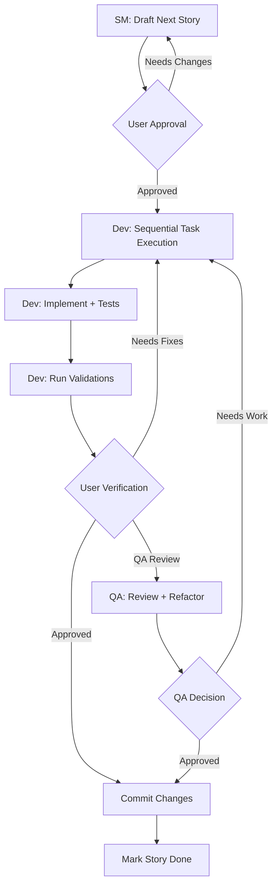

# 🧠 Lendário.ai - Mente Lendária

> **Uma biblioteca de consciências. Distribuindo cognição humana de gênios em escala.**

Mente Lendária combina o framework **AIOS-FULLSTACK** para desenvolvimento ágil orientado por IA com o **MMOS (Mind Mapper OS)** para capturar e replicar o DNA Mental - a arquitetura cognitiva única de cada mente brilhante - tornando-a acessível e amplificando a capacidade de quem usa.

**Mentores lendários na palma da sua mão.**

---

## 📋 Índice

- [Visão Geral](#-visão-geral)
- [Componentes Principais](#-componentes-principais)
- [Estrutura do Projeto](#-estrutura-do-projeto)
- [Quick Start](#-quick-start)
- [Ferramentas e Scripts](#-ferramentas-e-scripts)
- [Documentação](#-documentação)
- [Desenvolvimento](#-desenvolvimento)
- [Contribuindo](#-contribuindo)

---

## 🎯 Visão Geral

O Mente Lendária é uma plataforma completa que permite:

1. **Mapear Arquiteturas Cognitivas**: Pipeline estruturado para extrair padrões de pensamento, comunicação e tomada de decisão de personalidades específicas
2. **Criar Clones de IA**: Gerar system prompts que replicam fielmente essas personalidades em LLMs
3. **Orquestrar Desenvolvimento**: Framework AIOS para gerenciar todo o ciclo de desenvolvimento com agentes especializados
4. **Automatizar Workflows**: Launcher, board de telemetria e assistentes para execução eficiente

### Definições Fundamentais

- **Cognição**: Padrões únicos de processamento de informação de cada indivíduo
- **Arquitetura Mental**: Framework pessoal de tomada de decisão + heurísticas + viéses
- **DNA Mental**: Conjunto de algoritmos cognitivos replicáveis e transferíveis

### Solução First Principles

1. **Captura**: Isolar padrões cognitivos de gênios vivos/mortos através de análise massiva de conteúdo
2. **Codificação**: Transformar padrões em algoritmos replicáveis via fine-tuning de LLMs
3. **Distribuição**: Escala global via APIs e interfaces conversacionais
4. **Amplificação**: 10x na capacidade cognitiva do usuário médio

### Casos de Uso

- **Consultoria Virtual**: Obter insights de "mentores virtuais" baseados em grandes personalidades
- **Análise de Decisões**: Simular como diferentes líderes abordariam problemas específicos
- **Criação de Conteúdo**: Gerar conteúdo no estilo de copywriters, estrategistas ou pensadores renomados
- **Aprendizado**: Estudar padrões de pensamento de gênios aplicados a contextos práticos
- **Amplificação Cognitiva**: 10x na capacidade de processamento e tomada de decisão

---

## 🏗️ Componentes Principais

### 1. AIOS-FULLSTACK Framework

Sistema de orquestração para desenvolvimento ágil com IA que inclui:

- **Agentes Especializados**: PM, PO, Architect, Dev, QA, SM, Analyst
- **Workflows Estruturados**: Planning → Development → QA → Release
- **Task Management**: Sistema de tarefas, templates e checklists
- **Multi-IDE Support**: Claude Code, Cursor, Windsurf, VSCode

📚 [Documentação AIOS](.aios-core/user-guide.md)

### 2. MMOS (Mind Mapper OS) v3.0

Pipeline industrial para mapeamento cognitivo em 6 fases:

```
Viability → Research → Analysis → Synthesis → Implementation → Testing
```

**Recursos principais:**
- 📋 **Catálogo de Prompts**: Sistema YAML para gerenciar 48+ prompts especializados
- 🚀 **AIOS Launcher**: Script automatizado para executar prompts sequencialmente
- 📊 **Orchestration Board**: Dashboard de telemetria e progresso
- 🎯 **Clones Especializados**: Suporte para clones generalistas e especialistas

📚 [Documentação MMOS](docs/mmos/README.md)

### 3. Biblioteca de Minds/Clones

Coleção de personalidades mapeadas, incluindo:

- **Empreendedores**: Elon Musk, Gary Vee
- **Copywriters**: Dan Kennedy, Eugene Schwartz
- **Estrategistas**: Alex Hormozi, Dan Koe
- **Pensadores**: Mark Manson, Kapil Gupta, Nassim Taleb
- **Criadores**: Leonardo da Vinci
- **Técnicos**: Andrej Karpathy, Brad Frost
- **E mais...**

📚 [Catálogo de Clones](docs/minds/README.md) | [Status dos Clones](docs/minds/CLONES_STATUS.md)

---

## 📁 Estrutura do Projeto

```
mente_lendaria/
│
├── 📂 .aios-core/              # Framework AIOS-FULLSTACK
│   ├── agents/                 # Definições de agentes (YAML)
│   ├── tasks/                  # Workflows executáveis
│   ├── templates/              # Templates de documentos
│   ├── checklists/             # Checklists de validação
│   ├── utils/                  # Utilitários JavaScript
│   └── user-guide.md           # Guia do usuário AIOS
│
├── 📂 docs/                    # Documentação principal
│   ├── minds/                  # Clones de personalidades
│   │   ├── [nome-clone]/       # Estrutura individual de cada clone
│   │   │   ├── docs/           # PRD, README
│   │   │   ├── sources/        # Material fonte
│   │   │   ├── analysis/       # Análises de personalidade
│   │   │   ├── kb/             # Knowledge base
│   │   │   ├── system-prompts/ # System prompts versionados
│   │   │   └── specialists/    # Clones especializados
│   │   ├── README.md           # Guia de boas práticas
│   │   └── catalog.md          # Catálogo completo
│   │
│   └── mmos/                   # Mind Mapper OS v3.0
│       ├── README.md           # Visão geral AIOS-first
│       ├── prompts.yaml        # Catálogo único de prompts
│       ├── prompts/            # Todos os prompts (48+)
│       ├── templates/          # Templates por fase
│       ├── docs/               # Documentação detalhada
│       ├── scripts/            # Automação (launcher, board)
│       ├── launcher/           # AIOS Launcher
│       ├── board/              # Orchestration Board
│       ├── logs/               # Logs operacionais
│       └── orchestration/      # Guias de execução
│
├── 📂 .claude/                 # Configuração Claude Code
├── 📂 .cursor/                 # Configuração Cursor
├── 📂 .windsurf/               # Configuração Windsurf
│
└── README.md                   # Este arquivo
```

---

## 🚀 Quick Start

### Para Usuários Finais

1. Acesse [lendario.ai](https://lendario.ai)
2. Escolha seu mentor virtual
3. Converse naturalmente
4. Receba insights personalizados

### Para Desenvolvedores/Contribuidores

#### Pré-requisitos
- **Python 3.8+** e pip
- **Node.js 18+** e npm/yarn
- **Homebrew** (macOS) ou **apt** (Linux)
- Git com acesso ao repositório completo
- Credenciais/API keys configuradas (ver `.env.example`)

#### Instalação Rápida

```bash
# 1. Clone o repositório
git clone [repository-url]
cd mente_lendaria

# 2. Instalar dependências CLI
brew bundle                    # macOS
# ou: sudo apt install yt-dlp ffmpeg exiftool  # Linux

# 3. Instalar dependências Python
pip install -r requirements.txt

# 4. Configurar API keys
cp .env.example .env
# Editar .env com suas keys (ver docs/API_SETUP_GUIDE.md)

# 5. Verificar instalação
./mmos/scripts/check-api-keys.sh

# 6. Instale o AIOS Framework
npx bmad-method install
```

#### Checklist de Setup

- [ ] Estrutura AIOS instalada e verificada
- [ ] Dependências Python instaladas (`requirements.txt`)
- [ ] CLI tools instalados (yt-dlp, ffmpeg, exiftool)
- [ ] API keys configuradas e testadas
- [ ] Estrutura de mind criada com script
- [ ] Pipeline MMOS compreendido (`mmos/README.md`)
- [ ] Outputs Guide consultado (`mmos/docs/OUTPUTS_GUIDE.md`)

### 2. Executar AIOS Launcher (MMOS)

O launcher automatiza a execução sequencial dos prompts do pipeline MMOS:

```bash
# Executar próximo prompt pendente para uma personalidade
cd docs/mmos
./scripts/aios-launcher.sh --mind nassim_taleb

# Ver status geral
./scripts/aios-launcher.sh --status

# Listar comandos disponíveis
./scripts/aios-launcher.sh --help
```

### 3. Visualizar Progresso (Board)

```bash
# Ver progresso de uma personalidade
aios-board view --mind nassim_taleb

# Ver overview de todas as personalidades
aios-board overview

# Dashboard de telemetria
aios-board telemetry

# Auto-refresh
aios-board view --mind nassim_taleb --watch
```

### 4. Usar Agentes AIOS (IDE)

**Claude Code:**
```bash
/po          # Product Owner
/sm          # Scrum Master
/dev         # Developer
/qa          # Quality Assurance
```

**Cursor/Windsurf:**
```bash
@po Create next story
@sm Draft story from epic
@dev Implement feature
@qa Review implementation
```

---

## 🛠️ Ferramentas e Scripts

### AIOS Launcher

Script principal para automação do pipeline MMOS:

```bash
./scripts/aios-launcher.sh [OPTIONS]

Opções:
  --mind <name>      # Especificar personalidade
  --phase <phase>    # Filtrar por fase
  --status           # Ver status geral
  --reset <mind>     # Resetar progresso
  --help             # Ajuda completa
```

📚 [Documentação Launcher](docs/mmos/launcher/README.md)

### Orchestration Board

Dashboard de telemetria e visualização de progresso:

```bash
aios-board <command> [OPTIONS]

Comandos:
  view              # Visualizar progresso de um mind
  overview          # Overview multi-mind
  telemetry         # Dashboard de telemetria
  checkpoint        # Registrar checkpoint de validação
  export            # Exportar snapshot
```

📚 [Documentação Board](docs/mmos/board/README.md)

### Brownfield Assistant (em desenvolvimento)

Assistente para aplicar MMOS a clones existentes:

```bash
./scripts/brownfield-assistant.sh --mind <name> --analyze
```

---

## 📚 Documentação

### Guias Principais

- **[AIOS User Guide](.aios-core/user-guide.md)** - Como usar o framework AIOS
- **[AIOS Working in Brownfield](.aios-core/working-in-the-brownfield.md)** - Trabalhar com projetos existentes
- **[MMOS README](docs/mmos/README.md)** - Visão geral do Mind Mapper OS
- **[Minds README](docs/minds/README.md)** - Boas práticas para clones

### Documentação MMOS

- **[PRD](docs/mmos/docs/PRD.md)** - Product Requirements Document
- **[DNA Mental Methodology](docs/mmos/docs/DNA_MENTAL_METHODOLOGY.md)** - Metodologia de mapeamento
- **[Outputs Guide](docs/mmos/docs/OUTPUTS_GUIDE.md)** - Outputs esperados por fase
- **[Prompt Engineering Guide](docs/mmos/docs/PROMPT_ENGINEERING_GUIDE.md)** - Guia de engenharia de prompts
- **[Tools Guide](docs/mmos/docs/TOOLS_GUIDE.md)** - Ferramentas recomendadas
- **[Brownfield Workflow](docs/mmos/docs/BROWNFIELD_WORKFLOW.md)** - Workflow para clones existentes
- **[Parallel Collection Guide](docs/mmos/docs/PARALLEL_COLLECTION_GUIDE.md)** - Coleta paralela de dados

### Guias por Fase (MMOS)

- **[Viability Guide](docs/mmos/docs/stage-guides/viability.md)** - Fase de viabilidade
- **[Research Guide](docs/mmos/docs/stage-guides/research/README.md)** - Fase de pesquisa
- **[Analysis Guide](docs/mmos/docs/stage-guides/analysis.md)** - Fase de análise

### Stories (Desenvolvimento)

- **[Story 1.1 - AIOS Launcher](docs/mmos/launcher/README.md)** - ✅ Completo
- **[Story 1.2 - Orchestration Board](docs/mmos/board/README.md)** - ✅ Completo
- **[Story 1.3 - Brownfield Assistant](docs/mmos/docs/stories/story-1.3-brownfield-assistant.md)** - 🔄 Em progresso
- **[Story 1.5 - Auto-Execution Engine](docs/mmos/docs/stories/story-1.5-auto-execution-engine.md)** - 📋 Planejado

---

## 💻 Desenvolvimento

### Estrutura de Desenvolvimento AIOS

O projeto segue o modelo **Story-Driven Development**:

1. **Stories** definem features completas
2. **Epics** agrupam stories relacionadas
3. **Tasks** são passos executáveis dentro de stories
4. **Checklists** garantem qualidade e completude

### Workflow de Desenvolvimento



### Convenções

#### Commits
```bash
# Conventional commits
feat: implementar nova feature [Story X.Y]
fix: corrigir bug em component
docs: atualizar documentação
chore: manutenção geral
```

#### Nomenclatura de Arquivos
- **Geral**: `kebab-case` (snake_case para MMOS)
- **System Prompts**: `YYYYMMDD-HHMM-vX.Y-tipo-descriptor.md`
- **Logs**: `YYYYMMDD-HHMM-nome-arquivo.md`
- **Timestamps**: `YYYYMMDD-HHMM`

### Testing

```bash
# Executar testes
npm test

# Linting
npm run lint

# Type checking
npm run typecheck
```

### Comandos Úteis

```bash
# Criar log com timestamp
timestamp=$(date +"%Y%m%d-%H%M")
echo "# Log Title" > docs/mmos/logs/${timestamp}-NAME.md

# Validar estrutura mínima de mind
git rev-parse --show-toplevel
ls docs/minds/mind_name/{sources,artifacts,kb,docs,system_prompts}

# Criar estrutura de novo mind
cd docs/mmos/scripts/universal
./create-mind-structure.sh mind_name

# Validar mind completo
./validate-mind.sh mind_name
```

---

## 🛡️ Ética & Transparência

### ✅ Nossos Compromissos

- **Identificação Clara**: Minds sempre identificados como IA
- **Amplificação, não Substituição**: Foco em aumentar capacidades humanas
- **Transparência Total**: Metodologia e processos documentados
- **Privacidade**: Respeito rigoroso aos dados e privacidade
- **Código Aberto**: Framework e metodologia disponíveis publicamente

### ❌ O que NÃO fazemos

- **Impersonação Enganosa**: Nunca fazemos passar IA por pessoa real
- **Deepfakes ou Manipulação**: Sem conteúdo enganoso ou manipulativo
- **Conteúdo Prejudicial**: Bloqueio de uso malicioso ou prejudicial
- **Violação de Privacidade**: Respeito absoluto aos direitos individuais
- **Comercialização Não Autorizada**: Uso ético e legal das personalidades

---

## 🤝 Contribuindo

### Como Contribuir

1. **Fork** o projeto
2. Crie uma **branch** para sua feature (`git checkout -b feature/AmazingFeature`)
3. **Commit** suas mudanças (`git commit -m 'feat: add amazing feature'`)
4. **Push** para a branch (`git push origin feature/AmazingFeature`)
5. Abra um **Pull Request**

### Áreas para Contribuição

- 🧠 **Novos Clones**: Adicionar novas personalidades ao catálogo
- 📝 **Prompts**: Melhorar prompts existentes ou criar novos
- 🛠️ **Ferramentas**: Desenvolver novos scripts e automações
- 📚 **Documentação**: Melhorar guias e tutoriais
- 🐛 **Bug Fixes**: Corrigir problemas identificados

---

## 📞 Suporte e Comunidade

### Contato e Recursos

- 🌐 **Website**: [lendario.ai](https://lendario.ai)
- 📧 **Email**: alan@academialendaria.ai
- **GitHub Issues**: [Reportar bugs ou solicitar features](../../issues)
- **Discord AIOS**: [Comunidade AIOS](https://discord.gg/gk8jAdXWmj)
- **YouTube**: [AIOS Framework Channel](https://www.youtube.com/@AIOSFramework)
- **Documentação**: [GitHub Docs](https://github.com/Pedrovaleriolopez/aios-fullstack/docs)

---

## 👥 Time

**Desenvolvido pela Academia Lendar[IA]**

- **Alan Nicolas** - Founder & Chief Architect

---

## 🙏 Agradecimentos

- **AIOS-FULLSTACK Team**: Framework de orquestração
- **Comunidade Open Source**: Contribuições e feedback
- **Personalidades Mapeadas**: Inspiração e conhecimento compartilhado

---

## 🔗 Links Úteis

- [AIOS-FULLSTACK GitHub](https://github.com/Pedrovaleriolopez/aios-fullstack)
- [Claude Code](https://claude.ai/claude-code)
- [Anthropic](https://www.anthropic.com)

---

<div align="center">

**Desenvolvido com 🧠 e IA pela Academia Lendar[IA]**

*"Democratizando o acesso às mentes mais brilhantes da humanidade"*

---

**© 2025 Academia Lendar[IA] - Todos os direitos reservados**

</div>
