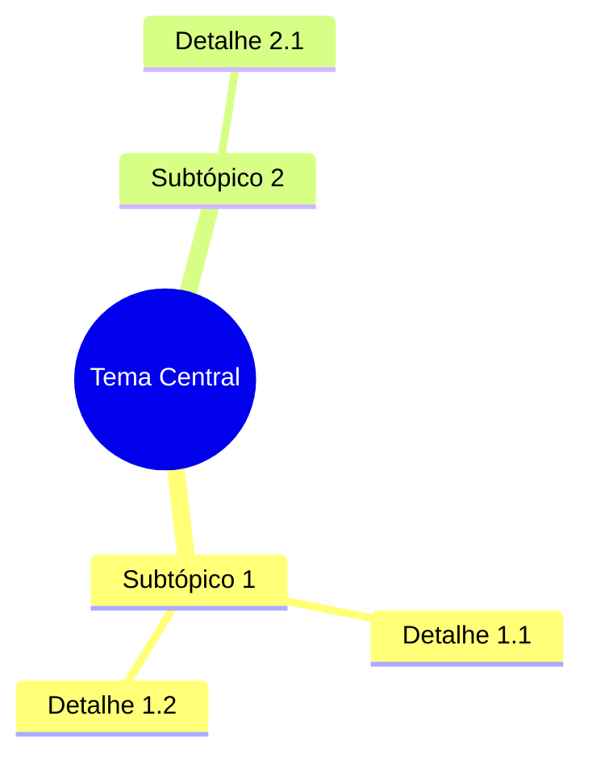

# Aula 3.1 - O Mapa do Tesouro

**Módulo:** 3 - O Laboratório Visual
**Duração:** 10 minutos
**Tipo:** Tutorial Prático (Screencast)

---

## Objetivo da Aula

Gerar mind maps estruturados a partir das sources para visualizar conexões e hierarquias de informação.

---

## Roteiro de Gravação

### INTRODUÇÃO (0:00 - 1:00)

**[CENA: Instrutor em câmera]**

Você já transformou documentos em áudio. Agora vamos transformar em **visual**.

Um mapa mental bem feito revela conexões que você não veria apenas lendo. É como ter uma **visão aérea** do conhecimento.

Nesta aula, você vai aprender a criar mapas mentais usando o NotebookLM.

---

### PARTE 1: ENTENDENDO MAPAS NO NOTEBOOKLM (1:00 - 2:30)

**[CENA: Screencast - interface]**

O NotebookLM não gera mapas visuais diretamente. Mas você pode usar o chat para criar estruturas que depois visualiza em outras ferramentas.

**Estratégia:**
1. Pedir ao NotebookLM para estruturar em formato de mapa
2. Copiar a estrutura
3. Colar em ferramenta de mind map (opcional)

**Ou:** Usar a estrutura textual diretamente (funciona muito bem!).

---

### PARTE 2: CRIANDO O MAPA VIA CHAT (2:30 - 6:00)

**[CENA: Screencast - chat do NotebookLM]**

#### Prompt Básico:

```
Create a mind map structure of the main concepts in these documents.

Use this format:
- Main Topic
  - Subtopic 1
    - Detail 1.1
    - Detail 1.2
  - Subtopic 2
    - Detail 2.1
```

**[DEMONSTRAR - executar prompt]**

---

#### Prompt para Mapa Hierárquico:

```
Organize all information from these sources into a hierarchical
mind map with 3 levels:

Level 1: Main themes (3-5 maximum)
Level 2: Key concepts under each theme
Level 3: Specific details or examples

Format as indented bullet points.
```

**[DEMONSTRAR]**

---

#### Prompt para Mapa de Conexões:

```
Create a concept map showing how the main ideas in these documents
connect to each other.

For each connection, briefly explain the relationship.

Format:
[Concept A] → connects to → [Concept B]
Relationship: [explanation]
```

**[DEMONSTRAR]**

---

#### Prompt para Mapa de Ação:

```
Create an action-oriented mind map from these documents:

- Central theme: [objetivo]
- Branches: Categories of action
- Leaves: Specific tasks or steps

Make it practical and actionable.
```

**[DEMONSTRAR]**

---

### PARTE 3: TRANSFORMANDO EM VISUAL (6:00 - 8:30)

**[CENA: Screencast - ferramentas externas]**

A estrutura que o NotebookLM gera pode ser visualizada em várias ferramentas:

#### Opção 1: Mermaid (Gratuito, no navegador)

**[DEMONSTRAR]**
1. Copie a estrutura do NotebookLM
2. Peça ao NotebookLM: "Convert this to Mermaid mindmap syntax"
3. Cole em mermaid.live
4. Visualize o mapa

**Exemplo de output Mermaid:**


---

#### Opção 2: Obsidian Canvas / Notion

**[DEMONSTRAR brevemente]**
1. Copie estrutura
2. Crie novo canvas/page
3. Cole e organize visualmente

---

#### Opção 3: Mindmeister / Miro / Whimsical

**[MENCIONAR]**
- Import de texto estruturado
- Arrastar e soltar
- Bom para compartilhar com equipe

---

#### Opção 4: Usar texto estruturado direto

Muitas vezes, a estrutura em texto já é suficiente!

```
✅ TEMA CENTRAL: Marketing Digital
│
├── 📌 Aquisição
│   ├── SEO
│   │   ├── On-page
│   │   └── Off-page
│   ├── Paid Ads
│   └── Social Media
│
├── 📌 Engajamento
│   ├── Email Marketing
│   └── Content Marketing
│
└── 📌 Conversão
    ├── Landing Pages
    └── CRO
```

**DICA:** Peça ao NotebookLM para usar emojis e símbolos ASCII para criar visual direto no texto.

---

### PARTE 4: CASOS DE USO (8:30 - 9:30)

**[CENA: Instrutor em câmera + exemplos]**

#### Quando usar mapas mentais:

| Situação | Tipo de Mapa |
|----------|--------------|
| Estudando novo tema | Hierárquico (estrutura geral) |
| Planejando projeto | Ação (tarefas e responsáveis) |
| Analisando documento complexo | Conexões (relações entre conceitos) |
| Preparando apresentação | Hierárquico simplificado |
| Revisão antes de prova/reunião | Resumo visual rápido |

---

### FECHAMENTO (9:30 - 10:00)

**[CENA: Instrutor em câmera]**

Você agora sabe criar mapas do tesouro — visualizações que revelam a estrutura do conhecimento.

**Missão:**
1. Escolha um notebook com conteúdo denso
2. Gere um mapa hierárquico de 3 níveis
3. Visualize (Mermaid ou texto estruturado)

**Próxima aula:** O Relatório Executivo — criar summaries profissionais em segundos.

---

## Notas de Produção

**Elementos visuais:**
- Exemplos de mapas (texto e visual)
- Split screen: NotebookLM + Mermaid.live
- Tabela de casos de uso
- Emojis/ASCII art de exemplo

**Tom:**
- Visual e demonstrativo
- Mostrar transformação (texto → mapa)
- Enfatizar praticidade

---

## Checklist de Gravação

- [ ] Notebook com conteúdo complexo preparado
- [ ] Prompts de mapa testados
- [ ] Mermaid.live aberto
- [ ] Exemplos de output salvos
- [ ] Ferramenta de mind map instalada (opcional)

---

## Quick Reference Card

```
PROMPTS PARA MAPAS MENTAIS:

HIERÁRQUICO:
"Create a 3-level mind map:
Level 1: Main themes
Level 2: Key concepts
Level 3: Details"

CONEXÕES:
"Show how concepts connect.
Format: [A] → [B], Relationship: ..."

AÇÃO:
"Action-oriented mind map with
tasks and specific steps"

VISUAL:
"Convert to Mermaid syntax" → mermaid.live

FERRAMENTAS:
• Mermaid.live (gratuito)
• Obsidian Canvas
• Miro/Whimsical
• Texto estruturado (suficiente!)
```
