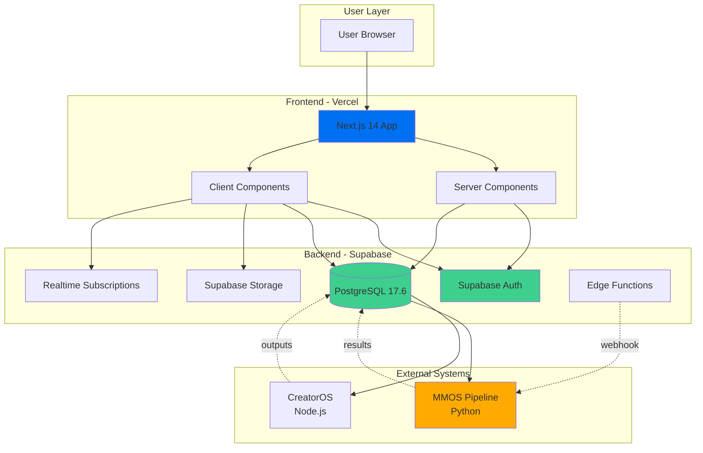
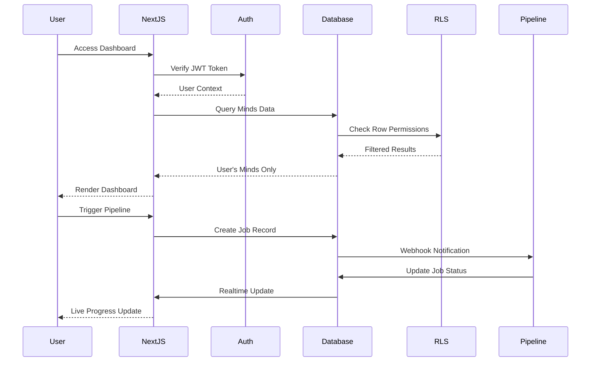

# 1. Introduction & Overview

**Document:** MMOS Admin Dashboard - Introduction
**Version:** 1.0
**Last Updated:** 2025-10-28

---

## 📖 Table of Contents

1. [Project Context](#project-context)
2. [Goals and Objectives](#goals-and-objectives)
3. [High-Level Architecture](#high-level-architecture)
4. [Key Architectural Decisions](#key-architectural-decisions)
5. [Platform and Infrastructure Choice](#platform-and-infrastructure-choice)
6. [Architectural Patterns](#architectural-patterns)
7. [Repository Structure](#repository-structure)

---

## Project Context

### What is MMOS?

**MMOS (Mind Mapper OS)** is an industrialized pipeline system that maps and emulates cognitive architectures of exceptional individuals into AI clones. The system achieves **94% fidelity** vs 30% from traditional LLMs through its proprietary **DNA Mental™ methodology** (8-layer cognitive architecture).

**Current State:**
- 22 production minds deployed
- 47 specialized prompts across 6 pipeline phases
- AIOS-first orchestration (conversational AI-driven workflow)
- 30-table PostgreSQL database on Supabase
- 13 MB database size, room for significant growth

**The Problem:**
Currently, managing MMOS requires:
- Manual database queries via SQL
- No unified view of pipeline executions
- Limited visibility into mind quality metrics
- Fragmented access to knowledge bases and system prompts
- No administrative interface for non-technical stakeholders

### What We're Building

**MMOS Admin Dashboard** - A comprehensive web application that provides:

1. **Unified Management Interface**
   - View and manage all 22+ minds in production
   - Monitor pipeline executions in real-time
   - Access knowledge bases and system prompts
   - Trigger new mind creations or updates

2. **Analytics and Insights**
   - Quality metrics (fidelity scores, trait distributions)
   - Pipeline performance (execution times, success rates)
   - Usage tracking and trend analysis
   - Cross-mind comparisons

3. **Multi-Tool Administration**
   - MMOS pipeline management
   - CreatorOS projects (course generation)
   - InnerLens profiles (psychometric data)
   - User and access management

4. **Developer Productivity**
   - API documentation and testing
   - Database query interface
   - Bulk operations and migrations
   - Export/import functionality

---

## Goals and Objectives

### Primary Goals

1. **Operational Efficiency**
   - Reduce time to manage minds from hours to minutes
   - Enable non-technical stakeholders to view data
   - Provide self-service analytics and reporting

2. **Visibility and Transparency**
   - Real-time pipeline monitoring
   - Quality assurance dashboards
   - Audit trails for all operations

3. **Scalability Foundation**
   - Support growth from 22 to 100+ minds
   - Enable multi-user concurrent access
   - Prepare for future public gallery

4. **Developer Experience**
   - Type-safe full-stack development
   - Fast local development (<3s hot reload)
   - Clear code organization and conventions

### Success Metrics

- **User Adoption:** 100% of stakeholders use dashboard within 2 weeks
- **Time Savings:** 80% reduction in time spent on routine admin tasks
- **Data Access:** Non-technical users can answer own questions without SQL
- **Performance:** <2s page load time, <500ms API response time
- **Quality:** Zero security incidents, >99% uptime

---

## High-Level Architecture

### System Overview



### Data Flow Architecture



---

## Key Architectural Decisions

### Decision 1: Supabase-First Architecture

**Choice:** Use Supabase as primary backend, minimize custom API code

**Rationale:**
- ✅ Already have 30 tables in Supabase with solid schema
- ✅ Built-in auth, storage, realtime - no need to build
- ✅ Row Level Security (RLS) for multi-tenant isolation
- ✅ Auto-generated TypeScript types from schema
- ✅ Reduces backend code by ~80% vs custom Node.js API

**Trade-offs:**
- ⚠️ Vendor lock-in to Supabase ecosystem
- ⚠️ Complex queries might require custom functions
- ⚠️ Limited control over database query optimization
- ✅ **Mitigation:** PostgreSQL is open-source, can migrate if needed

**Alternatives Considered:**
- Custom Node.js API + PostgreSQL (too much boilerplate)
- Firebase (inferior SQL support, vendor lock-in worse)
- Hasura (adds complexity layer, overkill for our scale)

---

### Decision 2: Next.js 14 with App Router

**Choice:** Next.js 14 (App Router) over Pages Router or other frameworks

**Rationale:**
- ✅ Server Components reduce bundle size by 30-40%
- ✅ App Router co-locates frontend + API routes
- ✅ Built-in optimizations (image, font, bundle splitting)
- ✅ Excellent Vercel deployment integration
- ✅ Strong TypeScript support

**Trade-offs:**
- ⚠️ App Router learning curve (newer paradigm)
- ⚠️ Some third-party libraries not optimized for RSC yet
- ✅ **Mitigation:** Use "use client" directive where needed

**Alternatives Considered:**
- Pages Router (older, missing RSC benefits)
- Remix (less mature ecosystem)
- Vite + React (no SSR/SSG out of box)

---

### Decision 3: Type-Safe Full Stack with Generated Types

**Choice:** Generate TypeScript types from Supabase schema automatically

**Rationale:**
- ✅ Single source of truth (database schema)
- ✅ Auto-complete for all queries (huge DX boost)
- ✅ Catch type errors at compile time, not runtime
- ✅ Refactoring safety when schema changes

**Implementation:**
```bash
# Generates types/supabase.ts from live schema
npx supabase gen types typescript --project-id <id> > types/supabase.ts
```

**Trade-offs:**
- ⚠️ Must regenerate types after schema changes
- ✅ **Mitigation:** Add to CI/CD pipeline, auto-generate on deploy

---

### Decision 4: Row Level Security (RLS) for Multi-Tenant Isolation

**Choice:** Implement RLS policies on all user-facing tables

**Rationale:**
- ✅ Security enforced at database layer, not application
- ✅ Impossible to bypass (even with SQL injection)
- ✅ Simplifies frontend code (no manual permission checks)
- ✅ **Critical:** DB Sage audit identified missing RLS on CreatorOS tables (P0 fix)

**Implementation Strategy:**
1. Fix P0 issues (CreatorOS tables lack RLS)
2. Add RLS to junction tables for defense-in-depth
3. Create admin policies for super-user access

**Trade-offs:**
- ⚠️ Complex queries might be slower with RLS
- ⚠️ Policy debugging can be tricky
- ✅ **Mitigation:** Use `EXPLAIN ANALYZE` to optimize policies

---

### Decision 5: Monorepo Structure (Future-Ready)

**Choice:** Start with single Next.js app, prepare for monorepo expansion

**Rationale:**
- ✅ Current needs: single dashboard app
- ✅ Future needs: shared packages, mobile app, public API
- ✅ Easy to extract shared code later (types, utils, components)

**Structure:**
```
mente_lendaria/
├── apps/
│   └── dashboard/          # Next.js admin dashboard (current)
├── packages/
│   ├── shared/             # Types, constants (future)
│   ├── ui/                 # Shared components (future)
│   └── api-client/         # API SDK (future)
└── expansion-packs/        # Existing MMOS code
```

**Trade-offs:**
- ⚠️ Slight upfront complexity for future-proofing
- ✅ Avoids major refactor later when adding mobile/API

---

## Platform and Infrastructure Choice

### Selected Platform: Vercel + Supabase

**Frontend Hosting:** Vercel
- Global CDN for static assets
- Edge network for Server Components
- Zero-config deployments from Git
- Automatic preview deployments for PRs
- Built-in analytics and monitoring

**Backend Services:** Supabase
- PostgreSQL 17.6 database (13 MB current, scales to GB)
- Authentication (JWT tokens, social login ready)
- Storage (for mind artifacts, system prompts, uploads)
- Realtime (WebSocket subscriptions for live updates)
- Edge Functions (Deno runtime, optional for heavy compute)

**Deployment Regions:**
- Vercel: Global (CDN in 50+ cities)
- Supabase: AWS us-east-2 (current), can add eu-central-1 for GDPR

**Cost Estimate (Startup Phase):**
- Vercel Pro: $20/month (or $0 Hobby if <3 users)
- Supabase Pro: $25/month
- **Total:** ~$45/month ($0-$45 depending on team size)

**Scalability:**
- Current: 13 MB database, <100 requests/day
- Expected (Year 1): 500 MB database, 10K requests/day
- Platform Limits: Supabase Pro handles 500K requests/day

---

### Alternative Platforms Considered

#### AWS Full Stack (Lambda + RDS + Cognito)
**Pros:**
- Ultimate flexibility and control
- Enterprise-grade compliance (SOC2, HIPAA)
- Deep integration with AWS services

**Cons:**
- ❌ Requires significant DevOps expertise
- ❌ Complex setup (IAM, VPC, security groups)
- ❌ Higher cost (~$200/month for similar features)
- ❌ Slower development velocity

**Verdict:** Overkill for current scale, revisit at 100K+ users

---

#### Railway (All-in-One Platform)
**Pros:**
- Simple pricing ($5-20/month)
- Easy PostgreSQL + Redis setup
- Good developer experience

**Cons:**
- ❌ No built-in auth (must use Clerk/Auth0)
- ❌ No realtime subscriptions
- ❌ Smaller ecosystem vs Vercel/Supabase
- ❌ Less mature than competitors

**Verdict:** Good for MVPs, but missing key features we need

---

#### Firebase + Cloud Functions
**Pros:**
- Excellent realtime capabilities
- Strong mobile SDK
- Google Cloud integration

**Cons:**
- ❌ Firestore (NoSQL) vs our relational needs
- ❌ Complex SQL support (requires workarounds)
- ❌ Vendor lock-in (harder to migrate than Supabase)
- ❌ Query limitations (no JOINs, limited filtering)

**Verdict:** Not suitable for our complex relational data model

---

## Architectural Patterns

### 1. Supabase-First Architecture

**Pattern:** Leverage Supabase platform capabilities before writing custom code

**Implementation:**
```typescript
// ✅ Good: Use Supabase query builder
const { data, error } = await supabase
  .from('minds')
  .select('*, mind_profiles(*), trait_scores(*)')
  .eq('status', 'active')
  .order('created_at', { ascending: false });

// ❌ Bad: Custom API route that duplicates Supabase
export async function GET(request: Request) {
  const minds = await db.query('SELECT * FROM minds...');
  return Response.json(minds);
}
```

**When to Break Pattern:**
- Complex business logic (multi-step transactions)
- Heavy computation (use Edge Functions)
- Third-party API integration

---

### 2. Type-Safe Full Stack

**Pattern:** End-to-end TypeScript with generated types

**Implementation:**
```typescript
// types/supabase.ts (auto-generated)
export type Database = {
  public: {
    Tables: {
      minds: {
        Row: { id: string; slug: string; name: string; ... }
        Insert: { slug: string; name: string; ... }
        Update: { name?: string; ... }
      }
    }
  }
}

// lib/supabase.ts
import { Database } from '@/types/supabase';
const supabase = createClient<Database>(...);

// Usage (auto-complete + type checking)
const { data } = await supabase.from('minds').select('*');
// data is typed as Database['public']['Tables']['minds']['Row'][]
```

---

### 3. Component-Based UI with shadcn/ui

**Pattern:** Build from reusable, accessible components

**Implementation:**
```tsx
// app/minds/page.tsx
import { DataTable } from '@/components/ui/data-table';
import { columns } from './columns';

export default async function MindsPage() {
  const minds = await getMinds(); // Server Component
  return <DataTable columns={columns} data={minds} />;
}

// app/minds/columns.tsx
import { ColumnDef } from '@tanstack/react-table';
export const columns: ColumnDef<Mind>[] = [
  { accessorKey: 'name', header: 'Name' },
  { accessorKey: 'status', header: 'Status' },
  // ... with built-in sorting, filtering, pagination
];
```

---

### 4. Row Level Security (RLS) for Authorization

**Pattern:** Enforce permissions at database layer

**Implementation:**
```sql
-- Users can only see minds they created or have access to
CREATE POLICY "minds_user_access" ON minds
  FOR SELECT TO authenticated
  USING (
    creator_user_id = auth.uid()
    OR id IN (
      SELECT mind_id FROM mind_collaborators
      WHERE user_id = auth.uid()
    )
  );

-- Admins can see everything
CREATE POLICY "minds_admin_all" ON minds
  FOR ALL TO authenticated
  USING (is_admin());
```

**Frontend Code:**
```typescript
// No permission checks needed - RLS handles it
const { data } = await supabase.from('minds').select('*');
// User automatically sees only their minds
```

---

### 5. Realtime Updates with Supabase Subscriptions

**Pattern:** Live updates without polling

**Implementation:**
```typescript
// app/pipeline/[id]/page.tsx
'use client';

export function PipelineMonitor({ jobId }: Props) {
  const [status, setStatus] = useState('pending');

  useEffect(() => {
    const channel = supabase
      .channel('job-updates')
      .on(
        'postgres_changes',
        {
          event: 'UPDATE',
          schema: 'public',
          table: 'job_executions',
          filter: `id=eq.${jobId}`
        },
        (payload) => setStatus(payload.new.status)
      )
      .subscribe();

    return () => { channel.unsubscribe(); };
  }, [jobId]);

  return <StatusBadge status={status} />; // Updates live
}
```

---

## Repository Structure

### Current Structure (Before Dashboard)

```
mente_lendaria/
├── .aios-core/              # AIOS framework (read-only)
├── expansion-packs/         # MMOS, CreatorOS, InnerLens
│   ├── mmos/                # Mind mapping pipeline
│   ├── creator-os/          # Course generation
│   └── innerlens/           # Psychometric profiling
├── docs/                    # Documentation
│   ├── prd/
│   ├── architecture/
│   ├── mmos/
│   └── logs/
├── outputs/                 # Generated artifacts (not versioned)
│   ├── minds/               # Processed minds
│   └── courses/             # Generated courses
└── supabase/                # Database migrations, functions
```

### Proposed Structure (With Dashboard)

```
mente_lendaria/
├── .aios-core/              # AIOS framework (unchanged)
├── expansion-packs/         # Existing expansion packs (unchanged)
├── apps/                    # 🆕 Applications
│   └── dashboard/           # 🆕 MMOS Admin Dashboard
│       ├── app/             # Next.js 14 App Router
│       │   ├── (auth)/      # Auth pages (login, signup)
│       │   ├── (dashboard)/ # Main dashboard pages
│       │   │   ├── layout.tsx
│       │   │   ├── page.tsx              # Overview
│       │   │   ├── minds/                # Minds management
│       │   │   ├── pipeline/             # Pipeline monitoring
│       │   │   ├── content/              # CreatorOS projects
│       │   │   ├── analytics/            # Analytics dashboards
│       │   │   └── settings/             # Settings & admin
│       │   └── api/         # API routes (webhooks, exports)
│       ├── components/      # React components
│       │   ├── ui/          # shadcn/ui components
│       │   ├── minds/       # Mind-specific components
│       │   ├── charts/      # Data visualization
│       │   └── tables/      # Data tables
│       ├── lib/             # Utilities
│       │   ├── supabase.ts  # Supabase client
│       │   ├── utils.ts     # Helper functions
│       │   └── hooks/       # Custom React hooks
│       ├── types/           # TypeScript types
│       │   └── supabase.ts  # Generated from schema
│       ├── public/          # Static assets
│       ├── tests/           # Tests (unit, integration, E2E)
│       ├── .env.local       # Local environment variables
│       ├── next.config.js   # Next.js configuration
│       ├── tailwind.config.ts
│       ├── tsconfig.json
│       └── package.json
├── packages/                # 🆕 Shared packages (future)
│   ├── shared/              # Types, constants (future)
│   └── ui/                  # Component library (future)
├── docs/                    # Documentation (expanded)
│   ├── architecture/
│   │   └── mmos-dashboard/  # This architecture doc set
│   └── ...
├── outputs/                 # Generated artifacts (unchanged)
└── supabase/                # Database (expanded)
    ├── migrations/          # Schema migrations
    ├── functions/           # Edge Functions
    ├── seed.sql             # Seed data for development
    └── docs/                # Database documentation
```

---

## Change Log

| Date | Version | Changes | Author |
|------|---------|---------|--------|
| 2025-10-28 | 1.0 | Initial document | Winston (Architect) |

---

**Next Document:** [2. Tech Stack Decisions →](./2-tech-stack-decisions.md)
