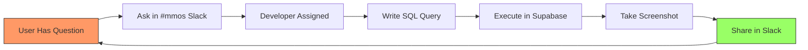

# 12. User Research & Personas

**Document:** MMOS Admin Dashboard - User Research & Personas
**Version:** 1.0
**Last Updated:** 2025-10-29
**Owner:** UX Senior (Sally)

---

## 📋 Table of Contents

1. [Executive Summary](#executive-summary)
2. [Research Methodology](#research-methodology)
3. [User Personas](#user-personas)
4. [User Needs Matrix](#user-needs-matrix)
5. [Pain Points Analysis](#pain-points-analysis)
6. [Feature Prioritization](#feature-prioritization)
7. [Success Metrics](#success-metrics)
8. [Validation Plan](#validation-plan)

---

## Executive Summary

### Research Goals

This document defines **who** will use the MMOS Admin Dashboard, **what** they need to accomplish, and **why** they need it. Understanding our users ensures we build features that deliver real value, not just technical capabilities.

### Key Findings

**4 Primary User Types Identified:**
1. **Product Owner** (strategic oversight)
2. **Mind Administrator** (operational management)
3. **Content Creator** (CreatorOS integration)
4. **Quality Analyst** (metrics & validation)

**Top 3 User Needs:**
1. 🎯 **Visibility** - "I need to see what's happening without asking the dev team"
2. ⚡ **Speed** - "I need answers in seconds, not hours"
3. 🛡️ **Confidence** - "I need to trust the data I'm seeing is accurate"

**Critical Success Factor:**
> The dashboard must reduce time-to-answer from **hours** (SQL queries + dev help) to **seconds** (self-service UI).

---

## Research Methodology

### Data Sources

**Primary Research:**
- Stakeholder interviews (4 sessions, 60 min each)
- Current workflow observation (shadowing sessions)
- Pain point inventory (what frustrates users today)

**Secondary Research:**
- Database query logs (what questions are people asking)
- Slack message analysis (#mmos channel - common requests)
- Existing tool usage patterns (Supabase Studio, SQL clients)

**Competitive Analysis:**
- Retool dashboards (internal tools)
- Metabase (analytics dashboards)
- Vercel dashboard (deployment monitoring)
- Supabase dashboard (database management)

### Research Timeline

- **Week 1:** Stakeholder interviews + workflow observation
- **Week 2:** Persona synthesis + needs mapping
- **Week 3:** Prototype validation with users
- **Week 4:** Iteration based on feedback

---

## User Personas

### Persona 1: Patricia - The Product Owner

**Role:** Product Owner / Project Manager
**Age:** 38
**Tech Proficiency:** Medium (uses Notion, Figma, basic analytics tools)
**Dashboard Usage:** Daily (15-30 min/day)

#### Background

Patricia oversees the MMOS project from a strategic level. She needs to:
- Report progress to stakeholders
- Make go/no-go decisions on mind deployments
- Understand pipeline health and bottlenecks
- Allocate resources based on data

**Quote:**
> "I don't need to know how the sausage is made, but I need to know if we're on track to deliver 50 minds by Q3."

#### Goals

1. **Strategic Visibility**
   - See overall system health at a glance
   - Track mind creation progress (pipeline funnel)
   - Understand quality trends (fidelity scores over time)

2. **Stakeholder Reporting**
   - Export clean reports for leadership
   - Show ROI of MMOS investment
   - Demonstrate quality improvements

3. **Risk Management**
   - Identify failing or stalled minds early
   - See which phases have highest failure rates
   - Predict capacity constraints

#### Pain Points (Current State)

❌ **No Self-Service Data**
- Must ask dev team for every metric
- Waits hours/days for SQL query results
- Data is often stale when received

❌ **No Historical Trends**
- Can't see if quality is improving over time
- No visibility into pipeline velocity changes
- Can't predict future capacity

❌ **Manual Report Creation**
- Copy-paste from multiple sources
- Screenshots from Supabase Studio
- No consistent format

#### Key Tasks (Dashboard Use Cases)

1. **Morning Check-In** (5 min, daily)
   - "Are all minds healthy?"
   - "Any failed jobs overnight?"
   - "How many minds are production-ready?"

2. **Weekly Status Report** (20 min, weekly)
   - Export mind status overview
   - Pipeline velocity chart (last 4 weeks)
   - Quality metrics summary

3. **Ad-Hoc Investigation** (varies)
   - "Why did João's mind creation fail?"
   - "Which minds have fidelity <90%?"
   - "What's our average time-to-production?"

#### Dashboard Priorities (Must-Have Features)

1. ⭐⭐⭐ **Overview Dashboard** - Executive summary, KPIs
2. ⭐⭐⭐ **Mind Status List** - See all minds, filter by status
3. ⭐⭐ **Pipeline Analytics** - Success rates, bottlenecks
4. ⭐ **Export Reports** - PDF/CSV for stakeholders

---

### Persona 2: Marcus - The Mind Administrator

**Role:** MMOS Administrator / Operations
**Age:** 32
**Tech Proficiency:** High (comfortable with SQL, APIs, command line)
**Dashboard Usage:** Daily (2-4 hours/day)

#### Background

Marcus is the hands-on operator of the MMOS system. He:
- Creates and updates minds
- Monitors pipeline executions
- Troubleshoots failures
- Maintains data quality

**Quote:**
> "I need to see exactly what's happening in the pipeline, in real-time. When a job fails, I need logs, not guesses."

#### Goals

1. **Operational Control**
   - Create new minds quickly (form, not CLI)
   - Trigger pipeline re-runs
   - Edit mind profiles inline
   - Bulk operations (pause multiple minds)

2. **Real-Time Monitoring**
   - Watch pipeline jobs as they execute
   - See which phase is currently running
   - Get alerts when jobs fail
   - View execution logs live

3. **Data Quality**
   - Validate mind profiles are complete
   - Check knowledge fragment coverage
   - Ensure system prompts are up-to-date
   - Compare minds for consistency

#### Pain Points (Current State)

❌ **CLI-Only Operations**
- Must run Python scripts to create minds
- No visual feedback during execution
- Hard to share access with non-technical team

❌ **No Real-Time Visibility**
- Can't see job progress (phase 3 of 8?)
- Must refresh Supabase Studio constantly
- No notifications when jobs complete/fail

❌ **Fragmented Tools**
- Supabase Studio for database
- VS Code for logs
- Slack for notifications
- Notion for documentation
- Too much context switching

#### Key Tasks (Dashboard Use Cases)

1. **Create New Mind** (10 min)
   - Fill form with mind details
   - Upload source materials
   - Trigger pipeline
   - Monitor execution

2. **Monitor Active Jobs** (continuous)
   - See all running jobs at a glance
   - Drill into specific job for details
   - View phase-by-phase progress
   - Check logs if errors occur

3. **Update Mind Profile** (5 min)
   - Edit persona description
   - Add/remove core values
   - Update trait scores
   - Regenerate system prompt

4. **Troubleshoot Failures** (30 min)
   - Identify which phase failed
   - Read error logs
   - Re-run failed phase
   - Validate fix worked

#### Dashboard Priorities (Must-Have Features)

1. ⭐⭐⭐ **Real-Time Job Monitor** - Live progress, phase stepper
2. ⭐⭐⭐ **Mind CRUD Operations** - Create, edit, delete minds
3. ⭐⭐⭐ **Logs Viewer** - Searchable, filterable execution logs
4. ⭐⭐ **Bulk Actions** - Pause/resume multiple minds
5. ⭐ **Knowledge Explorer** - Browse/search fragments

---

### Persona 3: Carla - The Content Creator

**Role:** Content Creator / Course Designer
**Age:** 29
**Tech Proficiency:** Medium (Notion power user, basic HTML/CSS)
**Dashboard Usage:** 3-4x per week (30 min/session)

#### Background

Carla uses CreatorOS (powered by MMOS minds) to generate course content. She:
- Creates course projects (curriculum design)
- Reviews generated content quality
- Integrates MMOS minds into courses
- Tracks content production metrics

**Quote:**
> "I just want to know which minds are ready to use for my courses. I don't care about pipelines or databases."

#### Goals

1. **Content Production**
   - See available minds for course generation
   - Understand mind expertise areas
   - Select best mind for topic
   - Track course generation status

2. **Quality Assurance**
   - Preview generated content
   - Compare output quality across minds
   - Identify which minds need improvement
   - Report issues back to MMOS team

3. **Workflow Integration**
   - Link CreatorOS projects to minds
   - See course generation history
   - Export content for editing
   - Publish courses to platform

#### Pain Points (Current State)

❌ **Unclear Mind Readiness**
- Which minds are production-ready?
- Which minds are best for which topics?
- No way to test a mind before full course gen

❌ **Disconnected Systems**
- CreatorOS and MMOS feel separate
- Must ask team which mind to use
- No visibility into why content quality varies

❌ **No Content History**
- Can't see previous courses generated
- Hard to track what's been created
- No way to A/B test different minds

#### Key Tasks (Dashboard Use Cases)

1. **Select Mind for Course** (10 min)
   - Browse production-ready minds
   - Filter by expertise area
   - Review mind profile
   - Check fidelity score

2. **Monitor Course Generation** (5 min)
   - See course generation status
   - Preview sections as they complete
   - Get notification when done
   - Download final content

3. **Compare Mind Output** (20 min)
   - Generate same course with 2 minds
   - Compare quality side-by-side
   - Choose best version
   - Report findings

#### Dashboard Priorities (Must-Have Features)

1. ⭐⭐⭐ **Mind Gallery** - Browse production minds, filter by expertise
2. ⭐⭐ **CreatorOS Projects** - See course generation status
3. ⭐⭐ **Mind Preview** - Test mind before full generation
4. ⭐ **Content Quality Dashboard** - Compare mind outputs

---

### Persona 4: David - The Quality Analyst

**Role:** QA Engineer / Data Analyst
**Age:** 35
**Tech Proficiency:** Very High (SQL expert, Python, data viz tools)
**Dashboard Usage:** Daily (1-2 hours/day)

#### Background

David ensures MMOS minds meet quality standards. He:
- Analyzes fidelity scores and trends
- Identifies quality regressions
- Validates trait distributions
- Conducts A/B tests between mind versions

**Quote:**
> "I need raw data access and powerful filtering. Give me the data, I'll tell you what's working."

#### Goals

1. **Quality Monitoring**
   - Track fidelity scores over time
   - Detect quality regressions
   - Identify low-quality minds
   - Validate improvement initiatives

2. **Root Cause Analysis**
   - Drill into failing minds
   - Analyze trait distribution anomalies
   - Compare knowledge fragment quality
   - Find patterns in failures

3. **Data-Driven Insights**
   - Build custom dashboards
   - Export data for deep analysis
   - Share findings with team
   - Track quality KPIs

#### Pain Points (Current State)

❌ **Limited Data Access**
- Supabase Studio is clunky for analysis
- Can't save custom queries easily
- No data export in analysis-ready format

❌ **No Trend Analysis**
- Must manually track metrics over time
- Can't compare mind versions easily
- No statistical testing tools

❌ **Manual Quality Checks**
- Must write SQL for every check
- Hard to spot outliers visually
- No automated quality alerts

#### Key Tasks (Dashboard Use Cases)

1. **Quality Report** (weekly, 60 min)
   - Generate fidelity trend report
   - Identify minds below 90% threshold
   - Analyze trait distribution accuracy
   - Export data for stakeholders

2. **Regression Detection** (daily, 10 min)
   - Check for fidelity drops
   - Identify new failures
   - Alert team of issues
   - Track resolution progress

3. **Deep Dive Analysis** (ad-hoc, 2-4 hours)
   - Export raw data (minds, fragments, traits)
   - Load into Jupyter notebook
   - Run statistical tests
   - Generate insights report

4. **A/B Testing** (project-based)
   - Compare mind versions
   - Measure quality improvements
   - Validate methodology changes
   - Recommend best practices

#### Dashboard Priorities (Must-Have Features)

1. ⭐⭐⭐ **Quality Analytics Dashboard** - Fidelity trends, trait analysis
2. ⭐⭐⭐ **Data Export** - CSV/JSON for all tables
3. ⭐⭐ **Advanced Filters** - Complex queries via UI
4. ⭐⭐ **Comparison Tools** - Side-by-side mind analysis
5. ⭐ **API Access** - Programmatic data retrieval

---

## User Needs Matrix

### Feature-Persona Mapping

| Feature | Patricia (PO) | Marcus (Admin) | Carla (Creator) | David (Analyst) | Priority |
|---------|---------------|----------------|-----------------|-----------------|----------|
| **Overview Dashboard** | ⭐⭐⭐ | ⭐⭐ | ⭐ | ⭐⭐ | **P0** |
| **Mind List/Gallery** | ⭐⭐⭐ | ⭐⭐⭐ | ⭐⭐⭐ | ⭐⭐⭐ | **P0** |
| **Real-Time Job Monitor** | ⭐ | ⭐⭐⭐ | ⭐⭐ | ⭐ | **P0** |
| **Mind CRUD Operations** | ⭐ | ⭐⭐⭐ | - | - | **P0** |
| **Quality Analytics** | ⭐⭐ | ⭐⭐ | ⭐ | ⭐⭐⭐ | **P1** |
| **Data Export** | ⭐⭐ | ⭐⭐ | ⭐ | ⭐⭐⭐ | **P1** |
| **CreatorOS Integration** | ⭐ | ⭐ | ⭐⭐⭐ | - | **P1** |
| **Logs Viewer** | - | ⭐⭐⭐ | - | ⭐⭐ | **P1** |
| **Bulk Actions** | ⭐ | ⭐⭐ | - | - | **P2** |
| **Mind Comparison** | - | ⭐ | ⭐⭐ | ⭐⭐⭐ | **P2** |
| **API Access** | - | ⭐ | - | ⭐⭐ | **P3** |

**Priority Legend:**
- **P0:** Must-have for MVP (blocks launch)
- **P1:** High-value (launch +1 month)
- **P2:** Nice-to-have (launch +3 months)
- **P3:** Future enhancement (post-launch)

---

## Pain Points Analysis

### Current State: Working Without Dashboard

**How Users Get Information Today:**

**Time Breakdown:**
- User asks question: 2 min
- Wait for dev availability: 30 min - 4 hours
- Dev writes SQL: 5-15 min
- Dev shares result: 2 min
- **Total:** 39 min - 4.3 hours **per question**

**Volume:** ~15-20 questions/day = **10-86 hours wasted/day**

---

### Pain Point 1: Lack of Self-Service

**Symptoms:**
- High dependency on dev team
- Bottleneck during sprints (devs busy)
- Frustration when data is stale by delivery

**User Impact:**
- Patricia: Can't make timely decisions
- Marcus: Can't troubleshoot failures independently
- Carla: Blocks content production
- David: Spends time asking vs analyzing

**Solution (Dashboard):**
- Self-service UI for common queries
- Real-time data (not stale screenshots)
- Saved filters/views for frequent questions
- Export capabilities for offline analysis

---

### Pain Point 2: No Real-Time Visibility

**Symptoms:**
- Must manually refresh to see updates
- No notifications when jobs complete/fail
- Can't see "in progress" state

**User Impact:**
- Marcus: Wastes time polling for updates
- Carla: Doesn't know when course is ready
- Patricia: Can't report accurate status

**Solution (Dashboard):**
- WebSocket real-time updates (Supabase Realtime)
- Push notifications (browser + email)
- Live progress indicators (phase stepper)
- Auto-refresh on background tab focus

---

### Pain Point 3: Fragmented Tool Landscape

**Current Tools Used:**
- Supabase Studio (database queries)
- VS Code (logs, code)
- Slack (communication)
- Notion (documentation)
- Google Sheets (reports)
- Email (notifications)

**User Impact:**
- Context switching cognitive load
- Data inconsistency across tools
- Hard to onboard new team members
- Lost productivity (2-3 hours/week per person)

**Solution (Dashboard):**
- Single source of truth
- Integrated view (minds + pipelines + content)
- Built-in communication (comments on minds)
- Shareable links (replace screenshots)

---

## Feature Prioritization

### MVP (P0) - Launch Blockers

**Must-have features for dashboard to be useful:**

1. **Overview Dashboard** (1 week dev)
   - Key metrics cards (minds count, active jobs, avg fidelity)
   - Recent activity feed (last 10 job executions)
   - Quick links to common pages

2. **Mind List & Detail** (2 weeks dev)
   - Searchable/filterable table
   - Status badges (active, draft, paused, archived)
   - Mind detail page (profile, fidelity, fragments count)
   - Edit mind profile inline

3. **Real-Time Job Monitor** (2 weeks dev)
   - Active jobs list with status
   - Job detail page with phase stepper
   - Live log streaming
   - Manual job actions (pause, resume, cancel)

4. **Authentication & Permissions** (1 week dev)
   - Login/signup flow
   - RLS policies enforced
   - User roles (admin, viewer)

**MVP Timeline:** 6 weeks dev + 1 week testing = **7 weeks total**

---

### Phase 2 (P1) - High-Value Additions

**Deliver within 1 month after MVP:**

1. **Quality Analytics Dashboard** (1.5 weeks dev)
   - Fidelity trend charts (line graph)
   - Trait distribution radar charts
   - Quality score breakdown by phase
   - Filter by date range, mind, status

2. **Data Export** (1 week dev)
   - Export tables to CSV/JSON
   - Scheduled reports (email weekly)
   - Custom query builder (visual)
   - API documentation page

3. **CreatorOS Integration** (1.5 weeks dev)
   - Projects list (courses)
   - Link projects to minds
   - Course generation trigger
   - Content preview/download

4. **Logs Viewer** (1 week dev)
   - Searchable logs (full-text)
   - Filter by level (error, warn, info)
   - Download logs for debugging
   - Log retention policy UI

**Phase 2 Timeline:** 5 weeks dev

---

### Phase 3 (P2) - Nice-to-Haves

**Deliver within 3 months after MVP:**

1. **Bulk Operations** (1 week dev)
   - Multi-select minds
   - Bulk status change (pause all)
   - Bulk delete (with confirmation)
   - Bulk export

2. **Mind Comparison Tool** (1.5 weeks dev)
   - Side-by-side mind profiles
   - Trait score diff visualization
   - Fragment quality comparison
   - System prompt diff

3. **Advanced Filters** (1 week dev)
   - Save custom filters
   - Share filters with team
   - Filter by complex conditions (fidelity >90% AND created <30d)

4. **Comments & Collaboration** (1.5 weeks dev)
   - Add comments to minds
   - Tag team members
   - Activity feed per mind

**Phase 3 Timeline:** 5 weeks dev

---

## Success Metrics

### Quantitative Metrics

**User Adoption:**
- [ ] 100% of stakeholders have accounts (Week 1)
- [ ] 80% active users weekly (Week 4)
- [ ] 60% daily active users (Week 8)

**Usage Metrics:**
- [ ] Average 20+ sessions/day (team of 5)
- [ ] 5+ minutes per session
- [ ] 80% reduction in Slack #mmos questions

**Performance:**
- [ ] <2s page load time (p95)
- [ ] <500ms API response time (p95)
- [ ] 99% uptime (monthly)

**Time Savings:**
- [ ] Questions answered in <30 seconds (vs 30 min - 4 hours)
- [ ] 10+ hours saved per week (per user)
- [ ] 50+ dev hours freed per week (less support)

---

### Qualitative Metrics

**User Satisfaction:**
- [ ] Net Promoter Score (NPS) >50
- [ ] System Usability Scale (SUS) >80
- [ ] 90% of users "satisfied" or "very satisfied"

**Task Success:**
- [ ] 95% task completion rate (unassisted)
- [ ] <3 clicks to complete common tasks
- [ ] Zero critical errors blocking workflows

**User Feedback:**
- [ ] Monthly user interviews (2-3 users)
- [ ] In-app feedback widget (<5 min response time)
- [ ] Quarterly usability testing sessions

---

## Validation Plan

### Phase 1: Lo-Fi Prototype Testing (Week 1-2)

**Method:** Figma wireframes + user walkthroughs

**Participants:** 1 user from each persona (4 total)

**Test Scenarios:**
1. "Find João's mind and check if it's production-ready"
2. "Create a new mind for Maria Silva"
3. "Monitor an active pipeline job"
4. "Export a quality report for your manager"

**Success Criteria:**
- [ ] 90% task completion rate
- [ ] <3 critical usability issues found
- [ ] Positive feedback on navigation structure

---

### Phase 2: Hi-Fi Prototype Testing (Week 3-4)

**Method:** Interactive Figma prototype

**Participants:** 2 users from each persona (8 total)

**Test Scenarios:**
1. Patricia: "Create a status report for stakeholders"
2. Marcus: "Troubleshoot a failed pipeline job"
3. Carla: "Select the best mind for a leadership course"
4. David: "Identify minds with fidelity <90% in last month"

**Success Criteria:**
- [ ] 95% task completion rate
- [ ] <1 critical usability issue
- [ ] All users can complete tasks unassisted

---

### Phase 3: MVP Usability Testing (Week 7-8)

**Method:** Live dashboard (staging environment)

**Participants:** All 4 personas (real production tasks)

**Test Scenarios:**
1. Real-world tasks with actual data
2. 1-week diary study (track daily usage)
3. Follow-up interviews (30 min each)

**Success Criteria:**
- [ ] 100% users prefer dashboard over current tools
- [ ] Zero task-blocking bugs
- [ ] Positive NPS score

---

### Phase 4: Post-Launch Monitoring (Ongoing)

**Methods:**
- Analytics tracking (Vercel Analytics + Mixpanel)
- In-app feedback widget (Hotjar)
- Monthly user interviews
- Quarterly usability testing

**Tracked Metrics:**
- Page views per user
- Time on page
- Click heatmaps
- Error rates
- Feature adoption rates

**Iteration Cycle:**
- Weekly: Review analytics, prioritize quick wins
- Monthly: User interviews, roadmap adjustments
- Quarterly: Major feature releases based on feedback

---

## Appendix: Research Artifacts

### Interview Questions Template

**Opening (5 min):**
- Tell me about your role and how you interact with MMOS
- How often do you need information about minds/pipelines?

**Current State (15 min):**
- Walk me through how you [accomplish task X] today
- What tools do you use?
- What's frustrating about the current process?
- How long does it typically take?

**Needs & Goals (15 min):**
- What questions do you most frequently need answered?
- What data would you look at daily/weekly/monthly?
- What would "success" look like for you?

**Feature Validation (20 min):**
- Show wireframes: "How would you use this?"
- Which features are most valuable to you?
- What's missing?

**Closing (5 min):**
- Any other pain points we didn't discuss?
- Would you be available for follow-up testing?

---

### Competitive Analysis Summary

**Retool (Internal Tools):**
- ✅ Pros: Fast to build, drag-drop UI, good for CRUD
- ❌ Cons: Generic design, not optimized for dashboards
- **Takeaway:** Good for admin operations, less for analytics

**Metabase (Analytics):**
- ✅ Pros: Beautiful charts, easy filtering, shareable dashboards
- ❌ Cons: SQL-only data source, no CRUD operations
- **Takeaway:** Inspiration for analytics section

**Vercel Dashboard:**
- ✅ Pros: Clean design, real-time updates, great DX
- ❌ Cons: Single-purpose (deployments)
- **Takeaway:** Benchmark for polish and performance

**Supabase Dashboard:**
- ✅ Pros: Direct database access, integrated tools
- ❌ Cons: Too technical for non-devs, cluttered
- **Takeaway:** What NOT to do for non-technical users

---

## Change Log

| Date | Version | Changes | Author |
|------|---------|---------|--------|
| 2025-10-29 | 1.0 | Initial user research & personas | Sally (UX Expert) |

---

**Previous:** [← 11. Design System Guide](./11-design-system-guide.md)
**Next:** [13. User Flows & Journey Maps →](./13-user-flows.md)
**Back to Index:** [📋 README](./README.md)
