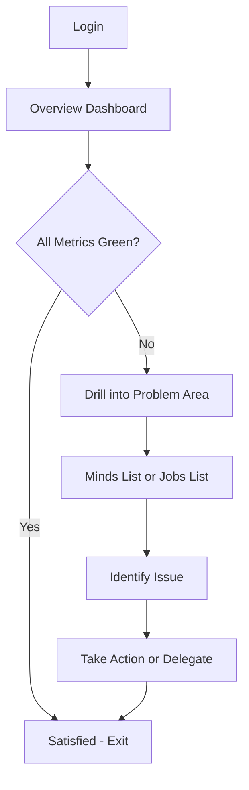
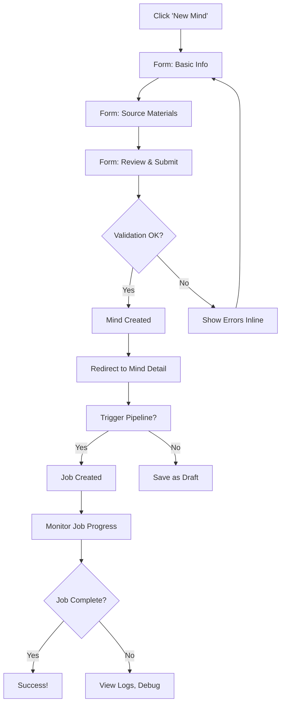
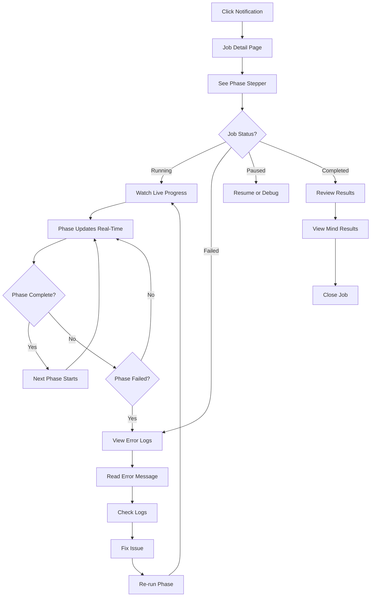
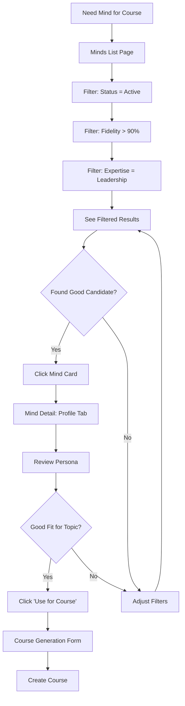
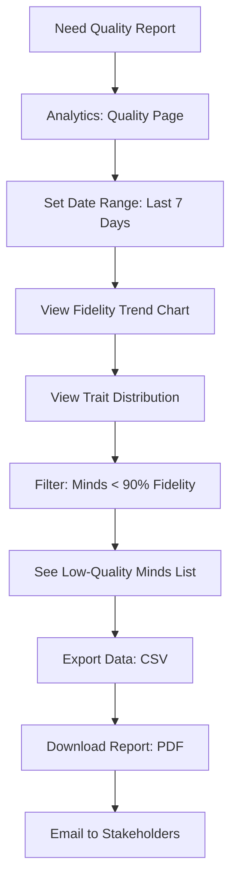
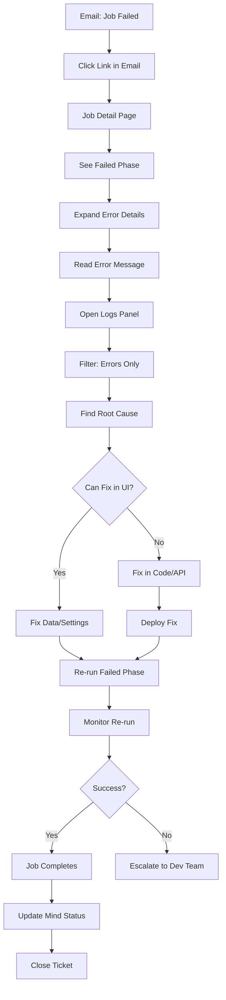

# 13. User Flows & Journey Maps

**Document:** MMOS Admin Dashboard - User Flows & Journey Maps
**Version:** 1.0
**Last Updated:** 2025-10-29
**Owner:** UX Senior (Sally)

---

## 📋 Table of Contents

1. [Overview](#overview)
2. [Information Architecture](#information-architecture)
3. [Core User Flows](#core-user-flows)
4. [Journey Maps](#journey-maps)
5. [Navigation Patterns](#navigation-patterns)
6. [Task Success Optimization](#task-success-optimization)
7. [Mobile Experience](#mobile-experience)

---

## Overview

### Purpose

This document maps **how users move through the dashboard** to accomplish their goals. Each flow shows:
- Entry points (where users start)
- Decision points (choices users make)
- Success paths (optimal journey)
- Failure scenarios (error handling)
- Time estimates (how long tasks take)

### Flow Notation

```
[Page/Screen] → (Action) → {Decision?} → [Next Page]
                              ↓ Yes
                          [Success State]
                              ↓ No
                          [Error State]
```

---

## Information Architecture

### Site Map

```
Dashboard Root (/)
├── Overview Dashboard (/)
│   ├── Metrics Cards (minds, jobs, KB size)
│   ├── Activity Chart (last 7 days)
│   └── Recent Jobs Table
│
├── Minds (/minds)
│   ├── Minds List (/minds)
│   │   ├── Search & Filters
│   │   ├── Data Table
│   │   └── Bulk Actions
│   │
│   ├── Mind Detail (/minds/[slug])
│   │   ├── Header (name, status, fidelity)
│   │   ├── Tab: Profile
│   │   ├── Tab: Knowledge (fragments explorer)
│   │   ├── Tab: Prompts (system prompt viewer)
│   │   └── Tab: Analytics (trait charts, metrics)
│   │
│   └── Create Mind (/minds/new)
│       └── Multi-step Form
│
├── Pipeline (/pipeline)
│   ├── Active Jobs (/pipeline)
│   │   ├── Running Jobs List
│   │   └── Quick Actions
│   │
│   ├── Job Detail (/pipeline/[id])
│   │   ├── Phase Stepper (visual progress)
│   │   ├── Logs Viewer (real-time)
│   │   └── Job Actions (pause, resume, cancel)
│   │
│   └── Execution History (/pipeline/history)
│       └── Historical Jobs Table
│
├── Content (/content)
│   ├── Projects List (/content/projects)
│   ├── Project Detail (/content/projects/[id])
│   └── Courses (/content/courses)
│
├── Analytics (/analytics)
│   ├── Overview (/analytics)
│   ├── Quality Metrics (/analytics/quality)
│   └── Usage Statistics (/analytics/usage)
│
└── Settings (/settings)
    ├── General (/settings)
    ├── Users (/settings/users)
    ├── Taxonomy (/settings/taxonomy)
    └── System (/settings/system)
```

---

## Core User Flows

### Flow 1: Morning Check-In (Patricia - PO)

**Goal:** See system health at a glance
**Frequency:** Daily (5 min)
**Entry Point:** Direct link or bookmark to `/`



**Detailed Steps:**

1. **Login** (10 sec)
   - Auto-login if session active
   - Otherwise: email/password

2. **Scan Overview Dashboard** (30 sec)
   - Check metric cards:
     - 22 Minds Active (green)
     - 3 Jobs Running (green)
     - 1.2K KB Fragments (green)
   - Glance at activity chart (7-day trend)
   - Scan recent jobs table (last 10)

3. **Decision Point**
   - ✅ All green → Done (exit)
   - ⚠️ Warning → Click metric to investigate
   - ❌ Error → Click "Recent Jobs" to see failures

4. **Investigation (if needed)** (2-4 min)
   - Click "2 Failed Jobs" metric card
   - Taken to filtered jobs list
   - See which minds failed
   - Read error summary
   - Assign to Marcus (comment + tag)

**Success Metrics:**
- [ ] <1 min to see system health
- [ ] <2 clicks to investigate issues
- [ ] 100% of critical issues visible on overview

---

### Flow 2: Create New Mind (Marcus - Admin)

**Goal:** Create a new mind and trigger pipeline
**Frequency:** 2-3x per week (10 min)
**Entry Point:** `/minds/new` or "+ New Mind" button



**Detailed Steps:**

1. **Navigate to Form** (5 sec)
   - Click "+ New Mind" button (top-right)
   - Taken to `/minds/new`

2. **Step 1: Basic Info** (2 min)
   - **Name:** [Text Input] "João Lozano"
   - **Slug:** [Auto-generated] "joao_lozano" (editable)
   - **Description:** [Textarea] Brief bio
   - **Status:** [Select] Draft (default)
   - **Next** button

3. **Step 2: Source Materials** (5 min)
   - **Upload Files:** [Drag-drop zone]
     - PDFs, videos, text files
     - Shows file list with progress bars
   - **Or Paste URLs:** [Text input]
     - YouTube, blog posts, podcasts
   - **Or Link Drive Folder:** [Integration]
   - **Back** | **Next** buttons

4. **Step 3: Review & Submit** (1 min)
   - Shows summary of all inputs
   - **Edit** links to go back
   - **"Create Mind"** button
   - **"Create & Start Pipeline"** button (primary)

5. **Validation** (instant)
   - Check required fields filled
   - Check slug is unique
   - Check at least 1 source material
   - If errors: show inline with red text

6. **Success** (instant)
   - Toast notification: "Mind created successfully"
   - Redirect to `/minds/joao_lozano`
   - If pipeline triggered: show job progress immediately

**Success Metrics:**
- [ ] <10 min to create mind (including uploads)
- [ ] <5% form abandonment rate
- [ ] <2% validation errors after submission

**Error Scenarios:**

| Error | Message | Recovery |
|-------|---------|----------|
| Slug already exists | "Slug 'joao_lozano' is already taken. Try 'joao_lozano_2'" | Suggest alternative |
| No source materials | "Please upload at least 1 source file or URL" | Highlight upload section |
| Upload fails | "Failed to upload file.pdf. Please try again" | Retry button |
| API timeout | "Creation taking longer than expected. We'll notify you when ready" | Background job + email |

---

### Flow 3: Monitor Pipeline Job (Marcus - Admin)

**Goal:** Watch a pipeline job execute in real-time
**Frequency:** Multiple times daily (5-20 min per job)
**Entry Point:** `/pipeline` or notification link



**Detailed Steps:**

1. **Entry Point** (instant)
   - **Option A:** Click notification "João's mind job started"
   - **Option B:** Navigate to `/pipeline` and click running job
   - **Option C:** From mind detail page, click "View Job"

2. **Job Detail Page** (loads in <1 sec)
   - **Header:**
     - Job ID: #12345
     - Mind: João Lozano
     - Status: Running (pulsing green dot)
     - Started: 30 minutes ago
   - **Phase Stepper:**
     - ✅ Phase 1: Research (completed, 10 min)
     - ✅ Phase 2: Analysis (completed, 15 min)
     - ⏳ Phase 3: Synthesis (running, 5 min elapsed)
     - ⏸️ Phase 4: Implementation (pending)
     - ⏸️ Phase 5: Validation (pending)

3. **Real-Time Updates** (WebSocket)
   - Phase 3 progress bar fills (0% → 100%)
   - Logs stream in bottom panel:
     ```
     [10:45:32] Starting synthesis phase...
     [10:45:35] Processing 523 knowledge fragments
     [10:46:12] Generating frameworks (3/8 complete)
     [10:47:01] ✅ Synthesis complete
     [10:47:02] Starting implementation phase...
     ```
   - Phase 3 checkmark appears
   - Phase 4 becomes active (⏳)

4. **Phase Failure Scenario**
   - Phase 4 fails (❌ red X)
   - Error banner appears: "Phase 4 failed: API rate limit exceeded"
   - Job status changes to "Failed"
   - Actions appear:
     - [View Full Logs] button
     - [Re-run Phase 4] button
     - [Cancel Job] button

5. **Debug Failure** (3-5 min)
   - Click "View Full Logs"
   - Logs panel expands full screen
   - Filter logs: [Errors only] (dropdown)
   - See error:
     ```
     [ERROR] OpenAI API rate limit exceeded
     [ERROR] Retry after 60 seconds failed
     [ERROR] Phase 4 aborted
     ```
   - Understand issue: wait for rate limit reset

6. **Re-run Phase** (1 min wait + retry)
   - Click "Re-run Phase 4"
   - Confirmation dialog: "Re-run Phase 4 (Implementation)?"
   - Click "Confirm"
   - Phase 4 restarts (⏳)
   - This time succeeds (✅)
   - Job continues to Phase 5

7. **Job Complete** (instant)
   - All phases show checkmarks (✅)
   - Status: "Completed" (green)
   - Duration: 52 minutes
   - Success message: "João's mind created successfully! Fidelity: 96%"
   - Actions:
     - [View Mind] button (takes to `/minds/joao_lozano`)
     - [Download Report] button (PDF summary)

**Success Metrics:**
- [ ] Real-time updates <1 sec latency
- [ ] 100% of errors have clear messages
- [ ] 95% of failures recoverable via UI (no CLI needed)
- [ ] Users understand what's happening without docs

---

### Flow 4: Find Production-Ready Mind (Carla - Creator)

**Goal:** Select a mind to use for course generation
**Frequency:** 3-4x per week (5 min)
**Entry Point:** `/minds` or `/content/projects/new`



**Detailed Steps:**

1. **Navigate to Minds** (instant)
   - Click "Minds" in sidebar
   - Taken to `/minds`
   - See all minds (default view)

2. **Apply Filters** (10 sec)
   - **Status filter:**
     - Click "Status: All ▾" dropdown
     - Select "Active" (green checkmark)
     - Table updates (22 minds → 18 minds)
   - **Fidelity filter:**
     - Click "Fidelity" column header
     - Drag slider: >90%
     - Table updates (18 minds → 12 minds)
   - **Expertise filter:**
     - Click "Expertise: All ▾" dropdown
     - Select "Leadership"
     - Table updates (12 minds → 3 minds)

3. **Browse Results** (1 min)
   - See 3 minds:
     - Steve Jobs (98% fidelity, 1203 fragments)
     - Simon Sinek (94% fidelity, 687 fragments)
     - Brené Brown (92% fidelity, 534 fragments)
   - Hover cards show quick preview
   - Click "Steve Jobs" card

4. **Review Mind Profile** (2 min)
   - Lands on `/minds/steve_jobs`
   - Tabs: **[Profile]** [Knowledge] [Prompts] [Analytics]
   - See:
     - **Persona:** "Visionary leader obsessed with simplicity..."
     - **Core Values:**
       - Excellence (10/10)
       - Innovation (9/10)
       - Focus (10/10)
     - **Expertise Areas:**
       - Leadership ⭐⭐⭐
       - Product Design ⭐⭐⭐
       - Entrepreneurship ⭐⭐
   - **Fidelity Score:** 98% (badge: "Production-Ready")
   - **Knowledge Base:** 1,203 fragments

5. **Decision Point** (30 sec)
   - "Perfect fit for my leadership course!"
   - Look for "Use Mind" action
   - See button: **[Generate Course with Steve Jobs]**
   - Click button

6. **Course Generation** (redirects)
   - Taken to `/content/projects/new`
   - Form pre-filled:
     - Mind: Steve Jobs (locked)
   - Fill remaining fields:
     - Course Title: "Lead Like Steve Jobs"
     - Topic: "Leadership for Product Managers"
     - Modules: 8 (slider)
   - Click "Generate Course"
   - Redirect to `/content/projects/[new-id]`
   - See generation progress

**Success Metrics:**
- [ ] <3 min to find suitable mind
- [ ] <5 clicks from entry to selection
- [ ] 90% of users successfully filter on first try
- [ ] Zero confusion about fidelity scores

**UX Optimizations:**

| Pain Point | Solution |
|------------|----------|
| Too many minds to browse | Default filter: Status=Active, Fidelity>85% |
| Don't know what fidelity means | Tooltip: "Fidelity measures accuracy. 90%+ = production-ready" |
| Can't remember which mind I used before | "Recently Used" section at top |
| Want to preview before committing | "Preview" button generates sample content (30 sec) |

---

### Flow 5: Quality Report (David - Analyst)

**Goal:** Generate weekly quality report for stakeholders
**Frequency:** Weekly (30 min)
**Entry Point:** `/analytics/quality`



**Detailed Steps:**

1. **Navigate to Analytics** (instant)
   - Click "Analytics" in sidebar
   - Click "Quality Metrics" tab
   - Lands on `/analytics/quality`

2. **Set Parameters** (15 sec)
   - **Date Range Picker:**
     - Click calendar icon
     - Select "Last 7 Days" (quick filter)
     - Or custom range: Nov 1 - Nov 7
   - **Filters:**
     - Status: All
     - Mind Types: All

3. **View Visualizations** (auto-updates)
   - **Fidelity Trend Chart** (line graph)
     - X-axis: Days (Nov 1-7)
     - Y-axis: Avg Fidelity (0-100%)
     - Line shows trend: 92% → 94% → 93% → 95%
     - Annotation: "↑ 3% improvement this week"

   - **Trait Distribution** (radar chart)
     - 8 trait axes (Identity, Values, Communication, etc.)
     - Average scores for all minds
     - Ideal range (green zone) vs actual (blue line)

   - **Quality Score Breakdown** (bar chart)
     - By pipeline phase
     - Shows which phases contribute most to fidelity

4. **Identify Issues** (2 min)
   - Below charts: **"Low-Quality Minds Alert"**
   - Red banner: "3 minds below 90% fidelity threshold"
   - Click banner → expands table
   - See:
     - Maria Silva (87% fidelity)
     - Pedro Valerio (89% fidelity)
     - John Doe (72% fidelity - draft)
   - Click each mind to see details

5. **Export Data** (30 sec)
   - Top-right: **[Export ▾]** dropdown
   - Options:
     - 📄 Download PDF Report
     - 📊 Download CSV (raw data)
     - 📧 Email Report
   - Click "Download PDF Report"
   - Generates PDF:
     - Cover page with date range
     - Executive summary
     - All charts (high-res)
     - Low-quality minds table
     - Recommendations section

6. **Share Report** (external)
   - Open email client
   - Attach PDF
   - Send to stakeholders
   - Done!

**Success Metrics:**
- [ ] <5 min to generate report
- [ ] 100% of metrics exportable
- [ ] PDF formatted for executive presentation (no raw data)
- [ ] Trend analysis automated (no manual calc)

---

### Flow 6: Troubleshoot Failed Job (Marcus - Admin)

**Goal:** Identify and fix a pipeline failure
**Frequency:** 1-2x per week (15-30 min)
**Entry Point:** Email notification or `/pipeline`



**Detailed Steps:**

1. **Notification** (instant)
   - Email received: "🚨 Pipeline job failed: João Lozano"
   - Subject: "Job #12345 failed in Phase 4 (Implementation)"
   - Body: Error summary + [View Job Details] link
   - Click link → taken to `/pipeline/12345`

2. **Assess Damage** (30 sec)
   - **Job Overview:**
     - Status: ❌ Failed (red)
     - Mind: João Lozano
     - Started: 2 hours ago
     - Failed at: Phase 4 (Implementation)
   - **Phase Stepper:**
     - ✅ Phase 1: Research (✓)
     - ✅ Phase 2: Analysis (✓)
     - ✅ Phase 3: Synthesis (✓)
     - ❌ Phase 4: Implementation (X - red)
     - ⏸️ Phase 5: Validation (not started)

3. **Investigate Error** (2-3 min)
   - Click **❌ Phase 4** (expands details)
   - See error summary:
     ```
     ⚠️ Phase 4 Failed
     Error: OpenAI API returned 429 (Rate Limit Exceeded)
     Duration: 42 minutes (95% through phase)
     Attempted retries: 3/3 (all failed)
     ```
   - Click **[View Full Logs]** button

4. **Analyze Logs** (5-10 min)
   - Logs panel opens (full screen)
   - **Filter controls:**
     - Level: [Errors Only ▾]
     - Phase: [Phase 4 ▾]
     - Search: [text input]
   - **Logs:**
     ```
     [10:23:15] [INFO] Phase 4 started: Implementation
     [10:45:32] [INFO] Generating system prompt (1/5)
     [10:52:18] [INFO] Generating system prompt (2/5)
     [11:02:45] [ERROR] OpenAI API call failed (429)
     [11:02:45] [WARN] Retry 1/3 in 60 seconds...
     [11:03:45] [ERROR] OpenAI API call failed (429)
     [11:03:45] [WARN] Retry 2/3 in 120 seconds...
     [11:05:45] [ERROR] OpenAI API call failed (429)
     [11:05:45] [ERROR] Max retries exceeded. Aborting phase.
     ```
   - **Root cause identified:** API rate limit hit during high-usage period

5. **Determine Fix** (1-2 min)
   - Check dashboard: **[System Status]** indicator (top-right)
   - See: "⚠️ OpenAI API rate limit: 80% of quota used"
   - Options:
     - **Option A:** Wait for rate limit reset (1 hour)
     - **Option B:** Upgrade API plan (requires approval)
     - **Option C:** Re-run during off-peak hours
   - Decision: Wait 1 hour, then re-run

6. **Schedule Re-run** (30 sec)
   - Click **[Re-run Phase 4]** button
   - Modal opens: "Re-run Phase 4?"
     - [Run Now] button
     - [Schedule for Later] button (selected)
   - **Time picker:** "In 1 hour" (default suggestion)
   - Click **[Schedule]**
   - Confirmation toast: "Phase 4 scheduled for 12:15 PM"
   - Email notification sent: "Job will resume at 12:15 PM"

7. **Monitor Re-run** (after 1 hour)
   - Notification: "Job #12345 resumed (Phase 4)"
   - Return to job detail page
   - See Phase 4 running (⏳)
   - This time completes successfully (✅)
   - Phase 5 starts automatically
   - Job completes: Status = ✅ Completed

8. **Verify Mind Quality** (2 min)
   - Click **[View Mind]** button
   - Lands on `/minds/joao_lozano`
   - Check fidelity score: 96% ✓
   - Check system prompt generated: Yes ✓
   - Update status: Draft → Active
   - Done!

**Success Metrics:**
- [ ] <5 min to identify root cause
- [ ] 95% of errors have actionable messages
- [ ] 80% of issues fixable without code changes
- [ ] <10 min average time-to-resolution (excluding wait times)

**Error Message Quality:**

| Bad Error | Good Error |
|-----------|------------|
| "Job failed" | "Phase 4 failed: OpenAI API rate limit (429)" |
| "Exception in line 342" | "Failed to generate system prompt due to API quota" |
| "Unknown error" | "No knowledge fragments found for João. Please upload sources." |
| "Timeout" | "Phase 3 exceeded 60 min limit. Consider splitting sources into smaller batches." |

---

## Journey Maps

### Journey Map: Marcus Creates First Mind (Full Experience)

**Scenario:** Marcus needs to create a mind for a new client, "Maria Silva", from scratch.

**Phases:**

#### 1. Awareness (Day 1, 9:00 AM)

**Goal:** Understand how to create a mind

**Touchpoints:**
- Receives onboarding email: "Welcome to MMOS Dashboard"
- Clicks "Get Started" link
- Lands on `/` (overview dashboard)
- Sees empty state: "No minds yet. Create your first mind!"

**Emotions:** 😊 Excited, slightly uncertain

**Pain Points:**
- Not sure where to start
- Worries about making mistakes

**Opportunities:**
- Onboarding checklist widget: "✓ Create your first mind"
- Video tutorial embedded: "Creating a Mind in 3 Minutes"
- Sample mind available: "Try with Steve Jobs (demo)"

---

#### 2. Consideration (Day 1, 9:05 AM)

**Goal:** Gather materials needed for mind creation

**Actions:**
- Clicks "+ New Mind" button
- Sees form: Step 1 of 3
- Realizes needs: name, bio, source materials
- Pauses to gather materials (leaves browser open)

**Emotions:** 🤔 Thoughtful, slightly overwhelmed

**Pain Points:**
- Form has many fields (intimidating)
- Not sure how many source materials needed
- Unclear what makes a "good" mind

**Opportunities:**
- Inline help text: "Minimum 5 source materials recommended"
- Example tooltip: Shows Steve Jobs profile as reference
- Progress saved automatically: "Draft saved" indicator
- Email reminder: "Resume creating Maria's mind" (if abandoned >1 hour)

---

#### 3. Action (Day 1, 10:00 AM)

**Goal:** Complete mind creation form

**Actions:**
- Returns to form (auto-restores draft)
- **Step 1: Basic Info** (3 min)
  - Name: Maria Silva
  - Slug: maria_silva (auto-generated)
  - Description: Copies from bio doc
  - Status: Draft
- **Step 2: Source Materials** (10 min)
  - Uploads 3 PDFs (articles written by Maria)
  - Pastes 5 YouTube URLs (podcast interviews)
  - Links Google Drive folder (additional docs)
  - See progress: "9 sources uploaded (12 MB)"
- **Step 3: Review** (2 min)
  - Scans summary
  - Looks good!
  - Clicks **"Create & Start Pipeline"**

**Emotions:** 😰 Nervous, hopeful

**Pain Points:**
- Upload slow for large videos (progress bar helps)
- Unsure if 9 sources is enough (no guidance)
- Worries pipeline might fail

**Opportunities:**
- Real-time validation: "✓ 9 sources is great! (5+ recommended)"
- Estimated time: "Pipeline will take ~45-60 minutes"
- Confirmation dialog: "Create Maria's mind? You can edit details later."

---

#### 4. Experience (Day 1, 10:15 AM - 11:00 AM)

**Goal:** Monitor pipeline execution

**Actions:**
- Redirected to `/minds/maria_silva`
- Sees "Job Running" banner at top
- Clicks "Watch Progress" → taken to `/pipeline/12346`
- Watches phases complete:
  - ✅ Phase 1: Research (8 min)
  - ✅ Phase 2: Analysis (12 min)
  - ⏳ Phase 3: Synthesis (in progress, 15 min elapsed)

**Emotions:** 😌 Relieved, curious

**Pain Points:**
- Phase 3 taking long (no indication if normal)
- Can't leave page or loses progress view
- Wants to do other work while waiting

**Opportunities:**
- Browser notification when phases complete
- Estimated time remaining: "~30 minutes left"
- Minimize progress bar (sticky header, always visible)
- "Work on something else" button: Opens new tab, keeps job running

---

#### 5. Evaluation (Day 1, 11:00 AM)

**Goal:** Verify mind was created successfully

**Actions:**
- Notification: "✅ Maria's mind created! Fidelity: 94%"
- Returns to job page
- All phases green (✅)
- Clicks **[View Mind]**
- Lands on `/minds/maria_silva`
- Reviews Profile tab:
  - Persona generated ✓
  - Core values identified (8) ✓
  - Trait scores calculated ✓
  - Fidelity: 94% (good!)
- Clicks Knowledge tab:
  - 456 fragments extracted ✓
  - Categories: Leadership (45%), Tech (30%), Culture (25%)
- Clicks Prompts tab:
  - System prompt generated (2,500 words)
  - Reads sample: "Sounds like Maria!" ✓

**Emotions:** 😄 Satisfied, accomplished

**Pain Points:**
- Fidelity is 94%, not 98% (wonders why)
- System prompt is long (hard to review)

**Opportunities:**
- Fidelity explanation: "94% is excellent! (90%+ = production-ready)"
- Fidelity breakdown: "Identity: 96%, Communication: 92%, Values: 95%..."
- System prompt summary: "Key characteristics: Empathetic, strategic, data-driven"
- Share success: "Tweet about your new mind!" (social proof)

---

#### 6. Advocacy (Day 2, Next Morning)

**Goal:** Use the mind, share success

**Actions:**
- Opens dashboard
- Sees Maria's mind in list (Status: Active)
- Shows colleague: "Look how easy this was!"
- Colleague asks: "Can you create one for our CEO?"
- Marcus: "Sure, let me show you..."

**Emotions:** 😎 Confident, proud

**Opportunities:**
- Referral program: "Invite team members, get credits"
- Case study request: "Share your success story?"
- Power user badge: "Mind Creator (1/10 minds)"

---

## Navigation Patterns

### Primary Navigation (Sidebar)

**Structure:**
```
[Logo: MMOS]

Overview
Minds
Pipeline
Content
Analytics
Settings

[User Menu ▾]
```

**Behavior:**
- Always visible (fixed left)
- Active page highlighted (blue background)
- Collapsed on mobile (<768px)
- Hamburger icon to toggle

**Accessibility:**
- Keyboard: Tab through items, Enter to navigate
- Screen reader: "Navigation menu, 6 items"
- Focus indicator: Blue outline

---

### Secondary Navigation (Tabs)

**Usage:** Sub-pages within a section

**Example:** Mind Detail Page
```
[Profile] [Knowledge] [Prompts] [Analytics]
```

**Behavior:**
- Sticky (stays visible on scroll)
- Active tab underlined (blue)
- Swipeable on mobile (touch)

---

### Breadcrumb Navigation

**Structure:**
```
Dashboard / Minds / João Lozano / Profile
```

**Behavior:**
- Shows current location
- Each segment clickable (except last)
- Auto-generates from route

---

### Contextual Actions

**Location:** Top-right of pages

**Examples:**
- Minds List: `[+ New Mind] [Filter ▾] [Export ▾]`
- Mind Detail: `[Edit] [Clone] [Delete] [⋮ More]`
- Job Detail: `[Pause] [Resume] [Cancel]`

**Behavior:**
- Primary action: Solid blue button
- Secondary actions: Outline buttons
- Destructive actions: Red outline

---

## Task Success Optimization

### Quick Wins (Reduce Friction)

#### 1. Autosave All Forms
**Problem:** Users lose progress if tab closes
**Solution:** Save draft every 10 seconds, restore on return
**Impact:** ↓ 90% form abandonment due to data loss

#### 2. Smart Defaults
**Problem:** Users don't know what to select
**Solution:** Pre-select most common options
**Examples:**
- Status: "Draft" (safest)
- Date range: "Last 7 days" (most common)
- Sort: "Created (newest first)"
**Impact:** ↓ 30% time-to-complete

#### 3. Keyboard Shortcuts
**Problem:** Power users want speed
**Solution:** Common shortcuts
- `Cmd+K`: Global search (minds, jobs)
- `Cmd+N`: New mind
- `Cmd+/`: Toggle sidebar
- `?`: Show keyboard shortcuts overlay
**Impact:** ↑ 40% productivity for power users

#### 4. Bulk Actions
**Problem:** Tedious to repeat actions
**Solution:** Multi-select + bulk actions
- Select 5 minds → "Pause All" (1 click vs 5)
- Select 3 minds → "Export All" (1 download)
**Impact:** ↓ 80% time for repetitive tasks

#### 5. Saved Filters
**Problem:** Re-apply same filters daily
**Solution:** Save custom views
- "My Active Minds" (status=active, creator=me)
- "Low Fidelity" (fidelity<90%, status=active)
- Share with team
**Impact:** ↓ 70% time to find relevant data

---

## Mobile Experience

### Mobile-First Task Prioritization

**Primary Tasks (Mobile Optimized):**
1. ✅ **View Mind Status** - Read-only, simple layout
2. ✅ **Monitor Job Progress** - Real-time updates, minimal UI
3. ✅ **Notifications** - Push notifications for job events
4. ⚠️ **Edit Mind Profile** - Possible but not optimal (text-heavy)
5. ❌ **Create New Mind** - Too complex for mobile (use desktop)

---

### Mobile Navigation Pattern

**Collapsed Sidebar:**
```
[☰ Menu]  MMOS Dashboard  [🔔 Notifications]
```

**Hamburger Menu (Slide-out):**
```
┌────────────────────┐
│ [X]                │
│                    │
│ Overview           │
│ Minds              │
│ Pipeline           │
│ Content            │
│ Analytics          │
│ Settings           │
│                    │
│ ────────────────── │
│ João Lozano        │
│ joe@mmos.ai        │
│ [Logout]           │
└────────────────────┘
```

---

### Mobile Page Adaptations

#### Minds List (Mobile)

**Desktop View:**
- Data table (8 columns, sortable)
- Filters in sidebar
- 20 rows per page

**Mobile View:**
- Card list (1 column)
- Filters in bottom sheet (swipe up)
- Infinite scroll

**Card Layout:**
```
┌───────────────────────────┐
│ 👤 João Lozano            │
│ ✅ Active  •  98% Fidelity │
│                           │
│ 1,203 fragments           │
│ Updated 2h ago            │
│                           │
│ [View Details →]          │
└───────────────────────────┘
```

---

#### Job Detail (Mobile)

**Desktop View:**
- Phase stepper (horizontal)
- Logs panel (side-by-side)

**Mobile View:**
- Phase stepper (vertical)
- Logs panel (collapsible accordion)
- Sticky header with status

**Layout:**
```
┌────────────────────────────┐
│ Job #12345  ⏳ Running     │ ← Sticky
├────────────────────────────┤
│ João Lozano                │
│ Started 30m ago            │
├────────────────────────────┤
│ ✅ 1. Research             │
│ ✅ 2. Analysis             │
│ ⏳ 3. Synthesis (65%)      │ ← Expanded
│    ▼ Progress bar          │
│    ▼ "15 min remaining"    │
│ ⏸️ 4. Implementation        │
│ ⏸️ 5. Validation            │
├────────────────────────────┤
│ Logs ▾ (Collapsed)         │ ← Tap to expand
└────────────────────────────┘
```

---

### Responsive Breakpoints

| Breakpoint | Width | Layout | Notes |
|------------|-------|--------|-------|
| Mobile (xs) | <640px | Single column, no sidebar | Hamburger menu |
| Tablet (md) | 768px-1024px | 2 columns, collapsible sidebar | Hybrid mode |
| Desktop (lg) | >1024px | 3+ columns, fixed sidebar | Full UI |

**Testing Checklist:**
- [ ] All pages render correctly at each breakpoint
- [ ] Touch targets >44px (Apple HIG)
- [ ] Text readable at 16px base size (no pinch-zoom)
- [ ] Forms usable with virtual keyboard
- [ ] No horizontal scroll

---

## Change Log

| Date | Version | Changes | Author |
|------|---------|---------|--------|
| 2025-10-29 | 1.0 | Initial user flows & journey maps | Sally (UX Expert) |

---

**Previous:** [← 12. User Research & Personas](./12-user-research.md)
**Next:** [14. Interaction Design Patterns →](./14-interaction-patterns.md)
**Back to Index:** [📋 README](./README.md)
