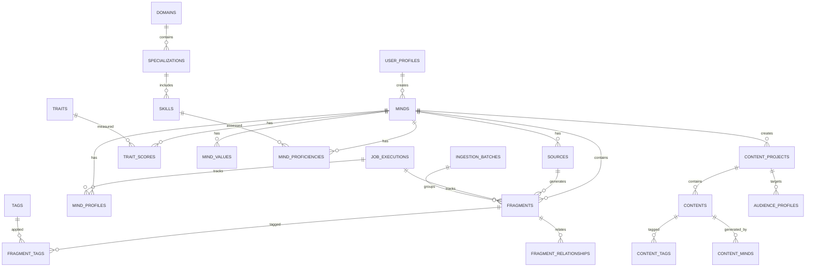

# 3. Data Architecture

**Document:** MMOS Admin Dashboard - Data Architecture
**Version:** 1.0
**Last Updated:** 2025-10-28
**Primary Reviewer:** 🗄️ Data Architect

---

## 📋 Table of Contents

1. [Database Overview](#database-overview)
2. [Schema Health Report](#schema-health-report)
3. [Entity Relationship Model](#entity-relationship-model)
4. [Table Categories](#table-categories)
5. [Critical Improvements Required](#critical-improvements-required)
6. [Data Models for Dashboard](#data-models-for-dashboard)
7. [Migration Strategy](#migration-strategy)
8. [Performance Considerations](#performance-considerations)
9. [Data Architect Review Checklist](#data-architect-review-checklist)

---

## Database Overview

### Current State (Based on DB Sage Audit 2025-10-28)

**Platform:** Supabase (PostgreSQL 17.6)
**Connection:** aws-1-us-east-2.pooler.supabase.com
**Schema Version:** v0.7.0 (Production Baseline)

**Statistics:**
- **Tables:** 30 (all with UUID primary keys ✅)
- **Columns:** 400
- **Indexes:** 97 (all utilized, zero waste ✅)
- **Foreign Keys:** 37 constraints
- **Check Constraints:** 154 (excellent data quality ✅)
- **Total Size:** 13 MB (fits entirely in RAM)
- **Largest Table:** `contents` (672 KB)

**Overall Health Score:** 85/100 - **Production Ready** ✅

| Category | Score | Status |
|----------|-------|--------|
| Design | 85/100 | ⚠️ Good |
| Performance | 95/100 | ✅ Excellent |
| Security | 70/100 | ⚠️ Needs Work |
| Data Integrity | 90/100 | ✅ Very Good |

---

## Schema Health Report

### Strengths ✅

1. **Perfect Primary Key Coverage**
   - All 30 tables have UUID-based primary keys
   - No composite keys (simplifies ORM usage)

2. **Zero Index Waste**
   - 97 indexes, **all** have scan counts > 0
   - No duplicate indexes
   - No bloat detected

3. **Comprehensive Data Validation**
   - 154 check constraints enforce:
     - Range validation (`relevance` 0-10, `intensity_10` 0-10)
     - Enum validation (`status`, `content_type`, `privacy_level`)
     - Business rules (`from_fragment_id <> to_fragment_id`)
     - NOT NULL enforcement

4. **Strong Referential Integrity**
   - 37 foreign key relationships
   - Provenance tracking via `generation_execution_id`

### Critical Issues 🔴

**NONE** - No blocking issues for production use.

### Important Concerns ⚠️

1. **Security: 63% of tables lack RLS**
   - 19/30 tables without Row Level Security
   - **Critical gap:** CreatorOS tables (`content_projects`, `contents`, `audience_profiles`)
   - **Risk:** Multi-tenant data leakage

2. **Audit Trail: Missing Timestamps**
   - 11 tables missing `created_at`
   - 20 tables missing `updated_at`
   - **Impact:** Limited audit capabilities

3. **Performance: 8 Foreign Keys Without Indexes**
   - Impacts JOIN performance and DELETE CASCADE
   - Tables affected: `content_projects`, `fragments`, `mind_proficiencies`, etc.

---

## Entity Relationship Model

### Core Domain Model



### Mind-Centric Architecture

The schema follows a **mind-centric design** where everything revolves around the `minds` table:

```
                         ┌─────────────┐
                         │    MINDS    │
                         └──────┬──────┘
                                │
        ┌───────────────────────┼───────────────────────┐
        │                       │                       │
   ┌────▼─────┐         ┌──────▼────────┐      ┌──────▼──────┐
   │ SOURCES  │         │ MIND_PROFILES │      │  FRAGMENTS  │
   └──────────┘         └───────────────┘      └─────────────┘
                                │
                    ┌───────────┼───────────┐
                    │           │           │
             ┌──────▼──────┐ ┌─▼────────┐ ┌▼─────────────┐
             │ TRAIT_SCORES│ │  VALUES  │ │ PROFICIENCIES│
             └─────────────┘ └──────────┘ └──────────────┘
```

---

## Table Categories

### 1. Mind Core Tables (11 tables) - RLS ✅

**Perfect security coverage, well-designed**

| Table | Purpose | Key Columns | RLS | Notes |
|-------|---------|-------------|-----|-------|
| `minds` | Core mind entities | `slug`, `name`, `status` | ✅ | Central entity |
| `sources` | Input materials | `url`, `title`, `content_hash` | ✅ | Books, interviews, etc. |
| `fragments` | Knowledge chunks | `content`, `embedding`, `relevance` | ✅ | Vector search ready |
| `mind_profiles` | Cognitive profiles | `fidelity_score`, `persona_description` | ✅ | Quality metrics |
| `mind_values` | Core values | `value_name`, `intensity_10` | ✅ | DNA Mental layer |
| `mind_psychometrics` | Psychological traits | `openness`, `conscientiousness` | ✅ | Big 5 personality |
| `mind_routine_windows` | Time management | `weekday`, `start_time`, `activity_type` | ✅ | Schedule patterns |
| `mind_obsessions` | Focus areas | `obsession_name`, `intensity_10` | ✅ | Cognitive priorities |
| `mind_proficiencies` | Skill assessments | `skill_id`, `level_10` | ✅ | Competency matrix |
| `trait_scores` | Trait measurements | `trait_id`, `score_10` | ✅ | Quantified characteristics |
| `user_profiles` | System users | `email`, `role`, `preferences` | ✅ | Authentication |

**Status:** ✅ Production-ready, no changes needed

---

### 2. CreatorOS Tables (4 tables) - RLS ❌ **CRITICAL GAP**

**Missing RLS = Multi-tenant data leakage risk**

| Table | Purpose | Key Columns | RLS | **Issue** |
|-------|---------|-------------|-----|-----------|
| `content_projects` | Course projects | `title`, `target_audience_id`, `creator_mind_id` | ❌ | 🔴 **P0: Add RLS** |
| `contents` | Generated content | `title`, `body`, `project_id` | ❌ | 🔴 **P0: Add RLS** |
| `audience_profiles` | Target personas | `name`, `demographics`, `project_id` | ❌ | 🔴 **P0: Add RLS** |
| `content_frameworks` | Templates | `name`, `structure` | ❌ | ⚠️ Shared data (OK) |

**Action Required:** See [Critical Improvements Required](#critical-improvements-required)

---

### 3. Taxonomy Tables (8 tables) - RLS ❌ **BY DESIGN**

**Shared reference data, no RLS needed**

| Table | Purpose | Examples |
|-------|---------|----------|
| `categories` | Fragment categorization | Research, Experience, Philosophy |
| `domains` | Knowledge domains | Technology, Business, Arts |
| `specializations` | Domain specializations | Software Engineering, Marketing |
| `skills` | Specific skills | Python, Public Speaking |
| `traits` | Personality traits | Decisiveness, Charisma |
| `tags` | Flexible tagging | #innovation, #leadership |
| `content_frameworks` | Content templates | Blog post, Course module |
| `mind_aliases` | Alternative names | Steve, Steve Jobs, SJ |

**Status:** ✅ Correct (shared across tenants)

---

### 4. Operational Tables (3 tables) - RLS ❌ **BY DESIGN**

**Service-role only access, background jobs**

| Table | Purpose | Access Pattern |
|-------|---------|----------------|
| `ingestion_batches` | Track data imports | Service role only |
| `processing_queue` | Job queue | Service role only |
| `job_executions` | Pipeline runs | Service role + RLS for viewing |

**Status:** ✅ Correct architecture

---

### 5. Junction Tables (4 tables) - RLS ❌ **NEEDS REVIEW**

**Should inherit parent RLS or have explicit policies?**

| Table | Relationship | Current | Recommendation |
|-------|--------------|---------|----------------|
| `fragment_tags` | fragments ↔ tags | No RLS | ⚠️ Add via `fragment_id` |
| `fragment_relationships` | fragments ↔ fragments | No RLS | ⚠️ Add via `from_fragment_id` |
| `content_tags` | contents ↔ tags | No RLS | ⚠️ Add via `content_id` |
| `content_minds` | contents ↔ minds | No RLS | ⚠️ Add via `mind_id` |

**Rationale:** Defense-in-depth (explicit > implicit protection)

---

## Critical Improvements Required

### Priority P0: RLS for CreatorOS (MUST DO BEFORE LAUNCH)

**Impact:** Prevents data leakage between users

**Estimated Effort:** 1.5 hours

**SQL Implementation:**

```sql
-- 1. Enable RLS on CreatorOS tables
ALTER TABLE content_projects ENABLE ROW LEVEL SECURITY;
ALTER TABLE contents ENABLE ROW LEVEL SECURITY;
ALTER TABLE audience_profiles ENABLE ROW LEVEL SECURITY;

-- 2. Policy: Users see only their own projects
CREATE POLICY "content_projects_user_access"
  ON content_projects
  FOR ALL
  TO authenticated
  USING (creator_mind_id IN (
    SELECT id FROM minds WHERE creator_user_id = auth.uid()
  ))
  WITH CHECK (creator_mind_id IN (
    SELECT id FROM minds WHERE creator_user_id = auth.uid()
  ));

-- 3. Policy: Contents visible if user owns parent project
CREATE POLICY "contents_via_project"
  ON contents
  FOR ALL
  TO authenticated
  USING (
    project_id IN (
      SELECT cp.id
      FROM content_projects cp
      JOIN minds m ON m.id = cp.creator_mind_id
      WHERE m.creator_user_id = auth.uid()
    )
  )
  WITH CHECK (
    project_id IN (
      SELECT cp.id
      FROM content_projects cp
      JOIN minds m ON m.id = cp.creator_mind_id
      WHERE m.creator_user_id = auth.uid()
    )
  );

-- 4. Policy: Audience profiles via project ownership
CREATE POLICY "audience_profiles_via_project"
  ON audience_profiles
  FOR ALL
  TO authenticated
  USING (
    project_id IN (
      SELECT cp.id
      FROM content_projects cp
      JOIN minds m ON m.id = cp.creator_mind_id
      WHERE m.creator_user_id = auth.uid()
    )
  )
  WITH CHECK (
    project_id IN (
      SELECT cp.id
      FROM content_projects cp
      JOIN minds m ON m.id = cp.creator_mind_id
      WHERE m.creator_user_id = auth.uid()
    )
  );

-- 5. Admin policy (see everything)
CREATE POLICY "content_projects_admin"
  ON content_projects
  FOR ALL
  TO authenticated
  USING (is_admin())
  WITH CHECK (is_admin());

-- Repeat for contents and audience_profiles
```

**Testing:**
```sql
-- Test as regular user (should see only own data)
SET ROLE authenticated;
SET request.jwt.claims = '{"sub": "user-123"}';
SELECT * FROM content_projects; -- Only user-123's projects

-- Test as admin (should see all)
SELECT * FROM content_projects WHERE is_admin(); -- All projects
```

---

### Priority P1: Add Missing Indexes (DO SOON)

**Impact:** Improves JOIN and DELETE CASCADE performance

**Estimated Effort:** 1 hour

**SQL Implementation:**

```sql
-- Add indexes for foreign keys (zero-downtime)
CREATE INDEX CONCURRENTLY idx_content_projects_target_audience_id
  ON content_projects(target_audience_id)
  WHERE target_audience_id IS NOT NULL;

CREATE INDEX CONCURRENTLY idx_fragments_generation_execution_id
  ON fragments(generation_execution_id)
  WHERE generation_execution_id IS NOT NULL;

CREATE INDEX CONCURRENTLY idx_fragments_ingestion_batch_id
  ON fragments(ingestion_batch_id)
  WHERE ingestion_batch_id IS NOT NULL;

CREATE INDEX CONCURRENTLY idx_mind_proficiencies_generation_execution_id
  ON mind_proficiencies(generation_execution_id)
  WHERE generation_execution_id IS NOT NULL;

CREATE INDEX CONCURRENTLY idx_mind_profiles_generation_execution_id
  ON mind_profiles(generation_execution_id)
  WHERE generation_execution_id IS NOT NULL;

CREATE INDEX CONCURRENTLY idx_skills_specialization_id
  ON skills(specialization_id);

CREATE INDEX CONCURRENTLY idx_specializations_domain_id
  ON specializations(domain_id);

CREATE INDEX CONCURRENTLY idx_trait_scores_generation_execution_id
  ON trait_scores(generation_execution_id)
  WHERE generation_execution_id IS NOT NULL;
```

**Note:** `CONCURRENTLY` allows zero-downtime indexing

---

### Priority P1: Add Created_at Timestamps (DO SOON)

**Impact:** Enables audit trails and temporal queries

**Estimated Effort:** 1 hour

**SQL Implementation:**

```sql
-- Add created_at to 11 tables
ALTER TABLE mind_aliases ADD COLUMN created_at TIMESTAMPTZ DEFAULT NOW() NOT NULL;
ALTER TABLE domains ADD COLUMN created_at TIMESTAMPTZ DEFAULT NOW() NOT NULL;
ALTER TABLE specializations ADD COLUMN created_at TIMESTAMPTZ DEFAULT NOW() NOT NULL;
ALTER TABLE skills ADD COLUMN created_at TIMESTAMPTZ DEFAULT NOW() NOT NULL;
ALTER TABLE processing_queue ADD COLUMN created_at TIMESTAMPTZ DEFAULT NOW() NOT NULL;
ALTER TABLE categories ADD COLUMN created_at TIMESTAMPTZ DEFAULT NOW() NOT NULL;
ALTER TABLE fragment_tags ADD COLUMN created_at TIMESTAMPTZ DEFAULT NOW() NOT NULL;
ALTER TABLE fragment_relationships ADD COLUMN created_at TIMESTAMPTZ DEFAULT NOW() NOT NULL;
ALTER TABLE traits ADD COLUMN created_at TIMESTAMPTZ DEFAULT NOW() NOT NULL;
ALTER TABLE content_minds ADD COLUMN created_at TIMESTAMPTZ DEFAULT NOW() NOT NULL;
ALTER TABLE content_tags ADD COLUMN created_at TIMESTAMPTZ DEFAULT NOW() NOT NULL;
```

---

### Priority P2: Helper Functions (NICE TO HAVE)

**Impact:** Simplifies RLS policies and queries

**SQL Implementation:**

```sql
-- Helper: Get current authenticated user
CREATE OR REPLACE FUNCTION auth_uid()
RETURNS UUID AS $$
  SELECT COALESCE(
    auth.uid(),
    (current_setting('request.jwt.claims', true)::jsonb->>'sub')::uuid
  );
$$ LANGUAGE SQL STABLE;

-- Helper: Check if current user is admin
CREATE OR REPLACE FUNCTION is_admin()
RETURNS BOOLEAN AS $$
  SELECT EXISTS (
    SELECT 1 FROM user_profiles
    WHERE id = auth_uid() AND role = 'admin'
  );
$$ LANGUAGE SQL STABLE SECURITY DEFINER;

-- Helper: Get current user's mind IDs
CREATE OR REPLACE FUNCTION current_user_mind_ids()
RETURNS SETOF UUID AS $$
  SELECT id FROM minds WHERE creator_user_id = auth_uid();
$$ LANGUAGE SQL STABLE;
```

---

## Data Models for Dashboard

### TypeScript Interfaces (Generated from Schema)

```typescript
// types/supabase.ts (auto-generated)
export type Mind = Database['public']['Tables']['minds']['Row'];
export type MindInsert = Database['public']['Tables']['minds']['Insert'];
export type MindUpdate = Database['public']['Tables']['minds']['Update'];

export type MindProfile = Database['public']['Tables']['mind_profiles']['Row'];
export type Fragment = Database['public']['Tables']['fragments']['Row'];
export type TraitScore = Database['public']['Tables']['trait_scores']['Row'];
```

### Composite Views for Dashboard

```sql
-- View: Mind Overview (for dashboard cards)
CREATE OR REPLACE VIEW v_mind_overview AS
SELECT
  m.id,
  m.slug,
  m.name,
  m.status,
  m.created_at,
  mp.fidelity_score,
  mp.persona_description,
  COUNT(DISTINCT s.id) as source_count,
  COUNT(DISTINCT f.id) as fragment_count,
  AVG(ts.score_10) as avg_trait_score,
  u.email as creator_email
FROM minds m
LEFT JOIN mind_profiles mp ON mp.mind_id = m.id
LEFT JOIN sources s ON s.mind_id = m.id
LEFT JOIN fragments f ON f.mind_id = m.id
LEFT JOIN trait_scores ts ON ts.mind_id = m.id
LEFT JOIN user_profiles u ON u.id = m.creator_user_id
GROUP BY m.id, m.slug, m.name, m.status, m.created_at,
         mp.fidelity_score, mp.persona_description, u.email;

-- View: Pipeline Job Status
CREATE OR REPLACE VIEW v_pipeline_status AS
SELECT
  je.id as job_id,
  je.started_at,
  je.completed_at,
  je.status,
  je.error_message,
  je.metadata->>'phase' as phase,
  m.name as mind_name,
  m.slug as mind_slug
FROM job_executions je
LEFT JOIN minds m ON m.id = (je.metadata->>'mind_id')::uuid
ORDER BY je.started_at DESC;
```

---

## Migration Strategy

### Migration Files Location

**Directory Structure:**
```
supabase/migrations/
├── 20251028000001_enable_rls_creator_os.sql      # P0: RLS for CreatorOS
├── 20251028000002_add_missing_indexes.sql         # P1: Performance indexes
├── 20251028000003_add_created_at_timestamps.sql   # P1: Audit timestamps
├── 20251028000004_add_helper_functions.sql        # P2: Utility functions
└── 20251028000005_create_user_trigger.sql         # P0: Auth user creation
```

**Naming Convention:**
- Format: `YYYYMMDDHHMMSS_description.sql`
- Example: `20251028_143022_enable_rls_creator_os.sql`
- Use descriptive names that explain the change

**Creating Migrations:**
```bash
# Using Supabase CLI (recommended)
supabase migration new enable_rls_creator_os

# Result: Creates supabase/migrations/[timestamp]_enable_rls_creator_os.sql

# Manual creation (if no CLI)
# Create file: supabase/migrations/YYYYMMDDHHMMSS_description.sql
```

**Applying Migrations:**
```bash
# Local development
supabase migration up

# List pending migrations
supabase migration list

# Staging/Production (via CI/CD or manual)
supabase db push
```

**Migration File Template:**
```sql
-- Migration: [Brief description]
-- Date: YYYY-MM-DD
-- Priority: P0|P1|P2
-- Description: [Detailed explanation of what this migration does and why]

-- [Your SQL here]

-- Example:
-- ALTER TABLE content_projects ENABLE ROW LEVEL SECURITY;
```

---

### Phase 1: Pre-Launch (Week 1)

1. **Apply P0 Fixes** ✅
   - Enable RLS on CreatorOS tables
   - Create RLS policies
   - Test with multiple users

2. **Apply P1 Fixes** ✅
   - Add missing indexes
   - Add `created_at` timestamps

3. **Create Dashboard Views** ✅
   - `v_mind_overview`
   - `v_pipeline_status`
   - `v_content_projects_summary`

4. **Generate TypeScript Types** ✅
   ```bash
   npx supabase gen types typescript --project-id <id> > types/supabase.ts
   ```

### Phase 2: Post-Launch (Month 1)

1. **Monitor Performance**
   - Track slow queries via `pg_stat_statements`
   - Identify missing indexes
   - Optimize complex RLS policies

2. **Add Helper Functions**
   - `auth_uid()`, `is_admin()`, `current_user_mind_ids()`

3. **Implement Audit Logging** (Optional)
   - Create `audit.logged_actions` table
   - Track changes to sensitive tables

### Phase 3: Scale (Month 2-3)

1. **Partitioning** (if needed)
   - Partition `fragments` by `mind_id` if >1M rows

2. **Read Replicas** (if needed)
   - Add read replica for analytics queries

3. **Caching Layer**
   - Redis for frequently accessed data (views, aggregations)

---

## Performance Considerations

### Current Performance Profile

**Database Size:** 13 MB (fits entirely in RAM) ✅
**Query Performance:** <10ms for indexed lookups ✅
**Index Health:** Perfect (zero waste, zero bloat) ✅

### Expected Growth (Year 1)

| Metric | Current | Year 1 Projection | Mitigation |
|--------|---------|-------------------|------------|
| Minds | 22 | 100 | Scale OK |
| Fragments | ~10K | ~50K | Add partition at 1M |
| Database Size | 13 MB | 500 MB | Still in RAM |
| Queries/day | <100 | 10K | Connection pooling OK |

### Performance Optimization Checklist

- [x] All foreign keys have indexes (after P1 fixes)
- [x] No unused indexes (already perfect)
- [x] No duplicate indexes (already perfect)
- [ ] Monitor slow queries (setup pg_stat_statements)
- [ ] Optimize RLS policies (profile after launch)
- [ ] Add partial indexes for filtered queries (as needed)

---

## Data Architect Review Checklist

### Schema Design Review

- [ ] **Primary Keys:** All tables have appropriate PKs?
- [ ] **Foreign Keys:** All relationships properly constrained?
- [ ] **Indexes:** Coverage adequate for expected queries?
- [ ] **Data Types:** Appropriate types for each column?
- [ ] **Normalization:** Schema in 3NF where appropriate?
- [ ] **Denormalization:** Strategic denormalization justified?

### Security Review

- [ ] **RLS Coverage:** All user-facing tables protected?
- [ ] **RLS Policies:** Policies correct and performant?
- [ ] **Admin Access:** Super-user paths clearly defined?
- [ ] **Sensitive Data:** PII/secrets properly handled?

### Performance Review

- [ ] **Index Strategy:** Indexes align with query patterns?
- [ ] **Query Performance:** No N+1 queries in dashboard?
- [ ] **Scalability:** Schema scales to 100x current size?
- [ ] **Monitoring:** Observability plan in place?

### Data Integrity Review

- [ ] **Constraints:** Check constraints enforce business rules?
- [ ] **Nullability:** Nullable columns justified?
- [ ] **Cascades:** DELETE/UPDATE cascades appropriate?
- [ ] **Audit Trail:** Timestamp columns where needed?

### Migration Review

- [ ] **P0 Fixes:** Critical security issues addressed?
- [ ] **P1 Fixes:** Performance optimizations planned?
- [ ] **Rollback Plan:** Can migrations be safely reverted?
- [ ] **Testing:** Migration tested on staging data?

---

**Key Questions for Data Architect:**

1. **RLS Strategy:** Do you agree with the CreatorOS RLS policies? Any edge cases missed?
2. **Index Strategy:** Should we add any additional indexes for dashboard queries?
3. **View Design:** Are the proposed views (v_mind_overview, etc.) optimal?
4. **Migration Risk:** Any concerns with the P0/P1 migration plan?
5. **Scalability:** Database design sound for 100+ minds, 1M+ fragments?

---

## Change Log

| Date | Version | Changes | Author |
|------|---------|---------|--------|
| 2025-10-28 | 1.0 | Initial data architecture based on DB Sage audit | Winston (Architect) |

---

**Previous:** [← 2. Tech Stack Decisions](./2-tech-stack-decisions.md)
**Next:** [4. Frontend Architecture →](./4-frontend-architecture.md)
