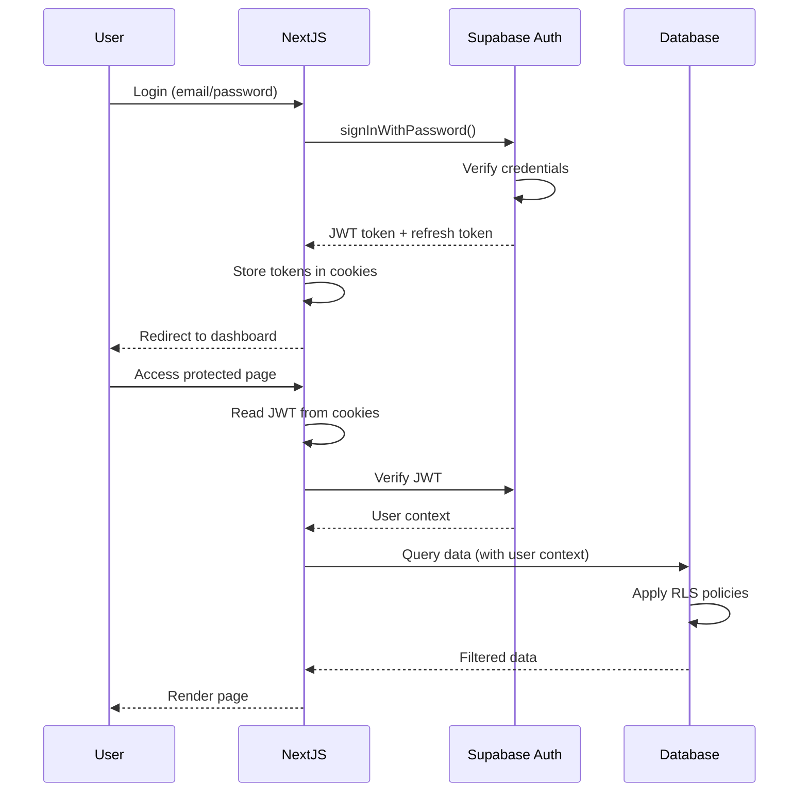
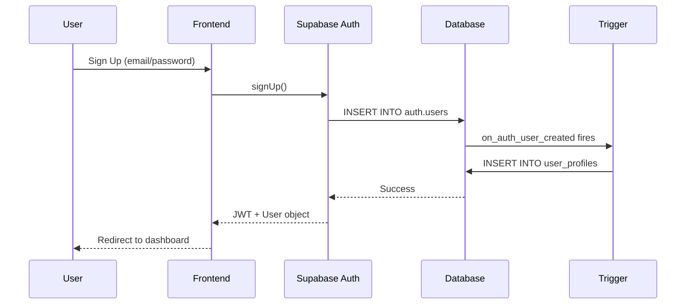

# 5. Backend Architecture

**Document:** MMOS Admin Dashboard - Backend Architecture
**Version:** 1.0
**Last Updated:** 2025-10-28
**Primary Reviewer:** ⚙️ Dev Senior

---

## 📋 Table of Contents

1. [Backend Strategy Overview](#backend-strategy-overview)
2. [Supabase-First Architecture](#supabase-first-architecture)
3. [Custom API Routes](#custom-api-routes)
4. [Authentication & Authorization](#authentication--authorization)
5. [Business Logic Organization](#business-logic-organization)
6. [Error Handling Strategy](#error-handling-strategy)
7. [API Design Patterns](#api-design-patterns)
8. [Performance Optimization](#performance-optimization)
9. [Dev Senior Review Checklist](#dev-senior-review-checklist)

---

## Backend Strategy Overview

### Architecture Decision

**Primary Pattern:** **Supabase-First** (minimize custom backend code)
**Custom Code:** Only when Supabase capabilities are insufficient

**Breakdown:**
- **90% of API needs:** Handled by Supabase (CRUD, auth, realtime)
- **10% of API needs:** Custom Next.js API routes (complex logic, integrations)

```
┌─────────────────────────────────────────┐
│          Frontend (Next.js)             │
│                                         │
│  ┌─────────────┐    ┌───────────────┐  │
│  │ Supabase    │    │ Custom API    │  │
│  │ Client      │    │ Routes        │  │
│  │ (90%)       │    │ (10%)         │  │
│  └──────┬──────┘    └───────┬───────┘  │
└─────────┼──────────────────┼───────────┘
          │                  │
          ▼                  ▼
┌──────────────────────────────────────────┐
│       Supabase Backend                   │
│  ┌──────────────────────────────────┐   │
│  │ PostgreSQL + RLS                 │   │
│  │ Auth (JWT)                       │   │
│  │ Storage (S3-compatible)          │   │
│  │ Realtime (WebSockets)            │   │
│  │ Edge Functions (Deno) [Optional] │   │
│  └──────────────────────────────────┘   │
└──────────────────────────────────────────┘
```

---

## Supabase-First Architecture

### What Supabase Provides

**1. Auto-Generated REST API**

Every table automatically gets a RESTful API:

```typescript
// No backend code needed - Supabase generates this:
// GET    /rest/v1/minds
// POST   /rest/v1/minds
// PATCH  /rest/v1/minds?id=eq.{id}
// DELETE /rest/v1/minds?id=eq.{id}

// Frontend usage (type-safe):
const { data, error } = await supabase
  .from('minds')
  .select('*')
  .eq('status', 'active');

// Equivalent to: GET /rest/v1/minds?status=eq.active
```

**2. Real-time Subscriptions**

```typescript
// Subscribe to database changes (no polling needed)
const channel = supabase
  .channel('minds-channel')
  .on(
    'postgres_changes',
    { event: '*', schema: 'public', table: 'minds' },
    (payload) => {
      console.log('Change:', payload);
    }
  )
  .subscribe();
```

**3. Row Level Security (RLS)**

Authorization happens at database layer:

```sql
-- Users can only see their own minds
CREATE POLICY "minds_user_access" ON minds
  FOR SELECT TO authenticated
  USING (creator_user_id = auth.uid());

-- No need for authorization code in API!
```

**4. File Storage**

```typescript
// Upload mind artifacts
const { data, error } = await supabase.storage
  .from('mind-artifacts')
  .upload(`${mindId}/system-prompt.md`, file);

// With RLS policies for access control
```

---

### When to Use Custom API Routes

**Use Custom Routes For:**

1. **Complex Multi-Step Operations**
   - Creating a mind + profile + initial fragments (transaction)
   - Export mind data (aggregate from multiple tables)

2. **External API Integrations**
   - Webhook receivers (GitHub, Stripe, etc.)
   - Third-party API calls (OpenAI, Anthropic, etc.)

3. **Heavy Computation**
   - Generate embeddings for fragments
   - Process large file uploads
   - Generate PDF reports

4. **Custom Business Logic**
   - Validate complex rules not possible in SQL
   - Rate limiting per user
   - Custom analytics aggregations

---

## Custom API Routes

### Directory Structure

```
app/api/
├── webhooks/
│   ├── pipeline/
│   │   └── route.ts           # Pipeline job updates
│   └── stripe/
│       └── route.ts           # Payment webhooks (future)
│
├── export/
│   ├── mind/
│   │   └── route.ts           # Export mind as ZIP
│   └── analytics/
│       └── route.ts           # Export analytics data
│
├── pipeline/
│   ├── trigger/
│   │   └── route.ts           # Trigger MMOS pipeline
│   └── status/
│       └── route.ts           # Get pipeline status
│
└── admin/
    ├── users/
    │   └── route.ts           # User management (admin only)
    └── system/
        └── route.ts           # System health checks
```

---

### Route Template

**File:** `app/api/export/mind/route.ts`

```typescript
import { NextRequest, NextResponse } from 'next/server';
import { createRouteHandlerClient } from '@supabase/auth-helpers-nextjs';
import { cookies } from 'next/headers';
import type { Database } from '@/types/supabase';

/**
 * Export Mind Data as ZIP
 *
 * @route POST /api/export/mind
 * @auth Required
 * @body { mindId: string }
 * @returns ZIP file (application/zip)
 */
export async function POST(request: NextRequest) {
  try {
    // 1. Initialize Supabase client (with user context)
    const supabase = createRouteHandlerClient<Database>({ cookies });

    // 2. Verify authentication
    const { data: { user }, error: authError } = await supabase.auth.getUser();
    if (authError || !user) {
      return NextResponse.json(
        { error: 'Unauthorized' },
        { status: 401 }
      );
    }

    // 3. Parse and validate request body
    const body = await request.json();
    const { mindId } = body;

    if (!mindId) {
      return NextResponse.json(
        { error: 'mindId is required' },
        { status: 400 }
      );
    }

    // 4. Fetch mind data (RLS ensures user has access)
    const { data: mind, error: mindError } = await supabase
      .from('minds')
      .select('*, mind_profiles(*), fragments(*), trait_scores(*)')
      .eq('id', mindId)
      .single();

    if (mindError || !mind) {
      return NextResponse.json(
        { error: 'Mind not found or access denied' },
        { status: 404 }
      );
    }

    // 5. Generate ZIP file
    const zipBuffer = await generateMindZip(mind);

    // 6. Return file with proper headers
    return new NextResponse(zipBuffer, {
      status: 200,
      headers: {
        'Content-Type': 'application/zip',
        'Content-Disposition': `attachment; filename="${mind.slug}.zip"`,
      },
    });

  } catch (error) {
    console.error('Export mind error:', error);
    return NextResponse.json(
      { error: 'Internal server error' },
      { status: 500 }
    );
  }
}

// Helper function
async function generateMindZip(mind: Mind): Promise<Buffer> {
  const JSZip = (await import('jszip')).default;
  const zip = new JSZip();

  // Add mind profile
  zip.file('profile.json', JSON.stringify(mind.mind_profiles, null, 2));

  // Add fragments
  const fragmentsFolder = zip.folder('fragments');
  mind.fragments.forEach((f, i) => {
    fragmentsFolder!.file(`${i+1}.md`, f.content);
  });

  // Add trait scores
  zip.file('traits.json', JSON.stringify(mind.trait_scores, null, 2));

  return await zip.generateAsync({ type: 'nodebuffer' });
}
```

---

### Webhook Route (Pipeline Updates)

**File:** `app/api/webhooks/pipeline/route.ts`

```typescript
import { NextRequest, NextResponse } from 'next/server';
import { createClient } from '@supabase/supabase-js';

/**
 * Webhook: Pipeline Job Status Update
 *
 * @route POST /api/webhooks/pipeline
 * @auth Webhook secret
 * @body { jobId: string, status: string, metadata?: object }
 */
export async function POST(request: NextRequest) {
  try {
    // 1. Verify webhook signature
    const signature = request.headers.get('x-webhook-signature');
    const isValid = await verifyWebhookSignature(signature, request.body);

    if (!isValid) {
      return NextResponse.json({ error: 'Invalid signature' }, { status: 401 });
    }

    // 2. Parse webhook payload
    const { jobId, status, metadata } = await request.json();

    // 3. Update job in database (service role - bypasses RLS)
    const supabase = createClient(
      process.env.NEXT_PUBLIC_SUPABASE_URL!,
      process.env.SUPABASE_SERVICE_ROLE_KEY! // Admin key
    );

    const { error } = await supabase
      .from('job_executions')
      .update({
        status,
        metadata,
        updated_at: new Date().toISOString(),
      })
      .eq('id', jobId);

    if (error) throw error;

    // 4. Trigger notifications (optional)
    // await sendNotification(jobId, status);

    return NextResponse.json({ success: true });

  } catch (error) {
    console.error('Webhook error:', error);
    return NextResponse.json({ error: 'Webhook processing failed' }, { status: 500 });
  }
}

async function verifyWebhookSignature(signature: string | null, body: any): Promise<boolean> {
  if (!signature) return false;
  // Implement HMAC verification
  // const expectedSignature = createHmac('sha256', process.env.WEBHOOK_SECRET).update(body).digest('hex');
  // return signature === expectedSignature;
  return true; // Placeholder
}
```

---

## Authentication & Authorization

### Authentication Flow



### Client-Side Auth

**File:** `app/(auth)/login/page.tsx`

```typescript
'use client';

import { useState } from 'react';
import { createClientComponentClient } from '@supabase/auth-helpers-nextjs';
import { useRouter } from 'next/navigation';

export default function LoginPage() {
  const router = useRouter();
  const supabase = createClientComponentClient();
  const [email, setEmail] = useState('');
  const [password, setPassword] = useState('');

  async function handleLogin() {
    const { data, error } = await supabase.auth.signInWithPassword({
      email,
      password,
    });

    if (error) {
      alert(error.message);
      return;
    }

    router.push('/'); // Redirect to dashboard
    router.refresh(); // Refresh server components
  }

  return (
    <form onSubmit={(e) => { e.preventDefault(); handleLogin(); }}>
      <input type="email" value={email} onChange={(e) => setEmail(e.target.value)} />
      <input type="password" value={password} onChange={(e) => setPassword(e.target.value)} />
      <button type="submit">Login</button>
    </form>
  );
}
```

### Server-Side Auth (API Routes)

```typescript
import { createRouteHandlerClient } from '@supabase/auth-helpers-nextjs';
import { cookies } from 'next/headers';

export async function GET(request: Request) {
  const supabase = createRouteHandlerClient({ cookies });

  // Get current user
  const { data: { user }, error } = await supabase.auth.getUser();

  if (error || !user) {
    return Response.json({ error: 'Unauthorized' }, { status: 401 });
  }

  // User is authenticated, proceed
  return Response.json({ userId: user.id });
}
```

### User Profile Creation (Critical for RLS)

**⚠️ CRITICAL:** When a user signs up, a `user_profiles` record MUST be created. Without this, RLS policies won't work and users won't be able to access their data.

**Recommended Approach: Database Trigger (Automatic)**

```sql
-- File: supabase/migrations/20251028000005_create_user_trigger.sql

-- Function: Create user profile automatically
CREATE OR REPLACE FUNCTION public.handle_new_user()
RETURNS TRIGGER AS $$
BEGIN
  INSERT INTO public.user_profiles (id, email, role, created_at)
  VALUES (
    NEW.id,
    NEW.email,
    'user',  -- Default role
    NOW()
  );
  RETURN NEW;
END;
$$ LANGUAGE plpgsql SECURITY DEFINER;

-- Trigger: On new auth user
CREATE TRIGGER on_auth_user_created
  AFTER INSERT ON auth.users
  FOR EACH ROW
  EXECUTE FUNCTION public.handle_new_user();

-- Grant execute permission
GRANT EXECUTE ON FUNCTION public.handle_new_user() TO authenticated;
```

**Why This Approach:**
- ✅ **Automatic** - No application code needed
- ✅ **Atomic** - Happens in same transaction
- ✅ **Reliable** - Can't forget to call it
- ✅ **Works with OAuth** - Google, GitHub, etc. automatically trigger it

**Signup Flow with Trigger:**



**Frontend Signup Implementation:**

```typescript
// app/(auth)/signup/page.tsx
'use client';

import { useState } from 'react';
import { createClientComponentClient } from '@supabase/auth-helpers-nextjs';
import { useRouter } from 'next/navigation';

export default function SignupPage() {
  const router = useRouter();
  const supabase = createClientComponentClient();
  const [email, setEmail] = useState('');
  const [password, setPassword] = useState('');
  const [loading, setLoading] = useState(false);

  async function handleSignup(e: React.FormEvent) {
    e.preventDefault();
    setLoading(true);

    // Signup (trigger creates user_profiles automatically)
    const { error } = await supabase.auth.signUp({
      email,
      password,
      options: {
        emailRedirectTo: `${window.location.origin}/auth/callback`,
      },
    });

    if (error) {
      alert(error.message);
      setLoading(false);
      return;
    }

    // Success - trigger already created user_profiles
    router.push('/');
    router.refresh();
  }

  return (
    <form onSubmit={handleSignup}>
      <input
        type="email"
        value={email}
        onChange={(e) => setEmail(e.target.value)}
        required
      />
      <input
        type="password"
        value={password}
        onChange={(e) => setPassword(e.target.value)}
        required
      />
      <button type="submit" disabled={loading}>
        {loading ? 'Creating account...' : 'Sign Up'}
      </button>
    </form>
  );
}
```

**Testing the Trigger:**

```sql
-- Verify trigger exists
SELECT trigger_name, event_manipulation, event_object_table
FROM information_schema.triggers
WHERE trigger_name = 'on_auth_user_created';

-- Test manually (creates user_profiles automatically)
INSERT INTO auth.users (
  instance_id, id, aud, role, email,
  encrypted_password, email_confirmed_at,
  created_at, updated_at
) VALUES (
  '00000000-0000-0000-0000-000000000000',
  gen_random_uuid(), 'authenticated', 'authenticated',
  'test@example.com',
  crypt('password123', gen_salt('bf')),
  NOW(), NOW(), NOW()
);

-- Verify user_profiles was created
SELECT * FROM user_profiles WHERE email = 'test@example.com';

-- Cleanup
DELETE FROM auth.users WHERE email = 'test@example.com';
```

---

### Authorization (Role-Based)

```typescript
// lib/auth.ts
export async function requireAdmin(supabase: SupabaseClient) {
  const { data: { user } } = await supabase.auth.getUser();

  if (!user) {
    throw new Error('Unauthorized');
  }

  const { data: profile } = await supabase
    .from('user_profiles')
    .select('role')
    .eq('id', user.id)
    .single();

  if (profile?.role !== 'admin') {
    throw new Error('Forbidden: Admin access required');
  }

  return user;
}

// Usage in API route:
export async function DELETE(request: Request) {
  const supabase = createRouteHandlerClient({ cookies });

  try {
    await requireAdmin(supabase); // Throws if not admin
    // Proceed with admin-only operation
  } catch (error) {
    return Response.json({ error: error.message }, { status: 403 });
  }
}
```

---

## Business Logic Organization

### Service Layer Pattern

**Directory:** `lib/services/`

```
lib/services/
├── minds.service.ts       # Mind-related business logic
├── pipeline.service.ts    # Pipeline operations
├── export.service.ts      # Export functionality
└── analytics.service.ts   # Analytics calculations
```

**Example:** `lib/services/minds.service.ts`

```typescript
import { SupabaseClient } from '@supabase/supabase-js';
import type { Database } from '@/types/supabase';

type Mind = Database['public']['Tables']['minds']['Row'];
type MindInsert = Database['public']['Tables']['minds']['Insert'];

export class MindsService {
  constructor(private supabase: SupabaseClient<Database>) {}

  /**
   * Create a new mind with initial profile
   * (Multi-step transaction)
   */
  async createMind(data: MindInsert): Promise<Mind> {
    // 1. Insert mind
    const { data: mind, error: mindError } = await this.supabase
      .from('minds')
      .insert({
        ...data,
        status: 'draft',
        created_at: new Date().toISOString(),
      })
      .select()
      .single();

    if (mindError) throw mindError;

    // 2. Create initial profile
    const { error: profileError } = await this.supabase
      .from('mind_profiles')
      .insert({
        mind_id: mind.id,
        fidelity_score: 0,
        persona_description: '',
      });

    if (profileError) {
      // Rollback: delete mind if profile creation fails
      await this.supabase.from('minds').delete().eq('id', mind.id);
      throw profileError;
    }

    return mind;
  }

  /**
   * Calculate mind quality score
   * (Business logic)
   */
  async calculateQualityScore(mindId: string): Promise<number> {
    // Fetch all trait scores
    const { data: traits } = await this.supabase
      .from('trait_scores')
      .select('score_10')
      .eq('mind_id', mindId);

    if (!traits || traits.length === 0) return 0;

    // Calculate average
    const avgScore = traits.reduce((sum, t) => sum + t.score_10, 0) / traits.length;

    // Fetch fragment count
    const { count: fragmentCount } = await this.supabase
      .from('fragments')
      .select('*', { count: 'exact', head: true })
      .eq('mind_id', mindId);

    // Quality formula: (avgScore * 0.7) + (min(fragmentCount / 1000, 1) * 30)
    const qualityScore = (avgScore * 0.7) + (Math.min((fragmentCount || 0) / 1000, 1) * 30);

    return Math.round(qualityScore * 10) / 10; // Round to 1 decimal
  }

  /**
   * Get mind with full profile and stats
   * (Data aggregation)
   */
  async getMindDetails(slug: string) {
    const { data: mind, error } = await this.supabase
      .from('minds')
      .select(`
        *,
        mind_profiles(*),
        sources(count),
        fragments(count),
        trait_scores(count, score_10)
      `)
      .eq('slug', slug)
      .single();

    if (error) throw error;

    return {
      ...mind,
      qualityScore: await this.calculateQualityScore(mind.id),
    };
  }
}

// Usage in API route or Server Component:
const mindsService = new MindsService(supabase);
const mind = await mindsService.createMind({ name: 'Steve Jobs', slug: 'steve_jobs' });
```

---

## Error Handling Strategy

### Error Response Format

```typescript
// types/api.ts
export interface ApiError {
  error: {
    code: string;
    message: string;
    details?: Record<string, any>;
    timestamp: string;
    requestId?: string;
  };
}

export interface ApiSuccess<T> {
  data: T;
  metadata?: {
    total?: number;
    page?: number;
    limit?: number;
  };
}
```

### Error Handler Utility

```typescript
// lib/errors.ts
export class AppError extends Error {
  constructor(
    public code: string,
    public message: string,
    public statusCode: number = 500,
    public details?: Record<string, any>
  ) {
    super(message);
    this.name = 'AppError';
  }
}

export function handleApiError(error: unknown): NextResponse<ApiError> {
  console.error('API Error:', error);

  if (error instanceof AppError) {
    return NextResponse.json(
      {
        error: {
          code: error.code,
          message: error.message,
          details: error.details,
          timestamp: new Date().toISOString(),
        },
      },
      { status: error.statusCode }
    );
  }

  // Unknown error
  return NextResponse.json(
    {
      error: {
        code: 'INTERNAL_ERROR',
        message: 'An unexpected error occurred',
        timestamp: new Date().toISOString(),
      },
    },
    { status: 500 }
  );
}

// Usage in API route:
export async function POST(request: Request) {
  try {
    // ... operation
    if (invalidInput) {
      throw new AppError('INVALID_INPUT', 'Mind name is required', 400);
    }
    return NextResponse.json({ data: result });
  } catch (error) {
    return handleApiError(error);
  }
}
```

---

## API Design Patterns

### RESTful Conventions

```typescript
// CRUD operations
GET    /api/minds          // List all minds
GET    /api/minds/:id      // Get single mind
POST   /api/minds          // Create mind
PATCH  /api/minds/:id      // Update mind
DELETE //api/minds/:id      // Delete mind

// Nested resources
GET    /api/minds/:id/fragments      // List mind's fragments
POST   /api/minds/:id/fragments      // Add fragment to mind

// Actions (non-CRUD)
POST   /api/minds/:id/trigger-pipeline  // Trigger action
POST   /api/minds/:id/export            // Export mind
```

### Pagination

```typescript
export async function GET(request: Request) {
  const { searchParams } = new URL(request.url);
  const page = parseInt(searchParams.get('page') || '1');
  const limit = parseInt(searchParams.get('limit') || '20');
  const offset = (page - 1) * limit;

  const { data, count, error } = await supabase
    .from('minds')
    .select('*', { count: 'exact' })
    .range(offset, offset + limit - 1);

  if (error) throw error;

  return NextResponse.json({
    data,
    metadata: {
      total: count,
      page,
      limit,
      pages: Math.ceil((count || 0) / limit),
    },
  });
}
```

---

## Performance Optimization

### Database Query Optimization

```typescript
// ❌ Bad: N+1 query problem
const minds = await supabase.from('minds').select('*');
for (const mind of minds.data) {
  const { data: profile } = await supabase
    .from('mind_profiles')
    .select('*')
    .eq('mind_id', mind.id)
    .single();
  // N additional queries
}

// ✅ Good: Single query with join
const { data: minds } = await supabase
  .from('minds')
  .select(`
    *,
    mind_profiles(*)
  `);
```

### Caching Strategy

```typescript
// Use React Server Components for automatic caching
export default async function MindsPage() {
  const minds = await getMinds();
  // Next.js caches this by default (revalidates every 60s)
  return <MindsList minds={minds} />;
}

// Or use Next.js cache API
import { cache } from 'react';

export const getMinds = cache(async () => {
  const { data } = await supabase.from('minds').select('*');
  return data;
});
```

---

## Dev Senior Review Checklist

### Architecture Review
- [ ] **Separation of Concerns:** Business logic in services, not routes?
- [ ] **Code Reusability:** Common patterns abstracted into utilities?
- [ ] **Error Handling:** Consistent error handling across all routes?
- [ ] **Type Safety:** All API routes and services fully typed?

### Performance Review
- [ ] **Query Optimization:** No N+1 queries, proper use of joins?
- [ ] **Caching:** Server Components cached appropriately?
- [ ] **Pagination:** Large datasets paginated?
- [ ] **Bundle Size:** No unnecessary dependencies in API routes?

### Security Review
- [ ] **Authentication:** All routes properly authenticated?
- [ ] **Authorization:** RLS policies cover all cases?
- [ ] **Input Validation:** All inputs validated before processing?
- [ ] **Secrets Management:** No hardcoded secrets, use env vars?

### API Design Review
- [ ] **RESTful:** API follows REST conventions?
- [ ] **Consistency:** Response formats consistent?
- [ ] **Versioning:** API version strategy defined (if needed)?
- [ ] **Documentation:** API routes documented (comments + OpenAPI)?

### Testing Review
- [ ] **Unit Tests:** Services have unit tests?
- [ ] **Integration Tests:** API routes tested end-to-end?
- [ ] **Error Cases:** Error scenarios tested?
- [ ] **Performance Tests:** Load testing plan exists?

---

## Change Log

| Date | Version | Changes | Author |
|------|---------|---------|--------|
| 2025-10-28 | 1.0 | Initial backend architecture | Winston (Architect) |

---

**Previous:** [← 4. Frontend Architecture](./4-frontend-architecture.md)
**Next:** [6. Deployment & Infrastructure →](./6-deployment-infrastructure.md)
