# Mind Context Pattern - Session-Based Multi-Mind Architecture

**Document:** MMOS Admin Dashboard - Mind Context Pattern Explanation
**Version:** 1.0
**Date:** 2025-10-29
**Status:** 🔴 CRITICAL - Required reading for dashboard developers

---

## 📋 Table of Contents

1. [Overview](#overview)
2. [Current Architecture vs Proposed Architecture](#current-architecture-vs-proposed-architecture)
3. [How Mind Context Works](#how-mind-context-works)
4. [Database Implementation](#database-implementation)
5. [Frontend Implementation](#frontend-implementation)
6. [RLS Policy Pattern](#rls-policy-pattern)
7. [Common Use Cases](#common-use-cases)
8. [Migration from Architecture Proposal](#migration-from-architecture-proposal)
9. [Testing Mind Context](#testing-mind-context)
10. [Troubleshooting](#troubleshooting)

---

## Overview

### What is Mind Context?

The MMOS database uses a **session-based mind context pattern** where:
- Users can own multiple "minds" (cognitive personas)
- At any given time, a user has ONE "active/current mind"
- All database operations automatically filter by the current mind context
- RLS policies use `current_mind_id()` instead of `auth.uid()`

**Key Insight:** This pattern enables **multi-mind switching without requiring mind_id in every API request**.

---

## Current Architecture vs Proposed Architecture

### ❌ What Architecture Docs Propose (NOT Implemented)


**Pattern:** Direct user → minds relationship
- User ID passed in every request
- RLS policies check `creator_user_id = auth.uid()`
- Frontend must send `userId` or rely on `auth.uid()`

**SQL Example (NOT USED):**
```sql
-- Proposed but NOT implemented
CREATE POLICY "minds_user_access" ON minds
  FOR SELECT TO authenticated
  USING (creator_user_id = auth.uid());
```

---

### ✅ What's Actually Implemented (Current System)


**Pattern:** Session-based current mind context
- User has a "current_mind_id" stored in `user_profiles.mind_id`
- User can switch between owned minds
- RLS policies use `current_mind_id()` function
- Frontend doesn't need to send mind_id (automatic from session)

**SQL Example (ACTUALLY USED):**
```sql
-- Current implementation
CREATE POLICY "fragments_rw_mine" ON fragments
  FOR ALL TO authenticated
  USING (mind_id = current_mind_id());
```

---

## How Mind Context Works

### Step-by-Step Flow

```mermaid
sequenceDiagram
    participant User
    participant Frontend
    participant Supabase Auth
    participant Database
    participant RLS

    User->>Frontend: Login (email/password)
    Frontend->>Supabase Auth: signInWithPassword()
    Supabase Auth->>Database: SET auth.uid()

    Note over Database: Auth trigger fires
    Database->>Database: provision_user_profile()
    Database->>Database: Create default mind
    Database->>Database: INSERT user_profiles (id, mind_id)

    Supabase Auth-->>Frontend: JWT + Session

    User->>Frontend: Query "Get my minds"
    Frontend->>Database: SELECT * FROM minds
    Database->>RLS: Apply policy (creator_user_id = auth.uid())
    RLS-->>Database: Filtered results
    Database-->>Frontend: [Mind 1, Mind 2, Mind 3]

    User->>Frontend: Switch to Mind 2
    Frontend->>Database: UPDATE user_profiles SET mind_id = 'mind-2-uuid'
    Database-->>Frontend: Success

    User->>Frontend: Query "Get my fragments"
    Frontend->>Database: SELECT * FROM fragments
    Database->>RLS: current_mind_id() → mind-2-uuid
    RLS-->>Database: Fragments for Mind 2 only
    Database-->>Frontend: [Fragment A, Fragment B, ...]
```



### Key Components

**1. User Authentication**
```sql
-- User signs up
-- auth.uid() = 'user-uuid-123'
```

**2. Auto-Provisioning (on signup)**
```sql
-- Trigger: provision_user_profile()
-- Creates:
--   - Default mind (slug = username)
--   - user_profiles record with mind_id set

INSERT INTO minds (id, slug, name, creator_user_id)
VALUES (gen_random_uuid(), 'john_doe', 'John Doe', auth.uid());

INSERT INTO user_profiles (id, mind_id)
VALUES (auth.uid(), mind_id);
```

**3. Current Mind Function**
```sql
-- Returns the currently active mind for the user
CREATE OR REPLACE FUNCTION current_mind_id()
RETURNS uuid LANGUAGE sql STABLE AS $$
  SELECT mind_id FROM user_profiles WHERE id = auth.uid()
$$;
```

**4. RLS Policies**
```sql
-- All policies use current_mind_id(), not auth.uid()
CREATE POLICY "fragments_rw_mine" ON fragments
  FOR ALL TO authenticated
  USING (mind_id = current_mind_id());
```

---

## Database Implementation

### Schema Structure

```sql
-- 1. Auth (Supabase managed)
auth.users
├── id (UUID) - auth.uid()
├── email
└── ... (managed by Supabase)

-- 2. User Profiles (maps auth to minds)
user_profiles
├── id (UUID) - FK to auth.users.id
├── mind_id (UUID) - FK to minds.id (CURRENT CONTEXT)
├── email
├── role
└── created_at

-- 3. Minds (cognitive personas)
minds
├── id (UUID) - PK
├── slug (TEXT) - unique identifier
├── name (TEXT)
├── creator_user_id (UUID) - FK to user_profiles.id
├── status
└── created_at

-- 4. Data Tables (filtered by current mind)
fragments, sources, mind_profiles, trait_scores, etc.
├── id (UUID)
├── mind_id (UUID) - FK to minds.id (RLS FILTER)
└── ... (data columns)
```

### Key Relationships

```sql
-- User can own MULTIPLE minds
SELECT * FROM minds WHERE creator_user_id = auth.uid();
-- Returns: [Mind 1, Mind 2, Mind 3, ...]

-- User has ONE current mind at any time
SELECT mind_id FROM user_profiles WHERE id = auth.uid();
-- Returns: UUID of current mind

-- All data queries filter by current mind
SELECT * FROM fragments WHERE mind_id = current_mind_id();
-- Returns: Only fragments for current mind
```

### The current_mind_id() Function

**Full Implementation:**
```sql
CREATE OR REPLACE FUNCTION current_mind_id()
RETURNS uuid
LANGUAGE sql
STABLE
AS $$
  SELECT mind_id FROM user_profiles WHERE id = auth.uid()
$$;
```

**Attributes:**
- `STABLE`: Result won't change within a transaction (can be optimized)
- `LANGUAGE sql`: Pure SQL (fast)
- Returns: UUID of current mind, or NULL if user has no profile

**Usage in RLS Policies:**
```sql
-- Pattern 1: Direct equality check
USING (mind_id = current_mind_id())

-- Pattern 2: Via foreign key (e.g., content_projects)
USING (creator_mind_id = current_mind_id())

-- Pattern 3: Nested (e.g., contents via projects)
USING (
  project_id IN (
    SELECT id FROM content_projects
    WHERE creator_mind_id = current_mind_id()
  )
)
```

---

## Frontend Implementation

### 1. Initial Authentication

```typescript
// app/(auth)/login/page.tsx
'use client';

import { createClientComponentClient } from '@supabase/auth-helpers-nextjs';

export default function LoginPage() {
  const supabase = createClientComponentClient();

  async function handleLogin(email: string, password: string) {
    const { data, error } = await supabase.auth.signInWithPassword({
      email,
      password,
    });

    if (error) {
      console.error('Login error:', error);
      return;
    }

    // ✅ User is authenticated
    // ✅ auth.uid() is set automatically
    // ✅ Default mind created via trigger (if first login)
    // ✅ user_profiles.mind_id set automatically

    router.push('/'); // Redirect to dashboard
  }
}
```

---

### 2. Fetching Current Mind Context

```typescript
// lib/hooks/use-current-mind.ts
import { useQuery } from '@tanstack/react-query';
import { createClientComponentClient } from '@supabase/auth-helpers-nextjs';

export function useCurrentMind() {
  const supabase = createClientComponentClient();

  return useQuery({
    queryKey: ['current-mind'],
    queryFn: async () => {
      // Get current user's profile (includes mind_id)
      const { data: profile } = await supabase
        .from('user_profiles')
        .select('mind_id, minds(*)')
        .eq('id', (await supabase.auth.getUser()).data.user!.id)
        .single();

      return profile?.minds; // Returns current mind object
    },
  });
}

// Usage in component:
function DashboardHeader() {
  const { data: currentMind, isLoading } = useCurrentMind();

  if (isLoading) return <Skeleton />;

  return (
    <div>
      <h1>Current Mind: {currentMind.name}</h1>
      <p>@{currentMind.slug}</p>
    </div>
  );
}
```

---

### 3. Fetching User's Owned Minds

```typescript
// lib/hooks/use-user-minds.ts
export function useUserMinds() {
  const supabase = createClientComponentClient();

  return useQuery({
    queryKey: ['user-minds'],
    queryFn: async () => {
      // Get all minds owned by user
      const { data } = await supabase
        .from('minds')
        .select('*')
        .eq('creator_user_id', (await supabase.auth.getUser()).data.user!.id)
        .order('created_at', { ascending: false });

      return data;
    },
  });
}
```

---

### 4. Switching Mind Context

```typescript
// lib/services/mind-context.service.ts
export class MindContextService {
  constructor(private supabase: SupabaseClient) {}

  /**
   * Switch to a different mind
   * Updates user_profiles.mind_id
   * All subsequent queries will use new mind context
   */
  async switchMind(mindId: string): Promise<void> {
    const { data: { user } } = await this.supabase.auth.getUser();

    if (!user) throw new Error('Not authenticated');

    // Verify user owns this mind
    const { data: mind, error: checkError } = await this.supabase
      .from('minds')
      .select('id')
      .eq('id', mindId)
      .eq('creator_user_id', user.id)
      .single();

    if (checkError || !mind) {
      throw new Error('Mind not found or access denied');
    }

    // Update current mind context
    const { error } = await this.supabase
      .from('user_profiles')
      .update({ mind_id: mindId })
      .eq('id', user.id);

    if (error) throw error;

    // ✅ Mind context switched!
    // ✅ All subsequent queries will use new mind_id
    // ✅ RLS policies will filter by new current_mind_id()
  }
}

// Usage in component:
function MindSwitcher() {
  const { data: minds } = useUserMinds();
  const { data: currentMind } = useCurrentMind();
  const queryClient = useQueryClient();

  async function handleSwitchMind(mindId: string) {
    const service = new MindContextService(supabase);
    await service.switchMind(mindId);

    // Invalidate all queries (data will re-fetch with new context)
    queryClient.invalidateQueries();
  }

  return (
    <Select value={currentMind?.id} onValueChange={handleSwitchMind}>
      {minds?.map((mind) => (
        <SelectItem key={mind.id} value={mind.id}>
          {mind.name}
        </SelectItem>
      ))}
    </Select>
  );
}
```

---

### 5. Querying Data (Automatic Filtering)

```typescript
// lib/hooks/use-fragments.ts
export function useFragments() {
  const supabase = createClientComponentClient();

  return useQuery({
    queryKey: ['fragments'],
    queryFn: async () => {
      // ✅ NO need to specify mind_id
      // ✅ RLS automatically filters by current_mind_id()
      const { data } = await supabase
        .from('fragments')
        .select('*')
        .order('created_at', { ascending: false });

      return data; // Returns only fragments for current mind
    },
  });
}

// When user switches mind and invalidates queries:
// 1. Query re-fetches
// 2. current_mind_id() returns new mind
// 3. RLS filters by new mind
// 4. Component shows new mind's fragments
```

---

### 6. Creating Data (Automatic mind_id)

```typescript
// lib/services/fragments.service.ts
export class FragmentsService {
  constructor(private supabase: SupabaseClient) {}

  async createFragment(content: string) {
    // ✅ NO need to specify mind_id
    // ✅ Database DEFAULT sets mind_id = current_mind_id()
    const { data, error } = await this.supabase
      .from('fragments')
      .insert({ content })
      .select()
      .single();

    if (error) throw error;
    return data;
  }
}
```

**Database DEFAULT:**
```sql
-- fragments table schema
ALTER TABLE fragments
  ALTER COLUMN mind_id
  SET DEFAULT current_mind_id();

-- When INSERT doesn't specify mind_id:
-- 1. Database calls current_mind_id()
-- 2. Gets mind_id from user_profiles
-- 3. Sets fragment.mind_id automatically
```

---

## RLS Policy Pattern

### Standard Pattern for Mind-Owned Tables

```sql
-- Template for tables directly owned by minds
CREATE POLICY "<table>_rw_mine"
ON <table>
FOR ALL
TO authenticated
USING (mind_id = current_mind_id())
WITH CHECK (mind_id = current_mind_id());

-- Examples:
CREATE POLICY "fragments_rw_mine" ON fragments ...
CREATE POLICY "sources_rw_mine" ON sources ...
CREATE POLICY "mind_profiles_rw_mine" ON mind_profiles ...
```

### Pattern for Indirectly-Owned Tables (via Foreign Key)

```sql
-- Template for tables owned via another table
CREATE POLICY "<table>_rw_by_<parent>"
ON <table>
FOR ALL
TO authenticated
USING (
  <parent_id> IN (
    SELECT id FROM <parent_table>
    WHERE mind_id = current_mind_id()
  )
)
WITH CHECK (
  <parent_id> IN (
    SELECT id FROM <parent_table>
    WHERE mind_id = current_mind_id()
  )
);

-- Example: contents owned via content_projects
CREATE POLICY "contents_rw_by_project"
ON contents
FOR ALL
TO authenticated
USING (
  project_id IN (
    SELECT id FROM content_projects
    WHERE creator_mind_id = current_mind_id()
  )
)
WITH CHECK (
  project_id IN (
    SELECT id FROM content_projects
    WHERE creator_mind_id = current_mind_id()
  )
);
```

### Pattern for Multi-Mind Tables (creator + persona)

```sql
-- CreatorOS: Projects can have creator_mind AND persona_mind
CREATE POLICY "content_projects_rw_mine"
ON content_projects
FOR ALL
TO authenticated
USING (creator_mind_id = current_mind_id())
WITH CHECK (creator_mind_id = current_mind_id());

-- Read-only access as persona
CREATE POLICY "content_projects_read_as_persona"
ON content_projects
FOR SELECT
TO authenticated
USING (persona_mind_id = current_mind_id());
```

---

## Common Use Cases

### Use Case 1: User Signs Up


**Result:**
- User authenticated
- Default mind created (slug = email username)
- `user_profiles.mind_id` set to default mind
- All queries automatically filter by default mind

---

### Use Case 2: User Switches Minds

```typescript
// User has 3 minds: personal, business, research

// Step 1: View current mind
const { data: currentMind } = await supabase
  .from('user_profiles')
  .select('minds(*)')
  .eq('id', userId)
  .single();

console.log(currentMind.minds.name); // "Personal Mind"

// Step 2: Query fragments (sees personal mind's data)
const { data: fragments } = await supabase
  .from('fragments')
  .select('*');

console.log(fragments.length); // 50 fragments (personal)

// Step 3: Switch to business mind
await supabase
  .from('user_profiles')
  .update({ mind_id: 'business-mind-uuid' })
  .eq('id', userId);

// Step 4: Query fragments again (sees different data!)
const { data: newFragments } = await supabase
  .from('fragments')
  .select('*');

console.log(newFragments.length); // 120 fragments (business)

// ✅ No mind_id parameter needed
// ✅ RLS automatically filtered
// ✅ Complete data isolation
```

---

### Use Case 3: Multi-Mind Collaboration (Future)

```sql
-- Potential future enhancement: Share minds with other users

-- 1. Add mind_collaborators table
CREATE TABLE mind_collaborators (
  id UUID PRIMARY KEY DEFAULT gen_random_uuid(),
  mind_id UUID REFERENCES minds(id) ON DELETE CASCADE,
  user_id UUID REFERENCES user_profiles(id) ON DELETE CASCADE,
  role TEXT NOT NULL CHECK (role IN ('viewer', 'editor', 'admin')),
  created_at TIMESTAMPTZ DEFAULT NOW(),
  UNIQUE(mind_id, user_id)
);

-- 2. Update RLS to include collaborators
CREATE POLICY "fragments_rw_mine_or_shared"
ON fragments
FOR ALL
TO authenticated
USING (
  mind_id = current_mind_id()
  OR mind_id IN (
    SELECT mind_id FROM mind_collaborators
    WHERE user_id = (SELECT id FROM user_profiles WHERE id = auth.uid())
  )
);

-- 3. User can switch to shared mind
UPDATE user_profiles
SET mind_id = 'shared-mind-uuid'
WHERE id = auth.uid();
-- Now working in shared mind context
```

---

## Migration from Architecture Proposal

### If You Implemented the Proposed Pattern

**Proposed Pattern (docs suggest):**
```sql
-- ❌ Don't implement this
CREATE POLICY "minds_user_access" ON minds
  FOR SELECT TO authenticated
  USING (creator_user_id = auth.uid());
```

**Current Pattern (already exists):**
```sql
-- ✅ This is already implemented
CREATE POLICY "fragments_rw_mine" ON fragments
  FOR ALL TO authenticated
  USING (mind_id = current_mind_id());
```

### Migration Steps (if needed)

**If you haven't started yet:**
- ✅ Nothing to do! Use current pattern
- ✅ Skip `handle_new_user()` trigger (already have `provision_user_profile()`)
- ✅ Use `current_mind_id()` in all RLS policies

**If you already implemented proposed pattern:**

1. **Update RLS policies:**
```sql
-- Replace all instances of:
creator_user_id = auth.uid()
-- With:
creator_mind_id = current_mind_id()

-- OR for tables with mind_id column:
mind_id = current_mind_id()
```

2. **Update frontend queries:**
```typescript
// Remove manual mind_id filtering:
// ❌ Before:
const { data } = await supabase
  .from('fragments')
  .select('*')
  .eq('mind_id', currentMindId); // Remove this

// ✅ After:
const { data } = await supabase
  .from('fragments')
  .select('*'); // RLS handles filtering
```

3. **Implement mind switcher UI:**
```typescript
// Add mind switcher component
<MindSwitcher
  currentMind={currentMind}
  minds={userMinds}
  onSwitch={handleSwitchMind}
/>
```

---

## Testing Mind Context

### Test 1: Verify current_mind_id() Function

```sql
-- Login as user
SET request.jwt.claims = '{"sub": "user-uuid-123"}';

-- Check current mind
SELECT current_mind_id();
-- Should return: UUID of current mind

-- Verify it matches user_profiles
SELECT mind_id FROM user_profiles WHERE id = auth.uid();
-- Should match current_mind_id() result
```

---

### Test 2: Verify Data Isolation

```sql
-- Create test users
INSERT INTO auth.users (id, email) VALUES
  ('user-1', 'user1@test.com'),
  ('user-2', 'user2@test.com');

-- Trigger creates minds and profiles automatically

-- As user 1: Insert fragments
SET request.jwt.claims = '{"sub": "user-1"}';
INSERT INTO fragments (content) VALUES
  ('Fragment 1 for user 1'),
  ('Fragment 2 for user 1');

-- As user 2: Insert fragments
SET request.jwt.claims = '{"sub": "user-2"}';
INSERT INTO fragments (content) VALUES
  ('Fragment 1 for user 2');

-- As user 1: Query (should see only own)
SET request.jwt.claims = '{"sub": "user-1"}';
SELECT content FROM fragments;
-- Returns: ['Fragment 1 for user 1', 'Fragment 2 for user 1']

-- As user 2: Query (should see only own)
SET request.jwt.claims = '{"sub": "user-2"}';
SELECT content FROM fragments;
-- Returns: ['Fragment 1 for user 2']

-- ✅ Data isolated correctly
```

---

### Test 3: Verify Mind Switching

```sql
-- User 1 creates second mind
SET request.jwt.claims = '{"sub": "user-1"}';
INSERT INTO minds (slug, name, creator_user_id)
VALUES ('user1_alt', 'User 1 Alt', 'user-1');

-- Insert fragment in first mind
SELECT current_mind_id(); -- Returns: user-1-mind-uuid
INSERT INTO fragments (content) VALUES ('Fragment in mind 1');

-- Switch to second mind
UPDATE user_profiles
SET mind_id = 'user-1-alt-mind-uuid'
WHERE id = 'user-1';

-- Insert fragment in second mind
SELECT current_mind_id(); -- Returns: user-1-alt-mind-uuid
INSERT INTO fragments (content) VALUES ('Fragment in mind 2');

-- Query fragments (should see only mind 2)
SELECT content FROM fragments;
-- Returns: ['Fragment in mind 2']

-- Switch back to first mind
UPDATE user_profiles
SET mind_id = 'user-1-mind-uuid'
WHERE id = 'user-1';

-- Query fragments (should see only mind 1)
SELECT content FROM fragments;
-- Returns: ['Fragment in mind 1']

-- ✅ Mind switching works correctly
```

---

## Troubleshooting

### Issue 1: current_mind_id() Returns NULL

**Symptoms:**
```sql
SELECT current_mind_id();
-- Returns: NULL
```

**Causes:**
1. User not authenticated (`auth.uid()` is NULL)
2. No user_profiles record (trigger didn't fire)
3. user_profiles.mind_id not set

**Diagnosis:**
```sql
-- Check auth context
SELECT auth.uid();
-- Should return user UUID

-- Check user_profiles exists
SELECT * FROM user_profiles WHERE id = auth.uid();
-- Should return row

-- Check mind_id is set
SELECT mind_id FROM user_profiles WHERE id = auth.uid();
-- Should return mind UUID
```

**Solution:**
```sql
-- Create missing user_profiles
INSERT INTO user_profiles (id, mind_id)
VALUES (auth.uid(), (SELECT id FROM minds WHERE creator_user_id = auth.uid() LIMIT 1));
```

---

### Issue 2: Empty Results Despite Data Existing

**Symptoms:**
```sql
-- Query returns empty
SELECT * FROM fragments;
-- Returns: []

-- But data exists
SELECT COUNT(*) FROM fragments;
-- ERROR: permission denied (RLS blocks COUNT)
```

**Causes:**
1. Mind context not set
2. User querying different mind's data
3. RLS policy misconfigured

**Diagnosis:**
```sql
-- Check current mind
SELECT current_mind_id();

-- Check which mind owns the data
SELECT DISTINCT mind_id FROM fragments;

-- Verify they match
SELECT
  current_mind_id() as current,
  (SELECT ARRAY_AGG(DISTINCT mind_id) FROM fragments) as data_minds;
```

**Solution:**
```sql
-- Switch to correct mind
UPDATE user_profiles
SET mind_id = (SELECT mind_id FROM fragments LIMIT 1)
WHERE id = auth.uid();

-- Or query as service role to see all
SET ROLE service_role;
SELECT * FROM fragments;
```

---

### Issue 3: Mind Switch Doesn't Update Data

**Symptoms:**
```typescript
// Switch mind
await supabase
  .from('user_profiles')
  .update({ mind_id: newMindId })
  .eq('id', userId);

// Query data - still shows old mind's data
const { data } = await supabase.from('fragments').select('*');
console.log(data); // Shows old mind's fragments
```

**Causes:**
1. Frontend cache not invalidated
2. Stale JWT token
3. Database connection pooling (different connection)

**Solution:**
```typescript
// 1. Invalidate all queries after switch
await supabase
  .from('user_profiles')
  .update({ mind_id: newMindId })
  .eq('id', userId);

// 2. Invalidate React Query cache
queryClient.invalidateQueries();

// 3. Refresh auth session (for fresh claims)
await supabase.auth.refreshSession();

// 4. Re-fetch data
const { data } = await supabase.from('fragments').select('*');
console.log(data); // Shows new mind's fragments
```

---

## Key Takeaways

### For Developers

1. **DON'T** specify `mind_id` in INSERT operations
   - Database DEFAULT handles it via `current_mind_id()`

2. **DON'T** filter by `mind_id` in SELECT queries
   - RLS policies handle filtering automatically

3. **DO** implement mind switcher UI component
   - Users need to see and change current mind

4. **DO** invalidate queries after mind switch
   - React Query cache will be stale

5. **DO** understand session context pattern
   - `current_mind_id()` is session-based, not request-based

### For Database Admins

1. **DON'T** add `handle_new_user()` trigger
   - `provision_user_profile()` already exists and is better

2. **DO** use `current_mind_id()` in all mind-scoped RLS policies
   - Consistent with existing schema pattern

3. **DO** add indexes on `mind_id` columns
   - RLS policies will query these frequently

4. **DO** test RLS with multiple minds per user
   - Verify switching works correctly

---

## Summary

The Mind Context Pattern provides:
- ✅ **Multi-mind support** - Users can own multiple cognitive personas
- ✅ **Session-based switching** - Change context without re-authentication
- ✅ **Automatic filtering** - RLS handles data isolation
- ✅ **Cleaner frontend** - No mind_id parameters needed
- ✅ **Better UX** - Switch minds like switching accounts

**Next Steps:**
1. Read this document completely
2. Review existing `current_mind_id()` function
3. Implement mind switcher UI component
4. Test mind switching thoroughly
5. Update architecture docs to reference this pattern

---

**Document Status:** ✅ Ready for Implementation
**Last Updated:** 2025-10-29
**Maintained By:** DB Sage + Dev Senior
