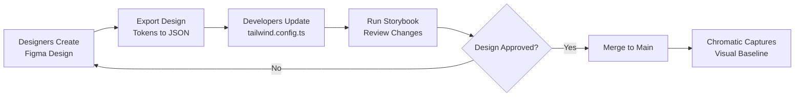

# Implementation Templates - Design System

**Status:** 🎨 WIREFRAMES / TEMPLATES (NOT FINAL DESIGN)

**Purpose:** These are CODE STRUCTURES, not visual designs. They show HOW to implement the design system, not WHAT the final design looks like.

---

## ⚠️ IMPORTANT - These Are Wireframes

### What These Files ARE ✅
- **Code templates** showing correct token usage
- **Structure examples** for semantic tokens
- **Reference implementation** for shadcn/ui integration
- **Storybook patterns** for visual regression testing
- **Starting point** that designers will customize

### What These Files ARE NOT ❌
- ❌ **Not the final design** (colors, spacing will change)
- ❌ **Not production-ready** (needs UX/design review)
- ❌ **Not prescriptive** (designers choose final values)
- ❌ **Not mandatory** (templates can be modified)

---

## How to Use These Templates

### Step 1: Designers Define Tokens (FIRST)

**UX/Design team provides:**
```yaml
# Design tokens specification (from Figma/design tool)
colors:
  primary: "#3b82f6"      # Designers choose
  success: "#10b981"      # Designers choose
  warning: "#f59e0b"      # Designers choose
  error: "#ef4444"        # Designers choose

spacing:
  sm: 16px               # Designers choose
  md: 24px               # Designers choose
  lg: 32px               # Designers choose

typography:
  heading: "24px/32px"   # Designers choose
  body: "16px/24px"      # Designers choose
  label: "14px/20px"     # Designers choose
```

---

### Step 2: Developers Implement Tokens (SECOND)

**Convert design tokens to code (using templates):**

```typescript
// tailwind.config.ts (customize values from design spec)
extend: {
  colors: {
    // Replace these values with designer's choices
    primary: '221.2 83.2% 53.3%',  // Example HSL
    success: '142.1 76.2% 36.3%',  // Example HSL
  },
  spacing: {
    // Replace these values with designer's choices
    'spacing-sm': '1rem',    // Example
    'spacing-md': '1.5rem',  // Example
  }
}
```

---

### Step 3: Build Components (THIRD)

**Components use semantic tokens (no changes needed):**

```tsx
// This code doesn't change when design changes
<Button className="bg-primary text-primary-foreground px-spacing-sm">
  Click Me
</Button>

// Only token VALUES change in config
// Component code stays the same ✅
```

---

## Files in This Directory

### 1. `tailwind.config.ts`
**Purpose:** Shows semantic token STRUCTURE
**What to customize:** All color/spacing/typography VALUES
**What to keep:** Token names (--primary, spacing-sm, text-heading)

**Example customization:**
```diff
// Before (template example)
- --primary: 221.2 83.2% 53.3%;

// After (your design)
+ --primary: 210 100% 50%;  // Designer's blue
```

---

### 2. `globals.css`
**Purpose:** Shows CSS variable STRUCTURE
**What to customize:** All HSL color values
**What to keep:** Variable names, dark mode structure

**Example customization:**
```diff
// Before (template example)
- --success: 142.1 76.2% 36.3%;

// After (your design)
+ --success: 160 85% 45%;  // Designer's green
```

---

### 3. `button.stories.tsx`
**Purpose:** Shows Storybook story STRUCTURE
**What to customize:** Nothing (uses tokens automatically)
**What to keep:** All story variants

**How it adapts:**
```tsx
// Story code never changes
<Button variant="default">Button</Button>

// But appearance changes when you update:
// - tailwind.config.ts (spacing)
// - globals.css (colors)
```

---

### 4. `visual-regression.yml`
**Purpose:** CI/CD workflow for Chromatic
**What to customize:** Nothing
**What to keep:** Everything (copy as-is)

---

### 5. `storybook-setup.sh`
**Purpose:** Automated setup script
**What to customize:** Nothing
**What to keep:** Everything (run as-is)

---

## Workflow: Design to Implementation



---

## Example: Changing Primary Color

### Designer Decision
```
Primary color: Blue (#3b82f6)
↓ Convert to HSL
Primary color: 221.2° 83.2% 53.3%
```

### Developer Implementation
```typescript
// tailwind.config.ts - ONE line change
colors: {
  primary: {
    DEFAULT: '221.2 83.2% 53.3%',  // Designer's value
  }
}
```

### Result
```tsx
// ALL components update automatically (zero code changes)
<Button variant="default">        // Uses --primary
<Badge className="bg-primary">    // Uses --primary
<Link className="text-primary">   // Uses --primary

// All update to new blue when token changes ✅
```

---

## Token Philosophy

### ✅ Correct Approach (Semantic Tokens)

**Designers define:**
```
"Primary action color should be vibrant blue"
"Success color should be positive green"
"Spacing between cards should be comfortable"
```

**Developers implement:**
```typescript
colors: { primary: <designer-blue> }
colors: { success: <designer-green> }
spacing: { 'spacing-md': <designer-value> }
```

**Components use:**
```tsx
<Button className="bg-primary">       // Semantic
<Alert className="bg-success">        // Semantic
<Card className="p-spacing-md">       // Semantic
```

**Design changes:**
```
Designer: "Primary blue too bright, make it darker"
Developer: Change ONE value in tailwind.config.ts
Result: ALL buttons/links/badges update automatically ✅
```

---

### ❌ Wrong Approach (Hardcoded Values)

**Components hardcode:**
```tsx
<Button className="bg-blue-500">      // Hardcoded ❌
<Alert className="bg-green-600">      // Hardcoded ❌
<Card className="p-6">                 // Hardcoded ❌
```

**Design changes:**
```
Designer: "Primary blue too bright, make it darker"
Developer: Update 47 files, miss 8 instances, ship inconsistent UI ❌
Result: Bug reports, visual inconsistencies, wasted time
```

---

## When to Customize These Templates

### Customize NOW (Before Implementation)
- [ ] Update color values (match brand)
- [ ] Update spacing scale (match design system)
- [ ] Update typography scale (match design)
- [ ] Add custom semantic tokens (if needed)

### Customize LATER (During Implementation)
- [ ] Add component-specific tokens (as needed)
- [ ] Add animation tokens (as needed)
- [ ] Add shadow tokens (as needed)
- [ ] Refine dark mode values (after testing)

### DON'T Customize (Keep As-Is)
- ✅ Token naming conventions (--primary, spacing-sm, etc.)
- ✅ Storybook story structure
- ✅ CI/CD workflow
- ✅ File organization

---

## FAQ

### Q: These colors don't match our brand. Is that OK?
**A:** Yes! These are EXAMPLES. Replace all color values with your brand colors in `tailwind.config.ts` and `globals.css`.

### Q: Can I add more semantic tokens?
**A:** Absolutely. Add `spacing-2xs`, `text-micro`, `color-brand-secondary`, etc. as needed.

### Q: Do I need to use ALL these tokens?
**A:** No. Start with the basics (primary, spacing-sm/md/lg, text-heading/body/label). Add more as needed.

### Q: What if my design uses 5px spacing, not 4px grid?
**A:** No problem. Change the spacing scale:
```typescript
spacing: {
  'spacing-xs': '5px',   // Your design
  'spacing-sm': '10px',  // Your design
  'spacing-md': '15px',  // Your design
}
```

### Q: Can I rename tokens?
**A:** Yes, but be consistent. If you rename `spacing-md` to `space-medium`, update ALL components.

---

## Design System Token Checklist

**Before starting implementation:**

- [ ] Brand colors defined (primary, secondary, accent)
- [ ] Status colors defined (success, warning, error, info)
- [ ] Spacing scale defined (xs, sm, md, lg, xl)
- [ ] Typography scale defined (display, title, heading, body, label, caption)
- [ ] Responsive breakpoints defined (mobile, tablet, desktop)
- [ ] Dark mode colors defined (if needed)
- [ ] Border radius values defined
- [ ] Shadow values defined (if needed)
- [ ] Animation durations defined (if needed)

**After implementation:**

- [ ] All components use semantic tokens (zero hardcoded values)
- [ ] Storybook stories created for all components
- [ ] Dark mode tested and approved
- [ ] Responsive behavior tested
- [ ] Chromatic baseline captured
- [ ] Design review approved

---

## Summary

These templates show **HOW to structure** a token-based design system, not **WHAT the design should look like**.

**Think of these as:**
- 📐 Architectural blueprints (structure)
- 🎨 NOT interior design (aesthetics)

**Your design team provides:**
- ✅ Visual design (colors, spacing, typography)

**These templates provide:**
- ✅ Code structure (how to implement the design)

**Result:**
- 🎯 Design changes = update tokens (1 file)
- 🎯 Not design changes = update 100+ components (nightmare)

---

**Questions?**
- Design tokens: @ux-senior, @design-system-senior
- Implementation: @dev-senior
- Templates: See Document #11 - Design System Guide

---

**Status:** Ready for customization
**Last Updated:** 2025-10-28
