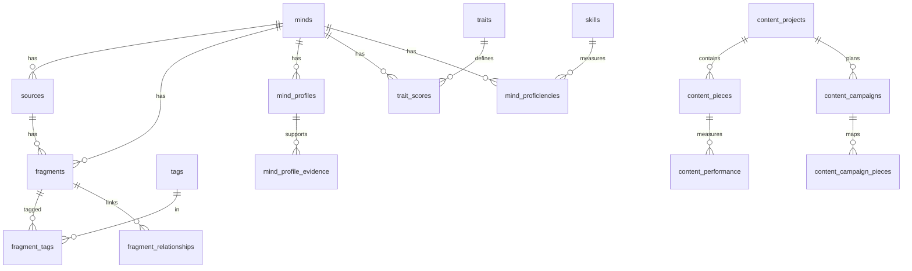

# MMOS / AIOS Unified Database — Decision Log README (KISS, Supabase PG16+)

> **Norte:** KISS, zero débitos técnicos desnecessários, rastreabilidade total e segurança pragmática.  
> **Escopo:** `minds → sources → fragments` (+ tags, relationships), perfis MMOS, InnerLens (traits), CreatorOS, operacional (lote→fila→execução), Auth→Mind (Magic Link) e RLS mínima.

Este documento não só descreve o esquema — ele é o **mapa de como chegamos até aqui**, com decisões, cortes, trade-offs e segundas ordens. É a nossa memória arquitetural.

---

## 0) Princípios que guiaram tudo
- **KISS real**: cada peça precisa pagar o próprio aluguel em valor agora. O resto vai para *backlog ADR*.
- **Mind é a raiz**: tudo é sobre uma mente (identidade/voz). Simplifica RLS, ownership e queries cross-sistema.
- **Proveniência acima de opinião**: sem “campos mágicos” derivados; preferimos **views** sobre execuções e filas.
- **Leitura rápida > escrita fácil**: schema relacional com índices para buscas reais (tags, timeline, FTS), evitando JSON arrays.
- **Sem triggers “inteligentes”**: só `updated_at` e provisionamento do usuário→mind. Nada de contadores/custos em trigger.
- **Passwordless primeiro**: menos fricção, menos suporte, menos vetores de falha.
- **Upgradeable sem refactor**: começar enxuto, expandir por **novas tabelas/colunas** compatíveis.

---

## 1) Linha do tempo (como evoluímos)
**v0 (rascunho local / SQLite)**  
- Dados espalhados (YAML/JSON, pequenas tabelas).  
- Descobrimos o gargalo: **arrays de tags** e busca no app (table scans, 800–2000ms).

**v0.1 (KISS-core em PostgreSQL)**  
- Normalização mínima: `minds`, `sources`, `fragments`, `tags`, `fragment_tags`, `fragment_relationships`.
- Índices essenciais + **FTS** (`tsv` GIN).  
- **Ganhos:** consultas de tag **~8–20ms** com junction e índices.

**v0.2 (Competências & Traits)**  
- `domains → specializations → skills` e `mind_proficiencies`.  
- `traits` + `trait_scores` (+ evidências).  
- Ainda sem colunar em demasia: **apenas o necessário** para ligar evidências.

**v0.3 (Operacional + MMOS profiles, quase completo)**  
- Operacional: `ingestion_batches → processing_queue → job_executions` com **tokens/custo/latência**.  
- `mind_profiles` (JSONB), `mind_values`, `mind_routine_windows`, `mind_psychometrics`, `mind_obsessions`.  
- Views operacionais (custos por fragmento/lote, timeline de processamento).  
- **Decisão crucial:** **não** guardar `processing_*` em `minds`; derivar de `queue + executions`.

**v1.0 Unificado (Supabase-ready + CreatorOS + Auth/RLS mínima)**  
- CreatorOS P1: `content_projects` (creator_mind ▶ persona_mind), `content_pieces`, `content_campaigns`, `content_performance`.  
- Auth→Mind: `user_profiles` (id=auth.users.id), `current_mind_id()`, trigger `provision_user_profile`.  
- **RLS mínima**: 1 policy/tabela + `DEFAULT current_mind_id()` (cliente não envia `mind_id`).  
- **Cortes conscientes** empurrados para backlog (ver §5).

---

## 2) Decisões-chave (ADR condensado)

### D1 — **Mind como raiz** (ownership único)
**Problema:** ownership difuso entre usuário, perfil, persona.  
**Decisão:** toda entidade “pertence” a uma `mind`. `sources` e `fragments` **sempre** carregam `mind_id`.  
**Por quê:** simplifica RLS, queries e telemetria por mente.  
**Alternativas rejeitadas:** multi-tenant via `orgs/projects` agora (complexidade sem uso imediato).  
**Efeitos:** mudanças de ownership ficam explícitas (migrar `mind_id`).

### D2 — **Tags normalizadas (N:M)**, case-sensitive
**Problema:** arrays JSON/YAML escalam mal para busca.  
**Decisão:** `tags` + `fragment_tags` com índices (`INCLUDE`) e lookups por `name`.  
**Efeito:** ~100x mais rápido em 100k linhas. `name` é **case-sensitive** por semântica e desambiguação.  
**Adiamos:** taxonomias rígidas de tags (sinônimos, hierarquias) — viram outro escopo.

### D3 — **Relevância 0..1 com “dízimo”** (decimais de 0.1)
**Problema:** floats arbitrários são ruins para index/consistência.  
**Decisão:** armazenar `relevance_10` (`SMALLINT` 0..10) e gerar `relevance NUMERIC(2,1)` (0.0..1.0). Regra de arredondar: ≥0.08 sobe.  
**Efeito:** filtros e ordenações estáveis e baratos.  
**Adiamos:** pesos múltiplos de relevância (contextual, temporal) — só quando houver sinal real.

### D4 — **FTS nativo (to_tsvector 'simple')**, sem `pg_trgm` por ora
**Problema:** busca textual ampla; `LIKE` é ruim.  
**Decisão:** coluna gerada `tsv` (content/context/insight com pesos A/B/C) + **GIN**.  
**Por quê:** rápido o suficiente para MVP e barato de manter.  
**Adiamos:** `pg_trgm`, dicionários específicos e ranking customizada — só com dados reais pedindo.

### D5 — **Proveniência total via execuções** (sem contadores/denorm)
**Problema:** medir tokens/custos por artefato sem drift.  
**Decisão:** `fragments.generation_execution_id → job_executions.id`; **views** fazem o agregado.  
**Por quê:** evita “contador em trigger” → fonte única de verdade.  
**Adiamos:** *materialized views* — só se as *views* ficarem quentes no tráfego.

### D6 — **Triggers mínimos** (updated_at + provisionamento)
**Problema:** triggers pesadas consomem DB e criam acoplamento.  
**Decisão:** apenas `set_updated_at` e `provision_user_profile`.  
**Por quê:** menos latência e bugs.  
**Adiamos:** triggers de auditoria/contagem/publicação — vão para serviço/worker quando necessário.

### D7 — **RLS mínima e anti-atrito**
**Problema:** policies costumam travar DEV/PROD.  
**Decisão:** 1 policy `FOR ALL` por tabela com `USING/ WITH CHECK = mind_id = current_mind_id()` + `DEFAULT` para `mind_id`.  
**Ferramenta de escape:** scripts `dev_open.sql/dev_close.sql` para ligar/desligar rapidamente.  
**Adiamos:** papéis/time/multi-usuário por mind — vira `mind_members` depois.

### D8 — **Passwordless (Magic Link)** e **auto-provisionamento de mind**
**Problema:** fricção de senha/MFA e onboarding.  
**Decisão:** usar `signInWithOtp` + trigger que cria `mind` e `user_profile` na primeira autenticação.  
**Efeito:** onboarding sem backend, pronto para começar.

### D9 — **CreatorOS P1** (conteúdo essencial)
**Problema:** relacionar **quem cria** e **qual voz**.  
**Decisão:** `content_projects(creator_mind_id ▶ persona_mind_id)`; peças, campanhas e performance mínimas.  
**Adiamos (P2):** frameworks pedagógicos/marketing (`content_frameworks`), attribution e SEO tracking.

### D10 — **Profiles como JSONB** (+ evidências)
**Problema:** grande variabilidade de artefatos (psychometrics, writing_style, voice_guide, etc.).  
**Decisão:** `mind_profiles(payload JSONB)` com `profile_type` e `format`; *evidence* liga a fragments/sources.  
**Por quê:** evita colunar cedo; dá liberdade para evoluir o conteúdo.

---

## 3) O que foi **cortado** (consciente) — e por quê
- **Audit trail completo** (`audit_log` + triggers): só quando surgir demanda de compliance.  
- **RLS avançada** (times, papéis): adiado; manter 1:1 user↔mind é suficiente agora.  
- **Trigram / dicionário linguístico FTS**: sem dados quentes pedindo, não compensa a complexidade.  
- **Métricas agregadas gravadas** (custos por lote, duração por mente): **derivamos em views**.  
- **Catálogos profundos de tags/taxonomias**: começamos livres, consolidamos depois com uso real.  
- **Distribuição/SEO/Attribution de CreatorOS**: backlog P2/P3, sem bloquear o core.

**Benefício:** menos refactor no futuro — nada aqui nos prende. Tudo é **additive**.

---

## 4) Segundas/terceiras ordens (o que já previmos)
- **Index bloat**: reduzimos para o necessário; adicionamos mais só com *EXPLAIN ANALYZE* e tráfego real.  
- **RLS fricção**: defaults + 1 policy → maioria dos erros some. `dev_open.sql` desbloqueia QA rapidamente.  
- **Crescimento de profiles JSONB**: mitigado por evidências e por “última versão válida” (`v_mind_latest_profiles`).  
- **Hot paths previsíveis**: índices compostos (`mind_id, relevance_10 DESC` e `source_id, created_at DESC`) cobrem 80% das leituras.

---

## 5) Backlog ADR (quando mexer)
- **Teams/Multi-user por mind**: `mind_members(user_id, mind_id, role)` + policies por papel.  
- **Audit log**: `audit_log` + trigger genérico.  
- **Materialized views**: para *dashboards* de alta leitura.  
- **CreatorOS P2**: `content_frameworks`, attribution, SEO.  
- **FTS avançado**: trigram, stemming custom, ranking BM25-like.  
- **Storage/Releases**: buckets para originais e assets.

---

## 6) Operação: fila→lote→execução→métrica→view
- `ingestion_batches`: define contexto (modelo pretendido, prompt_hash, params).  
- `processing_queue`: unidade de trabalho (scope mind/source/fragment).  
- `job_executions`: tentativa real (modelo usado, tokens, custo, latência).  
- **Atribuição por mente**: `v_job_mind_attribution` (prioridade: mind → source → fragment).  
- **Tempo gasto por mente**: `v_mind_processing_time` (soma derivada de `started_at/finished_at`).  
- **Custo por fragmento/lote/modelo**: `v_cost_per_fragment` e `v_batch_costs`.

> **Sem** gravar totais em tabela: caixas de areia ficam nas views; materializamos só se o tráfego pedir.

---

## 7) Segurança e Auth (sem dor)
- **Passwordless Magic Link**; nada de senha no seu código.  
- `user_profiles(id = auth.users.id, mind_id)` + `current_mind_id()`; cliente **não** envia `mind_id`.  
- **RLS mínima**: 1 policy por tabela com `FOR ALL` e `USING/WITH CHECK` iguais.  
- **Operacional sem RLS**: acessado somente por service-role (workers).

**DEV toggle**
```sql
-- dev_open.sql
CREATE POLICY dev_open_fragments ON fragments FOR ALL TO authenticated USING (true) WITH CHECK (true);
-- dev_close.sql
DROP POLICY IF EXISTS dev_open_fragments ON fragments;
```

---

## 8) ERD (alto nível)


---

## 9) Smoke tests (o essencial)

**Inserção mínima (cliente autenticado):**
```sql
INSERT INTO sources (title, type, published_date, quality) VALUES
('Meu Artigo', 'article', '2025-10-01', 'primary');

INSERT INTO categories(code, name) VALUES ('COG','Cognitive') ON CONFLICT DO NOTHING;

INSERT INTO fragments (source_id, category_id, location, type, relevance_10, content, context, insight)
SELECT s.id, (SELECT id FROM categories WHERE code='COG'), 'p.1', 'direct_quote', 9,
       'Conteúdo...', 'Contexto...', 'Insight...'
FROM sources s ORDER BY s.created_at DESC LIMIT 1;
```

**Tagging + busca por tag:**
```sql
INSERT INTO tags(name, tag_type) VALUES ('leverage','theme') ON CONFLICT DO NOTHING;
INSERT INTO fragment_tags(fragment_id, tag_id)
SELECT f.id, t.id FROM fragments f, tags t WHERE t.name='leverage' ORDER BY f.created_at DESC LIMIT 1;

SELECT f.id, left(f.content,80)
FROM fragments f
JOIN fragment_tags ft ON ft.fragment_id=f.id
JOIN tags t ON t.id=ft.tag_id
WHERE t.name='leverage';
```

**Custo por lote/modelo:**
```sql
SELECT * FROM v_batch_costs ORDER BY last_exec_at DESC;
```

**CreatorOS básico:**
```sql
INSERT INTO content_projects (persona_mind_id, name) VALUES (current_mind_id(), 'Projeto Newsletter');
INSERT INTO content_pieces (project_id, type, title, content)
SELECT id, 'newsletter', 'Edição #1', 'Olá mundo' FROM content_projects ORDER BY created_at DESC LIMIT 1;
SELECT * FROM v_project_content_stats ORDER BY last_published_at DESC NULLS LAST;
```

---

## 10) Glossário rápido
- **Mind**: identidade/voz (pessoa, personagem, marca).  
- **Source**: origem factual (livro, artigo, podcast, entrevista, dossiê).  
- **Fragment**: unidade destilada (conteúdo + contexto + insight, com relevância).  
- **Profile**: artefato estruturado em JSONB (psychometrics, writing style etc.).  
- **Batch/Queue/Execution**: telemetria de processamento LLM.  
- **CreatorOS**: projetos de conteúdo (quem cria vs. qual voz).

---

## 11) Próximos passos seguros
- Adicionar `mind_members` (times) quando houver colaboração real.  
- Materializar as duas views mais quentes conforme perfis de tráfego.  
- Fechar P2 do CreatorOS quando houver campanhas reais.  
- Escrever funções RPC STABLE para as *query libraries* dos 8 agentes.

---

**Conclusão:**  
Chegamos a um **núcleo sólido e simples**, com **proveniência completa**, **busca rápida**, **RLS mínima** e **onboarding sem senha**. O que cortamos foi por prudência — nada impede expansão **sem refactor**. Este README é o nosso mapa: decisão por decisão, com o “porquê” claro.
