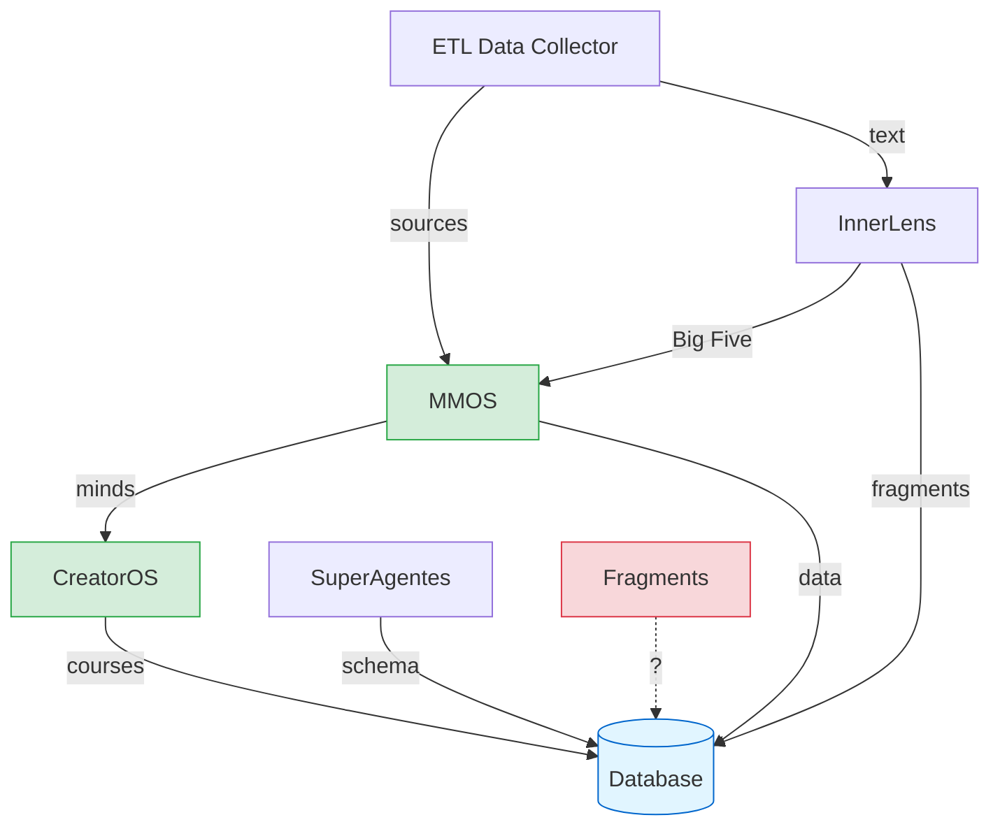

# Expansion Packs - System Architecture & Governance

**Central hub for coordinating evolution across all Mente Lendária expansion packs**

---

## 📋 Table of Contents

1. [Overview](#overview)
2. [Expansion Pack Registry](#expansion-pack-registry)
3. [System Architecture](#system-architecture)
4. [Dependency Graph](#dependency-graph)
5. [Cross-Pack Workflows](#cross-pack-workflows)
6. [Governance Model](#governance-model)
7. [Planning & Coordination](#planning--coordination)

---

## Overview

Mente Lendária is built as a **modular system of expansion packs** - each providing specialized capabilities while integrating into a cohesive whole. This documentation provides **centralized governance** to ensure:

✅ **Maximum integration** - Expansion packs work together seamlessly
✅ **Coordinated evolution** - Features are planned across the entire system
✅ **Clear contracts** - Well-defined interfaces between modules
✅ **Unified data model** - Single database (`outputs/database/mmos.db`)
✅ **Traceability** - From epics to implementation across all packs

---

## Expansion Pack Registry

### Production Ready (5 packs)

| Pack | Version | Purpose | Primary Output | Status |
|------|---------|---------|----------------|--------|
| [**MMOS**](./packs/mmos.md) | v3.0 | Cognitive clone creation | `outputs/minds/{slug}/` | ✅ Production |
| [**CreatorOS**](./packs/creator-os.md) | v2.0.0 | Content generation with voice preservation | `outputs/courses/{slug}/` | ✅ Production |
| [**InnerLens**](./packs/innerlens.md) | v1.1.0 | Big Five personality analysis | YAML profiles | ✅ Complete |
| [**ETL Data Collector**](./packs/etl.md) | v1.0.0 | Multi-source data collection | `downloads/` | ✅ Production |
| [**SuperAgentes**](./packs/super-agentes.md) | v2.0.0 | DB + Design System orchestration | Database + UI | ✅ Production |

### In Development (2 packs)

| Pack | Status | Purpose | Next Milestone |
|------|--------|---------|----------------|
| [**Fragments**](./packs/fragments.md) | 🚧 Research | Fragment processing (TBD) | Define scope |
| **etl (variant)** | ⚠️ Unclear | ETL tools variant? | Clarify vs ETL Data Collector |

---

## System Architecture

**Core Principle:** Expansion packs are **loosely coupled, highly integrated** modules.

### Architectural Layers

```
┌─────────────────────────────────────────────────────────────┐
│                  User-Facing Applications                    │
│     CreatorOS (Courses) │ MMOS (Clones) │ SuperAgentes      │
└─────────────────────────┬───────────────┬───────────────────┘
                          │               │
┌─────────────────────────┴───────────────┴───────────────────┐
│               Integration & Enrichment Layer                 │
│         InnerLens (Psychology) │ Fragments (?)               │
└─────────────────────────┬───────────────────────────────────┘
                          │
┌─────────────────────────┴───────────────────────────────────┐
│                  Data Collection Layer                       │
│              ETL Data Collector │ etl (variant?)             │
└─────────────────────────┬───────────────────────────────────┘
                          │
┌─────────────────────────┴───────────────────────────────────┐
│                    Unified Database                          │
│               outputs/database/mmos.db                       │
│    (Minds, Fragments, Courses, Profiles, Projects...)       │
└─────────────────────────────────────────────────────────────┘
```

### Design Principles

1. **Single Database** - All packs write to `outputs/database/mmos.db`
2. **Contract-Based Integration** - Well-defined interfaces between packs
3. **Optional Dependencies** - Packs work standalone, but integrate when available
4. **Shared Outputs** - `outputs/` directory structure shared across packs
5. **AIOS Compliance** - All packs follow agents → tasks → checklists pattern

---

## Dependency Graph

See [dependency-graph.md](./dependency-graph.md) for detailed analysis.

### High-Level Dependencies



### Integration Points

| From | To | Interface | Data Flow |
|------|-----|-----------|-----------|
| ETL → MMOS | Sources collection | File system (`outputs/minds/{slug}/sources/`) | Transcripts, PDFs, text |
| InnerLens → MMOS | Personality enrichment | YAML profiles | Big Five scores |
| MMOS → CreatorOS | Voice preservation | System prompts | Cognitive patterns |
| All → Database | State persistence | SQLite API | Structured data |

---

## Cross-Pack Workflows

See [workflows.md](./workflows.md) for detailed workflow orchestrations.

### Example: Complete Mind Creation with Course

**Workflow Name:** `create-mind-and-course`

```yaml
workflow:
  name: "Create cognitive clone and generate course"
  packs_involved: [ETL, InnerLens, MMOS, CreatorOS]
  duration: "3-5 days"

  steps:
    - step: 1
      pack: ETL Data Collector
      command: "*collect-all-sources"
      input: "sources.yaml"
      output: "outputs/minds/naval/sources/downloads/"
      duration: "4-8 hours"

    - step: 2
      pack: InnerLens
      command: "@innerlens-orchestrator *detect-traits-quick"
      input: "outputs/minds/naval/sources/downloads/"
      output: "bigfive-profile.yaml"
      duration: "2 minutes"

    - step: 3
      pack: MMOS
      command: "@mind-mapper *map naval"
      input: "outputs/minds/naval/sources/"
      output: "outputs/minds/naval/system_prompts/"
      duration: "15-20 hours"
      uses: ["bigfive-profile.yaml from InnerLens"]

    - step: 4
      pack: CreatorOS
      command: "@course-architect *new naval-startups"
      input: "COURSE-BRIEF.md + Naval mind"
      output: "outputs/courses/naval-startups/"
      duration: "45-75 minutes"
      uses: ["Naval system prompt for voice preservation"]
```

---

## Governance Model

See [governance.md](./governance.md) for complete governance framework.

### Centralized Planning

**All expansion pack evolution is coordinated through:**

1. **System-Level Epics** (`docs/expansion-packs/epics/`)
   - Cross-pack features
   - Integration improvements
   - Architecture changes

2. **Pack-Level Epics** (within each pack's `docs/`)
   - Pack-specific features
   - Must reference system-level dependencies

3. **Coordinated Stories** (`docs/expansion-packs/stories/`)
   - Stories that span multiple packs
   - Tracked centrally with pack-specific sub-stories

### Interface Contracts

**Each integration point has a versioned contract:**

```yaml
# docs/expansion-packs/contracts/mmos-creator-os.yaml
contract:
  name: "MMOS → CreatorOS Voice Integration"
  version: "1.0.0"
  provider: MMOS
  consumer: CreatorOS

  interface:
    format: "system_prompt_generalista.md"
    location: "outputs/minds/{slug}/system_prompts/"
    required_sections:
      - cognitive_patterns
      - communication_style
      - decision_making
    optional_sections:
      - big_five_profile  # from InnerLens
```

---

## Planning & Coordination

### When to Create System-Level Epics

✅ **Create in `docs/expansion-packs/epics/`** when:
- Feature requires changes in 2+ expansion packs
- New integration point between packs
- Database schema changes affecting multiple packs
- Architectural changes impacting system design

❌ **Create in pack's `docs/epics/`** when:
- Feature is entirely within one expansion pack
- No new integration points needed
- Doesn't affect other packs' contracts

### Epic Planning Template

```markdown
# Epic: [Name]

**Affected Packs:** MMOS, CreatorOS, InnerLens
**Integration Points:** 2 new, 1 modified
**Database Changes:** Yes (new table)

## Overview
[What and why]

## Pack Breakdown

### MMOS Changes
- Story 1: [description]
- Story 2: [description]

### CreatorOS Changes
- Story 3: [description]

### InnerLens Changes
- Story 4: [description]

## Integration Stories
- Story 5: [cross-pack integration]

## Contracts Affected
- `mmos-creator-os.yaml` - v1.0.0 → v1.1.0
```

---

## Quick Navigation

### By Use Case

**"I want to create a cognitive clone"**
→ [MMOS Pack](./packs/mmos.md) + [ETL Pack](./packs/etl.md)

**"I want to generate a course"**
→ [CreatorOS Pack](./packs/creator-os.md) + [MMOS Pack](./packs/mmos.md) (optional)

**"I want to analyze personality"**
→ [InnerLens Pack](./packs/innerlens.md)

**"I want to design database"**
→ [SuperAgentes Pack](./packs/super-agentes.md)

### By Role

**Product Manager:**
1. [Governance Model](./governance.md)
2. [Epic Planning](./epics/)
3. [Dependency Graph](./dependency-graph.md)

**Developer:**
1. [System Architecture](./architecture.md)
2. [Interface Contracts](./contracts/)
3. [Cross-Pack Workflows](./workflows.md)

**Architect:**
1. [Architecture](./architecture.md)
2. [Integration Points](./dependency-graph.md#integration-points)
3. [Database Schema](./database-schema.md)

---

## Contributing

### Adding a New Expansion Pack

1. Create pack in `expansion-packs/{pack-name}/`
2. Add registry entry in this README
3. Document in `docs/expansion-packs/packs/{pack-name}.md`
4. Define contracts for integration points
5. Update dependency graph
6. Create system-level epic if integrating with existing packs

### Proposing Cross-Pack Features

1. Create epic in `docs/expansion-packs/epics/`
2. Identify affected packs
3. Define new/modified contracts
4. Break down into pack-specific stories
5. Coordinate implementation across teams

---

**Last Updated:** 2025-10-27
**Maintainer:** Architecture Team
**Status:** Living document - update as system evolves
