# Expansion Packs - Dependency Graph

**Complete mapping of dependencies, data flows, and integration points**

---

## Visual Dependency Graph

```mermaid
graph TB
    subgraph "Data Collection Layer"
        ETL[ETL<br/>v2.0.0<br/>Blog Collection Utilities]
    end

    subgraph "Integration & Enrichment Layer"
        InnerLens[InnerLens<br/>v1.1.0<br/>Psychometric + RAG Enrichment]
        Fragments[Fragments<br/>v0.1.0<br/>Fragment Processing<br/>Research Phase]
    end

    subgraph "Core Application Layer"
        MMOS[MMOS<br/>v3.0<br/>Cognitive Clone Creation]
        CreatorOS[CreatorOS<br/>v2.0.0<br/>Content Generation<br/>+ Market Research]
        SuperAgentes[SuperAgentes<br/>v2.0.0<br/>DB Sage + Design System]
    end

    subgraph "Data Persistence"
        DB[(Unified Database<br/>Supabase<br/>PostgreSQL<br/>Primary Data Store)]
        OutputsMinds[outputs/minds/<br/>System Prompts<br/>File Assets]
    end

    %% Data Collection → Applications
    ETL -->|blog posts<br/>transcripts<br/>text files| MMOS
    ETL -->|raw text| InnerLens

    %% Enrichment → Applications
    InnerLens -->|Big Five<br/>profiles YAML| MMOS
    InnerLens -->|MIU<br/>fragments| DB
    InnerLens -.->|RAG fragment<br/>responses| CreatorOS
    Fragments -.->|TBD| DB

    %% Applications → Database (Primary)
    MMOS -->|mind metadata<br/>cognitive specs<br/>taxonomy| DB
    CreatorOS -->|courses<br/>lessons<br/>content<br/>performance<br/>campaigns| DB
    SuperAgentes -->|schema design<br/>migrations<br/>RLS policies<br/>design tokens| DB

    %% Applications → File System (Assets)
    MMOS -->|system prompts<br/>markdown files| OutputsMinds
    MMOS -->|voice model<br/>90%+ fidelity| CreatorOS

    style DB fill:#e1f5ff,stroke:#0066cc,stroke-width:3px
    style MMOS fill:#d4edda,stroke:#28a745,stroke-width:2px
    style CreatorOS fill:#d4edda,stroke:#28a745,stroke-width:2px
    style InnerLens fill:#d4edda,stroke:#28a745,stroke-width:2px
    style ETL fill:#d4edda,stroke:#28a745,stroke-width:2px
    style SuperAgentes fill:#d4edda,stroke:#28a745,stroke-width:2px
    style Fragments fill:#fff3cd,stroke:#ffc107,stroke-width:2px
```



---

## Integration Matrix

| From Pack | To Pack | Data Flow | Interface | Optional? |
|-----------|---------|-----------|-----------|-----------|
| **ETL** → MMOS | Sources collection | Blog posts, transcripts, text | File system: `outputs/minds/{slug}/sources/` | ❌ Required |
| **ETL** → InnerLens | Text for analysis | Raw text files | File paths or direct text | ✅ Optional |
| **InnerLens** → MMOS | Personality profiles | Big Five YAML (0-100 scores) | `outputs/minds/{slug}/analysis/psychometric-profile.yaml` | ✅ Optional (2-3% fidelity boost) |
| **InnerLens** → Database | MIU fragments | PostgreSQL INSERT | `sources`, `fragments`, `big_five_profiles` tables | ❌ Required |
| **CreatorOS** → InnerLens | Contextual fragments for lessons | RAG query service (`query_fragments`) | Python API / SQL direct | ✅ Optional (98% fidelity with RAG) |
| **MMOS** → CreatorOS | Voice preservation | System prompts + cognitive patterns | `outputs/minds/{slug}/system_prompts/generalista.md` | ✅ Optional (90%+ voice fidelity) |
| **MMOS** → Database | Mind metadata (primary storage) | PostgreSQL INSERT | `minds`, `cognitive_specs`, `mind_fragments` tables | ❌ Required |
| **MMOS** → File System | System prompts + assets | File write | `outputs/minds/{slug}/system_prompts/`, `outputs/minds/{slug}/sources/` | ❌ Required |
| **CreatorOS** → Database | Course data (primary storage) | PostgreSQL INSERT | `courses`, `lessons`, `content_pieces`, `content_performance`, `content_campaigns` tables | ❌ Required |
| **SuperAgentes** → Database | Schema design + migrations | SQL DDL/DML + RLS policies + design tokens | Supabase CLI + Direct SQL | ❌ Required |
| **Fragments** → Database | Fragment processing (TBD) | TBD | TBD | ⚠️ Research phase |

---

## Dependency Analysis

### Strong Dependencies (Required)

**MMOS depends on:**
- ✅ **ETL** - Cannot create mind without source materials
- ✅ **Database** - Must persist mind metadata and cognitive specs

**CreatorOS depends on:**
- ✅ **Database** - Must persist course data, lessons, and performance metrics

**InnerLens depends on:**
- ✅ **Database** - Must persist MIU fragments and Big Five profiles

**SuperAgentes depends on:**
- ✅ **Database** - All DB Sage and Design System operations target database

### Weak Dependencies (Optional Enhancements)

**MMOS optionally uses:**
- 🔵 **InnerLens** - Enriches clone with Big Five personality layer (2-3% fidelity improvement)
  - *Fallback:* MMOS works without it, cognitive patterns sufficient for 94% fidelity
  - *Enhancement:* Adds psychological depth to system prompts

**CreatorOS optionally uses:**
- 🔵 **MMOS** - Preserves authentic instructor voice (90%+ fidelity)
  - *Fallback:* Rule-based voice extraction from course transcripts/materials
  - *Enhancement:* Dramatically improves voice consistency across all lessons
- 🔵 **InnerLens** - Fornece fragmentos comportamentais via RAG (98%+ fidelidade contextual)
  - *Fallback:* CreatorOS gera exemplos usando heurísticas internas
  - *Enhancement:* Injeta evidências autênticas do instrutor em lições e avaliações

**InnerLens optionally uses:**
- 🔵 **ETL** - Can collect sources for analysis
  - *Fallback:* Works standalone with manually-provided text files

**SuperAgentes provides:**
- 🔵 **Design System tokens** - Can be consumed by MMOS/CreatorOS for UI consistency
  - *Current:* Not yet integrated, future opportunity

### Clarified: Previous Unclear Dependencies

**Fragments (✅ Clarified):**
- **Status:** v0.1.0 - Research/Development phase
- **Purpose:** Generic fragment processing expansion pack
- **Relationship to InnerLens:** Complementary, not overlapping
  - InnerLens: Specialized for psychological MIU extraction (Big Five framework)
  - Fragments: Generic fragment processing infrastructure (framework-agnostic)
- **Next Steps:** Define specific use cases beyond psychology

**ETL variant (✅ Resolved):**
- **Resolution:** No variant exists - single ETL pack refactored to v2.0.0
- **What happened:** ETL underwent major simplification (2025-10-27)
  - Deprecated: Orchestration, untested collectors (YouTube, PDF, podcast)
  - Kept: Proven blog collection utilities (100% success rate)
- **Current:** Single, focused ETL pack for blog collection

---

## Data Flow Scenarios

### Scenario 1: Complete Mind Creation

**Goal:** Create high-fidelity cognitive clone

```
1. ETL Data Collector
   ├─ Input: sources.yaml (YouTube, blogs, PDFs)
   ├─ Action: Download, transcribe, extract
   └─ Output: outputs/minds/naval/sources/downloads/
          ├─ youtube/lex-fridman-1/transcript.md
          ├─ blogs/naval-blog-1.md
          └─ pdf/naval-almanack/text.md

2. InnerLens (optional)
   ├─ Input: outputs/minds/naval/sources/downloads/*.md
   ├─ Action: Extract MIUs, analyze Big Five
   └─ Output: outputs/minds/naval/analysis/psychometric-profile.yaml
          └─ Supabase: sources, fragments, big_five_profiles tables

3. MMOS
   ├─ Input: outputs/minds/naval/sources/
   ├─ Input (optional): psychometric-profile.yaml
   ├─ Action: 5-phase pipeline (collection → analysis → synthesis → implementation → validation)
   └─ Output: outputs/minds/naval/system_prompts/generalista.md
          └─ Supabase: minds, cognitive_specs, mind_fragments tables

Result: High-fidelity cognitive clone with optional personality layer
Fidelity: 94% (base) + 2-3% (InnerLens) = 96-97%
```

### Scenario 2: Course Generation with Voice & Market Intelligence

**Goal:** Generate strategically differentiated course in specific instructor's voice

```
1. MMOS (prerequisite - optional but recommended)
   └─ Existing mind: outputs/minds/naval/system_prompts/generalista.md

2. CreatorOS (NEW: with automated market research)
   ├─ Input: COURSE-BRIEF.md + Naval system prompt
   ├─ Phase 1: Competitive market research (5-10 min)
   │   └─ Analyzes 10-15 competitive courses
   │   └─ Identifies gaps, pricing strategies, differentiation opportunities
   ├─ Phase 2: COURSE-BRIEF reformulation
   │   └─ Integrates research insights while preserving original vision
  ├─ Phase 3: Curriculum generation (market-informed)
  ├─ Phase 4: Lesson generation (with voice preservation + RAG InnerLens)
  │   └─ Consulta `query_fragments` (top_k=5) para injetar exemplos comportamentais
   └─ Output: Supabase Database (primary storage)
          ├─ courses table:
          │   └─ Course metadata, brief, research summaries, status
          ├─ lessons table:
          │   └─ Lesson content, GPS framework, markdown body (90%+ Naval voice fidelity)
          ├─ content_pieces table:
          │   └─ Granular content fragments, exercises, assessments
          ├─ content_performance table:
          │   └─ Analytics, engagement metrics, completion rates
          └─ content_campaigns table:
              └─ Marketing campaigns, funnels, A/B tests

Result: Strategically differentiated course that sounds like Naval wrote it
Voice Fidelity: 90%+ (validated automatically)
Market Intelligence: Competitive gaps identified, unique positioning defined
Timeline: 45-75 minutes (vs 30-40 min without research)
```

### Scenario 3: Standalone Personality Analysis

**Goal:** Quick Big Five analysis without creating full clone

```
1. InnerLens (standalone)
   ├─ Input: interview-transcript.txt (user-provided)
   ├─ Action: Extract MIUs → Analyze Big Five → Validate
   └─ Output: bigfive-profile.yaml + Supabase fragments (sources, fragments, big_five_profiles tables)

Result: Standalone personality profile (<2 min)
Cost: ~$0.20
```

### Scenario 4: Database Operations with Supabase

**Goal:** Design and manage production database

```
1. SuperAgentes - DB Sage
   ├─ Action: Design schema → Create migration → Apply → Snapshot → Test
   ├─ Tools: Supabase CLI, automatic snapshots, RLS policies
   └─ Output: Supabase database (PostgreSQL)
          ├─ 30 tables with RLS security
          ├─ 16 RLS policies (data isolation per user)
          ├─ 4 PostgreSQL functions
          ├─ Automatic before/after snapshots
          └─ Rollback capability via snapshot restore

Result: Production-ready Supabase database with enterprise security
Features: RLS, automatic backups, versioned migrations, rollback capability
```

---

## Integration Points Detail

### 1. ETL → MMOS Integration

**Interface:** File system

**Location:** `outputs/minds/{slug}/sources/`

**Structure:**
```
sources/
├── downloads/           # ETL output
│   ├── youtube/
│   ├── blogs/
│   └── pdf/
├── metadata.yaml        # MMOS creates
└── COLLECTION_SUMMARY.yaml  # ETL creates
```

**Contract:**
- ETL **provides:** Clean markdown files (no images/videos)
- MMOS **expects:** UTF-8 text files with metadata
- **Version:** 1.0.0 (stable)

---

### 2. InnerLens → MMOS Integration

**Interface:** YAML file

**Location:** `outputs/minds/{slug}/analysis/psychometric-profile.yaml`

**Schema:**
```yaml
profile_version: "1.0"
framework: "Big Five (OCEAN)"
traits:
  openness: 85
  conscientiousness: 68
  extraversion: 45
  agreeableness: 35
  neuroticism: 25
```

**Contract:**
- InnerLens **provides:** Big Five scores (0-100) + evidence
- MMOS **expects:** YAML with specific schema
- **Version:** 1.0.0 (stable)
- **Usage:** Optional enrichment in MMOS Phase 4 (Synthesis)

---

### 3. MMOS → CreatorOS Integration

**Interface:** System prompt file + Database reference

**Location (File System):** `outputs/minds/{slug}/system_prompts/generalista.md`
**Location (Database):** `minds` table (`mind_id` foreign key in CreatorOS)

**Structure:**
```markdown
# System Prompt: Naval Ravikant

## Cognitive Patterns
[MMOS DNA Mental analysis]

## Communication Style
[MMOS synthesis]

## Big Five Profile (if InnerLens ran)
- Openness: 95 (Extremely High)
- ...
```

**Contract:**
- MMOS **provides:** 
  - Markdown system prompt with cognitive patterns (file system)
  - Mind metadata in database (`minds` table)
- CreatorOS **expects:** 
  - Specific sections (cognitive_patterns, communication_style)
  - Can reference via `mind_id` foreign key
- **Version:** 1.0.0 (stable)
- **Usage:** Optional voice preservation (90%+ fidelity)
- **Storage:** Hybrid (file system for prompts, database for metadata)

---

### 4. All → Database Integration

**Interface:** Supabase (PostgreSQL)

**Location:** Supabase Cloud / Self-hosted PostgreSQL

**Schema Version:** v0.9.0 (30 tables, 16 RLS policies, 4 functions)

**Tables:**
```sql
-- MMOS tables
minds, cognitive_specs, mind_fragments, taxonomy (domains, skills, traits, specializations)

-- InnerLens tables
sources, fragments, big_five_profiles

-- CreatorOS tables
courses, lessons, content_pieces, content_projects, content_frameworks,
content_campaigns, content_performance, audience_profiles

-- SuperAgentes tables
agent_scans, versioned_tables_registry

-- Auth & Security
profiles (user authentication), RLS policies (row-level security)

-- Shared utilities
metadata, migrations history
```

**Contract:**
- All packs **use:** Shared Supabase database as **primary data store**
- **Schema versioning:** Timestamp-based migrations in `supabase/migrations/`
- **Security:** RLS policies enforce data isolation per user
- **Snapshots:** Automatic before/after snapshots for rollback
- **Version:** Managed by SuperAgentes (DB Sage)
- **Deployment:** `./scripts/db-migrate.sh` with automatic snapshots

**Storage Strategy:**
- **Primary Storage (Supabase):** All structured data (courses, lessons, minds metadata, fragments, profiles, analytics)
- **File System (outputs/):** Assets only (system prompts markdown, source materials, temporary artifacts)
- **Migration:** CreatorOS courses now stored directly in Supabase (no more `outputs/courses/`)
- **Benefits:** Real-time queries, RLS security, multi-user access, performance analytics, search capabilities

---

## Circular Dependencies

### None Detected ✅

The system has a **clean dependency hierarchy**:

```
Data Collection (ETL)
    ↓
Enrichment (InnerLens)
    ↓
Applications (MMOS, CreatorOS)
    ↓
Persistence (Database)
```

No circular dependencies exist. All data flows are **uni-directional** and **acyclic**.

---

## Dependency Management Recommendations

### Issues Resolved ✅

1. **✅ etl vs ETL Data Collector**
   - **Resolution:** Single ETL pack (v2.0.0) - refactored and simplified
   - **Action Taken:** Consolidated to proven blog collection utilities
   - **Status:** Production ready

2. **✅ Fragments Pack**
   - **Resolution:** Complementary to InnerLens (framework-agnostic processing)
   - **Action Taken:** Scope defined as generic infrastructure, InnerLens as psychological specialist
   - **Status:** v0.1.0 - Research phase, no conflicts

### Best Practices

✅ **Version contracts**
- All integration points should have versioned contracts
- Breaking changes require new contract version

✅ **Optional dependencies**
- Packs should work standalone
- Integrations enhance, don't block

✅ **Fail gracefully**
- If optional dependency unavailable, fallback to baseline behavior
- Example: CreatorOS works without MMOS (rule-based voice extraction)

✅ **Single database**
- All structured data goes to Supabase (PostgreSQL)
- No duplicate data stores
- Production-grade with RLS security and automatic backups

---

## System Status Summary

### Production Ready (5 packs - 83%)

| Pack | Version | Status | Core Capability | Integration Status |
|------|---------|--------|-----------------|-------------------|
| **ETL** | v2.0.0 | ✅ Production | Blog collection utilities | ✅ Integrated with MMOS, InnerLens |
| **InnerLens** | v1.1.0 | ✅ Production | Psychometric analysis + RAG enrichment | ✅ Integrated with MMOS, CreatorOS (RAG), Database |
| **MMOS** | v3.0 | ✅ Production | Cognitive clone creation | ✅ Integrated with all packs |
| **CreatorOS** | v2.0.0 | ✅ Production | Content generation + market research | ✅ Integrated with MMOS, Database |
| **SuperAgentes** | v2.0.0 | ✅ Production | DB Sage + Design System | ✅ Database integration complete |

### In Development (1 pack - 17%)

| Pack | Version | Status | Purpose | Next Milestone |
|------|---------|--------|---------|----------------|
| **Fragments** | v0.1.0 | 🚧 Research | Generic fragment processing | Define concrete use cases |

### Integration Health: Excellent ✅

- **Zero circular dependencies** - Clean dependency hierarchy
- **Single database** - All packs use unified Supabase (PostgreSQL)
- **Production-grade security** - RLS policies, automatic snapshots, rollback capability
- **Well-defined contracts** - Clear integration points with versioned migrations
- **Optional integrations** - Packs work standalone or enhanced
- **Future-ready** - Architecture supports planned integrations
- **Novo em 2025-10:** CreatorOS consulta InnerLens via RAG (`query_fragments`) para enriquecer lições

### Database Infrastructure

| Component | Technology | Version | Status |
|-----------|-----------|---------|--------|
| **Database** | Supabase (PostgreSQL) | v0.9.0 | ✅ Production |
| **Schema Version** | Timestamp-based migrations | v0.9.0 | ✅ Active |
| **Tables** | Production schema | 30 tables | ✅ Complete |
| **Security** | Row-Level Security (RLS) | 16 policies | ✅ Enforced |
| **Functions** | PostgreSQL functions | 4 functions | ✅ Active |
| **Migrations** | Automatic snapshots | `supabase/migrations/` | ✅ Versioned |
| **Rollback** | Snapshot restore | `supabase/schemas/` | ✅ Available |
| **Testing** | Smoke tests | `supabase/tests/` | ✅ Automated |

### Storage Architecture

| Data Type | Primary Storage | File System Usage | Rationale |
|-----------|----------------|-------------------|-----------|
| **Courses** | ✅ Supabase | ❌ None | Real-time queries, RLS, analytics, search |
| **Lessons** | ✅ Supabase | ❌ None | Content versioning, performance tracking |
| **Minds Metadata** | ✅ Supabase | ❌ None | Structured queries, relationships |
| **System Prompts** | ❌ Database | ✅ `outputs/minds/` | Large text, markdown formatting |
| **Source Materials** | ❌ Database | ✅ `outputs/minds/` | Binary files, PDFs, videos |
| **Fragments** | ✅ Supabase | ❌ None | Cross-mind analysis, search |
| **Profiles** | ✅ Supabase | ❌ None | User authentication, RLS enforcement |
| **Analytics** | ✅ Supabase | ❌ None | Real-time dashboards, aggregations |

---

## Questions Resolved ✅

### Previously Unclear - Now Clarified

1. **✅ What is `expansion-packs/etl/`?**
   - **Answer:** Single, refactored ETL pack (v2.0.0)
   - **Resolution:** No variants exist, simplified to focus on proven blog collection
   - **Status:** Production ready

2. **✅ What is Fragments Pack for?**
   - **Answer:** Generic fragment processing infrastructure (framework-agnostic)
   - **Resolution:** Complementary to InnerLens (not overlapping)
     - InnerLens: Psychological MIU extraction (Big Five specialist)
     - Fragments: Generic fragment processing (any framework)
   - **Status:** v0.1.0 - Research phase, scope being defined

3. **✅ Does SuperAgentes integrate with other packs?**
   - **Answer:** Yes, through database + future Design System tokens
   - **Current Integration:** All packs use database managed by DB Sage
   - **Future Opportunity:** Design System tokens for UI consistency across MMOS/CreatorOS
   - **Status:** Database integration complete, Design System integration planned

4. **✅ CreatorOS consulta InnerLens com RAG?**
   - **Answer:** Sim, contrato `creator-os-innerlens-v1.0.0.yaml` habilita o serviço `query_fragments`
   - **Status:** Implementado em 2025-10-27 (CreatorOS v2.0.0 + InnerLens v1.1.0)
   - **Impacto:** Lições recebem fragmentos comportamentais validados → fidelidade de voz ~98%

## Future Integration Opportunities

### Potential New Integrations

1. **InnerLens → CreatorOS (direct)**
   - **Use case:** Adapt course content to learner personality profiles
   - **Example:** High Openness learners → More abstract/conceptual examples
   - **Benefit:** Personalized learning experiences
   - **Status:** Planned (v2.0+)

2. **Fragments → Multiple Frameworks**
   - **Use case:** Generic fragment processing for any psychological framework
   - **Example:** Extract once, analyze with Big Five, HEXACO, MBTI, etc.
   - **Benefit:** Reusable extraction layer
   - **Status:** Research phase

3. **SuperAgentes Design System → MMOS/CreatorOS**
   - **Use case:** Consistent UI/UX across cognitive clone interfaces and course platforms
   - **Example:** Design tokens define colors, spacing, typography
   - **Benefit:** Brand consistency, reduced UI development time
   - **Status:** Planned (v2.1+)


---

**Last Updated:** 2025-10-29
**Status:** Living document - update as integrations evolve
**Database:** Migrated from SQLite to Supabase (PostgreSQL) - v0.9.0 production ready
**Next Review:** 2026-01-01
