# Expansion Packs - Dependency Graph

**Complete mapping of dependencies, data flows, and integration points**

---

## Visual Dependency Graph

```mermaid
graph TB
    subgraph "Data Collection Layer"
        ETL[ETL Data Collector<br/>v1.0.0]
        ETLv[etl variant<br/>status unclear]
    end

    subgraph "Integration & Enrichment Layer"
        InnerLens[InnerLens<br/>v1.1.0<br/>Big Five Analysis]
        Fragments[Fragments<br/>in development]
    end

    subgraph "Core Application Layer"
        MMOS[MMOS<br/>v3.0<br/>Cognitive Clones]
        CreatorOS[CreatorOS<br/>v2.0.0<br/>Content Generation]
        SuperAgentes[SuperAgentes<br/>v2.0.0<br/>DB + Design System]
    end

    subgraph "Data Persistence"
        DB[(Unified Database<br/>mmos.db)]
        OutputsMinds[outputs/minds/]
        OutputsCourses[outputs/courses/]
    end

    %% Data Collection → Applications
    ETL -->|transcripts<br/>PDFs<br/>text files| MMOS
    ETL -->|raw text| InnerLens

    %% Enrichment → Applications
    InnerLens -->|Big Five<br/>profiles| MMOS
    InnerLens -->|MIU<br/>fragments| DB
    Fragments -.->|?| DB

    %% Applications → Outputs
    MMOS -->|system prompts<br/>cognitive specs| OutputsMinds
    MMOS -->|mind data| DB
    MMOS -->|voice model| CreatorOS
    CreatorOS -->|courses<br/>lessons| OutputsCourses
    CreatorOS -->|course data| DB
    SuperAgentes -->|schema<br/>migrations| DB

    %% ETL variant (unclear)
    ETLv -.->|?| MMOS

    style DB fill:#e1f5ff,stroke:#0066cc,stroke-width:3px
    style MMOS fill:#d4edda,stroke:#28a745,stroke-width:2px
    style CreatorOS fill:#d4edda,stroke:#28a745,stroke-width:2px
    style InnerLens fill:#d4edda,stroke:#28a745,stroke-width:2px
    style ETL fill:#d4edda,stroke:#28a745,stroke-width:2px
    style SuperAgentes fill:#d4edda,stroke:#28a745,stroke-width:2px
    style Fragments fill:#f8d7da,stroke:#dc3545,stroke-width:2px
    style ETLv fill:#fff3cd,stroke:#ffc107,stroke-width:2px
```



---

## Integration Matrix

| From Pack | To Pack | Data Flow | Interface | Optional? |
|-----------|---------|-----------|-----------|-----------|
| **ETL** → MMOS | Sources | Transcripts, PDFs, articles | File system: `outputs/minds/{slug}/sources/` | ❌ Required |
| **ETL** → InnerLens | Text for analysis | Raw text files | File paths | ✅ Optional |
| **InnerLens** → MMOS | Personality profiles | Big Five YAML | `outputs/minds/{slug}/analysis/psychometric-profile.yaml` | ✅ Optional |
| **InnerLens** → Database | MIU fragments | SQLite INSERT | `sources`, `fragments` tables | ❌ Required |
| **MMOS** → CreatorOS | Voice preservation | System prompts | `outputs/minds/{slug}/system_prompts/generalista.md` | ✅ Optional |
| **MMOS** → Database | Mind data | SQLite INSERT | `minds`, `cognitive_specs` tables | ❌ Required |
| **CreatorOS** → Database | Course data | SQLite INSERT | `courses`, `lessons` tables | ❌ Required |
| **SuperAgentes** → Database | Schema ops | SQL DDL/DML | Direct SQL | ❌ Required |
| **Fragments** → ? | ? | ? | ? | ? |

---

## Dependency Analysis

### Strong Dependencies (Required)

**MMOS depends on:**
- ✅ **ETL Data Collector** - Cannot create mind without sources
- ✅ **Database** - Must persist mind state

**CreatorOS depends on:**
- ✅ **Database** - Must persist course data

**InnerLens depends on:**
- ✅ **Database** - Must persist fragments

**SuperAgentes depends on:**
- ✅ **Database** - All operations target database

### Weak Dependencies (Optional Enhancements)

**MMOS optionally uses:**
- 🔵 **InnerLens** - Enriches clone with personality data (10-15% fidelity improvement)
  - *Fallback:* MMOS works without it, just lacks personality layer

**CreatorOS optionally uses:**
- 🔵 **MMOS** - Preserves instructor voice (90%+ fidelity)
  - *Fallback:* Rule-based voice extraction from transcripts

**InnerLens optionally uses:**
- 🔵 **ETL** - Can analyze manually-provided text instead

### Unclear Dependencies

**Fragments:**
- ⚠️ Purpose unclear - in research phase
- ⚠️ May overlap with InnerLens MIU extraction?
- ⚠️ Need to clarify scope and integrations

**etl (variant):**
- ⚠️ Relationship with ETL Data Collector unclear
- ⚠️ May be legacy version or experimental variant
- ⚠️ Need to clarify: consolidate or separate?

---

## Data Flow Scenarios

### Scenario 1: Complete Mind Creation

**Goal:** Create high-fidelity cognitive clone

```
1. ETL Data Collector
   ├─ Input: sources.yaml (YouTube, blogs, PDFs)
   ├─ Action: Download, transcribe, extract
   └─ Output: outputs/minds/naval/sources/downloads/
          ├─ youtube/lex-fridman-1/transcript.md
          ├─ blogs/naval-blog-1.md
          └─ pdf/naval-almanack/text.md

2. InnerLens (optional)
   ├─ Input: outputs/minds/naval/sources/downloads/*.md
   ├─ Action: Extract MIUs, analyze Big Five
   └─ Output: outputs/minds/naval/analysis/psychometric-profile.yaml
          └─ Database: sources, fragments tables

3. MMOS
   ├─ Input: outputs/minds/naval/sources/
   ├─ Input (optional): psychometric-profile.yaml
   ├─ Action: 5-phase pipeline (collection → analysis → synthesis → implementation → validation)
   └─ Output: outputs/minds/naval/system_prompts/generalista.md
          └─ Database: minds, cognitive_specs tables

Result: High-fidelity cognitive clone with optional personality layer
Fidelity: 94% (base) + 2-3% (InnerLens) = 96-97%
```

### Scenario 2: Course Generation with Voice

**Goal:** Generate course in specific instructor's voice

```
1. MMOS (prerequisite)
   └─ Existing mind: outputs/minds/naval/system_prompts/generalista.md

2. CreatorOS
   ├─ Input: COURSE-BRIEF.md + Naval system prompt
   ├─ Action: Market research → curriculum → lessons (with voice preservation)
   └─ Output: outputs/courses/startup-fundamentals/
          ├─ curriculum.yaml
          ├─ lessons/lesson-001.md (90%+ Naval voice fidelity)
          └─ Database: courses, lessons, content_pieces tables

Result: Course that sounds like Naval wrote it
Fidelity: 90%+ (validated automatically)
```

### Scenario 3: Standalone Personality Analysis

**Goal:** Quick Big Five analysis without creating full clone

```
1. InnerLens (standalone)
   ├─ Input: interview-transcript.txt (user-provided)
   ├─ Action: Extract MIUs → Analyze Big Five → Validate
   └─ Output: bigfive-profile.yaml + Database fragments

Result: Standalone personality profile (<2 min)
Cost: ~$0.20
```

### Scenario 4: Database Operations

**Goal:** Design and manage database

```
1. SuperAgentes - DB Sage
   ├─ Action: Design schema → Create migration → Apply → Test
   └─ Output: Database tables, RLS policies, indexes

Result: Production-ready database with security
```

---

## Integration Points Detail

### 1. ETL → MMOS Integration

**Interface:** File system

**Location:** `outputs/minds/{slug}/sources/`

**Structure:**
```
sources/
├── downloads/           # ETL output
│   ├── youtube/
│   ├── blogs/
│   └── pdf/
├── metadata.yaml        # MMOS creates
└── COLLECTION_SUMMARY.yaml  # ETL creates
```

**Contract:**
- ETL **provides:** Clean markdown files (no images/videos)
- MMOS **expects:** UTF-8 text files with metadata
- **Version:** 1.0.0 (stable)

---

### 2. InnerLens → MMOS Integration

**Interface:** YAML file

**Location:** `outputs/minds/{slug}/analysis/psychometric-profile.yaml`

**Schema:**
```yaml
profile_version: "1.0"
framework: "Big Five (OCEAN)"
traits:
  openness: 85
  conscientiousness: 68
  extraversion: 45
  agreeableness: 35
  neuroticism: 25
```

**Contract:**
- InnerLens **provides:** Big Five scores (0-100) + evidence
- MMOS **expects:** YAML with specific schema
- **Version:** 1.0.0 (stable)
- **Usage:** Optional enrichment in MMOS Phase 4 (Synthesis)

---

### 3. MMOS → CreatorOS Integration

**Interface:** System prompt file

**Location:** `outputs/minds/{slug}/system_prompts/generalista.md`

**Structure:**
```markdown
# System Prompt: Naval Ravikant

## Cognitive Patterns
[MMOS DNA Mental analysis]

## Communication Style
[MMOS synthesis]

## Big Five Profile (if InnerLens ran)
- Openness: 95 (Extremely High)
- ...
```

**Contract:**
- MMOS **provides:** Markdown system prompt with cognitive patterns
- CreatorOS **expects:** Specific sections (cognitive_patterns, communication_style)
- **Version:** 1.0.0 (stable)
- **Usage:** Optional voice preservation (90%+ fidelity)

---

### 4. All → Database Integration

**Interface:** SQLite database

**Location:** `outputs/database/mmos.db`

**Tables:**
```sql
-- MMOS tables
minds, cognitive_specs, mind_fragments

-- InnerLens tables
sources, fragments, big_five_profiles

-- CreatorOS tables
courses, lessons, content_pieces, content_projects

-- Shared tables
metadata, migrations
```

**Contract:**
- All packs **use:** Shared SQLite database
- **Schema versioning:** Migrations in `db/migrations/`
- **Version:** Managed by SuperAgentes (DB Sage)

---

## Circular Dependencies

### None Detected ✅

The system has a **clean dependency hierarchy**:

```
Data Collection (ETL)
    ↓
Enrichment (InnerLens)
    ↓
Applications (MMOS, CreatorOS)
    ↓
Persistence (Database)
```

No circular dependencies exist. All data flows are **uni-directional** and **acyclic**.

---

## Dependency Management Recommendations

### Current Issues

1. **etl vs ETL Data Collector**
   - ⚠️ Two ETL directories exist
   - **Action:** Clarify relationship, consolidate if duplicates

2. **Fragments Pack**
   - ⚠️ Purpose unclear, may overlap with InnerLens
   - **Action:** Define scope, identify if it duplicates MIU extraction

### Best Practices

✅ **Version contracts**
- All integration points should have versioned contracts
- Breaking changes require new contract version

✅ **Optional dependencies**
- Packs should work standalone
- Integrations enhance, don't block

✅ **Fail gracefully**
- If optional dependency unavailable, fallback to baseline behavior
- Example: CreatorOS works without MMOS (rule-based voice extraction)

✅ **Single database**
- All structured data goes to `mmos.db`
- No duplicate data stores

---

## Future Integration Opportunities

### Potential New Integrations

1. **InnerLens → CreatorOS (direct)**
   - **Use case:** Adapt course content to learner personality
   - **Example:** High Openness → More abstract examples

2. **Fragments → InnerLens**
   - **Use case:** If Fragments is for advanced MIU processing
   - **Example:** Multi-framework fragment analysis

3. **SuperAgentes → All Packs**
   - **Use case:** Design System tokens for UI consistency
   - **Example:** Unified UI across MMOS, CreatorOS interfaces

---

## Questions to Resolve

### Clarification Needed

1. **What is `expansion-packs/etl/`?**
   - Is it related to ETL Data Collector?
   - Should it be consolidated?

2. **What is Fragments Pack for?**
   - Does it overlap with InnerLens MIU extraction?
   - What's its target use case?

3. **Does SuperAgentes integrate with other packs?**
   - Currently only touches database
   - Could Design System provide UI for MMOS/CreatorOS?

---

**Last Updated:** 2025-10-27
**Status:** Living document - update as integrations evolve
