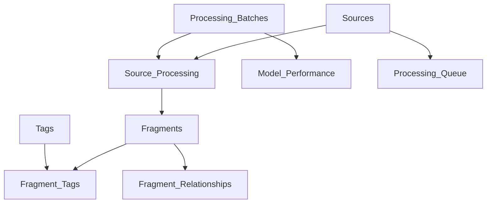

# MMOS v5.0 Database Usage Guide
**Fragment Management & Model Optimization System**

Version: 5.0  
Last Updated: 2025-01-26  
Database: PostgreSQL/MySQL

---

## 1. System Overview

The MMOS database enables:
- **Complete traceability** of every fragment back to its source and processing batch
- **Model comparison** to find the optimal cost/quality balance
- **Processing queue management** for scalable extraction
- **Quality metrics** at every level (source, batch, fragment)

### Core Tables Structure



---

## 2. Key Features for Model Optimization

### A. Multi-Model Processing

Process the same source with different models to compare:

```sql
-- Queue same source for multiple models
INSERT INTO processing_queue (source_id, priority, processing_type)
VALUES 
    (1, 10, 'extraction_gpt4'),
    (1, 10, 'extraction_claude3'),
    (1, 10, 'extraction_gemini');

-- Compare results after processing
SELECT 
    pb.model_name,
    pb.model_provider,
    COUNT(f.id) as fragments_extracted,
    AVG(f.relevance) as avg_relevance,
    AVG(f.confidence) as avg_confidence,
    pb.estimated_cost_usd,
    pb.processing_duration_minutes,
    (pb.estimated_cost_usd / COUNT(f.id)) as cost_per_fragment
FROM processing_batches pb
JOIN fragments f ON f.batch_id = pb.id
WHERE f.source_id = 1
GROUP BY pb.id
ORDER BY avg_relevance DESC, cost_per_fragment ASC;
```

### B. Find the Sweet Spot

Identify the cheapest model that maintains quality:

```sql
-- Find optimal model by quality/cost ratio
WITH model_stats AS (
    SELECT 
        model_provider,
        model_name,
        AVG(extraction_quality_avg) as quality,
        AVG(cost_per_fragment) as cost,
        AVG(time_per_fragment_seconds) as speed
    FROM model_performance
    WHERE extraction_quality_avg > 7.0  -- Minimum quality threshold
    GROUP BY model_provider, model_name
)
SELECT 
    *,
    (quality / cost) as quality_per_dollar,
    RANK() OVER (ORDER BY quality / cost DESC) as efficiency_rank
FROM model_stats
ORDER BY efficiency_rank;
```

---

## 3. Typical Workflows

### Workflow 1: Initial Source Processing

```sql
-- 1. Add new source
INSERT INTO sources (
    source_code, 
    title, 
    source_type, 
    quality, 
    extraction_priority,
    url,
    source_date
) VALUES (
    'SRC_PODCAST_001',
    'Tim Ferriss Show - Episode on AI',
    'podcast',
    'primary',
    'VERY_HIGH',
    'https://example.com/podcast',
    '2025-01-15'
);

-- 2. Create processing batch
INSERT INTO processing_batches (
    batch_code,
    model_provider,
    model_name,
    temperature,
    processor_name
) VALUES (
    'BATCH_2025_01_26_001',
    'anthropic',
    'claude-3-opus',
    0.7,
    'alan@example.com'
) RETURNING id;  -- Get batch_id

-- 3. Link source to batch
INSERT INTO source_processing (
    source_id,
    batch_id,
    processing_status
) VALUES (
    1,  -- source_id
    1,  -- batch_id from above
    'processing'
);

-- 4. Insert extracted fragments
INSERT INTO fragments (
    fragment_code,
    source_id,
    batch_id,
    category,
    fragment_type,
    content,
    location_in_source,
    context,
    insight,
    relevance,
    confidence
) VALUES (
    (SELECT get_next_fragment_code('Cognitive')),
    1,
    1,
    'Cognitive Philosophy',
    'direct_quote',
    'I always start with first principles thinking...',
    'Minute 15:30',
    'Discussing problem-solving approach',
    'Uses first principles as primary framework',
    9,
    0.95
);
```

### Workflow 2: Reprocess with Cheaper Model

```sql
-- Find sources worth reprocessing
WITH expensive_extractions AS (
    SELECT 
        s.id,
        s.source_code,
        pb.model_name as original_model,
        pb.estimated_cost_usd as original_cost,
        COUNT(f.id) as fragment_count,
        AVG(f.relevance) as avg_relevance
    FROM sources s
    JOIN source_processing sp ON s.id = sp.source_id
    JOIN processing_batches pb ON sp.batch_id = pb.id
    JOIN fragments f ON f.source_id = s.id
    WHERE pb.estimated_cost_usd > 1.00  -- Expensive processing
    GROUP BY s.id, pb.id
)
SELECT * FROM expensive_extractions
WHERE avg_relevance < 8  -- Not critical content
ORDER BY original_cost DESC;

-- Queue for reprocessing with cheaper model
INSERT INTO processing_queue (source_id, priority, processing_type)
SELECT 
    id, 
    5, 
    'extraction_gpt3.5'
FROM expensive_extractions
WHERE avg_relevance < 8;
```

### Workflow 3: Quality Validation

```sql
-- Compare fragment quality across batches
WITH fragment_comparison AS (
    SELECT 
        f1.content,
        f1.batch_id as batch1,
        f2.batch_id as batch2,
        f1.relevance as relevance1,
        f2.relevance as relevance2,
        f1.confidence as confidence1,
        f2.confidence as confidence2,
        ABS(f1.relevance - f2.relevance) as relevance_diff
    FROM fragments f1
    JOIN fragments f2 ON f1.source_id = f2.source_id 
        AND f1.content = f2.content
        AND f1.batch_id < f2.batch_id
)
SELECT 
    pb1.model_name as model1,
    pb2.model_name as model2,
    AVG(fc.relevance_diff) as avg_relevance_difference,
    COUNT(*) as matching_fragments
FROM fragment_comparison fc
JOIN processing_batches pb1 ON fc.batch1 = pb1.id
JOIN processing_batches pb2 ON fc.batch2 = pb2.id
GROUP BY pb1.model_name, pb2.model_name;
```

---

## 4. Model Performance Tracking

### A. Record Performance After Each Batch

```sql
-- After processing completes, record performance
INSERT INTO model_performance (
    model_provider,
    model_name,
    source_id,
    batch_id,
    fragments_extracted,
    extraction_quality_avg,
    relevance_score_avg,
    cost_per_fragment,
    tokens_per_fragment,
    time_per_fragment_seconds,
    baseline_model,
    quality_delta,
    cost_delta
)
SELECT 
    pb.model_provider,
    pb.model_name,
    sp.source_id,
    pb.id,
    COUNT(f.id),
    AVG(f.confidence * 10),  -- Convert to 0-10 scale
    AVG(f.relevance),
    pb.estimated_cost_usd / NULLIF(COUNT(f.id), 0),
    pb.total_output_tokens / NULLIF(COUNT(f.id), 0),
    (EXTRACT(EPOCH FROM (pb.completed_at - pb.started_at)) / NULLIF(COUNT(f.id), 0)),
    'gpt-4',  -- baseline model
    ((AVG(f.confidence * 10) - 8.5) / 8.5) * 100,  -- % difference from baseline
    ((pb.estimated_cost_usd / COUNT(f.id) - 0.05) / 0.05) * 100  -- % difference from baseline cost
FROM processing_batches pb
JOIN source_processing sp ON sp.batch_id = pb.id
LEFT JOIN fragments f ON f.batch_id = pb.id AND f.source_id = sp.source_id
WHERE pb.batch_status = 'completed'
GROUP BY pb.id, sp.source_id;
```

### B. Model Optimization Dashboard Query

```sql
-- Comprehensive model comparison dashboard
SELECT 
    model_provider,
    model_name,
    COUNT(DISTINCT source_id) as sources_processed,
    SUM(fragments_extracted) as total_fragments,
    ROUND(AVG(extraction_quality_avg), 2) as avg_quality,
    ROUND(AVG(relevance_score_avg), 2) as avg_relevance,
    ROUND(AVG(cost_per_fragment), 4) as avg_cost_per_frag,
    ROUND(AVG(time_per_fragment_seconds), 2) as avg_time_per_frag,
    ROUND(AVG(tokens_per_fragment), 0) as avg_tokens_per_frag,
    ROUND(AVG(quality_delta), 2) as quality_vs_baseline,
    ROUND(AVG(cost_delta), 2) as cost_vs_baseline,
    COUNT(*) as evaluation_count
FROM model_performance
WHERE evaluation_date > CURRENT_DATE - INTERVAL '30 days'
GROUP BY model_provider, model_name
ORDER BY 
    avg_quality DESC,
    avg_cost_per_frag ASC;
```

---

## 5. Processing Queue Management

### A. Smart Queue Prioritization

```sql
-- View current queue status
CREATE OR REPLACE VIEW v_queue_status AS
SELECT 
    pq.priority,
    s.source_code,
    s.title,
    s.source_type,
    s.quality,
    pq.queue_status,
    pq.attempts,
    pq.scheduled_for,
    pq.assigned_to,
    CASE 
        WHEN s.quality = 'primary' THEN pq.priority * 2
        WHEN s.quality = 'secondary' THEN pq.priority * 1.5
        ELSE pq.priority
    END as effective_priority
FROM processing_queue pq
JOIN sources s ON pq.source_id = s.id
WHERE pq.queue_status = 'waiting'
ORDER BY effective_priority DESC, pq.created_at ASC;
```

### B. Auto-Retry Failed Processing

```sql
-- Automatic retry for failed items
UPDATE processing_queue
SET 
    queue_status = 'waiting',
    attempts = attempts + 1,
    scheduled_for = CURRENT_TIMESTAMP + INTERVAL '1 hour'
WHERE 
    queue_status = 'failed'
    AND attempts < max_attempts
    AND updated_at < CURRENT_TIMESTAMP - INTERVAL '1 hour';
```

---

## 6. Quality Assurance Queries

### A. Find Contradicting Fragments

```sql
-- Identify potential contradictions
SELECT 
    f1.content as fragment1,
    f2.content as fragment2,
    f1.source_id,
    f1.relevance as relevance1,
    f2.relevance as relevance2
FROM fragments f1
JOIN fragment_relationships fr ON f1.id = fr.fragment_id
JOIN fragments f2 ON fr.related_fragment_id = f2.id
WHERE fr.relationship_type = 'contradicts'
ORDER BY f1.relevance DESC, f2.relevance DESC;
```

### B. Coverage Analysis

```sql
-- Check category coverage
SELECT 
    category,
    COUNT(*) as fragment_count,
    COUNT(DISTINCT source_id) as source_diversity,
    AVG(relevance) as avg_relevance,
    SUM(CASE WHEN verified THEN 1 ELSE 0 END) as verified_count,
    ROUND(SUM(CASE WHEN verified THEN 1 ELSE 0 END)::NUMERIC / COUNT(*) * 100, 2) as verification_rate
FROM fragments
GROUP BY category
ORDER BY fragment_count DESC;

-- Identify gaps
WITH expected_categories AS (
    SELECT unnest(ARRAY[
        'Biographical', 'Cognitive', 'Communicative', 
        'Behavioral', 'Values and Beliefs', 'Social', 
        'Emotional', 'Meta-cognitive'
    ]) as category
)
SELECT 
    ec.category,
    COALESCE(fc.fragment_count, 0) as fragments,
    CASE 
        WHEN COALESCE(fc.fragment_count, 0) < 10 THEN 'CRITICAL GAP'
        WHEN COALESCE(fc.fragment_count, 0) < 25 THEN 'Needs attention'
        ELSE 'Adequate'
    END as status
FROM expected_categories ec
LEFT JOIN (
    SELECT category, COUNT(*) as fragment_count
    FROM fragments
    GROUP BY category
) fc ON ec.category = fc.category
ORDER BY fragments;
```

---

## 7. Cost Optimization Strategies

### A. Progressive Model Downgrade

```python
# Python pseudocode for progressive optimization
def optimize_model_selection(source_id):
    models = [
        ('gpt-4', 0.10),      # $/fragment
        ('claude-3', 0.08),   
        ('gpt-3.5', 0.02),    
        ('mixtral', 0.01)     
    ]
    
    for model, cost in models:
        # Process sample
        quality = process_sample(source_id, model)
        
        if quality >= 7.0:  # Minimum threshold
            return model
    
    return models[0][0]  # Default to best if none meet threshold
```

### B. Batch Processing Optimization

```sql
-- Optimal batch sizes by model
SELECT 
    model_name,
    AVG(total_sources) as avg_batch_size,
    AVG(processing_duration_minutes) as avg_duration,
    AVG(total_sources::NUMERIC / processing_duration_minutes) as sources_per_minute,
    AVG(estimated_cost_usd) as avg_batch_cost
FROM processing_batches
WHERE batch_status = 'completed'
GROUP BY model_name
ORDER BY sources_per_minute DESC;
```

---

## 8. Migration Path

For existing MMOS implementations:

```sql
-- Import existing fragments
INSERT INTO fragments (
    fragment_code, source_id, batch_id, category, 
    fragment_type, content, location_in_source, 
    context, insight, relevance, confidence
)
SELECT 
    id, 1, 1, category, type, content, 
    location, context, insight, relevance, 
    metadata->>'confidence'
FROM legacy_fragments;

-- Backfill processing data
INSERT INTO processing_batches (
    batch_code, model_provider, model_name, 
    batch_status, completed_at
)
VALUES (
    'LEGACY_IMPORT_001', 'unknown', 'legacy', 
    'completed', CURRENT_TIMESTAMP
);
```

---

## 9. Performance Tuning

### Essential Indexes Already Included:
- Full-text search on fragments
- Composite indexes for common joins
- Partial indexes for queue management
- GIN index for JSONB fields

### Recommended Maintenance:
```sql
-- Weekly maintenance
VACUUM ANALYZE fragments;
VACUUM ANALYZE source_processing;
REINDEX INDEX idx_fragment_search;

-- Monthly statistics update
ANALYZE;
```

---

## 10. Integration Points

### API Endpoints Needed:
- `POST /sources` - Add new source
- `POST /batches` - Start processing batch
- `GET /models/compare` - Compare model performance
- `POST /fragments/verify` - Mark fragments as verified
- `GET /queue/next` - Get next item from queue
- `GET /reports/coverage` - Coverage analysis
- `GET /reports/optimization` - Model optimization report

### Webhook Events:
- `batch.completed` - Processing batch finished
- `source.processed` - Source extraction complete
- `model.optimized` - Better model found for source type
- `queue.empty` - Processing queue empty

---

This database structure enables you to:
1. **Track everything** - Complete audit trail
2. **Compare models** - Find the best cost/quality ratio
3. **Scale processing** - Queue-based architecture
4. **Ensure quality** - Verification and validation built-in
5. **Optimize continuously** - Performance metrics at every level

The sweet spot discovery happens automatically through the model_performance tracking and comparison views.
