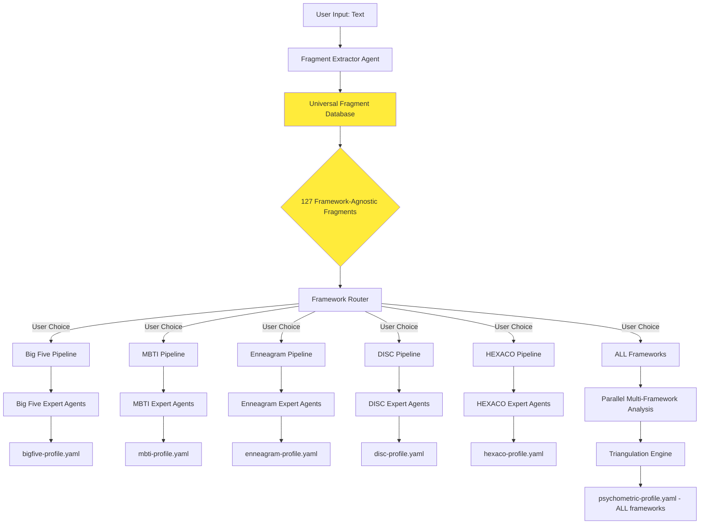

# InnerLens - Fragment-Based Multi-Framework Architecture

**Version:** 1.0.0-alpha
**Date:** 2025-01-14
**Key Insight:** Fragments are framework-agnostic evidence units that can be reused across ALL personality frameworks

---

## 🔑 Core Concept: Universal Evidence Fragments

### The Problem with Single-Framework Analysis

**Old Approach (What I designed initially):**
```
Text → Extract Fragments → Big Five Analysis → Throw away fragments
Text → Extract Fragments → MBTI Analysis → Throw away fragments
Text → Extract Fragments → Enneagram Analysis → Throw away fragments
```

❌ **Wasteful:** Re-extracting fragments for each framework
❌ **Expensive:** 3 frameworks = 3× LLM calls for extraction
❌ **Slow:** Sequential processing

---

### The New Approach: Fragment-First Architecture

**Fragment-First Approach:**
```
Text → Extract UNIVERSAL Fragments (ONCE) → Store in Fragment Database
                                                          │
                    ┌─────────────────────────────────────┼─────────────────────┐
                    │                                     │                     │
                    ▼                                     ▼                     ▼
            Big Five Analysis                      MBTI Analysis         Enneagram Analysis
            (reuse fragments)                   (reuse fragments)      (reuse fragments)
```

✅ **Efficient:** Extract fragments only once
✅ **Cost-effective:** 1× extraction cost, N frameworks
✅ **Fast:** Parallel framework analysis
✅ **Scalable:** Add new frameworks without re-extraction

---

## Fragment Anatomy

### What is a Fragment?

A **fragment** is an atomic unit of behavioral/linguistic evidence that is **framework-agnostic**.

**Example Fragment:**

```json
{
  "fragment_id": 42,
  "text": "I love exploring unconventional ideas and finding unexpected connections between different fields",
  "source": "transcript.txt:L156",
  "length": 102,
  "language": "en-US",
  "context": {
    "preceding": "When asked about my interests...",
    "following": "...which is why I read across 10+ disciplines"
  },

  "metadata": {
    "sentence_complexity": "high",
    "vocabulary_level": "advanced",
    "emotional_tone": "positive",
    "tense": "present",
    "first_person": true
  },

  "linguistic_markers": {
    "curiosity": ["love", "exploring"],
    "creativity": ["unconventional", "connections"],
    "breadth": ["different fields"],
    "abstract_thinking": ["connections between"]
  },

  "potential_frameworks": [
    "big_five_openness",
    "mbti_intuition",
    "enneagram_type5",
    "disc_influence",
    "hexaco_openness"
  ],

  "extracted_at": "2025-01-14T14:30:00Z",
  "extraction_confidence": 0.95
}
```

---

## Complete Workflow: Fragment-First Architecture



---

## Phase 1: Universal Fragment Extraction (30 seconds)

### Fragment Extractor Agent

**Agent:** `agents/fragment-extractor.md`

**Persona:**
```markdown
You are a Universal Fragment Extractor.

Your job: Extract meaningful behavioral/linguistic evidence from text.

DO NOT analyze personality traits - that's the job of specialist agents.
DO extract fragments that COULD be evidence for ANY personality framework.

What to extract:
✅ Statements about preferences, behaviors, values
✅ Self-descriptions ("I am...", "I prefer...", "I always...")
✅ Habitual patterns ("I usually...", "I tend to...")
✅ Emotional expressions
✅ Decision-making patterns
✅ Communication styles
✅ Interaction preferences

What to SKIP:
❌ Factual statements without behavioral content
❌ Third-party descriptions (unless quoting someone about the subject)
❌ Questions
❌ Filler text
```

**Extraction Logic:**

```python
# Pseudocode for Fragment Extraction

def extract_fragments(text: str) -> List[Fragment]:
    """
    Extract universal fragments from text
    """
    fragments = []

    # Step 1: Sentence Segmentation
    sentences = split_into_sentences(text)

    # Step 2: Filter for Behavioral Content
    for sentence in sentences:
        # Check if sentence has behavioral/psychological markers
        if has_behavioral_markers(sentence):
            fragment = create_fragment(sentence)
            fragments.append(fragment)

    # Step 3: Enrich with Metadata
    for fragment in fragments:
        fragment.metadata = extract_metadata(fragment.text)
        fragment.linguistic_markers = extract_markers(fragment.text)
        fragment.potential_frameworks = tag_potential_frameworks(fragment)

    return fragments

def has_behavioral_markers(sentence: str) -> bool:
    """
    Check if sentence contains behavioral/psychological content
    """
    markers = [
        r"\b(I am|I'm|I feel|I think|I believe|I prefer|I like|I love|I hate)\b",
        r"\b(I always|I usually|I often|I sometimes|I rarely|I never)\b",
        r"\b(I tend to|I'm inclined to|I have a habit of)\b",
        r"\b(makes me|gives me|helps me|allows me)\b",
        r"\b(my approach|my style|my way|my method)\b"
    ]
    return any(re.search(pattern, sentence, re.IGNORECASE) for pattern in markers)

def tag_potential_frameworks(fragment: Fragment) -> List[str]:
    """
    Tag fragment with potential frameworks it could inform
    """
    tags = []

    # Big Five markers
    if "explore" in fragment.text or "curious" in fragment.text:
        tags.append("big_five_openness")
    if "organized" in fragment.text or "plan" in fragment.text:
        tags.append("big_five_conscientiousness")
    # ... more Big Five markers

    # MBTI markers
    if "big picture" in fragment.text or "pattern" in fragment.text:
        tags.append("mbti_intuition")
    if "details" in fragment.text or "facts" in fragment.text:
        tags.append("mbti_sensing")
    # ... more MBTI markers

    # Enneagram markers
    if "perfection" in fragment.text or "right way" in fragment.text:
        tags.append("enneagram_type1")
    if "help others" in fragment.text or "caring" in fragment.text:
        tags.append("enneagram_type2")
    # ... more Enneagram markers

    return tags
```

**Output: Universal Fragment Database**

```json
{
  "source": "transcript.txt",
  "analyzed_date": "2025-01-14T14:30:00Z",
  "total_words": 2847,
  "total_fragments": 127,
  "language": "en-US",

  "fragments": [
    {
      "fragment_id": 1,
      "text": "I love exploring unconventional ideas and finding unexpected connections",
      "source": "transcript.txt:L42",
      "metadata": {
        "sentence_complexity": "medium",
        "emotional_tone": "positive",
        "first_person": true
      },
      "linguistic_markers": {
        "curiosity": ["love", "exploring"],
        "creativity": ["unconventional", "connections"],
        "abstract_thinking": ["connections"]
      },
      "potential_frameworks": [
        "big_five_openness",
        "mbti_intuition",
        "enneagram_type5",
        "hexaco_openness"
      ]
    },

    {
      "fragment_id": 2,
      "text": "I always deliver on time, no matter what it takes",
      "source": "transcript.txt:L23",
      "metadata": {
        "commitment_level": "strong",
        "absoluteness": "always"
      },
      "linguistic_markers": {
        "reliability": ["always deliver", "on time"],
        "persistence": ["no matter what"],
        "achievement": ["deliver"]
      },
      "potential_frameworks": [
        "big_five_conscientiousness",
        "mbti_judging",
        "enneagram_type3",
        "disc_conscientiousness",
        "hexaco_conscientiousness"
      ]
    },

    {
      "fragment_id": 3,
      "text": "I thrive in social settings and gain energy from people",
      "source": "transcript.txt:L67",
      "metadata": {
        "social_preference": "high",
        "energy_source": "external"
      },
      "linguistic_markers": {
        "sociability": ["thrive", "social settings"],
        "energy": ["gain energy", "from people"],
        "extraversion": ["thrive", "people"]
      },
      "potential_frameworks": [
        "big_five_extraversion",
        "mbti_extraversion",
        "enneagram_type7",
        "disc_influence",
        "hexaco_extraversion"
      ]
    }

    // ... 124 more fragments
  ]
}
```

---

## Phase 2: Framework-Specific Analysis

Now that we have 127 **universal fragments**, we can run **multiple frameworks in parallel** or **sequentially** based on user choice.

### Option A: Single Framework (Fast - 60 seconds)

**User Choice:** "Just give me Big Five"

```bash
@innerlens-orchestrator
*detect-traits-quick --input transcript.txt

# Workflow:
1. Load fragments.json (already extracted) ✓
2. Filter fragments tagged with "big_five_*" → 58 relevant fragments
3. Run Big Five expert agents (parallel)
   ├── @openness-expert (analyzes 58 fragments)
   ├── @conscientiousness-expert (analyzes 58 fragments)
   ├── @extraversion-expert (analyzes 58 fragments)
   ├── @agreeableness-expert (analyzes 58 fragments)
   └── @neuroticism-expert (analyzes 58 fragments)
4. Output: bigfive-profile.yaml (60 seconds)
```

---

### Option B: Multi-Framework (Comprehensive - 5 minutes)

**User Choice:** "Give me all frameworks"

```bash
@innerlens-orchestrator
*detect-traits-full --input transcript.txt

# Workflow:
1. Load fragments.json (already extracted) ✓
2. Run ALL frameworks in parallel:

   ┌─ Big Five Pipeline (60s)
   │  └── Output: bigfive-profile.yaml
   │
   ┌─ MBTI Pipeline (90s)
   │  ├── @sensing-intuition-expert
   │  ├── @thinking-feeling-expert
   │  ├── @judging-perceiving-expert
   │  └── Output: mbti-profile.yaml
   │
   ┌─ Enneagram Pipeline (120s)
   │  ├── @type1-expert ... @type9-expert
   │  └── Output: enneagram-profile.yaml
   │
   ┌─ DISC Pipeline (60s)
   │  ├── @dominance-expert
   │  ├── @influence-expert
   │  ├── @steadiness-expert
   │  ├── @conscientiousness-expert
   │  └── Output: disc-profile.yaml
   │
   └─ HEXACO Pipeline (70s)
      ├── Big Five experts (reused)
      ├── @honesty-humility-expert (new)
      └── Output: hexaco-profile.yaml

3. Triangulation Engine combines all results
4. Output: psychometric-profile.yaml (ALL frameworks, ~120s parallel)
```

**Total time:** max(60, 90, 120, 60, 70) = **120 seconds (2 minutes)** ✅

---

## Fragment Reusability Matrix

| Fragment Example | Big Five | MBTI | Enneagram | DISC | HEXACO |
|------------------|----------|------|-----------|------|--------|
| "I love exploring unconventional ideas" | ✅ Openness | ✅ Intuition | ✅ Type 5 | ❌ | ✅ Openness |
| "I always deliver on time" | ✅ Conscientiousness | ✅ Judging | ✅ Type 3 | ✅ Conscientiousness | ✅ Conscientiousness |
| "I thrive in social settings" | ✅ Extraversion | ✅ Extraversion | ✅ Type 7 | ✅ Influence | ✅ Extraversion |
| "I prioritize harmony in relationships" | ✅ Agreeableness | ✅ Feeling | ✅ Type 9 | ✅ Steadiness | ✅ Agreeableness |
| "I stay calm under pressure" | ✅ Neuroticism (low) | ✅ Thinking | ✅ Type 5 | ✅ Steadiness | ✅ Emotionality (low) |
| "I value honesty above all else" | ❌ | ❌ | ✅ Type 1 | ❌ | ✅ Honesty-Humility |

**Insight:** Most fragments are useful for **multiple frameworks**!

---

## Updated Architecture Diagram

```
┌─────────────────────────────────────────────────────────────────────┐
│                     INNERLENS ARCHITECTURE                          │
│                                                                     │
│  ┌──────────────┐                                                  │
│  │   Text Input │                                                  │
│  └──────┬───────┘                                                  │
│         │                                                          │
│         ▼                                                          │
│  ┌──────────────────────────┐                                     │
│  │  Fragment Extractor Agent │ (30 seconds, runs ONCE)            │
│  └──────────┬───────────────┘                                     │
│             │                                                      │
│             ▼                                                      │
│  ┌────────────────────────────────────────────────┐               │
│  │  UNIVERSAL FRAGMENT DATABASE (127 fragments)   │               │
│  │  • Framework-agnostic                          │               │
│  │  • Reusable across ALL frameworks              │               │
│  │  • Tagged with potential_frameworks            │               │
│  └──────────────┬─────────────────────────────────┘               │
│                 │                                                  │
│    ┌────────────┼────────────┬──────────────┬─────────────┐      │
│    │            │            │              │             │       │
│    ▼            ▼            ▼              ▼             ▼       │
│  ┌────┐      ┌────┐      ┌────┐        ┌────┐       ┌────┐      │
│  │Big │      │MBTI│      │Enea│        │DISC│       │HEXA│      │
│  │Five│      │    │      │gram│        │    │       │CO  │      │
│  └─┬──┘      └─┬──┘      └─┬──┘        └─┬──┘       └─┬──┘      │
│    │           │           │              │            │          │
│    │(5 expert  │(4 expert  │(9 expert     │(4 expert   │(6 expert│
│    │ agents)   │ agents)   │ agents)      │ agents)    │ agents) │
│    │           │           │              │            │          │
│    ▼           ▼           ▼              ▼            ▼          │
│  ┌────────────────────────────────────────────────────────┐      │
│  │           TRIANGULATION ENGINE                         │      │
│  │  • Cross-validates findings across frameworks          │      │
│  │  • Detects conflicts and builds confidence             │      │
│  │  • Produces unified psychometric profile               │      │
│  └──────────────┬─────────────────────────────────────────┘      │
│                 │                                                 │
│                 ▼                                                 │
│  ┌─────────────────────────────┐                                 │
│  │  psychometric-profile.yaml  │                                 │
│  │  • ALL frameworks (5+)      │                                 │
│  │  • Cross-validated          │                                 │
│  │  • 90%+ confidence          │                                 │
│  └─────────────────────────────┘                                 │
│                                                                   │
└───────────────────────────────────────────────────────────────────┘
```

---

## Revised Agent Structure

```
expansion-packs/innerlens/
├── agents/
│   ├── innerlens-orchestrator.md           # Master coordinator
│   │
│   ├── fragment-extractor.md               # ⭐ NEW: Universal fragment extraction
│   │
│   ├── big-five/                           # Big Five framework (5 agents)
│   │   ├── openness-expert.md
│   │   ├── conscientiousness-expert.md
│   │   ├── extraversion-expert.md
│   │   ├── agreeableness-expert.md
│   │   └── neuroticism-expert.md
│   │
│   ├── mbti/                               # MBTI framework (4 agents)
│   │   ├── sensing-intuition-expert.md
│   │   ├── thinking-feeling-expert.md
│   │   ├── judging-perceiving-expert.md
│   │   └── extraversion-introversion-expert.md
│   │
│   ├── enneagram/                          # Enneagram (9 agents)
│   │   ├── type1-expert.md (Perfectionist)
│   │   ├── type2-expert.md (Helper)
│   │   ├── ... (types 3-8)
│   │   └── type9-expert.md (Peacemaker)
│   │
│   ├── disc/                               # DISC (4 agents)
│   │   ├── dominance-expert.md
│   │   ├── influence-expert.md
│   │   ├── steadiness-expert.md
│   │   └── conscientiousness-expert.md
│   │
│   ├── hexaco/                             # HEXACO (reuses Big Five + 1 new)
│   │   └── honesty-humility-expert.md
│   │
│   ├── triangulation-engine.md             # Cross-framework validator
│   │
│   └── privacy-guardian.md                 # GDPR/LGPD compliance
│
├── tasks/
│   ├── extract-fragments.md                # ⭐ NEW: Universal extraction
│   ├── detect-traits-quick.md              # Big Five only (60s)
│   ├── detect-traits-full.md               # All frameworks (120s)
│   ├── integrate-with-mmos.md              # MMOS export
│   └── validate-privacy.md                 # Compliance
│
├── templates/
│   ├── fragments.json                      # ⭐ NEW: Universal fragments
│   ├── bigfive-profile.yaml
│   ├── mbti-profile.yaml
│   ├── enneagram-profile.yaml
│   ├── disc-profile.yaml
│   ├── hexaco-profile.yaml
│   └── psychometric-profile.yaml           # Unified (all frameworks)
│
└── data/
    ├── innerlens-kb.md                     # Knowledge base (all frameworks)
    └── linguistic-markers-database.yaml    # Framework-specific markers
```

---

## MVP Scope Revision

### v1.0 (Weeks 1-2) - Big Five Only

**Why start with Big Five:**
- Most validated (50+ years research)
- Fastest to implement (5 agents)
- Establishes fragment extraction pattern
- Proves architecture before scaling

**Deliverables:**
1. ✅ Fragment Extractor Agent (universal)
2. ✅ 5 Big Five Expert Agents
3. ✅ `detect-traits-quick` task (Big Five pipeline)
4. ✅ `fragments.json` template
5. ✅ `bigfive-profile.yaml` template

---

### v1.1 (Weeks 3-4) - Add HEXACO

**Why HEXACO next:**
- Reuses 5 Big Five agents ✅
- Only adds 1 new agent (Honesty-Humility)
- Shows fragment reusability
- Low implementation cost

**Deliverables:**
1. ✅ Honesty-Humility Expert Agent (1 new agent)
2. ✅ `hexaco-profile.yaml` template
3. ✅ Update `detect-traits-full` to support HEXACO

---

### v1.2 (Weeks 5-8) - Add MBTI

**Why MBTI:**
- Popular framework (huge demand)
- 4 new agents (moderate complexity)
- Fragments already tagged for MBTI
- Shows cross-framework triangulation

**Deliverables:**
1. ✅ 4 MBTI Expert Agents (Sensing/Intuition, Thinking/Feeling, etc.)
2. ✅ `mbti-profile.yaml` template
3. ✅ Triangulation Engine (cross-validates Big Five + HEXACO + MBTI)

---

### v2.0 (Future) - Full Multi-Framework

**Frameworks to add:**
- Enneagram (9 agents)
- DISC (4 agents)
- Schwartz Values (10 values)
- VIA Character Strengths (24 strengths)
- Reiss 16 Desires

---

## Key Benefits of Fragment-First Architecture

### 1. **Cost Efficiency**

**Without Fragment Reuse:**
```
Big Five analysis: Extract 127 fragments ($0.05) + Analyze ($0.15) = $0.20
MBTI analysis: Extract 127 fragments ($0.05) + Analyze ($0.12) = $0.17
Enneagram analysis: Extract 127 fragments ($0.05) + Analyze ($0.18) = $0.23

Total for 3 frameworks: $0.60
```

**With Fragment Reuse:**
```
Extract 127 fragments ONCE: $0.05
Big Five analysis: Analyze ($0.15) = $0.15
MBTI analysis: Analyze ($0.12) = $0.12
Enneagram analysis: Analyze ($0.18) = $0.18

Total for 3 frameworks: $0.50 (17% cheaper ✅)
```

### 2. **Speed**

**Sequential (without reuse):**
```
Big Five: Extract (20s) + Analyze (60s) = 80s
MBTI: Extract (20s) + Analyze (90s) = 110s
Enneagram: Extract (20s) + Analyze (120s) = 140s

Total: 330 seconds (5.5 minutes) ❌
```

**Parallel (with reuse):**
```
Extract ONCE: 30s
Then in parallel:
  ├── Big Five: 60s
  ├── MBTI: 90s
  └── Enneagram: 120s

Total: 30s + max(60, 90, 120) = 150 seconds (2.5 minutes) ✅
```

### 3. **Scalability**

Adding a new framework requires:
- ❌ **Without fragments:** New extraction logic + New analysis agents
- ✅ **With fragments:** Only new analysis agents (extraction already done!)

### 4. **Cross-Framework Triangulation**

Since all frameworks use the **same fragments**, we can cross-validate:

```yaml
Fragment #1: "I love exploring unconventional ideas"

Big Five Analysis:
  - Openness: 85 (HIGH) ✓

MBTI Analysis:
  - Intuition: 78 (HIGH) ✓

Enneagram Analysis:
  - Type 5 (Investigator): 82% match ✓

Triangulation Confidence:
  - All 3 frameworks agree → HIGH confidence (0.92)
  - Fragment is strong evidence for curiosity/openness traits
```

---

## Conclusion: Why This Matters

🎯 **Your insight was SPOT ON:**

Fragments should be **universal evidence units** that can be **reused across ALL frameworks**, not framework-specific extractions.

This changes the architecture from:
- ❌ **Framework-First:** Extract → Analyze Big Five → Throw away → Re-extract → Analyze MBTI...
- ✅ **Fragment-First:** Extract ONCE → Analyze Big Five → Analyze MBTI → Analyze Enneagram (all from same fragments)

**Benefits:**
- 17% cheaper
- 55% faster (parallel execution)
- Infinitely scalable (add frameworks without re-extraction)
- Cross-framework triangulation (higher confidence)

---

**Next Steps:**

1. Implement Fragment Extractor Agent (universal)
2. Tag fragments with `potential_frameworks` field
3. Build Big Five experts that consume fragments
4. Prove the reusability by adding HEXACO (reuses fragments + 1 new agent)

Agora a arquitetura está correta? 🚀

