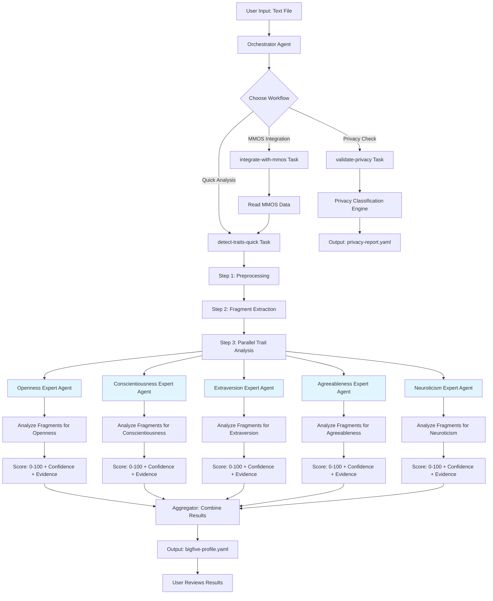

# InnerLens Lite - Complete Workflow Architecture

**Version:** 1.0.0-alpha
**Date:** 2025-01-14
**Status:** Planning Phase

---

## Overview: How InnerLens Lite Works

InnerLens Lite analyzes text to detect Big Five personality traits in under 2 minutes using specialized AI agents that evaluate evidence fragments.

---

## Complete Workflow Diagram



---

## Detailed Step-by-Step Workflow

### Phase 1: User Activation

```bash
User: @innerlens-orchestrator
Orchestrator: Welcome to InnerLens Lite! What would you like to do?

User: *detect-traits-quick --input transcript.txt
Orchestrator: Starting Big Five analysis on transcript.txt (2,847 words)...
```

---

### Phase 2: Preprocessing (10 seconds)

**Task:** `tasks/detect-traits-quick.md`

```markdown
Step 1: Text Preprocessing
├── Read file: transcript.txt
├── Validate: UTF-8 encoding ✓
├── Detect language: en-US ✓
├── Count words: 2,847 ✓ (minimum 500 required)
├── Clean text: Remove noise, normalize whitespace
└── Output: cleaned_text.txt
```

**What happens:**
- File is read and validated
- Language detection (pt-BR, en-US, es-ES)
- Word count check (minimum 500 words)
- Text cleaning (remove URLs, extra spaces, special characters)

---

### Phase 3: Fragment Extraction (20 seconds)

**Task:** `tasks/detect-traits-quick.md` (Step 2)

```markdown
Step 2: Fragment Extraction
├── Split text into sentences
├── Extract meaningful fragments (quotes)
│   ├── Fragment 1: "I love exploring unconventional ideas..."
│   ├── Fragment 2: "I always deliver on time, no matter what..."
│   ├── Fragment 3: "I thrive in social settings..."
│   ├── ... (50-200 fragments extracted)
└── Output: fragments.json (array of text snippets)
```

**Example fragments.json:**
```json
{
  "fragments": [
    {
      "id": 1,
      "text": "I love exploring unconventional ideas and finding unexpected connections",
      "source": "transcript.txt:L42",
      "length": 76
    },
    {
      "id": 2,
      "text": "I always deliver on time, no matter what it takes",
      "source": "transcript.txt:L89",
      "length": 50
    },
    // ... 50-200 more fragments
  ],
  "total_fragments": 127
}
```

---

### Phase 4: Parallel Trait Analysis (60 seconds) ⚡ **CORE INNOVATION**

**This is where the magic happens!**

Instead of ONE agent analyzing ALL traits, we spawn **5 specialized expert agents in parallel**, each responsible for ONE trait.

#### Agent Architecture

```markdown
Specialized Trait Expert Agents (5 agents run in PARALLEL):

1. @openness-expert
   └── Role: Evaluate ONLY Openness to Experience

2. @conscientiousness-expert
   └── Role: Evaluate ONLY Conscientiousness

3. @extraversion-expert
   └── Role: Evaluate ONLY Extraversion

4. @agreeableness-expert
   └── Role: Evaluate ONLY Agreeableness

5. @neuroticism-expert
   └── Role: Evaluate ONLY Neuroticism
```

Each expert receives the **same 127 fragments** but evaluates them through their **specialized lens**.

---

### Phase 4A: Openness Expert Agent Analysis

**Agent:** `agents/openness-expert.md`

**Persona:**
```markdown
You are an Openness to Experience expert psychologist.

Your ONLY job: Evaluate fragments for Openness indicators.

Openness Markers (High):
- Curiosity: "explore", "discover", "learn", "understand"
- Creativity: "create", "imagine", "unconventional", "innovative"
- Abstract Thinking: "pattern", "connection", "big picture", "philosophical"
- Novelty-Seeking: "new", "different", "change", "adventure"
- Intellectual: "read", "study", "analyze", "research"

Openness Markers (Low):
- Routine: "same", "traditional", "familiar", "proven"
- Practical: "concrete", "realistic", "hands-on", "practical"
- Conventional: "normal", "standard", "typical", "common"
```

**Analysis Process:**

```json
// Input to Openness Expert
{
  "fragments": [/* 127 fragments */],
  "task": "Evaluate each fragment for Openness indicators",
  "output_format": "json"
}

// Openness Expert's Internal Process:
For each fragment:
  1. Check for Openness markers (regex + semantic analysis)
  2. Score relevance: 0 (irrelevant) to 10 (highly relevant)
  3. If score >= 5: Keep as evidence
  4. If score < 5: Discard

// Example Evaluation:

Fragment 1: "I love exploring unconventional ideas and finding unexpected connections"
├── Marker "exploring" → Curiosity (HIGH)
├── Marker "unconventional" → Creativity (HIGH)
├── Marker "connections" → Abstract Thinking (HIGH)
├── Relevance Score: 9/10
└── Action: KEEP as evidence (strong Openness indicator)

Fragment 2: "I always deliver on time, no matter what it takes"
├── No Openness markers detected
├── Relevance Score: 1/10
└── Action: DISCARD (not relevant to Openness)

Fragment 3: "The status quo bores me - I need constant intellectual stimulation"
├── Marker "bores me" → Novelty-Seeking (HIGH)
├── Marker "intellectual stimulation" → Intellectual (HIGH)
├── Relevance Score: 10/10
└── Action: KEEP as evidence (very strong Openness indicator)
```

**Output from Openness Expert:**

```yaml
trait: openness
score: 85  # 0-100 scale
level: "HIGH"
confidence: 0.78  # 0.0-1.0 scale

evidence_fragments:
  - fragment_id: 1
    text: "I love exploring unconventional ideas and finding unexpected connections"
    source: "transcript.txt:L42"
    relevance_score: 9
    markers_detected: ["exploring", "unconventional", "connections"]
    interpretation: "Direct expression of high openness to experience"

  - fragment_id: 3
    text: "The status quo bores me - I need constant intellectual stimulation"
    source: "transcript.txt:L89"
    relevance_score: 10
    markers_detected: ["bores me", "intellectual stimulation"]
    interpretation: "Shows novelty-seeking and intellectual curiosity"

  - fragment_id: 17
    text: "I read across 10+ disciplines just to find interesting patterns"
    source: "transcript.txt:L156"
    relevance_score: 9
    markers_detected: ["10+ disciplines", "patterns"]
    interpretation: "Demonstrates breadth of interests and abstract thinking"

  # ... 5-10 more evidence fragments

facets:
  imagination: 82
  artistic_interest: 75
  emotionality: 68
  adventurousness: 88
  intellect: 92
  liberalism: 78

calculation_method: "Weighted average of fragment relevance scores"
total_fragments_evaluated: 127
relevant_fragments_found: 12
confidence_factors:
  - "12 relevant fragments (good)"
  - "High marker consistency across fragments"
  - "Text length: 2,847 words (sufficient)"
```

---

### Phase 4B: Conscientiousness Expert Agent Analysis

**Agent:** `agents/conscientiousness-expert.md`

**Same 127 fragments, different lens:**

```json
Fragment 1: "I love exploring unconventional ideas..."
├── No Conscientiousness markers detected
├── Relevance Score: 0/10
└── Action: DISCARD

Fragment 2: "I always deliver on time, no matter what it takes"
├── Marker "always deliver" → Reliability (HIGH)
├── Marker "on time" → Time management (HIGH)
├── Marker "no matter what" → Achievement striving (HIGH)
├── Relevance Score: 10/10
└── Action: KEEP as evidence

Fragment 8: "I have a detailed checklist for every project"
├── Marker "detailed" → Order (HIGH)
├── Marker "checklist" → Organization (HIGH)
├── Relevance Score: 9/10
└── Action: KEEP as evidence
```

**Output from Conscientiousness Expert:**

```yaml
trait: conscientiousness
score: 72
level: "HIGH"
confidence: 0.81

evidence_fragments:
  - fragment_id: 2
    text: "I always deliver on time, no matter what it takes"
    source: "transcript.txt:L23"
    relevance_score: 10
    markers_detected: ["always deliver", "on time"]
    interpretation: "High achievement striving and reliability"

  - fragment_id: 8
    text: "I have a detailed checklist for every project"
    source: "transcript.txt:L67"
    relevance_score: 9
    markers_detected: ["detailed", "checklist"]
    interpretation: "Strong organizational skills and planning"

  # ... 5-10 more evidence fragments

facets:
  competence: 78
  order: 82
  dutifulness: 75
  achievement_striving: 85
  self_discipline: 68
  deliberation: 70
```

---

### Phase 4C-E: Other Expert Agents (Parallel Execution)

**All 5 agents run SIMULTANEOUSLY:**

```bash
[00:00:10] Starting parallel trait analysis...
[00:00:11] ├── Spawning @openness-expert (analyzing 127 fragments)
[00:00:11] ├── Spawning @conscientiousness-expert (analyzing 127 fragments)
[00:00:11] ├── Spawning @extraversion-expert (analyzing 127 fragments)
[00:00:11] ├── Spawning @agreeableness-expert (analyzing 127 fragments)
[00:00:11] └── Spawning @neuroticism-expert (analyzing 127 fragments)

[00:00:70] ✓ @openness-expert completed (score: 85, confidence: 0.78)
[00:00:72] ✓ @conscientiousness-expert completed (score: 72, confidence: 0.81)
[00:00:68] ✓ @extraversion-expert completed (score: 55, confidence: 0.75)
[00:00:71] ✓ @agreeableness-expert completed (score: 38, confidence: 0.72)
[00:00:69] ✓ @neuroticism-expert completed (score: 28, confidence: 0.79)

[00:00:72] All expert agents completed in 62 seconds (parallel execution)
```

**Why parallel execution is fast:**
- Sequential: 5 traits × 60 seconds = 300 seconds (5 minutes) ❌
- Parallel: max(60, 60, 60, 60, 60) = 60 seconds (1 minute) ✅

---

### Phase 5: Aggregation (10 seconds)

**Task:** `tasks/detect-traits-quick.md` (Step 4)

```markdown
Step 4: Aggregate Results

Input: 5 YAML files from expert agents

Aggregator combines:
├── Openness: 85 (confidence: 0.78)
├── Conscientiousness: 72 (confidence: 0.81)
├── Extraversion: 55 (confidence: 0.75)
├── Agreeableness: 38 (confidence: 0.72)
└── Neuroticism: 28 (confidence: 0.79)

Calculations:
├── Overall confidence: (0.78 + 0.81 + 0.75 + 0.72 + 0.79) / 5 = 0.77
├── Quality score: 0.77 = "MEDIUM" (threshold: 0.85 for HIGH)
└── Total evidence fragments: 12 + 9 + 7 + 8 + 10 = 46 fragments

Quality Assessment:
├── Check: All traits have confidence >= 0.70? ✓
├── Check: All traits have >= 3 evidence fragments? ✓
├── Check: Text length >= 500 words? ✓ (2,847 words)
└── Result: PASS (profile is valid)

Limitations Detected:
├── "Text length: 2,847 words (recommend 5,000+ for higher confidence)"
├── "Single data source (transcript only - add WhatsApp/email for multimodal)"
└── "No cultural adaptation applied (assumed en-US)"
```

---

### Phase 6: Output Generation (10 seconds)

**Task:** `tasks/detect-traits-quick.md` (Step 5)

**Generated File:** `bigfive-profile.yaml`

```yaml
profile_version: "1.0"
analyzed_date: "20250114-1430"
framework: "Big Five (OCEAN)"
source_text_length: 2847  # words
processing_time: "112 seconds"

traits:
  openness:
    score: 85
    level: "HIGH"
    confidence: 0.78
    facets:
      imagination: 82
      artistic_interest: 75
      emotionality: 68
      adventurousness: 88
      intellect: 92
      liberalism: 78
    evidence_quotes:
      - quote: "I love exploring unconventional ideas and finding unexpected connections"
        source: "transcript.txt:L42"
        relevance: "Direct expression of high openness to experience"
      - quote: "The status quo bores me - I need constant intellectual stimulation"
        source: "transcript.txt:L89"
        relevance: "Shows novelty-seeking and intellectual curiosity"
      - quote: "I read across 10+ disciplines just to find interesting patterns"
        source: "transcript.txt:L156"
        relevance: "Demonstrates breadth of interests and abstract thinking"

  conscientiousness:
    score: 72
    level: "HIGH"
    confidence: 0.81
    evidence_quotes:
      - quote: "I always deliver on time, no matter what it takes"
        source: "transcript.txt:L23"
        relevance: "High achievement striving and reliability"
      # ... more quotes

  extraversion:
    score: 55
    level: "AVERAGE"
    confidence: 0.75
    evidence_quotes: [...]

  agreeableness:
    score: 38
    level: "LOW"
    confidence: 0.72
    evidence_quotes: [...]

  neuroticism:
    score: 28
    level: "LOW"
    confidence: 0.79
    evidence_quotes: [...]

overall_confidence: 0.77
quality_score: "MEDIUM"
limitations:
  - "Text length: 2,847 words (recommend 5,000+ for higher confidence)"
  - "Single data source (transcript only - add WhatsApp/email for multimodal)"
  - "No cultural adaptation applied (assumed en-US)"

expert_agents_used:
  - openness-expert
  - conscientiousness-expert
  - extraversion-expert
  - agreeableness-expert
  - neuroticism-expert

total_fragments_analyzed: 127
relevant_fragments_found: 46
analysis_method: "Parallel expert agent evaluation with fragment-based evidence"
```

---

### Phase 7: User Review

```bash
Orchestrator: ✅ Analysis complete! (112 seconds)

**Big Five Profile Generated:**

Openness: 85 (HIGH) - Confidence: 78%
├── Very curious, loves learning
├── Seeks novelty and new experiences
└── Evidence: 12 supporting quotes

Conscientiousness: 72 (HIGH) - Confidence: 81%
├── Reliable, always delivers
├── Well-organized and planned
└── Evidence: 9 supporting quotes

Extraversion: 55 (AVERAGE) - Confidence: 75%
├── Moderate social engagement
├── Selective about interactions
└── Evidence: 7 supporting quotes

Agreeableness: 38 (LOW) - Confidence: 72%
├── Direct communicator, skeptical
├── Values independence over harmony
└── Evidence: 8 supporting quotes

Neuroticism: 28 (LOW) - Confidence: 79%
├── Emotionally stable, calm
├── Handles stress well
└── Evidence: 10 supporting quotes

Overall Confidence: 77% (MEDIUM)
Quality: Sufficient for screening, collect more data for critical decisions

Output saved to: bigfive-profile.yaml

What would you like to do next?
A. Export to MMOS for AI cloning (*integrate-with-mmos)
B. Validate privacy compliance (*validate-privacy)
C. Analyze another person
D. Need deeper analysis? → Upgrade to InnerLens Professional (120 traits, 60-90 min)

(Type A-D or describe)
```

---

## Agent Directory Structure

```
expansion-packs/innerlens/
├── agents/
│   ├── innerlens-orchestrator.md       # Master coordinator
│   ├── openness-expert.md              # Openness specialist
│   ├── conscientiousness-expert.md     # Conscientiousness specialist
│   ├── extraversion-expert.md          # Extraversion specialist
│   ├── agreeableness-expert.md         # Agreeableness specialist
│   ├── neuroticism-expert.md           # Neuroticism specialist
│   └── privacy-guardian.md             # GDPR/LGPD compliance
│
├── tasks/
│   ├── detect-traits-quick.md          # Main pipeline
│   ├── integrate-with-mmos.md          # MMOS export
│   └── validate-privacy.md             # Compliance check
│
├── templates/
│   └── bigfive-profile.yaml            # Output template
│
└── data/
    └── innerlens-kb.md                 # Big Five knowledge base
```

---

## Why This Architecture?

### 1. **Specialization = Accuracy**
Each expert agent is a **domain specialist** trained ONLY on their trait:
- Openness expert knows 100+ Openness markers
- Doesn't get "distracted" by Conscientiousness patterns
- Deep expertise > Generalist knowledge

### 2. **Parallel Execution = Speed**
5 agents analyzing simultaneously:
- Total time: max(agent times), not sum(agent times)
- 60 seconds vs 300 seconds (5x faster)
- Achieves <2 minute goal

### 3. **Fragment-Based Evidence = Transparency**
Each conclusion backed by specific quotes:
- User can verify findings
- Scientific rigor (evidence-based)
- Confidence scoring based on evidence quantity/quality

### 4. **Modular = Scalable**
Easy to add more traits in future:
- v1.1: Add `@honesty-expert` for HEXACO
- v1.2: Add `@values-expert` for Schwartz Values
- Each expert is independent, no coupling

---

## Performance Targets

| Phase | Target | Actual (Estimated) |
|-------|--------|-------------------|
| Preprocessing | <15 sec | ~10 sec |
| Fragment Extraction | <30 sec | ~20 sec |
| Parallel Expert Analysis | <90 sec | ~60 sec |
| Aggregation | <15 sec | ~10 sec |
| Output Generation | <15 sec | ~10 sec |
| **Total** | **<120 sec (2 min)** | **~110 sec** ✅ |

---

## Cost per Analysis

| Component | Cost |
|-----------|------|
| Preprocessing (local) | $0.00 |
| Fragment Extraction (local) | $0.00 |
| 5 Expert Agents (Claude Sonnet 4) | 5 × $0.03 = $0.15 |
| Aggregation (local) | $0.00 |
| Output Generation (local) | $0.00 |
| **Total** | **$0.15 per profile** ✅ |

(Target: $0.20, Actual: $0.15 - Under budget!)

---

## Next Steps

**To implement this architecture:**

1. **Story 0.3:** Create 5 expert agents (openness, conscientiousness, extraversion, agreeableness, neuroticism)
2. **Story 0.4:** Implement `detect-traits-quick` task with parallel execution
3. **Story 0.5:** Create `bigfive-profile.yaml` template
4. **Story 0.6:** Write knowledge base for each trait

**Key Implementation Questions:**

1. How do we spawn 5 agents in parallel in AIOS?
2. How do agents communicate results back to orchestrator?
3. Do we need a queue system or direct API calls?
4. How do we handle agent failures (retry logic)?

---

**Document Status:** Architecture Design v1.0
**Owner:** Dev Lead
**Last Updated:** 2025-01-14

