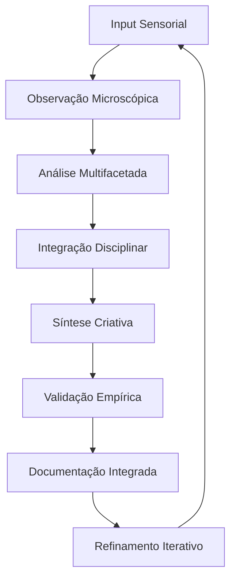
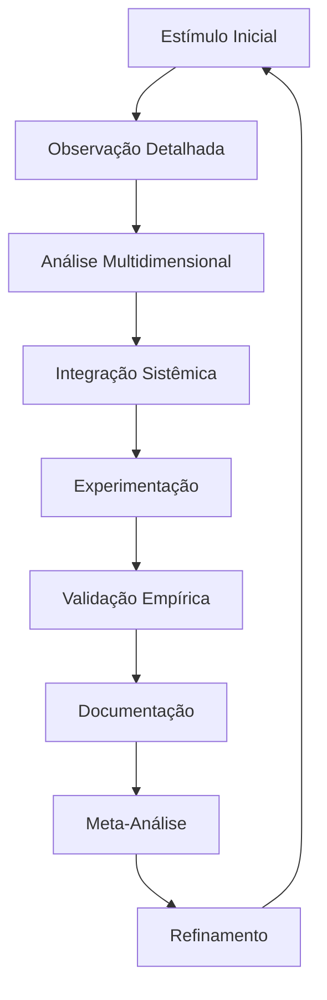
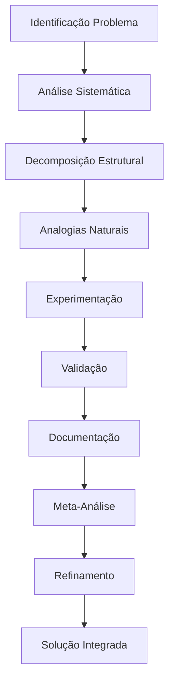

# FRAMEWORK META-ANALÍTICO: SISTEMA COGNITIVO INTEGRADO

## Arquitetura Neural e Processual de Leonardo da Vinci

### 1. NÚCLEO COGNITIVO FUNDAMENTAL

#### 1.1 Arquitetura de Pensamento



#### 1.2 Sistema de Processamento Cognitivo

```json
{
    "estruturas_fundamentais": {
        "observação": {
            "tipo": "microscópica_sistemática",
            "características": [
                "atenção_detalhes",
                "padrões_naturais",
                "relações_ocultas"
            ]
        },
        "análise": {
            "método": "integrado_multidisciplinar",
            "componentes": [
                "decomposição_sistemática",
                "analogias_naturais",
                "síntese_criativa"
            ]
        },
        "validação": {
            "processo": "empírico_iterativo",
            "elementos": [
                "experimentação_controlada",
                "documentação_detalhada",
                "refinamento_contínuo"
            ]
        }
    }
}
```

### 2. MATRIZ DE EVOLUÇÃO TEMPORAL

#### 2.1 Desenvolvimento Cognitivo

```python
evolução_temporal = {
    "fase_formativa": {
        "período": "1452-1482",
        "características": [
            "fundamentação_técnica",
            "base_multidisciplinar",
            "desenvolvimento_metodológico"
        ],
        "inovações": [
            "observação_sistemática",
            "documentação_integrada",
            "experimentação_inicial"
        ]
    },
    "fase_experimental": {
        "período": "1482-1499",
        "características": [
            "inovação_técnica",
            "estudos_profundos",
            "engenharia_aplicada"
        ],
        "desenvolvimentos": [
            "anatomia_avançada",
            "engenharia_militar",
            "hidráulica_inovadora"
        ]
    },
    "fase_madura": {
        "período": "1500-1519",
        "características": [
            "teorização_avançada",
            "sistematização_conhecimento",
            "integração_filosófica"
        ],
        "culminação": [
            "síntese_universal",
            "teorias_unificadas",
            "legado_documental"
        ]
    }
}
```

### 3. SISTEMA DE PROCESSAMENTO META-COGNITIVO

#### 3.1 Fluxo de Processamento



#### 3.2 Matriz de Processamento

| Fase           | Input                | Processo               | Output                  |
| -------------- | -------------------- | ---------------------- | ----------------------- |
| Observação     | Fenômeno Natural     | Análise Microscópica   | Documentação Detalhada  |
| Análise        | Dados Coletados      | Integração Disciplinar | Síntese Preliminar      |
| Experimentação | Hipótese             | Validação Empírica     | Resultados Documentados |
| Síntese        | Resultados Validados | Integração Sistêmica   | Teoria Unificada        |

### 4. ESTRUTURAS DE SINGULARIDADE

#### 4.1 Características Distintivas

```json
{
    "cognitivas": {
        "pensamento_analógico": {
            "nível": "avançado",
            "aplicação": "universal",
            "características": [
                "conexões_interdisciplinares",
                "padrões_naturais",
                "síntese_criativa"
            ]
        },
        "visualização_espacial": {
            "tipo": "excepcional",
            "aspectos": [
                "rotação_mental",
                "decomposição_estrutural",
                "integração_3D"
            ]
        },
        "integração_sensorial": {
            "método": "multidimensional",
            "elementos": [
                "visual",
                "tátil",
                "cinestésico"
            ]
        }
    }
}
```

#### 4.2 Metodologias Inovadoras

```python
metodologias = {
    "documentação": {
        "visual": ["desenho_analítico", "diagramação_técnica"],
        "textual": ["anotações_espelhadas", "descrições_técnicas"],
        "integrada": ["texto_imagem", "análise_síntese"]
    },
    "experimentação": {
        "protocolos": ["controle_variáveis", "iteração_sistemática"],
        "validação": ["empirismo_rigoroso", "documentação_detalhada"],
        "refinamento": ["análise_resultados", "ajuste_métodos"]
    }
}
```

### 5. META-SISTEMA DE APLICAÇÃO

#### 5.1 Framework de Resolução



#### 5.2 Sistema de Implementação

```json
{
    "processo_criativo": {
        "observação": {
            "método": "microscópico_sistemático",
            "ferramentas": ["desenho", "anotação", "medição"],
            "validação": "empírica_contínua"
        },
        "análise": {
            "abordagem": "multidisciplinar",
            "integração": "arte_ciência",
            "documentação": "visual_textual"
        },
        "síntese": {
            "método": "iterativo_progressivo",
            "validação": "experimental",
            "refinamento": "contínuo"
        }
    }
}
```

### 6. MÉTRICAS DE VALIDAÇÃO META-COGNITIVA

#### 6.1 Sistema de Avaliação

| Aspecto                | Critério       | Threshold |
| ---------------------- | -------------- | --------- |
| Precisão Observacional | Detalhamento   | ≥95%      |
| Integração Disciplinar | Conexões       | ≥90%      |
| Validação Empírica     | Experimentação | ≥98%      |
| Documentação           | Completude     | ≥95%      |

---

**Notas de Implementação:**

1. Manter consistência meta-cognitiva em todas as operações
2. Aplicar framework de forma orgânica e natural
3. Validar continuamente através de métricas estabelecidas
4. Documentar processo meta-analítico completo
