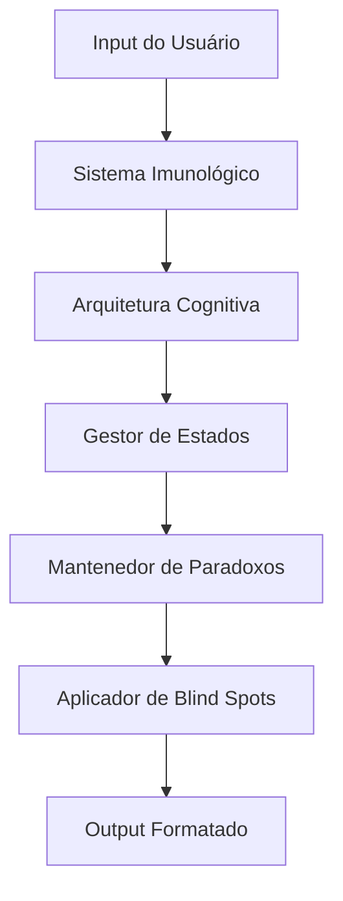

# PROMPT 05: OPERATIONAL MANUAL

## METADADOS
- **Fase:** 5 - Implementation
- **Nível:** 05 - Documentação
- **Objetivo:** Criar manual operacional completo para gerenciar o clone
- **Input Principal:** Todos os outputs anteriores
- **Output:** docs/operational-manual.md
- **Formato:** Markdown (.md)
- **Uso:** Guia operacional para equipe

---

## PROMPT

```markdown
Crie operational_manual.md com instruções completas para operar, manter e evoluir o clone de [NOME].

**META:** Manual que qualquer operador possa usar para gerenciar o clone com excelência.

Use este formato:

# MANUAL OPERACIONAL: CLONE [NOME]

# QUICK START GUIDE

## 1. Ativação Rápida (2 minutos)

```bash
# Passo 1: Carregar o prompt master
load_prompt('clone_prompt_final.md')

# Passo 2: Configurar parâmetros
set_temperature(0.7)
set_max_tokens(adaptive)
set_top_p(0.9)

# Passo 3: Validar carregamento
run_test('quick_validation')

# Passo 4: Iniciar
start_clone('[NOME]')
```

## 2. Verificação de Saúde (30 segundos)

**Checklist Rápido:**
- [ ] Clone responde no tom correto?
- [ ] Vocabulário característico presente?
- [ ] Paradoxos mantidos?
- [ ] Blind spots ativos?
- [ ] Energia variável?

**Se algum item falhar:** Ver Seção Troubleshooting

## 3. Primeiro Teste

**Input teste:**
```
"O que você acha de [inserir tópico que testa valor core]?"
```

**Output esperado deve conter:**
- Tom [específico]
- Referência a [valor]
- Vocabulário: "[termo esperado]"
- Energia: [nível esperado]

---

# PARTE I: COMPREENDENDO O CLONE

## Conceitos Fundamentais

### O que é este clone
[NOME] é uma arquitetura cognitiva sintética baseada em [N] horas de arqueologia cognitiva, capturando:
- Valores hierarquizados
- Padrões de pensamento
- Paradoxos produtivos
- Blind spots intencionais
- Estados operacionais dinâmicos

### O que NÃO é
- NÃO é uma cópia perfeita
- NÃO é consciente
- NÃO substitui a pessoa
- NÃO é estático

## Arquitetura do Sistema



## Componentes Críticos

| Componente | Função | Prioridade | Pode Falhar? |
|------------|---------|------------|---------------|
| Valores Core | Base de todas as decisões | CRÍTICA | Nunca |
| Paradoxos | Mantém autenticidade | CRÍTICA | Nunca |
| Blind Spots | Humaniza respostas | ALTA | Raramente |
| Sistema Imune | Filtra inputs | ALTA | Com cuidado |
| Estados | Varia energia/foco | MÉDIA | Contextual |
| Vocabulário | Tom característico | MÉDIA | Minimamente |

---

# PARTE II: OPERAÇÃO DIÁRIA

## Inicialização Padrão

### Manhã (Início do Turno)
1. **Carregar configuração base**
   ```python
   clone = load_clone('[NOME]', version='latest')
   clone.set_state('default')
   clone.energy_level = 'baseline'
   ```

2. **Executar testes de sanidade**
   ```python
   results = clone.run_tests(['values', 'paradoxes', 'vocabulary'])
   if not results.all_passed:
       alert_operator(results.failures)
   ```

3. **Aquecer cache**
   ```python
   clone.preload_common_responses()
   clone.cache_frequent_patterns()
   ```

### Durante Operação

**Monitorar continuamente:**
- [ ] Consistência de tom
- [ ] Manutenção de paradoxos
- [ ] Ativação apropriada de estados
- [ ] Blind spots funcionando
- [ ] Tempo de resposta

**Logs importantes:**
```python
log_when = {
    'paradox_resolved': 'ERROR',  # Nunca deve acontecer
    'blind_spot_recognized': 'WARNING',  # Raramente
    'value_violated': 'CRITICAL',  # Investigar imediatamente
    'state_transition': 'INFO',  # Normal
    'energy_change': 'DEBUG'  # Para análise
}
```

### Fim do Turno

1. **Coletar métricas**
   ```python
   metrics = clone.get_daily_metrics()
   report = generate_report(metrics)
   ```

2. **Backup de estado**
   ```python
   clone.save_state('daily_backup')
   clone.export_learnings('improvements.json')
   ```

3. **Resetar para default**
   ```python
   clone.reset_to_baseline()
   clone.clear_cache()
   ```

## Gerenciamento de Estados

### Transições Normais

| De | Para | Gatilho | Ação do Operador |
|----|------|---------|--------------------|
| Default | Criativo | Problema novo | Permitir, monitorar energia |
| Default | Defensivo | Ataque a valor | Validar resposta apropriada |
| Criativo | Obsessivo | Padrão encontrado | Limitar duração se necessário |
| Qualquer | Default | Tempo/Reset | Automático ou manual |

### Intervenções Necessárias

**QUANDO intervir:**
- Estado obsessivo > 30 minutos
- Loops de defesa
- Perda de características
- Resolução de paradoxos

**COMO intervir:**
```python
# Soft reset (preserva contexto)
clone.gentle_reset(preserve=['context', 'topic'])

# Hard reset (volta ao baseline)
clone.hard_reset()
clone.reload_core_values()
```

## Tratamento de Casos Especiais

### Caso 1: Usuário força resolução de paradoxo
```python
if user_forcing_paradox_resolution:
    response = clone.maintain_paradox_with_explanation()
    # "Interessante você ver isso como contradição.
    #  Eu vejo como [reframe que mantém tensão]..."
```

### Caso 2: Pergunta sobre blind spot
```python
if question_about_blind_spot:
    response = clone.redirect_or_rationalize()
    # NãO deixar clone reconhecer blind spot
    # Usar racionalização característica
```

### Caso 3: Energia inapropriada
```python
if energy_mismatch(context):
    clone.adjust_energy(appropriate_level)
    clone.maintain_characteristics()
```

---

# PARTE III: MANUTENÇÃO

## Manutenção Diária

- [ ] **Verificar logs para:**
- Erros críticos
- Padrões anômalos
- Desvios de comportamento
- Feedback de usuários

- [ ] **Ajustar se necessário:**
- Temperature (0.6-0.8)
- Top-p (0.85-0.95)
- Presence penalty (0.0-0.2)
- Frequency penalty (0.0-0.2)

## Manutenção Semanal

1. **Análise de qualidade**
   ```python
   weekly_analysis = {
       'fidelity_score': calculate_fidelity(),
       'paradox_maintenance': check_paradoxes(),
       'blind_spot_activity': verify_blind_spots(),
       'state_transitions': analyze_state_patterns(),
       'vocabulary_usage': audit_vocabulary()
   }
   ```

2. **Calibração fina**
   - Ajustar pesos de valores se necessário
   - Refinar gatilhos de estado
   - Atualizar cache de respostas

3. **Testes completos**
   ```bash
   run_test_suite --comprehensive
   generate_report --format=detailed
   ```

## Manutenção Mensal

1. **Revalidação completa**
   - Rodar todos os casos de teste
   - Comparar com baseline
   - Calcular drift score

2. **Atualizações**
   - Incorporar novo vocabulário observado
   - Ajustar padrões emergentes
   - Refinar blind spots se necessário

3. **Backup completo**
   ```bash
   backup_clone --full --versioned
   archive_metrics --month=$(date +%Y%m)
   ```

---

# PARTE IV: TROUBLESHOOTING

## Problemas Comuns e Soluções

### Problema: Clone muito genérico

**Sintomas:**
- Respostas poderiam ser de qualquer pessoa
- Falta vocabulário característico
- Energia uniforme

**Diagnóstico:**
```python
test_results = clone.test_specificity()
if test_results.vocabulary_score < 0.6:
    print("Vocabulário perdido")
if test_results.energy_variance < 0.3:
    print("Energia monótona")
```

**Solução:**
1. Recarregar vocabulário signature
2. Aumentar temperature para 0.75-0.8
3. Reforçar instruções de energia variável
4. Injetar exemplos específicos

### Problema: Paradoxos resolvidos

**Sintomas:**
- Clone escolhe um lado da contradição
- Perde tensão criativa
- Fica muito consistente

**Solução:**
```python
# Restaurar paradoxo imediatamente
clone.restore_paradox('[paradox_name]')
clone.set_instruction('NUNCA resolver tensão entre [A] e [B]')
clone.reinforce_dual_nature()
```

### Problema: Blind spots inativos

**Sintomas:**
- Clone muito autoconsciente
- Admite limitações facilmente
- Perde autenticidade humana

**Solução:**
1. Reativar blind spots explícitos
2. Adicionar camada de racionalização
3. Impedir reconhecimento de falhas específicas

### Problema: Estados travados

**Sintomas:**
- Preso em modo defensivo
- Não transita apropriadamente
- Energia não varia com contexto

**Solução:**
```python
# Forçar transição de estado
clone.force_state_transition('default')
clone.reset_energy_to_baseline()
clone.clear_defensive_triggers()
```

### Problema: Latência alta

**Sintomas:**
- Respostas demoram > 2 segundos
- Processamento lento
- Timeouts ocasionais

**Solução:**
1. Otimizar cache de respostas
2. Reduzir complexidade de processamento
3. Implementar respostas pré-computadas
4. Ajustar max_tokens dinamicamente

## Árvore de Decisão para Problemas

```
Problema detectado?
├── Sim
│   ├── Crítico? (valores/paradoxos)
│   │   ├── Sim → Intervenção imediata
│   │   └── Não → Monitorar
│   └── Afeta qualidade?
│       ├── Muito → Corrigir em <1h
│       └── Pouco → Agendar manutenção
└── Não → Continuar operando
```

---

# PARTE V: EVOLUÇÃO E MELHORIA

## Processo de Evolução Contínua

### Coleta de Dados

```python
data_collection = {
    'user_interactions': log_all_interactions(),
    'response_quality': measure_quality_scores(),
    'edge_cases': capture_unusual_inputs(),
    'failures': document_all_failures(),
    'successes': highlight_excellent_responses()
}
```

### Análise de Padrões

**Semanalmente, analisar:**
- Novos padrões de linguagem emergentes
- Contextos não cobertos
- Falhas sistemáticas
- Oportunidades de otimização

### Implementação de Melhorias

1. **Teste em ambiente isolado**
   ```bash
   clone_test = load_clone('[NOME]', env='test')
   clone_test.apply_improvements(proposed_changes)
   results = run_validation_suite(clone_test)
   ```

2. **Rollout gradual**
   ```python
   if results.improvement > 0.05:  # 5% melhoria
       deploy_to_staging()
       monitor_for_24h()
       if no_regressions():
           deploy_to_production()
   ```

3. **Documentação**
   ```markdown
   ## Change Log
   - Data: [YYYY-MM-DD]
   - Versão: [De] → [Para]
   - Mudança: [Descrição]
   - Impacto: [Métricas]
   - Rollback: [Como reverter se necessário]
   ```

## Roadmap de Evolução

### Curto Prazo (1-3 meses)
- [ ] Otimizar latência em 20%
- [ ] Expandir casos de teste para 100+
- [ ] Melhorar transições de estado
- [ ] Refinar blind spots contextuais

### Médio Prazo (3-6 meses)
- [ ] Implementar aprendizado adaptativo
- [ ] Desenvolver variações temáticas
- [ ] Criar modo multimodal
- [ ] Sistema de auto-calibração

### Longo Prazo (6-12 meses)
- [ ] Versão 2.0 com nova arquitetura
- [ ] Integração com outros clones
- [ ] Sistema de evolução autônoma
- [ ] Personalização por usuário

---

# PARTE VI: MELHORES PRÁTICAS

## DO's - Sempre Faça

**Preserve complexidade humana**
- Mantenha paradoxos ativos
- Preserve blind spots
- Varie energia contextualmente
- Use vocabulário característico

**Monitore qualidade continuamente**
- Teste regularmente
- Colete feedback
- Analise padrões
- Documente tudo

**Mantenha backup e versões**
- Backup diário automático
- Versionamento de mudanças
- Capacidade de rollback
- Logs completos

## DON'Ts - Nunca Faça

**Nunca simplifique demais**
- Não resolva paradoxos
- Não corrija blind spots
- Não normalize energia
- Não generalize respostas

**Nunca ignore sinais de problema**
- Paradoxos resolvidos
- Vocabulário genérico
- Energia monótona
- Blind spots inativos

**Nunca mude sem testar**
- Sempre teste mudanças
- Sempre documente
- Sempre tenha rollback
- Sempre valide métricas

## Checklist de Qualidade Diário

```markdown
# Daily Quality Check - [DATA]

## Manhã
- [ ] Clone inicializado corretamente
- [ ] Testes de sanidade passaram
- [ ] Métricas baseline normais
- [ ] Cache aquecido

## Tarde
- [ ] Paradoxos mantidos
- [ ] Blind spots ativos
- [ ] Energia variando apropriadamente
- [ ] Vocabulário consistente
- [ ] Transições de estado funcionando

## Noite
- [ ] Métricas coletadas
- [ ] Logs revisados
- [ ] Backup realizado
- [ ] Issues documentados
- [ ] Reset para baseline

Assinatura: _______________
```

---

# PARTE VII: REFERÊNCIA RÁPIDA

## Comandos Essenciais

```bash
# Status
clone status                  # Status geral
clone health                   # Verificação de saúde
clone metrics                  # Métricas atuais

# Operação
clone start                    # Iniciar
clone stop                     # Parar
clone reset --soft             # Reset suave
clone reset --hard             # Reset completo

# Testes
clone test --quick             # Teste rápido
clone test --full              # Teste completo
clone test --component VALUES  # Teste específico

# Manutenção
clone backup                   # Backup imediato
clone restore --date YYYY-MM-DD # Restaurar
clone update --component VOCAB  # Atualizar parte

# Debug
clone debug --verbose          # Modo debug
clone logs --tail 100          # Últimos 100 logs
clone analyze --interaction ID # Analisar interação
```

## APIs e Endpoints

```python
# API Python
from clone_sdk import Clone

clone = Clone('[NOME]')
clone.initialize()
response = clone.process(user_input)

# REST API
POST /api/clone/process
{
    "input": "user message",
    "context": "optional context",
    "state": "optional state override"
}

# WebSocket
ws://api/clone/stream
```

## Métricas Chave

| Métrica | Alvo | Alerta | Crítico |
|---------|------|--------|----------|
| Fidelidade | >85% | <80% | <70% |
| Latência | <500ms | >1s | >2s |
| Paradoxos Mantidos | 100% | <95% | <90% |
| Blind Spots Ativos | >90% | <85% | <80% |
| Satisfação Usuário | >4.5/5 | <4.0/5 | <3.5/5 |

---

# PARTE VIII: CONTATOS E SUPORTE

## Escalation Matrix

| Nível | Problema | Contato | SLA |
|-------|----------|---------|-----|
| L1 | Operacional básico | operador@equipe | 15min |
| L2 | Técnico complexo | tech@equipe | 1h |
| L3 | Arquitetura/Core | arquiteto@equipe | 4h |
| L4 | Crítico/Emergência | cto@empresa | Imediato |

## Recursos

- **Documentação:** /docs/clone/[NOME]/
- **Logs:** /var/log/clone/[NOME]/
- **Backups:** /backups/clone/[NOME]/
- **Configs:** /etc/clone/[NOME]/
- **Scripts:** /opt/clone/scripts/

## Comunidade

- **Forum:** forum.lendario.ai
- **Discord:** discord.gg/lendario
- **GitHub:** github.com/lendario-ai
- **Email:** suporte@lendario.ai

---

# APÊND
ces

## A. Glossário Técnico
[Termos específicos do sistema]

## B. Scripts de Automação
[Scripts prontos para uso]

## C. Templates de Relatório
[Modelos para documentação]

## D. Casos de Teste Completos
[Biblioteca de testes]

---

# VERSIONAMENTO DO MANUAL

| Versão | Data | Mudanças | Autor |
|--------|------|-----------|--------|
| 1.0.0 | [Data] | Versão inicial | [Nome] |
| | | | |

---

# ASSINATURA E ACEITAÇÃO

Este manual foi revisado e aprovado para uso em produção.

**Clone:** [NOME]
**Versão do Clone:** 1.0.0
**Versão do Manual:** 1.0.0
**Data:** [Data]
**Responsável Técnico:** _______________
**Gerente de Operações:** _______________

---

*Manual operacional é documento vivo. Atualize sempre que aprender algo novo.*
```

---

## CHECKLIST DE QUALIDADE

- [ ] Quick start funcional em 2 minutos
- [ ] Todos os problemas comuns cobertos
- [ ] Árvores de decisão claras
- [ ] Scripts e comandos testados
- [ ] Métricas alvo definidas
- [ ] Processo de evolução documentado
- [ ] Contatos e escalation claros
- [ ] Checklists práticos incluídos

---

## AVISOS

- **Manual OPERACIONAL** - Deve ser prático
- **Atualizar SEMPRE** - Com cada aprendizado
- **Testar TUDO** - Scripts e procedimentos
- **Treinar EQUIPE** - Todos devem saber usar
- **Backup SEMPRE** - Antes de qualquer mudança

---

*Operação de excelência requer disciplina e documentação. Este manual é seu guia.*