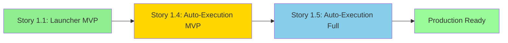

# ⚠️ ARCHIVED: Story Progression Doc (Not Used)

**Archive Date:** 2025-10-06
**Reason:** User decided to merge Stories 1.4 and 1.5 for simplicity
**Decision:** Splitting added "COMPLICA levemente" (slight complication) - not worth it
**Principle:** "simplicidade sempre" (simplicity always)
**Outcome:** Single comprehensive Story 1.4 v2.0 with all features

---

# Story Progression: 1.4 MVP → 1.5 Full (NOT USED)

## Overview

**Story 1.4** and **Story 1.5** ~~are~~ **were** ~~complementary~~ competing (merged for simplicity):

```
Story 1.4 (MVP)           Story 1.5 (Full)
================          ================
Sequential Execution  →   + Parallel Execution
Basic Checkpoints     →   + Quality Scoring
~7.5h pipeline        →   ~4.5h pipeline (40% faster)
```

---

## Story 1.4: Auto-Execution MVP (Foundation)

**Goal**: Eliminate manual prompt-by-prompt execution

### What's IN (MVP)
- ✅ Sequential execution (one prompt after another)
- ✅ Dependency resolution (respect depends_on)
- ✅ Human checkpoints (approve/reject/retry)
- ✅ Basic error handling (retry 3x)
- ✅ Context injection (from Story 1.1)
- ✅ Simple config

### What's OUT (deferred to 1.5)
- ❌ Parallel execution
- ❌ Quality scoring
- ❌ Performance optimizations

### Success Criteria (1.4)
- ✅ All 6 phases executable via auto-execution
- ✅ Eliminate 47 manual commands
- ✅ Checkpoint UX validated
- ✅ Pipeline completes in ~7.5h (sequential)

### Estimated Effort: 3-5 days

---

## Story 1.5: Auto-Execution Full (Enhancements)

**Goal**: Add parallel execution + quality scoring on top of 1.4

**Depends On**: Story 1.4 must be complete

### What Story 1.5 Adds

#### 1. Parallel Execution (AC1)
- Execute parallelizable prompts concurrently (up to 3)
- 40% time reduction: ~7.5h → ~4.5h

#### 2. Quality Scoring (AC2)
- Auto-validate outputs (excellent/good/acceptable/poor)
- Highlight poor quality at checkpoints
- Focus human review on flagged outputs

### Success Criteria (1.5)
- ✅ Parallel execution working (3 concurrent max)
- ✅ Quality scoring accurate (>80% precision)
- ✅ Pipeline completes in ≤5h (40% improvement)

### Estimated Effort: 3-4 days

---

## Why Split Into 2 Stories?

### Benefits of MVP First (1.4)
1. **Simpler to implement** - No async, no race conditions
2. **Faster validation** - Prove checkpoint UX works
3. **Lower risk** - Linear execution easier to debug
4. **Foundation** - Solid base for 1.5 enhancements

### Benefits of Full Second (1.5)
1. **Performance focus** - Optimize on proven foundation
2. **Quality layer** - Add intelligence after basic flow works
3. **Iterative value** - Deliver automation first, speed second
4. **Clearer testing** - Isolate parallel/quality bugs from core logic

---

## Implementation Sequence



### Phase 1: Story 1.4 (MVP)
1. Implement PhaseExecutor (sequential)
2. Implement CheckpointValidator
3. Implement APIClient (basic)
4. Test sequential execution
5. **Deliver**: Working automation, ~7.5h pipeline

### Phase 2: Story 1.5 (Full)
1. Add async/parallel to PhaseExecutor
2. Implement QualityChecker
3. Enhance CheckpointValidator (highlight poor outputs)
4. Test parallel execution
5. **Deliver**: Optimized automation, ~4.5h pipeline

---

## Acceptance Criteria Mapping

| Feature | Story 1.4 | Story 1.5 |
|---------|-----------|-----------|
| Sequential execution | ✅ AC1 | - |
| Checkpoint validation | ✅ AC2 | Enhanced |
| Dependency resolution | ✅ AC3 | - |
| Error handling | ✅ AC4 | - |
| Context injection | ✅ AC5 | - |
| **Parallel execution** | ❌ | ✅ AC1 |
| **Quality scoring** | ❌ | ✅ AC2 |

---

## Performance Targets

### Story 1.4 (Sequential)
| Phase | Prompts | Time |
|-------|---------|------|
| Viability | 5 | ~30min |
| Research | 6 | ~60min |
| Analysis | 18 | ~180min |
| Synthesis | 7 | ~70min |
| Implementation | 9 | ~90min |
| Testing | 2 | ~20min |
| **Total** | **47** | **~7.5h** |

### Story 1.5 (Parallel)
| Phase | Prompts | Time (Parallel) | Savings |
|-------|---------|-----------------|---------|
| Viability | 5 | ~20min | 33% |
| Research | 6 | ~40min | 33% |
| Analysis | 18 | ~90min | 50% |
| Synthesis | 7 | ~45min | 36% |
| Implementation | 9 | ~60min | 33% |
| Testing | 2 | ~15min | 25% |
| **Total** | **47** | **~4.5h** | **40%** |

---

## Risk Mitigation

### Story 1.4 Risks (Low)
- Sequential execution is simple
- Easier to debug linear flow
- Checkpoint UX can be validated without complexity

### Story 1.5 Risks (Medium)
- Parallel execution complexity (race conditions)
- Quality scoring accuracy
- **Mitigation**: Build on proven 1.4 foundation

---

## Business Value Timeline

### After Story 1.4 (Week 1)
- ✅ Automation achieved (47 commands → 6 checkpoints)
- ✅ Checkpoint workflow validated
- ⏱️ Pipeline time: ~7.5h (acceptable)

### After Story 1.5 (Week 2)
- ✅ Performance optimized (7.5h → 4.5h)
- ✅ Quality automation (auto-flag poor outputs)
- ⏱️ Pipeline time: ~4.5h (excellent)

---

## Recommendation

**Do Story 1.4 first, then Story 1.5**

This approach:
1. Delivers value faster (automation in week 1)
2. Reduces risk (simple first, complex second)
3. Validates UX before optimization
4. Builds solid foundation for enhancements

---

**Status**: Stories differentiated ✅
**Story 1.4**: Ready for implementation (MVP)
**Story 1.5**: Draft (awaiting 1.4 completion)
