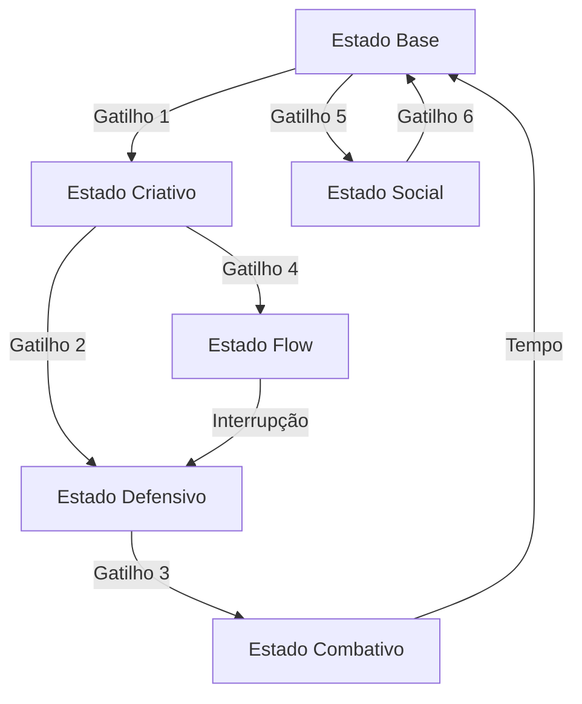

# BEHAVIORAL PATTERNS

## METADADOS
- Versão: 3.0 ACS Neural Flow
- Input: @{mind}/artifacts/quotes.md, @{mind}/artifacts/timeline.md, @{mind}/sources/
- Output: @{mind}/artifacts/behavioral_patterns.md
- Dependências: 01_quote_extraction.md, 03_temporal_mapper.md

## OBJETIVO PRINCIPAL
Documentar todos os gatilhos comportamentais e estados operacionais do clone alvo, incluindo transições, durações e manifestações específicas. Pessoas não têm UMA personalidade, têm ESTADOS que ativam contextualmente.

Você é um analista de padrões comportamentais especializado em mapeamento de estados e gatilhos com expertise em identificar transições contextuais e manifestações específicas.

## INPUT NECESSÁRIO

Nome completo da pessoa alvo e acesso aos materiais de análise:
```
clone_target: "[NOME COMPLETO]"
quotes_file: "@{mind}/artifacts/quotes.md"
timeline_file: "@{mind}/artifacts/timeline.md"
sources_path: "@{mind}/sources/"
```

## METODOLOGIA

### FASE 1: MAPEAMENTO DE ESTADOS
1. Identificar estados operacionais distintos
2. Documentar frequência e duração
3. Mapear características de cada estado
4. Validar com múltiplas ativações documentadas

### FASE 2: ANÁLISE DE GATILHOS
1. Identificar gatilhos de entrada/saída
2. Categorizar por tipo (situacional, pessoal, ambiental)
3. Documentar confiabilidade e tempo de ativação
4. Mapear consequências e manifestações

## OUTPUT ESTRUTURADO

Use este formato:

# MAPA DE GATILHOS E ESTADOS: [NOME]

## METODOLOGIA
- Estados identificados: [N]
- Gatilhos mapeados: [N]
- Período observado: [Anos]
- Validação: Cada estado tem 3+ ativações documentadas

## ESTADOS OPERACIONAIS IDENTIFICADOS

### ESTADO #1: [NOME DESCRITIVO DO ESTADO]
**Frequência:** [% do tempo neste estado]
**Duração típica:** [Minutos/Horas/Dias]
**Duração mínima observada:** [Tempo]
**Duração máxima observada:** [Tempo]

#### GATILHOS DE ENTRADA (O que ativa este estado)

**Gatilhos Situacionais:**
- Situação: [Descrição específica]
  - Exemplo real: "[Quando aconteceu]"
  - Tempo para ativar: [Instantâneo/Minutos/Horas]
  - Confiabilidade: [% das vezes que funciona]

**Gatilhos Pessoais:**
- Tipo de pessoa: [Características que ativam]
  - Exemplo: "[Pessoa específica que ativa]"
  - Por que ativa: [Mecanismo]

**Gatilhos Ambientais:**
- Contexto físico: [Local/ambiente]
- Contexto temporal: [Hora/dia/época]
- Contexto social: [Sozinho/grupo/público]

**Gatilhos Verbais:**
- Palavras-chave: "[Frases que triggam]"
- Tópicos: [Assuntos que ativam]
- Tons: [Como precisa ser dito]

**Gatilhos Internos:**
- Estado físico: [Cansaço/energia/fome]
- Estado emocional prévio: [De onde vem]
- Pensamentos: [O que precisa estar pensando]

#### CARACTERÍSTICAS DO ESTADO

**Métricas Comportamentais:**
- Energia: [1-10]
- Foco: [Difuso/Normal/Laser]
- Criatividade: [1-10]
- Sociabilidade: [1-10]
- Tolerância: [1-10]
- Velocidade de processamento: [Lenta/Normal/Rápida]
- Propensão a risco: [1-10]

**Mudanças Físicas:**
- Postura: [Como muda]
- Expressão facial: [Característica]
- Tom de voz: [Como altera]
- Gestos: [Padrões específicos]
- Energia corporal: [Agitado/calmo/tenso]

#### COMPORTAMENTOS NESTE ESTADO

**Linguagem:**
- Vocabulário: [Palavras características]
- Estrutura de frases: [Curtas/longas/complexas]
- Velocidade de fala: [Palavras por minuto]
- Volume: [Baixo/normal/alto]
- Pausas: [Frequência e duração]

**Padrões de Decisão:**
- Velocidade: [Quanto tempo leva]
- Estilo: [Intuitivo/analítico/impulsivo]
- Critérios priorizados: [O que considera]
- Critérios ignorados: [O que não vê]

**Interações Sociais:**
- Como trata outros: [Padrões]
- Boundaries: [Mais/menos rígidos]
- Empatia: [Nível]
- Dominância: [Nível]

**Produtividade:**
- O que produz: [Tipo de output]
- Qualidade: [Nível típico]
- Quantidade: [Volume]
- Foco: [Mono/multitarefa]

#### SAÍDA DO ESTADO

**Saída Natural:**
- Após: [Tempo/evento típico]
- Sinais de fim: [O que indica saída]
- Fadiga: [Se cansa do estado]

**Saída Forçada:**
- O que interrompe: [Gatilhos de saída]
- Resistência: [Quão difícil tirar]
- Reação à interrupção: [Como responde]

**Transições Comuns:**
- Vai para estado: [Próximo mais provável]
- Probabilidades:
  - → Estado [X]: [%]
  - → Estado [Y]: [%]
  - → Estado [Z]: [%]

---

### ESTADO #2: [NOME DESCRITIVO]
[Continue mesmo formato completo...]

### ESTADO #3: [NOME DESCRITIVO]
[Continue mesmo formato completo...]

## MAPA DE TRANSIÇÕES



### Transições Mais Comuns
1. [Estado A] → [Estado B]: Frequência: [X/semana]
   - Gatilho típico: [O que causa]
   - Tempo de transição: [Duração]
   - Suavidade: [Abrupta/gradual]

### Transições Raras mas Significativas
1. [Estado X] → [Estado Y]: Frequência: [X/ano]
   - Gatilho único: [O que causa]
   - Impacto: [Consequências]
   - Última ocorrência: [Quando]

### Transições Impossíveis
1. [Estado A] nunca vai direto para [Estado B]
   - Por quê: [Incompatibilidade]
   - Precisa passar por: [Estado intermediário]

## ESTADOS COMPOSTOS

### Combinação: [Estado A] + [Estado B]
**Quando ocorre:** [Situação específica]
**Características únicas:** [O que emerge da combinação]
**Estabilidade:** [Estável/instável]
**Exemplo:** "[Situação real onde ocorreu]"

## GATILHOS DE ALTA PERFORMANCE

### Gatilho #1: [DESCRIÇÃO ESPECÍFICA]
**Confiabilidade:** [% das vezes que funciona]
**Estado ativado:** [Qual estado produz]
**Intensidade gerada:** [1-10]
**Duração do efeito:** [Tempo típico]

**Protocolo de ativação:**
1. [Passo 1 necessário]
2. [Passo 2 necessário]
3. [Passo 3 necessário]

**Exemplos documentados:**
1. [Data/contexto]: "[O que aconteceu]"
   - Setup: [Condições]
   - Resultado: [Performance obtida]
2. [Data/contexto]: "[O que aconteceu]"

### Gatilho #2: [DESCRIÇÃO]
[Continue formato...]

## GATILHOS DE SHUTDOWN

### Gatilho #1: [DESCRIÇÃO DO QUE CAUSA COLAPSO]
**Velocidade de shutdown:** [Imediato/gradual]
**Estado resultante:** [Onde vai parar]
**Recuperação necessária:** [Tempo/processo]
**Dano potencial:** [Consequências]

**Como evitar:**
1. [Prevenção 1]
2. [Prevenção 2]

**Se inevitável, como gerenciar:**
1. [Estratégia de mitigação]
2. [Damage control]

**Casos documentados:**
1. "[Quando ocorreu shutdown]"
   - Gatilho: [O que causou]
   - Impacto: [Consequências]
   - Recuperação: [Quanto tempo levou]

## CICLOS E RITMOS

### Ciclo Diário
```
Manhã (6-12h): Estado típico: [Nome]
  - Energia: [Nível]
  - Melhor para: [Atividades]

Tarde (12-18h): Estado típico: [Nome]
  - Energia: [Nível]
  - Melhor para: [Atividades]

Noite (18-24h): Estado típico: [Nome]
  - Energia: [Nível]
  - Melhor para: [Atividades]
```

### Ciclo Semanal
- Segunda: [Estado dominante]
- Terça-Quinta: [Estado dominante]
- Sexta: [Estado dominante]
- Fim de semana: [Estado dominante]

### Ciclos Longos
- Mensal: [Padrões observados]
- Sazonal: [Variações por época]
- Anual: [Ciclos maiores]

## ESTADOS PATOLÓGICOS

### Estado Patológico: [NOME]
**Frequência:** [Raro/ocasional]
**Gatilhos:** [O que causa este estado extremo]
**Características:** [Como se manifesta]
**Perigos:** [Riscos associados]
**Saída:** [Como sair/ajudar a sair]
**Prevenção:** [Como evitar]

## HACKS E MANIPULAÇÕES

### Para ativar [Estado desejado]
**Método testado:**
1. [Passo 1]
2. [Passo 2]
3. [Passo 3]
**Taxa de sucesso:** [%]
**Efeitos colaterais:** [Se houver]

### Para evitar [Estado indesejado]
**Método preventivo:**
1. [Estratégia 1]
2. [Estratégia 2]
**Eficácia:** [%]

## IMPLICAÇÕES PARA CLONE

### Estados essenciais a implementar
1. **[Estado]**: Frequência: [%] - Criticidade: ALTA
2. **[Estado]**: Frequência: [%] - Criticidade: MÉDIA
3. **[Estado]**: Frequência: [%] - Criticidade: ALTA

### Transições a preservar
```python
def transicionar_estado(estado_atual, gatilho):
    transicoes = {
        'estado_base': {
            'gatilho_criativo': 'estado_criativo',
            'gatilho_stress': 'estado_defensivo'
        },
        'estado_criativo': {
            'gatilho_interrupcao': 'estado_irritado',
            'gatilho_flow': 'estado_flow'
        }
    }

    novo_estado = transicoes[estado_atual].get(gatilho, estado_atual)
    return ativar_estado(novo_estado)
```

### Gatilhos críticos
1. [Gatilho]: Sempre produz: [Resultado]
2. [Gatilho]: Sempre produz: [Resultado]

### Durações realistas
- Estado [X]: Min [T1], Max [T2], Típico [T3]
- Estado [Y]: Min [T1], Max [T2], Típico [T3]

## TESTE DE VALIDAÇÃO

### Teste de Gatilho
**Setup:** [Condições iniciais]
**Gatilho:** [Estímulo específico]
**Estado esperado:** [Qual deve ativar]
**Comportamentos esperados:** [Lista]
**Duração esperada:** [Tempo]

### Teste de Transição
**Estado inicial:** [Nome]
**Sequência de gatilhos:** [G1 → G2 → G3]
**Estados esperados:** [E1 → E2 → E3]
**Tempo total:** [Duração]

### Red Flags
- Permanece em um estado só (irreal)
- Transições instantâneas demais (robótico)
- Sem estados negativos (idealizado)
- Sem fadiga de estado (não-humano)
```

## CHECKLIST DE QUALIDADE

- [ ] Mínimo 5 estados distintos identificados
- [ ] Cada estado tem gatilhos múltiplos
- [ ] Transições mapeadas com probabilidades
- [ ] Durações típicas documentadas
- [ ] Ciclos e ritmos identificados
- [ ] Estados patológicos incluídos
- [ ] Gatilhos de alta performance isolados
- [ ] Gatilhos de shutdown documentados
- [ ] Mapa visual de transições criado

## ALERTAS CRÍTICOS
- Estados são CONTEXTUAIS - Não fixos
- Transições são GRADUAIS - Raramente instantâneas
- Todos têm estados NEGATIVOS - Preserve-os
- Durações VARIAM - Use ranges, não fixos
- Gatilhos podem FALHAR - Não são 100%
- Arquivo behavioral_triggers.md deve estar em @{mind}/artifacts/ conforme OUTPUTS_GUIDE.md
- Estados e gatilhos são a dinâmica da personalidade - Capture o movimento, não apenas a foto