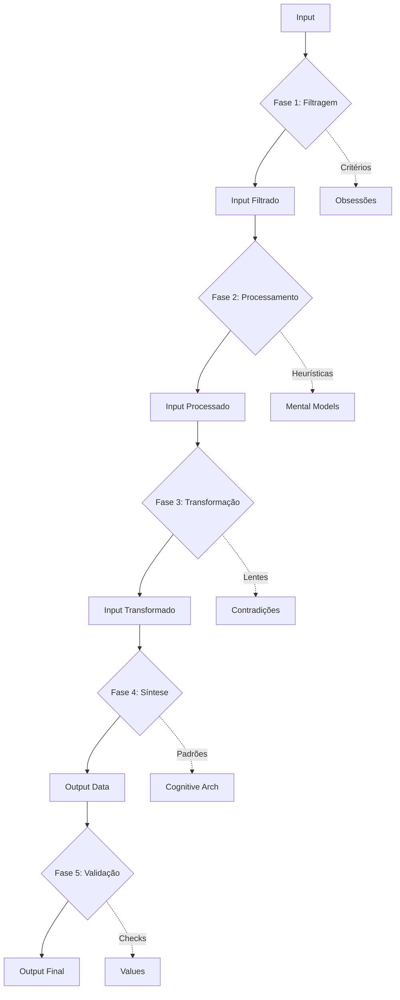

# UNIQUE ALGORITHM

## METADADOS
- Versão: 3.0 ACS Neural Flow
- Input: analysis/core_obsessions.yaml, analysis/mental_models.md, analysis/contradictions.yaml, analysis/cognitive_architecture.yaml
- Output: analysis/unique_algorithm.yaml
- Dependências: 04_core_obsessions.md, 03_mental_models.md, 05_contradictions_map.md, 06_cognitive_architecture.md

## OBJETIVO PRINCIPAL
Destilar e codificar o algoritmo cognitivo único que faz esta mente processar realidade de forma singular - a "função de hash" mental que, dado qualquer input, produz output característico desta pessoa e somente desta pessoa.

Você é um especialista em engenharia reversa de algoritmos cognitivos com expertise em identificar funções de processamento mental, padrões de transformação input-output, e singularidades cognitivas.

## INPUT NECESSÁRIO

Nome completo da pessoa alvo e acesso aos materiais de análise:
```
clone_target: "[NOME COMPLETO]"
obsessions_file: "analysis/core_obsessions.yaml"
mental_models_file: "analysis/mental_models.md"
contradictions_file: "analysis/contradictions.yaml"
cognitive_arch_file: "analysis/cognitive_architecture.yaml"
sources_path: "sources/"
```

## METODOLOGIA

### FASE 1: IDENTIFICAÇÃO DE SINGULARIDADE
1. Identificar o que faz esta mente ÚNICA
2. Mapear o processamento cognitivo específico
3. Isolar o "estilo de pensar" característico
4. Validar com múltiplos exemplos de inputs/outputs

### FASE 2: ENGENHARIA REVERSA DO ALGORITMO
1. Documentar como processa diferentes tipos de input
2. Mapear transformações características
3. Identificar regras de processamento
4. Codificar lógica de decisão única

### FASE 3: SÍNTESE ALGORÍTMICA
1. Destilar algoritmo em componentes essenciais
2. Documentar sequência de processamento
3. Mapear condições e branches
4. Codificar como pseudocódigo executável

## OUTPUT ESTRUTURADO

Use este formato:

# ALGORITMO ÚNICO: [NOME]

## METODOLOGIA
- Inputs analisados: [N]
- Outputs documentados: [N]
- Período observado: [Anos]
- Validação: Algoritmo prediz outputs com [%] accuracy

## ASSINATURA COGNITIVA

### DEFINIÇÃO DA SINGULARIDADE
**Nome do algoritmo:** [Nome descritivo]
**Tipo:** [Analítico/Intuitivo/Híbrido/Sintético]
**Complexidade:** [Alta/Média/Baixa]
**Velocidade:** [Rápida/Moderada/Lenta]

#### ESSÊNCIA EM UMA FRASE
[Uma frase que captura a essência de como esta mente processa realidade]

#### DISTINTIVIDADE
**O que faz este algoritmo ÚNICO:**
[Explicação de por que este processamento é característico e raro]

**Raridade estimada:** [% da população que pensa assim]

**Marcas registradas:**
1. [Característica única #1]
2. [Característica única #2]
3. [Característica única #3]

## ESTRUTURA ALGORÍTMICA

### FUNÇÃO PRINCIPAL

```python
def processar_input(input_data, contexto):
    """
    Algoritmo cognitivo único de [NOME]

    Args:
        input_data: Informação recebida
        contexto: Situação onde input ocorre

    Returns:
        output_data: Processamento característico desta mente
    """

    # FASE 1: FILTRAGEM INICIAL
    input_filtrado = fase_1_filtragem(input_data, contexto)

    # FASE 2: PROCESSAMENTO PRIMÁRIO
    input_processado = fase_2_processamento(input_filtrado)

    # FASE 3: TRANSFORMAÇÃO CARACTERÍSTICA
    input_transformado = fase_3_transformacao(input_processado)

    # FASE 4: INTEGRAÇÃO E SÍNTESE
    output_data = fase_4_sintese(input_transformado)

    # FASE 5: VALIDAÇÃO E CALIBRAÇÃO
    output_final = fase_5_validacao(output_data, contexto)

    return output_final
```

### FASE 1: FILTRAGEM INICIAL

#### FUNÇÃO DE FILTRAGEM
```python
def fase_1_filtragem(input_data, contexto):
    """
    [Descrição do que faz nesta fase]
    """

    # STEP 1: [Nome do step]
    if [condição específica]:
        [ação específica]
    elif [outra condição]:
        [outra ação]
    else:
        [ação padrão]

    # STEP 2: [Nome do step]
    [processamento específico]

    # STEP 3: [Nome do step]
    [outro processamento]

    return input_filtrado
```

#### CRITÉRIOS DE FILTRAGEM
1. **Critério 1:** [O que prioriza]
   - Lógica: [Por que prioriza]
   - Exemplo: "[Situação específica]"

2. **Critério 2:** [O que ignora]
   - Lógica: [Por que ignora]
   - Exemplo: "[Situação]"

3. **Critério 3:** [O que amplifica]
   - Lógica: [Por que amplifica]
   - Exemplo: "[Situação]"

#### OUTPUTS DESTA FASE
- **Input original:** [Tipo]
- **Input filtrado:** [O que sobra]
- **Perda de informação:** [O que foi eliminado]
- **Ganho de foco:** [O que foi destacado]

---

### FASE 2: PROCESSAMENTO PRIMÁRIO

#### FUNÇÃO DE PROCESSAMENTO
```python
def fase_2_processamento(input_filtrado):
    """
    [Descrição do processamento característico]
    """

    # STEP 1: [Nome]
    [processamento]

    # STEP 2: [Nome]
    [processamento]

    # STEP 3: [Nome]
    [processamento]

    return input_processado
```

#### OPERAÇÕES CARACTERÍSTICAS
1. **Operação 1:** [Nome da operação mental]
   - Tipo: [Análise/Síntese/Associação/Decomposição/etc]
   - Processo: [Como executa]
   - Exemplo: "[Situação]"
   - Resultado: [O que gera]

2. **Operação 2:** [Outra operação]
   - Tipo: [Tipo]
   - Processo: [Como faz]
   - Exemplo: "[Situação]"
   - Resultado: [Output]

3. **Operação 3:** [Mais uma operação]
   - Tipo: [Tipo]
   - Processo: [Execução]
   - Exemplo: "[Situação]"
   - Resultado: [Produto]

#### HEURÍSTICAS APLICADAS
```python
# Heurística 1: [Nome]
if [condição]:
    return [resultado baseado em heurística]

# Heurística 2: [Nome]
if [condição]:
    return [resultado]

# Heurística 3: [Nome]
if [condição]:
    return [resultado]
```

---

### FASE 3: TRANSFORMAÇÃO CARACTERÍSTICA

#### FUNÇÃO DE TRANSFORMAÇÃO
```python
def fase_3_transformacao(input_processado):
    """
    [Descrição da transformação única que esta mente faz]
    """

    # STEP 1: [Nome]
    [transformação]

    # STEP 2: [Nome]
    [transformação]

    # STEP 3: [Nome]
    [transformação]

    return input_transformado
```

#### TRANSFORMAÇÕES ÚNICAS
1. **Transformação 1:** [Nome da transformação]
   - Input: [O que recebe]
   - Processo: [Como transforma]
   - Output: [O que produz]
   - Exemplo: "[Input X] → [Output Y]"
   - Singularidade: [Por que é único]

2. **Transformação 2:** [Outra transformação]
   - Input: [Recebe]
   - Processo: [Transforma]
   - Output: [Produz]
   - Exemplo: "[X] → [Y]"
   - Singularidade: [Único porque]

3. **Transformação 3:** [Mais uma]
   - Input: [Recebe]
   - Processo: [Transforma]
   - Output: [Produz]
   - Exemplo: "[X] → [Y]"
   - Singularidade: [Distintivo]

#### LENTES COGNITIVAS
**Lente 1:** [Nome da lente]
- **Função:** [O que faz]
- **Efeito:** [Como distorce/realça realidade]
- **Exemplo:** "[Situação específica]"

**Lente 2:** [Outra lente]
- **Função:** [O que faz]
- **Efeito:** [Como altera percepção]
- **Exemplo:** "[Situação]"

**Lente 3:** [Mais uma lente]
- **Função:** [O que faz]
- **Efeito:** [Modificação]
- **Exemplo:** "[Situação]"

---

### FASE 4: INTEGRAÇÃO E SÍNTESE

#### FUNÇÃO DE SÍNTESE
```python
def fase_4_sintese(input_transformado):
    """
    [Descrição de como integra e sintetiza]
    """

    # STEP 1: [Nome]
    [síntese]

    # STEP 2: [Nome]
    [síntese]

    # STEP 3: [Nome]
    [síntese]

    return output_data
```

#### PADRÕES DE INTEGRAÇÃO
1. **Pattern 1:** [Nome do padrão]
   - **Elementos integrados:** [O que combina]
   - **Método de integração:** [Como combina]
   - **Síntese resultante:** [O que emerge]
   - **Exemplo:** "[Situação]"

2. **Pattern 2:** [Outro padrão]
   - **Elementos:** [O que]
   - **Método:** [Como]
   - **Síntese:** [Resultado]
   - **Exemplo:** "[Situação]"

3. **Pattern 3:** [Mais um padrão]
   - **Elementos:** [O que]
   - **Método:** [Como]
   - **Síntese:** [Resultado]
   - **Exemplo:** "[Situação]"

#### EMERGÊNCIAS CARACTERÍSTICAS
[Descrição de propriedades que emergem da síntese que são únicas desta mente]

---

### FASE 5: VALIDAÇÃO E CALIBRAÇÃO

#### FUNÇÃO DE VALIDAÇÃO
```python
def fase_5_validacao(output_data, contexto):
    """
    [Descrição de como valida e calibra output]
    """

    # CHECK 1: [Nome do check]
    if not [condição]:
        output_data = ajustar([como ajusta])

    # CHECK 2: [Nome]
    if not [condição]:
        output_data = ajustar([como ajusta])

    # CHECK 3: [Nome]
    if not [condição]:
        output_data = ajustar([como ajusta])

    return output_final
```

#### CRITÉRIOS DE VALIDAÇÃO
1. **Critério 1:** [Nome]
   - **Check:** [O que verifica]
   - **Threshold:** [Limite aceitável]
   - **Se falha:** [Como corrige]

2. **Critério 2:** [Nome]
   - **Check:** [Verificação]
   - **Threshold:** [Limite]
   - **Se falha:** [Correção]

3. **Critério 3:** [Nome]
   - **Check:** [Verificação]
   - **Threshold:** [Limite]
   - **Se falha:** [Correção]

## VARIAÇÕES CONTEXTUAIS

### CONTEXTO 1: [CONTEXTO ESPECÍFICO]

#### Modificações no algoritmo
```python
def processar_input_contexto_1(input_data):
    """
    Variação do algoritmo para [contexto específico]
    """

    # MODIFICAÇÃO 1: [O que muda]
    [código modificado]

    # MODIFICAÇÃO 2: [Outra mudança]
    [código]

    return output_contextual
```

#### Exemplos documentados
1. **Input:** "[Input específico]"
   **Contexto:** [Situação]
   **Processo:** [Como processou]
   **Output:** "[Output produzido]"
   **Singularidade:** [Por que é único]

2. **Input:** "[Outro input]"
   **Contexto:** [Situação]
   **Processo:** [Processamento]
   **Output:** "[Output]"
   **Singularidade:** [Distintivo]

---

### CONTEXTO 2: [OUTRO CONTEXTO]

[REPETIR ESTRUTURA]

---

### CONTEXTO 3: [MAIS UM CONTEXTO]

[REPETIR ESTRUTURA]

## PADRÕES INPUT-OUTPUT

### CATEGORIA 1: [TIPO DE INPUT]

#### Input típico
```
[Descrição do tipo de input]
```

#### Processamento característico
```
[Como processa este tipo]
```

#### Output esperado
```
[O que produz]
```

#### Exemplos documentados
1. **Input:** "[Input específico]"
   **Output:** "[Output produzido]"
   **Data/Fonte:** [Onde documentado]
   **Distintividade:** [Por que único]

2. **Input:** "[Outro input]"
   **Output:** "[Output]"
   **Data/Fonte:** [Fonte]
   **Distintividade:** [Único]

3. **Input:** "[Mais um]"
   **Output:** "[Output]"
   **Data/Fonte:** [Fonte]
   **Distintividade:** [Singular]

---

### CATEGORIA 2: [OUTRO TIPO]

[REPETIR ESTRUTURA]

---

### CATEGORIA 3: [MAIS UM TIPO]

[REPETIR ESTRUTURA]

## ASSINATURAS COMPORTAMENTAIS

### ASSINATURA #1: [NOME DA ASSINATURA]
**Descrição:** [O que é esta assinatura]
**Frequência:** [CONSTANTE/ALTA/MÉDIA]
**Distintividade:** [Quão único é]

#### Mecânica algorítmica
[Descrição de qual parte do algoritmo produz esta assinatura]

#### Manifestações observáveis
1. "[Comportamento específico]"
   - Contexto: [Quando]
   - Frequência: [Quanto]
   - Exemplo: "[Situação]"

2. "[Outro comportamento]"
   - Contexto: [Quando]
   - Frequência: [Quanto]
   - Exemplo: "[Situação]"

3. "[Mais um comportamento]"
   - Contexto: [Quando]
   - Frequência: [Quanto]
   - Exemplo: "[Situação]"

---

### ASSINATURA #2: [NOME]

[REPETIR ESTRUTURA]

---

### ASSINATURA #3: [NOME]

[REPETIR ESTRUTURA]

## SINGULARIDADES COGNITIVAS

### SINGULARIDADE #1: [NOME]
**Descrição:** [O que faz de único]
**Raridade:** [Quão raro é na população]
**Origem algorítmica:** [Qual parte do algoritmo gera]

#### Como se manifesta
[Descrição específica de manifestações]

#### Por que é distintivo
[Explicação de singularidade]

#### Exemplos documentados
1. "[Situação específica]"
2. "[Outra situação]"
3. "[Mais uma situação]"

---

### SINGULARIDADE #2: [NOME]

[REPETIR ESTRUTURA]

---

### SINGULARIDADE #3: [NOME]

[REPETIR ESTRUTURA]

## LIMITAÇÕES ALGORÍTMICAS

### LIMITAÇÃO #1: [NOME]
**Natureza:** [Tipo de limitação]
**Severidade:** [ALTA/MÉDIA/BAIXA]
**Origem:** [Qual parte do algoritmo causa]

#### Como se manifesta
[Descrição de manifestações]

#### Contextos de ativação
[Quando esta limitação aparece]

#### Compensações
[Como tenta compensar]

#### Exemplos de falha
1. "[Situação onde algoritmo falhou]"
   - Input: [O que recebeu]
   - Processo: [Como processou errado]
   - Output: [Output incorreto]
   - Consequência: [Impacto]

2. "[Outra situação]"
   - Input: [Input]
   - Processo: [Erro]
   - Output: [Output]
   - Consequência: [Impacto]

---

### LIMITAÇÃO #2: [NOME]

[REPETIR ESTRUTURA]

## TESTES DE VALIDAÇÃO

### TESTE #1: [NOME DO TESTE]
**Objetivo:** [O que testa]

#### Setup
```
Input: [Input específico]
Contexto: [Contexto específico]
```

#### Processamento esperado
```
Fase 1: [O que deve fazer]
Fase 2: [Próximo passo]
Fase 3: [Próximo]
Fase 4: [Próximo]
Fase 5: [Final]
```

#### Output esperado
```
[Output específico esperado]
```

#### Critérios de sucesso
- [ ] [Critério 1]
- [ ] [Critério 2]
- [ ] [Critério 3]

---

### TESTE #2: [NOME]

[REPETIR ESTRUTURA]

---

### TESTE #3: [NOME]

[REPETIR ESTRUTURA]

## IMPLEMENTAÇÃO NO CLONE

### INSTRUÇÃO ALGORÍTMICA PRINCIPAL
```
Ao processar qualquer input:

1. [Instrução específica fase 1]
2. [Instrução específica fase 2]
3. [Instrução específica fase 3]
4. [Instrução específica fase 4]
5. [Instrução específica fase 5]

Sempre preservar:
- [Característica essencial 1]
- [Característica essencial 2]
- [Característica essencial 3]
```

### CALIBRAÇÃO POR CONTEXTO
```yaml
contexto_business:
  modificacoes:
    - [Modificação 1]
    - [Modificação 2]
  enfases:
    - [Ênfase 1]
    - [Ênfase 2]

contexto_pessoal:
  modificacoes:
    - [Modificação 1]
    - [Modificação 2]
  enfases:
    - [Ênfase 1]
    - [Ênfase 2]

contexto_criativo:
  modificacoes:
    - [Modificação 1]
    - [Modificação 2]
  enfases:
    - [Ênfase 1]
    - [Ênfase 2]
```

### RED FLAGS (Sinais de quebra algorítmica)
- [ ] [Flag 1: O que indica que algoritmo quebrou]
- [ ] [Flag 2: Outro sinal de falha]
- [ ] [Flag 3: Mais um indicador]
- [ ] [Flag 4: Outro red flag]
- [ ] [Flag 5: Mais um alerta]

### MÉTRICAS DE AUTENTICIDADE
```python
def validar_autenticidade(output_produzido, output_esperado):
    """
    Valida se output do clone match algoritmo original
    """

    score = 0

    # Métrica 1: [Nome]
    if [condição]:
        score += [pontos]

    # Métrica 2: [Nome]
    if [condição]:
        score += [pontos]

    # Métrica 3: [Nome]
    if [condição]:
        score += [pontos]

    # Métrica 4: [Nome]
    if [condição]:
        score += [pontos]

    # Métrica 5: [Nome]
    if [condição]:
        score += [pontos]

    return score / 100  # Score de 0.0 a 1.0
```

## ALGORITMO VISUAL



## PERFIL DE PERFORMANCE

### Domínios de excelência
1. **[Domínio]**: Accuracy: [%]
   - Por que: [Razão da performance superior]
   - Exemplos: "[Situações]"

2. **[Domínio]**: Accuracy: [%]
   - Por que: [Razão]
   - Exemplos: "[Situações]"

3. **[Domínio]**: Accuracy: [%]
   - Por que: [Razão]
   - Exemplos: "[Situações]"

### Domínios de limitação
1. **[Domínio]**: Accuracy: [%]
   - Por que: [Razão da limitação]
   - Exemplos: "[Situações de falha]"

2. **[Domínio]**: Accuracy: [%]
   - Por que: [Razão]
   - Exemplos: "[Situações]"

3. **[Domínio]**: Accuracy: [%]
   - Por que: [Razão]
   - Exemplos: "[Situações]"

### Overall metrics
- **Velocidade média:** [Rápida/Moderada/Lenta]
- **Precisão média:** [%]
- **Consistência:** [ALTA/MÉDIA/BAIXA]
- **Distintividade:** [EXTREMA/ALTA/MÉDIA]
- **Replicabilidade:** [ALTA/MÉDIA/BAIXA]

## CHECKLIST DE QUALIDADE

- [ ] Algoritmo é específico desta mente (não genérico)
- [ ] Todas as 5 fases estão documentadas
- [ ] Mínimo 10 exemplos input-output documentados
- [ ] Variações contextuais mapeadas
- [ ] Assinaturas comportamentais identificadas
- [ ] Singularidades cognitivas explicitadas
- [ ] Limitações documentadas com exemplos
- [ ] Testes de validação criados
- [ ] Instruções de implementação específicas
- [ ] Métricas de autenticidade definidas
- [ ] Algoritmo prediz outputs com 70%+ accuracy

## ALERTAS CRÍTICOS
- Algoritmo deve ser ESPECÍFICO - Não pode ser genérico
- Deve ser PREDITIVO - Gerar outputs esperados
- Deve ter SINGULARIDADE - Marca desta mente
- Deve incluir LIMITAÇÕES - Não é perfeito
- Deve ser IMPLEMENTÁVEL - Não apenas teórico
- Deve ter EXEMPLOS - Validação com dados reais
- Arquivo unique_algorithm.yaml deve estar em analysis/ conforme OUTPUTS_GUIDE.md
- Algoritmo único é a essência cognitiva - Capture o que faz esta mente singular