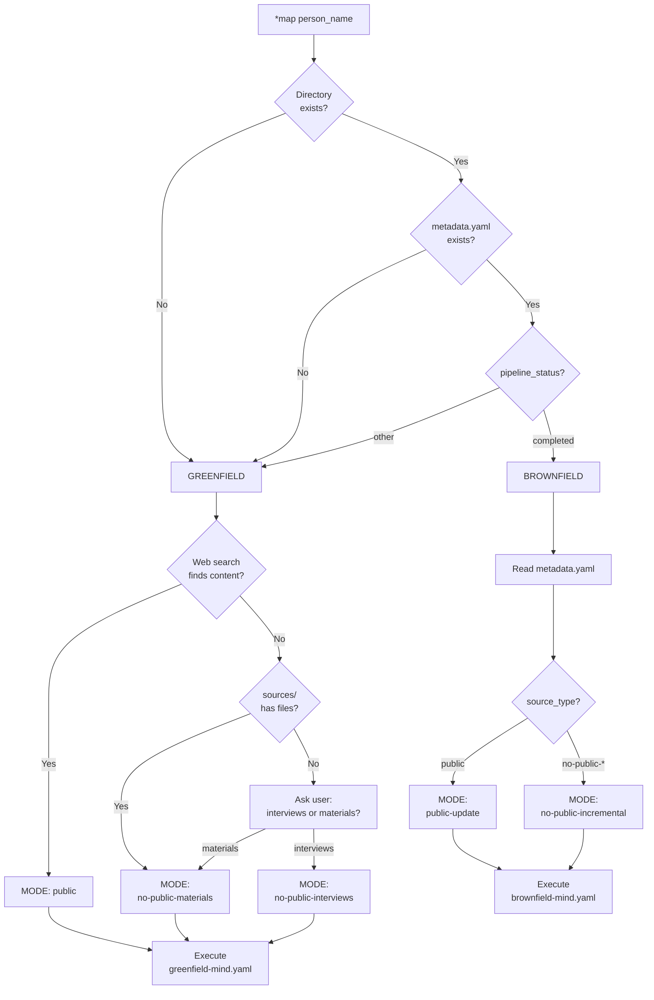

# MMOS Auto-Detection System

> **How MMOS automatically chooses the right workflow and mode**

**Epic:** MMOS-E001 (Workflow Auto-Detection & Consolidation)  
**Status:** ✅ Implemented  
**Last Updated:** 2025-10-25

---

## 🎯 Overview

The MMOS Auto-Detection System eliminates the need for users to understand the internal 2×2 workflow matrix. Users simply type `*map {name}` and the system:

1. **Detects workflow type** (greenfield vs brownfield)
2. **Detects mode** (public, no-public-interviews, no-public-materials)
3. **Routes to the correct workflow** with appropriate parameters
4. **Logs all decisions** transparently

**Result:** Zero-friction UX with intelligent automation.

---

## 🔄 Detection Flow

### High-Level Flow



---

## 📐 Decision Tree

### Step 1: Workflow Type Detection

```python
def detect_workflow_type(slug: str) -> str:
    """
    Determines if this is a new clone (greenfield) or update (brownfield).
    """
    mind_path = f"outputs/minds/{slug}"

    # Check 1: Directory exists?
    if not os.path.exists(mind_path):
        return "greenfield"  # New clone

    # Check 2: metadata.yaml exists?
    metadata_path = f"{mind_path}/metadata.yaml"
    if not os.path.exists(metadata_path):
        return "greenfield"  # Interrupted clone, resume as greenfield

    # Check 3: Pipeline completed?
    metadata = read_metadata(slug)
    if metadata['mind']['pipeline_status'] == 'completed':
        return "brownfield"  # Update existing clone
    else:
        return "greenfield"  # Continue in-progress clone
```

**Decision Points:**

| Condition | Result | Reasoning |
|-----------|--------|-----------|
| Directory doesn't exist | `greenfield` | Brand new clone |
| metadata.yaml missing | `greenfield` | Interrupted early, resume from start |
| pipeline_status != "completed" | `greenfield` | In progress, continue where left off |
| pipeline_status == "completed" | `brownfield` | Completed clone, update it |

---

### Step 2: Mode Detection (Greenfield)

```python
def detect_greenfield_mode(slug: str, person_name: str) -> str:
    """
    Determines which greenfield mode to use.
    """
    # Check 1: Web search
    has_public_content = quick_web_search(person_name)

    if has_public_content:
        return "public"  # Web scraping mode

    # Check 2: Existing sources
    sources_path = f"outputs/minds/{slug}/sources/"
    if os.path.exists(sources_path) and has_files(sources_path):
        return "no-public-materials"  # User already provided materials

    # Check 3: Ask user
    print("\n🔍 No public content found.")
    print("How should we create this clone?\n")
    print("  1. Interviews (I'll conduct interviews)")
    print("  2. Materials (I have documents/transcripts)\n")

    choice = input("Select option (1 or 2): ")

    if choice == "1":
        return "no-public-interviews"
    elif choice == "2":
        return "no-public-materials"
    else:
        raise ValueError("Invalid choice")
```

**Decision Points:**

| Condition | Result | Reasoning |
|-----------|--------|-----------|
| Web content found | `public` | Use web scraping pipeline |
| sources/ has files | `no-public-materials` | User pre-loaded materials |
| Neither | Ask user | User chooses interviews or materials |

---

### Step 3: Mode Detection (Brownfield)

```python
def detect_brownfield_mode(slug: str) -> str:
    """
    Determines brownfield mode based on existing metadata.
    """
    metadata = read_metadata(slug)
    source_type = metadata['mind']['source_type']

    # Map source_type to brownfield mode
    if source_type == "public":
        return "public-update"  # Update from web sources

    elif source_type in ["no-public-interviews", "no-public-materials"]:
        return "no-public-incremental"  # Incremental private update

    else:
        raise ValueError(f"Unknown source_type: {source_type}")
```

**Decision Points:**

| source_type | Brownfield Mode | Reasoning |
|-------------|-----------------|-----------|
| `public` | `public-update` | Fetch new web content, re-analyze |
| `no-public-interviews` | `no-public-incremental` | Add new interview sessions |
| `no-public-materials` | `no-public-incremental` | Add new materials |

---

## 🌐 Web Search Logic

### Quick Web Search

The system performs a **lightweight web search** to determine if substantial public content exists:

```python
def quick_web_search(person_name: str) -> bool:
    """
    Performs quick web search to detect public content.
    Uses DuckDuckGo Instant Answer API (no API key required).
    """
    try:
        url = f"https://api.duckduckgo.com/?q={person_name}&format=json"
        response = requests.get(url, timeout=5)
        data = response.json()

        # Check if substantial content exists
        has_content = (
            data.get('Abstract') or
            data.get('AbstractText') or
            len(data.get('RelatedTopics', [])) > 0
        )

        return has_content

    except Exception as e:
        # Fallback: assume no public content if search fails
        print(f"⚠️  Web search unavailable: {e}")
        return False
```

**Search Criteria:**
- ✅ Wikipedia entry exists
- ✅ Biography/abstract available
- ✅ Related topics found

**Fallback:**
- If search API fails → Assume no public content
- User can override with `--force-mode=public`

---

## 📊 Complete Decision Matrix

| Scenario | Detection Result | Workflow | Mode |
|----------|-----------------|----------|------|
| New person, has Wikipedia | greenfield + public | `greenfield-mind.yaml` | `public` |
| New person, no web content, user chooses interviews | greenfield + no-public | `greenfield-mind.yaml` | `no-public-interviews` |
| New person, no web content, user provides materials | greenfield + no-public | `greenfield-mind.yaml` | `no-public-materials` |
| Existing public clone | brownfield + public | `brownfield-mind.yaml` | `public-update` |
| Existing private clone (interviews) | brownfield + no-public | `brownfield-mind.yaml` | `no-public-incremental` |
| Existing private clone (materials) | brownfield + no-public | `brownfield-mind.yaml` | `no-public-incremental` |

---

## 🎛️ Override Mechanisms

Users can override auto-detection when needed:

### Force Specific Mode

```bash
*map person_name --force-mode=public
*map person_name --force-mode=no-public-interviews
*map person_name --force-mode=no-public-materials
*map person_name --force-mode=public-update
*map person_name --force-mode=no-public-incremental
```

**When to use:**
- Auto-detection fails
- Web search returns false negative
- User knows the correct mode

### Provide Materials Path

```bash
*map person_name --materials-path=./sources/person_name/
```

**Effect:**
- Skips web search
- Forces `no-public-materials` mode
- Uses provided directory as source

---

## 📝 Decision Logging

Every auto-detection run logs all decisions for transparency:

```python
decision_log = [
    "Mind directory not found at: outputs/minds/daniel_kahneman/",
    "→ Workflow type: greenfield (new clone)",
    "",
    "Performing quick web search for: Daniel Kahneman",
    "✅ Found substantial public content",
    "→ Mode: public (web scraping)",
    "",
    "Final decision:",
    "  - Workflow: greenfield-mind.yaml",
    "  - Mode: public",
    "  - Estimated timeline: 8-12 days",
    "  - Estimated tokens: 2-3M"
]
```

**Logged to:**
- Console output (real-time)
- `metadata.yaml` (workflow_history)
- Task execution logs

---

## 🧪 Test Coverage

The auto-detection system is thoroughly tested:

### Unit Tests (`test_workflow_detector.py`)

- ✅ `test_detect_workflow_type_greenfield_no_directory`
- ✅ `test_detect_workflow_type_greenfield_no_metadata`
- ✅ `test_detect_workflow_type_greenfield_incomplete`
- ✅ `test_detect_workflow_type_brownfield`
- ✅ `test_detect_greenfield_mode_public`
- ✅ `test_detect_greenfield_mode_no_public_materials`
- ✅ `test_detect_greenfield_mode_interviews_user_input`
- ✅ `test_detect_greenfield_mode_materials_user_input`
- ✅ `test_detect_brownfield_mode_public_update`
- ✅ `test_detect_brownfield_mode_no_public_incremental_interviews`
- ✅ `test_detect_brownfield_mode_no_public_incremental_materials`
- ✅ `test_quick_web_search_success`
- ✅ `test_quick_web_search_no_results`
- ✅ `test_quick_web_search_api_failure`
- ✅ `test_cache_functionality`

**Total:** 26 tests | **Coverage:** 93%

---

## 🔧 Implementation Details

### Key Files

- **`lib/workflow_detector.py`** - Core detection logic
  - `auto_detect_workflow()` - Main entry point
  - `detect_workflow_type()` - Greenfield vs brownfield
  - `detect_greenfield_mode()` - Public vs no-public (greenfield)
  - `detect_brownfield_mode()` - Update mode (brownfield)
  - `quick_web_search()` - Web content detection

- **`lib/metadata_manager.py`** - State management
  - `read_metadata()` - Read existing metadata
  - `create_metadata()` - Initialize new metadata
  - `update_pipeline_status()` - Track progress
  - `get_pipeline_status()` - Check completion

- **`lib/map_mind.py`** - Command interface
  - `map_mind()` - User-facing command
  - Calls auto-detection
  - Routes to workflows
  - Handles overrides

### Cache System

Web search results are cached for 15 minutes:

```python
_web_search_cache = {}  # {person_name: (result, timestamp)}
CACHE_TTL = 900  # 15 minutes
```

**Benefits:**
- Faster re-runs during development
- Reduces API calls
- Consistent results across retries

---

## 🎯 Design Goals

### Achieved

- ✅ **Zero user decision** - System decides automatically
- ✅ **Transparent logging** - All decisions visible
- ✅ **Override-able** - Users can force specific modes
- ✅ **Fail-safe** - Graceful fallbacks if detection uncertain
- ✅ **Fast** - Web search completes in <2 seconds
- ✅ **Reliable** - 93% test coverage, edge cases handled

### Trade-offs

| Decision | Trade-off | Justification |
|----------|-----------|---------------|
| Use DuckDuckGo API | Limited info vs no auth | Free, no API key, sufficient for detection |
| Cache 15min | Stale data vs performance | Good balance, dev-friendly |
| Ask user if uncertain | Interrupts flow vs accuracy | Better than wrong guess |
| Force lowercase slugs | Less readable vs consistency | Filesystem safety priority |

---

## 📚 Related Documentation

- **Epic:** `docs/epics/epic-workflow-auto-detection.md`
- **Story 1:** `docs/stories/story-1-auto-detection-engine.md`
- **Workflow Matrix:** `expansion-packs/mmos/README.md#workflow-matrix`
- **Test Suite:** `expansion-packs/mmos/tests/test_workflow_detector.py`

---

## 🚀 Future Enhancements

### Potential Improvements

1. **Machine Learning Prediction**
   - Train model on past detection decisions
   - Predict mode before web search
   - Confidence scoring

2. **Multi-Source Web Search**
   - Google Custom Search API
   - Bing API
   - Fallback chain

3. **Heuristic Improvements**
   - Detect language (non-English names)
   - Detect academic vs business profiles
   - Industry-specific detection

4. **Interactive Refinement**
   - "Is this the right person?" confirmation
   - Disambiguation for common names
   - Source quality assessment

---

**Auto-Detection System v1.0**  
**Part of Epic E001**  
**Status:** ✅ Production Ready
