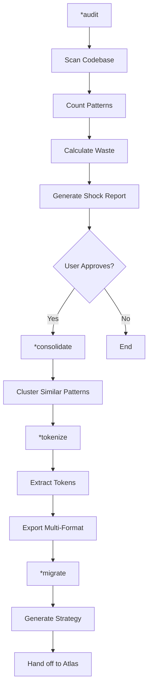
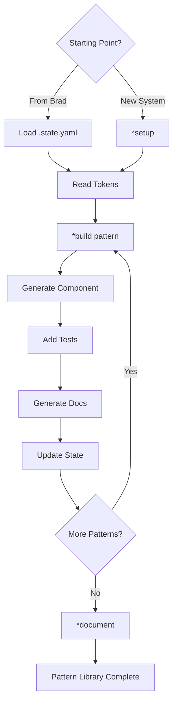

# Product Requirements Document: Design System Expansion Pack

**Version:** 1.0
**Status:** Draft - Architecture Review
**Last Updated:** 2025-10-26
**Owner:** Product Architecture Team
**Stakeholders:** AIOS Core, MMOS, CreatorOS, InnerLens teams

---

## Executive Summary

### The Problem

Modern development teams waste 30-40% of their engineering time rebuilding the same UI components with slight variations, creating:

- **Technical Debt**: 30-50+ variations of the same component (buttons, forms, inputs)
- **Maintenance Burden**: $20k-50k/month in redundant code maintenance
- **Inconsistent UX**: Users experience different interfaces across products
- **Slow Development**: Prolonged feature development due to decision paralysis and pattern reinvention

**Real-world example**: A typical React codebase has 37 different button implementations when it should have 3.

### The Solution

A design system expansion pack for AIOS-FULLSTACK that:

1. **Audits existing chaos** - Automatically scans codebases to find redundant patterns
2. **Generates shock reports** - Visual evidence of waste with ROI calculations
3. **Consolidates intelligently** - Reduces patterns using clustering algorithms
4. **Builds token systems** - Creates single source of truth for design decisions
5. **Migrates gradually** - Phased rollout strategy to minimize disruption

### Success Criteria

- **80%+ pattern reduction** in brownfield projects (47 buttons → 3)
- **3-6x development velocity** improvement after adoption
- **Measurable cost reduction** in maintenance burden
- **Positive ROI** demonstrated through real project usage
- **85%+ adoption rate** within existing expansion packs (MMOS, CreatorOS, InnerLens)

---

## Product Vision

### Mission Statement

> "Eliminate UI redundancy through intelligent automation, enabling teams to build consistent, accessible interfaces at AI-native speed while drastically reducing maintenance costs."

### Core Philosophy (Brad Frost-Inspired)

1. **Inventory First, Always** - You can't fix what you can't measure
2. **Tokens as Foundation** - All design decisions codified and reusable
3. **Atomic Design** - Build systems, not pages
4. **Measure Reduction** - Success is fewer components, not more
5. **Visual Shock Therapy** - Show the waste to drive action
6. **Outcome-Based Progress** - Measure by results achieved, not time elapsed

### Target Users

#### Primary Persona: Full-Stack Developer (Solo/Small Team)
- **Pain**: "I'm not a designer but need professional UIs"
- **Current Solution**: Copy-paste from past projects, inconsistent results
- **With Design System Pack**: Audit reveals chaos → tokens provide constraints → components built rapidly
- **Value**: 4x faster feature development, professional consistency

#### Secondary Persona: Frontend Lead (Medium Team)
- **Pain**: "Team creates 5 different buttons per sprint"
- **Current Solution**: Manual code reviews, style guides nobody follows
- **With Design System Pack**: Automated pattern detection → shock reports for stakeholders → enforced system
- **Value**: $300k/year savings, team velocity increase

#### Tertiary Persona: Product Designer (Using AIOS)
- **Pain**: "Developers don't implement designs consistently"
- **Current Solution**: Detailed specs, constant review cycles
- **With Design System Pack**: Token-based specs → automated implementation → guaranteed consistency
- **Value**: 70% less review time, pixel-perfect implementation

---

## Product Goals & Non-Goals

### Goals

#### Maturity Level 1: Foundation (MVP)
**Prerequisite**: None - Greenfield start
**Outcomes**:
- ✅ Audit existing codebases to identify pattern redundancy
- ✅ Generate visual shock reports with ROI calculations
- ✅ Extract and consolidate design tokens intelligently
- ✅ Build atomic components from token systems
- ✅ Create phased migration strategies

**Done When**:
- Can scan 100k LOC React codebase
- Generates accurate shock reports with pattern counts
- Consolidates patterns with >80% reduction
- Produces working TypeScript components from tokens
- State persists between Brad and Atlas agents

#### Maturity Level 2: Integration
**Prerequisite**: Level 1 complete + production validation
**Outcomes**:
- ✅ Integrate with MMOS for cognitive clone interfaces
- ✅ Integrate with CreatorOS for course platform UIs
- ✅ Integrate with InnerLens for assessment forms
- ✅ Establish cross-pack design language
- ✅ Automated pattern validation in CI/CD

**Done When**:
- At least 1 expansion pack successfully uses design system
- Cross-pack design tokens work seamlessly
- Personality-based token variations operational (MMOS)
- CI/CD prevents non-system pattern commits

#### Maturity Level 3: Intelligence (Advanced)
**Prerequisite**: Level 2 complete + adoption metrics positive
**Outcomes**:
- ✅ Machine learning for pattern similarity detection
- ✅ Automated accessibility compliance checking
- ✅ Performance optimization recommendations
- ✅ Usage analytics and pattern effectiveness tracking
- ✅ Community pattern library marketplace

**Done When**:
- ML model achieves >95% pattern detection accuracy
- A11y violations auto-detected and fixed
- Performance recommendations reduce bundle size >20%
- Community contributes at least 10 patterns

### Non-Goals

#### Explicitly Out of Scope
- ❌ **Visual design tools** - Not building Figma competitor
- ❌ **User research platform** - Not building analytics/testing tools
- ❌ **Design asset management** - Not managing images, fonts, etc.
- ❌ **Backend architecture** - UI patterns only
- ❌ **Mobile native** - Web/React focus initially
- ❌ **Multi-framework support** - React primary, Vue/Svelte later

#### May Consider Later
- ⚠️ Figma plugin for token sync
- ⚠️ Storybook integration
- ⚠️ Visual regression testing
- ⚠️ A/B testing framework
- ⚠️ Real-time collaboration features

---

## User Stories & Acceptance Criteria

### Epic 1: Brownfield Audit & Consolidation

#### Story 1.1: Interface Inventory Scanner
**As a** developer with an existing codebase
**I want to** automatically scan for UI pattern redundancies
**So that** I can understand the scope of technical debt

**Acceptance Criteria:**
- [ ] Scans React, Vue, and vanilla HTML/CSS codebases
- [ ] Detects buttons, forms, inputs, colors, spacing, typography, shadows
- [ ] Counts both unique patterns AND total usage instances
- [ ] Completes scan of 100k LOC codebase efficiently
- [ ] Outputs structured JSON with pattern metadata
- [ ] Handles TypeScript, JSX, styled-components, CSS modules, Tailwind

**Technical Requirements:**
```python
scan_result = {
    'buttons': {
        'unique_count': 47,
        'total_usage': 327,
        'redundancy_factor': 6.96,
        'examples': [...],
        'files': [...]
    },
    'colors': {
        'unique_count': 89,
        'total_usage': 1247,
        'hex_values': [...],
        'usage_frequency': {...}
    }
}
```

**Test Scenarios:**
```gherkin
# Happy Path
✅ GIVEN a React codebase with 100k LOC containing 47 button patterns
   WHEN Brad executes *audit ./src
   THEN the scan completes in <2 minutes
   AND outputs valid JSON with accurate pattern counts (±5% tolerance)
   AND generates shock report HTML

# Error Handling
❌ GIVEN a codebase with 5 malformed JSX files
   WHEN Brad executes *audit ./src
   THEN the scanner logs warnings for corrupted files
   AND continues scanning remaining files
   AND reports which files were skipped with reasons
   AND does NOT crash or fail entirely
```

#### Story 1.2: Visual Shock Report Generator
**As a** engineering manager
**I want to** see visual evidence of UI redundancy with cost analysis
**So that** I can justify design system investment to stakeholders

**Acceptance Criteria:**
- [ ] Generates self-contained HTML report (zero external dependencies)
- [ ] Displays all button variations side-by-side visually
- [ ] Calculates monthly/annual maintenance costs
- [ ] Shows "consolidated future state" preview (47 → 3)
- [ ] Includes savings calculator with developer salary inputs
- [ ] Exports to PDF for executive presentations
- [ ] Responsive design for mobile viewing

**Visual Requirements:**
- Horror show section: All variations displayed
- Cost calculator: Monthly, annual, comparison to salaries
- Consolidation preview: Proposed minimal set
- Timeline: Estimated migration effort
- ROI chart: Investment vs. savings over time

#### Story 1.3: Smart Pattern Consolidation
**As a** system architect
**I want to** automatically consolidate similar patterns
**So that** I don't manually compare 47 button variations

**Acceptance Criteria:**
- [ ] Clusters similar colors within 5% HSL difference
- [ ] Groups buttons by visual similarity (size, padding, colors)
- [ ] Identifies semantic purposes (primary, secondary, destructive)
- [ ] Suggests consolidated pattern names
- [ ] Shows consolidation impact (47 → 3 = 93.6% reduction)
- [ ] Allows manual override of clustering decisions
- [ ] Generates migration mapping (old → new)

**Algorithm Requirements:**
```python
# Color clustering example
colors = ['#0066CC', '#0065CB', '#0067CD', '#FF0000', '#FE0101']
clustered = cluster_similar_colors(colors, threshold=0.05)
# Result: [['#0066CC', '#0065CB', '#0067CD'], ['#FF0000', '#FE0101']]
# Consolidated: ['#0066CC', '#FF0000']
```

**Test Scenarios:**
```gherkin
# Happy Path
✅ GIVEN 89 color values detected by scanner with similar blues (#0066CC, #0065CB, #0067CD)
   WHEN Brad executes *consolidate with threshold=0.05
   THEN similar colors are clustered into 1 group
   AND most-used color becomes primary (#0066CC)
   AND consolidation shows 89 → 12 colors (86.5% reduction)
   AND migration mapping generated (old hex → new token)

# User Override
⚠️ GIVEN consolidation suggests merging #0066CC and #0052A3
   WHEN user marks #0052A3 as "DO NOT MERGE - intentional hover variant"
   THEN both colors preserved as separate tokens (primary, primary-dark)
   AND manual override logged in state file
   AND consolidation report updated
```

### Epic 2: Token System Generation

#### Story 2.1: Token Extraction from Existing Code
**As a** developer migrating to design system
**I want to** extract design tokens from my existing codebase
**So that** I preserve existing visual design while consolidating code

**Acceptance Criteria:**
- [ ] Extracts colors, spacing, typography, shadows, borders, radii
- [ ] Identifies most-used values as primary tokens
- [ ] Detects semantic relationships (hover states, dark variants)
- [ ] Generates token names following naming conventions
- [ ] Shows consolidation report (89 colors → 12 tokens)
- [ ] Validates token completeness (covers 95%+ of usage)

**Token Schema:**
```yaml
tokens:
  color:
    primary: "#0066CC"           # Used 234 times
    primary-dark: "#0052A3"      # Used 89 times (hover variant detected)
    error: "#DC2626"             # Used 45 times
    error-light: "#FEE2E2"       # Used 23 times (background variant)
  spacing:
    xs: "4px"    # 18.5% usage
    sm: "8px"    # 31.2% usage
    md: "16px"   # 35.7% usage
    lg: "24px"   # 14.6% usage
  typography:
    font-base: "Inter, system-ui, sans-serif"
    size-sm: "14px"
    size-base: "16px"
    size-lg: "20px"
    weight-normal: 400
    weight-semibold: 600
    weight-bold: 700
```

**Test Scenarios:**
```gherkin
# Happy Path
✅ GIVEN consolidation produced 12 color tokens, 8 spacing tokens
   WHEN Brad executes *tokenize
   THEN tokens.yaml is generated with semantic names (primary, error, success)
   AND hover variants detected automatically (primary-dark)
   AND coverage validation shows 95%+ of original values mapped
   AND token names follow kebab-case convention

# Error Handling
❌ GIVEN consolidation data contains invalid color value "not-a-color"
   WHEN Brad executes *tokenize
   THEN validator detects invalid format
   AND displays error: "Invalid token value for 'color-primary': must be hex, rgb, or hsl"
   AND no token files generated until errors fixed
```

#### Story 2.2: Multi-Format Token Export
**As a** frontend developer
**I want to** use design tokens in my preferred format
**So that** I can integrate with my existing toolchain

**Acceptance Criteria:**
- [ ] Exports to JSON (JavaScript import)
- [ ] Exports to CSS custom properties (`:root {}`)
- [ ] Exports to Tailwind config (`tailwind.config.js`)
- [ ] Exports to SCSS variables (`$color-primary`)
- [ ] Exports to Style Dictionary format (advanced transformations)
- [ ] All formats stay in sync (single source of truth)
- [ ] Validates exported tokens against schema

**Export Formats:**
```javascript
// tokens.json
{
  "color": {
    "primary": "#0066CC",
    "primary-dark": "#0052A3"
  }
}

// tokens.css
:root {
  --color-primary: #0066CC;
  --color-primary-dark: #0052A3;
}

// tokens.tailwind.js
module.exports = {
  theme: {
    extend: {
      colors: {
        primary: '#0066CC',
        'primary-dark': '#0052A3'
      }
    }
  }
}
```

### Epic 3: Component Generation

#### Story 3.1: Atomic Component Builder
**As a** developer
**I want to** generate React components from design tokens
**So that** I can implement UIs 6x faster

**Acceptance Criteria:**
- [ ] Generates TypeScript React components
- [ ] Uses tokens for all styling (no hardcoded values)
- [ ] Includes all variants (primary, secondary, destructive)
- [ ] Supports all sizes (small, medium, large)
- [ ] Implements full accessibility (WCAG AA)
- [ ] Includes TypeScript prop types
- [ ] Generates unit tests
- [ ] Generates Storybook stories (optional)

**Generated Component Example:**
```typescript
// Button.tsx
import { tokens } from '../tokens';

interface ButtonProps {
  variant?: 'primary' | 'secondary' | 'destructive';
  size?: 'sm' | 'md' | 'lg';
  children: React.ReactNode;
  onClick?: () => void;
  disabled?: boolean;
}

export const Button: React.FC<ButtonProps> = ({
  variant = 'primary',
  size = 'md',
  children,
  onClick,
  disabled = false
}) => {
  return (
    <button
      className={`btn btn-${variant} btn-${size}`}
      onClick={onClick}
      disabled={disabled}
      aria-disabled={disabled}
    >
      {children}
    </button>
  );
};

// CSS uses tokens
.btn {
  font-family: var(--font-base);
  border-radius: var(--radius-base);
  padding: var(--space-md) var(--space-lg);
  transition: all 0.2s;
}

.btn-primary {
  background: var(--color-primary);
  color: white;
}

.btn-primary:hover {
  background: var(--color-primary-dark);
}
```

**Test Scenarios:**
```gherkin
# Happy Path
✅ GIVEN tokens.yaml contains color, spacing, typography tokens
   WHEN Atlas executes *build button
   THEN Button.tsx is generated with TypeScript React component
   AND all styling uses token variables (no hardcoded values)
   AND component includes variants (primary, secondary, destructive)
   AND Button.test.tsx is generated with unit tests
   AND accessibility attributes present (aria-disabled)

# Error Handling
❌ GIVEN tokens.yaml is missing required token "color-primary"
   WHEN Atlas executes *build button
   THEN component generation fails with clear error
   AND displays: "Missing required token: color-primary"
   AND suggests running Brad's *tokenize again
   AND no incomplete component generated
```

#### Story 3.2: Automated Documentation Generation
**As a** team member
**I want to** automatically generated documentation for all patterns
**So that** everyone knows how to use the design system

**Acceptance Criteria:**
- [ ] Generates markdown documentation for each component
- [ ] Includes usage examples with code snippets
- [ ] Shows all variants and sizes visually
- [ ] Documents props and TypeScript types
- [ ] Includes accessibility notes
- [ ] Links to Storybook (if available)
- [ ] Auto-updates when components change
- [ ] Searchable pattern library

**Documentation Example:**
```markdown
# Button Component

A versatile button component built from design tokens.

## Usage

\`\`\`tsx
import { Button } from '@design-system/atoms';

<Button variant="primary" size="md" onClick={handleClick}>
  Click Me
</Button>
\`\`\`

## Variants

- **primary**: Main call-to-action
- **secondary**: Secondary actions
- **destructive**: Dangerous actions (delete, remove)

## Accessibility

- ✅ WCAG AA compliant
- ✅ Keyboard navigable
- ✅ Screen reader friendly
- ✅ Focus indicators
- ✅ Disabled state handling
```

### Epic 4: Migration & State Management

#### Story 4.1: Phased Migration Strategy Generator
**As a** tech lead
**I want to** get a realistic migration plan
**So that** I can gradually adopt the design system without blocking sprints

**Acceptance Criteria:**
- [ ] Generates 4-phase migration plan
- [ ] Prioritizes high-impact patterns first (most-used)
- [ ] Identifies dependencies between patterns
- [ ] Suggests gradual rollout strategy
- [ ] Includes rollback procedures
- [ ] Tracks migration progress
- [ ] Calculates ROI per phase

**Migration Plan Structure:**
```markdown
# Migration Strategy

## Phase 1: Foundation
**Goal**: Deploy token system, no visual changes
**Prerequisites**: None
**Tasks**:
- [ ] Add token files to project
- [ ] Configure build pipeline
- [ ] Update existing CSS to use tokens (automated)
- [ ] No component changes yet
**Risk**: Low
**Done When**: Tokens deployed, no visual regressions

## Phase 2: High-Impact Patterns
**Goal**: Replace most-used components for immediate ROI
**Prerequisites**: Phase 1 complete
**Tasks**:
- [ ] Replace Button (327 instances → 3 variants)
- [ ] Replace Input (189 instances → 5 variants)
- [ ] Replace Card (145 instances → 2 variants)
**Risk**: Medium
**Done When**: Top 3 patterns migrated, measurable velocity improvement

## Phase 3: Long-Tail Cleanup
**Goal**: Consolidate remaining patterns
**Prerequisites**: Phase 2 complete
**Tasks**:
- [ ] Forms (23 variations → 5)
- [ ] Modals (12 variations → 2)
- [ ] Navigation (8 variations → 3)
**Risk**: Low
**Done When**: >85% pattern consolidation achieved

## Phase 4: Enforcement
**Goal**: Prevent regression
**Prerequisites**: Phase 3 complete
**Tasks**:
- [ ] Add CI/CD pattern validation
- [ ] Deprecate old components
- [ ] Block non-system patterns
- [ ] Monitor adoption metrics
**Risk**: Low
**Done When**: System enforced, adoption sustained
```

#### Story 4.2: State Persistence Between Agent Calls
**As an** AIOS agent
**I want to** access context from previous agent activations
**So that** I don't lose critical information between Brad and Atlas

**Acceptance Criteria:**
- [ ] Persists state to `.state.yaml` in outputs directory
- [ ] Tracks current phase (inventory, consolidation, building, maintaining)
- [ ] Stores inventory results, token locations, migration progress
- [ ] Brad writes state, Atlas reads it seamlessly
- [ ] Validates state schema on read/write
- [ ] Handles concurrent access gracefully
- [ ] Includes state versioning for backward compatibility

**State Schema:**
```yaml
# outputs/design-system/{project}/.state.yaml
version: "1.0"
project_name: "my-app"
created_at: "2025-10-26T10:00:00Z"
updated_at: "2025-10-26T15:30:00Z"

system_state:
  phase: consolidation  # inventory | consolidation | building | maintaining

  inventory:
    scanned_at: "2025-10-26T10:00:00Z"
    scan_path: "./src"
    total_files: 487
    patterns:
      buttons:
        unique: 47
        instances: 327
        redundancy_factor: 6.96
      colors:
        unique: 89
        instances: 1247
    estimated_waste: "$23,456/month"

  consolidation:
    completed_at: "2025-10-26T12:00:00Z"
    patterns_consolidated:
      buttons:
        before: 47
        after: 3
        reduction: "93.6%"
      colors:
        before: 89
        after: 12
        reduction: "86.5%"

  tokens:
    generated_at: "2025-10-26T13:00:00Z"
    version: "1.0.0"
    location: "outputs/design-system/my-app/tokens/tokens.yaml"
    exports:
      - tokens.json
      - tokens.css
      - tokens.tailwind.js

  patterns:
    atoms_built: 8
    molecules_built: 5
    organisms_built: 2
    documented: 15
    tested: 12

  migration:
    strategy_created_at: "2025-10-26T14:00:00Z"
    current_phase: 2
    total_phases: 4
    completion_percentage: 45
    estimated_completion: "2025-11-23"

agent_history:
  - agent: brad
    command: audit
    timestamp: "2025-10-26T10:00:00Z"
  - agent: brad
    command: consolidate
    timestamp: "2025-10-26T12:00:00Z"
  - agent: atlas
    command: implement
    args: ["button"]
    timestamp: "2025-10-26T15:00:00Z"
```

**Test Scenarios:**
```gherkin
# Happy Path
✅ GIVEN Brad has completed audit, consolidate, tokenize
   WHEN Atlas executes *setup (reads .state.yaml)
   THEN state loads successfully with all Brad's data
   AND Atlas displays summary: "Found 12 color tokens, 8 spacing tokens"
   AND token locations loaded from state
   AND no data lost in handoff

# Corruption Recovery
❌ GIVEN .state.yaml is corrupted (invalid YAML or checksum mismatch)
   WHEN Atlas attempts to read state
   THEN corruption detected immediately
   AND displays error: "State file corrupted. Restoring from backup..."
   AND loads .state.yaml.backup automatically
   AND continues with recovered state
```

### Epic 5: Expansion Pack Integration

#### Story 5.1: MMOS Cognitive Clone Interface Integration
**As a** MMOS user
**I want** cognitive clone interfaces to use the design system
**So that** all clones have consistent, professional UIs

**Acceptance Criteria:**
- [ ] MMOS pipeline generates clone interfaces from design system patterns
- [ ] Personality traits map to token variations (formal → serif font)
- [ ] Chat interface uses system components (input, message bubble, avatar)
- [ ] Communication style affects spacing and density
- [ ] All clone UIs maintain accessibility standards
- [ ] Integration documented in MMOS workflow

**Integration Pattern:**
```yaml
# expansion-packs/mmos/.design-system/patterns/clone-chat.yaml
pattern: clone-chat-interface
extends: base-chat-component
personality_mapping:
  formal:
    tokens:
      font-family: var(--font-serif)
      spacing-unit: var(--space-formal)
      color-primary: var(--color-corporate)
  casual:
    tokens:
      font-family: var(--font-sans)
      spacing-unit: var(--space-relaxed)
      color-primary: var(--color-friendly)
  technical:
    tokens:
      font-family: var(--font-mono)
      spacing-unit: var(--space-compact)
      color-primary: var(--color-technical)
```

**Test Scenarios:**
```gherkin
# Happy Path
✅ GIVEN MMOS pipeline creates cognitive clone with personality="formal"
   WHEN MMOS generates clone interface using design system
   THEN interface uses serif fonts (formal personality tokens)
   AND chat components from design system (Input, MessageBubble, Avatar)
   AND all components pass WCAG AA accessibility tests
   AND personality mapping documented in clone metadata

# Fallback Handling
⚠️ GIVEN cognitive clone has personality="eccentric" (no token mapping exists)
   WHEN MMOS attempts to apply personality styling
   THEN system logs warning: "No mapping for 'eccentric', using defaults"
   AND falls back to "balanced" tokens
   AND interface generates successfully with default styling
```

#### Story 5.2: CreatorOS Course Platform Integration
**As a** CreatorOS user
**I want** generated courses to have consistent, learner-optimized UIs
**So that** students have better learning experiences

**Acceptance Criteria:**
- [ ] Course platform components use design system
- [ ] Learning-optimized tokens (readable spacing, typography)
- [ ] Video player, quiz, progress components from patterns
- [ ] Accessibility features built-in (WCAG AAA for education)
- [ ] Responsive design for mobile learners
- [ ] Integration documented in CreatorOS workflow

**Integration Pattern:**
```yaml
# expansion-packs/creator-os/.design-system/patterns/course-player.yaml
pattern: course-video-player
extends: base-media-component
learning_optimizations:
  tokens:
    font-size: var(--font-readable)     # 18px for readability
    line-height: var(--line-comfortable) # 1.6 for comprehension
    spacing-unit: var(--space-educational) # Generous whitespace
    color-focus: var(--color-highlight)  # Emphasize key content
    color-progress: var(--color-success) # Visual reinforcement
```

**Test Scenarios:**
```gherkin
# Happy Path
✅ GIVEN CreatorOS generates course "Supabase Zero to Hero"
   WHEN course platform interface built using design system
   THEN platform uses educational tokens (18px font, 1.7 line-height)
   AND components include VideoPlayer, QuizQuestion, ProgressBar
   AND interface passes WCAG AAA accessibility tests
   AND responsive on mobile (390px), tablet (768px), desktop (1920px)

# Performance Validation
⚡ GIVEN course platform interface generated
   WHEN interface loads in browser
   THEN initial page load <3 seconds
   AND all design system components render correctly
   AND no visual regressions detected
```

#### Story 5.3: InnerLens Assessment Form Integration
**As an** InnerLens user
**I want** psychometric assessments to use design system forms
**So that** test-takers have consistent, distraction-free experiences

**Acceptance Criteria:**
- [ ] Assessment forms use system input components
- [ ] Minimal distractions (neutral colors, clean layout)
- [ ] Progress indicators from design system
- [ ] Validation patterns shared across assessments
- [ ] Accessible to all users (WCAG AAA)
- [ ] Integration documented in InnerLens workflow

**Test Scenarios:**
```gherkin
# Happy Path
✅ GIVEN InnerLens generates psychometric assessment "Big Five Personality"
   WHEN assessment form built using design system
   THEN form uses minimal-distraction tokens (neutral colors, clean layout)
   AND components include QuestionPrompt, RadioGroup, ScaleInput, ProgressIndicator
   AND all form fields pass WCAG AAA accessibility tests
   AND validation patterns consistent across all questions

# Accessibility Validation
♿ GIVEN assessment form generated with design system
   WHEN automated accessibility tests run
   THEN color contrast ≥7:1 for all text (WCAG AAA)
   AND keyboard navigation works (Tab through all fields)
   AND screen reader announces questions clearly
   AND no color-only indicators (icons + text used)
```

---

## Agent Specifications

### Agent 1: Brad (System Architect)

**Agent Metadata:**
```yaml
name: Brad
id: system-architect
icon: 🔍
role: Design System Architect & Pattern Consolidator
personality: Direct, metric-driven, chaos-eliminating
tagline: "Let me show you the horror show you've created"
```

**When to Activate:**
- Brownfield projects with existing UI code
- Suspected pattern redundancy
- Need for design system audit
- Migration planning required
- ROI justification needed

**Core Capabilities:**
1. **Interface Inventory** - Scan codebases for patterns
2. **Shock Report Generation** - Visual evidence + cost analysis
3. **Pattern Consolidation** - Reduce redundancy intelligently
4. **Token Extraction** - Generate tokens from existing code
5. **Migration Strategy** - Phased rollout planning
6. **ROI Calculation** - Show the money

**Commands:**
```yaml
commands:
  - *audit {path}: Scan codebase for patterns
  - *consolidate: Reduce redundancy using clustering
  - *tokenize: Generate design token system
  - *migrate: Create phased migration strategy
  - *calculate-roi: Cost analysis and savings projection
  - *shock-report: Generate visual HTML report
  - *help: Show all commands
```

**Agent Workflow:**


**State Management:**
- Writes to `.state.yaml` after each command
- Tracks: inventory results, consolidation decisions, token locations
- Provides context for Atlas agent

### Agent 2: Atlas (System Builder)

**Agent Metadata:**
```yaml
name: Atlas
id: system-builder
icon: 🏗️
role: Design System Builder & Component Engineer
personality: Systematic, quality-focused, implementation-oriented
tagline: "Carrying the design system world on my shoulders"
```

**When to Activate:**
- Greenfield projects (new design systems)
- Extending existing systems
- Implementing components from tokens
- Building pattern libraries
- Integrating with expansion packs

**Core Capabilities:**
1. **System Setup** - Initialize new design systems
2. **Component Generation** - Build from tokens
3. **Atomic Composition** - Molecules from atoms, organisms from molecules
4. **Documentation Generation** - Automatic pattern docs
5. **Expansion Pack Integration** - Hooks for MMOS, CreatorOS, InnerLens
6. **Pattern Extension** - Add to existing systems

**Commands:**
```yaml
commands:
  - *setup: Initialize new design system
  - *build {pattern}: Generate component from tokens
  - *compose {molecule}: Build from atoms
  - *extend {pattern}: Add to existing system
  - *document: Generate pattern library docs
  - *integrate {pack}: Connect with expansion pack
  - *help: Show all commands
```

**Agent Workflow:**


**State Management:**
- Reads from `.state.yaml` to get token locations
- Writes: patterns built, documentation generated
- Tracks: atoms, molecules, organisms, migration progress

---

## Technical Architecture

### System Components

```
design-system/
├── scanner/              # Pattern detection
│   ├── AST parsers       # JavaScript/TypeScript
│   ├── CSS parsers       # Stylesheets
│   ├── Component finder  # React/Vue components
│   └── Usage analyzer    # Frequency counting
│
├── consolidation/        # Intelligent reduction
│   ├── Color clusterer   # HSL-based grouping
│   ├── Pattern matcher   # Visual similarity
│   ├── Token extractor   # Semantic detection
│   └── Mapper generator  # Old → new mapping
│
├── generation/           # Token & component creation
│   ├── Token generator   # Multi-format export
│   ├── Component builder # React/TypeScript
│   ├── Test generator    # Unit tests
│   └── Docs generator    # Markdown docs
│
├── reporting/            # Metrics & visualization
│   ├── Shock report      # HTML visualization
│   ├── ROI calculator    # Cost analysis
│   └── Metrics tracker   # Real measurements
│
└── state/                # Persistence layer
    └── State manager     # YAML read/write
```

### Data Flow

```
1. AUDIT PHASE (Brad)
   User → @brad *audit ./src
   → Scanner parses code
   → Patterns extracted
   → Usage counted
   → State written

2. CONSOLIDATION PHASE (Brad)
   Brad reads state
   → Clusters similar patterns
   → Generates consolidation report
   → User reviews/approves
   → State updated

3. TOKEN PHASE (Brad)
   Brad reads consolidation
   → Extracts semantic tokens
   → Generates multi-format exports
   → Validates completeness
   → State updated

4. BUILD PHASE (Atlas)
   Atlas reads state
   → Loads tokens
   → Generates components
   → Writes tests + docs
   → State updated

5. INTEGRATION PHASE (Atlas)
   Atlas reads pack config
   → Generates pack-specific patterns
   → Updates pack workflows
   → Documents integration
```

### Integration Architecture

```yaml
# Cross-pack integration pattern
expansion-packs/{pack}/.design-system/
├── config.yaml              # Integration config
├── patterns/                # Pack-specific patterns
│   └── {pattern}.yaml
└── tokens/                  # Token overrides/extensions
    └── {theme}-tokens.yaml

# Example: MMOS integration
expansion-packs/mmos/.design-system/
├── config.yaml
│   integration:
│     base_system: outputs/design-system/base/
│     personality_mapping: true
│     components:
│       - clone-chat
│       - clone-avatar
│       - clone-settings
├── patterns/
│   ├── clone-chat.yaml
│   └── clone-avatar.yaml
└── tokens/
    ├── formal-personality.yaml
    ├── casual-personality.yaml
    └── technical-personality.yaml
```

### Output Structure

```
outputs/design-system/{project}/
├── .state.yaml                      # Persistent state
├── audit/
│   ├── shock-report.html           # Visual horror show
│   ├── pattern-inventory.json      # Raw scan data
│   ├── redundancy-analysis.yaml    # Detailed breakdown
│   └── cost-calculation.yaml       # ROI numbers
├── tokens/
│   ├── tokens.yaml                 # Source of truth
│   ├── tokens.json                 # JavaScript
│   ├── tokens.css                  # CSS custom properties
│   ├── tokens.scss                 # SCSS variables
│   └── tokens.tailwind.js          # Tailwind config
├── patterns/
│   ├── atoms/
│   │   ├── Button/
│   │   │   ├── Button.tsx
│   │   │   ├── Button.test.tsx
│   │   │   ├── Button.stories.tsx
│   │   │   └── Button.module.css
│   │   ├── Input/
│   │   └── ...
│   ├── molecules/
│   │   ├── FormField/
│   │   ├── Card/
│   │   └── ...
│   ├── organisms/
│   │   ├── LoginForm/
│   │   ├── Navigation/
│   │   └── ...
│   └── templates/
│       └── PageLayout/
├── migration/
│   ├── strategy.md                 # Overall plan
│   ├── phase-1-foundation.md
│   ├── phase-2-high-impact.md
│   ├── phase-3-long-tail.md
│   ├── phase-4-enforcement.md
│   ├── mapping.json                # Old → new component map
│   └── progress.yaml               # Current state
├── docs/
│   ├── pattern-library.md          # Complete documentation
│   ├── getting-started.md
│   ├── migration-guide.md
│   └── integration-guides/
│       ├── mmos.md
│       ├── creator-os.md
│       └── innerlens.md
└── metrics/
    ├── baseline.yaml               # Before metrics
    ├── current.yaml                # Current state
    └── roi-tracking.yaml           # Savings over time
```

---

## Success Metrics & KPIs

### Primary Metrics (Must Track)

#### 1. Pattern Reduction Rate
**Definition**: Percentage reduction in unique UI patterns
**Target**: >80% reduction
**Measurement**:
```python
reduction_rate = (before_unique - after_unique) / before_unique * 100
# Example: (47 - 3) / 47 * 100 = 93.6%
```

**Success Criteria:**
- Buttons: >85% reduction (typical 40-50 → 3-5)
- Forms: >75% reduction (typical 20-30 → 5-7)
- Colors: >85% reduction (typical 80-100 → 10-15)

#### 2. Development Velocity Improvement
**Definition**: Measurable speedup in feature delivery
**Target**: 3-6x faster
**Measurement**:
```yaml
# Measure actual build times before/after adoption
before:
  feature_complexity_simple: baseline_time_1
  feature_complexity_medium: baseline_time_2
  feature_complexity_complex: baseline_time_3

after:
  feature_complexity_simple: measured_time_1
  feature_complexity_medium: measured_time_2
  feature_complexity_complex: measured_time_3

velocity_multiplier = baseline / measured
# Example: If baseline=100 units, measured=20 units → 5x faster
```

**Success Criteria:**
- Simple features: 4-6x velocity multiplier
- Complex features: 3-4x velocity multiplier
- Bug fixes: 2-3x velocity multiplier (less code surface)
- Measured from real project data, not estimates

#### 3. Maintenance Cost Reduction
**Definition**: Monthly savings in maintenance effort
**Target**: $200k-500k/year (medium teams)
**Measurement**:
```python
monthly_before = redundant_patterns * hours_per_pattern * hourly_rate
monthly_after = consolidated_patterns * hours_per_pattern * hourly_rate
monthly_savings = monthly_before - monthly_after
annual_savings = monthly_savings * 12

# Example:
# Before: 127 patterns * 2 hours/month * $150/hour = $38,100/month
# After: 23 patterns * 2 hours/month * $150/hour = $6,900/month
# Savings: $31,200/month = $374,400/year
```

**Success Criteria:**
- Small teams (2-5 devs): $100k-200k/year
- Medium teams (10-20 devs): $200k-500k/year
- Large teams (50+ devs): $500k-1M+/year

#### 4. ROI Achievement
**Definition**: Demonstrable cost savings vs. implementation investment
**Target**: Positive ROI demonstrated
**Measurement**:
```python
investment = implementation_cost  # Whatever it actually costs
ongoing_savings = calculate_actual_savings()  # Measured from real usage

roi_achieved = ongoing_savings > investment
roi_ratio = ongoing_savings / investment

# Example from real usage:
# Investment: $12,000 (implementation)
# Savings: $30,000 (measured reduction)
# ROI Ratio: 2.5x (factual, not predicted)
```

**Success Criteria:**
- Positive ROI demonstrated through real projects
- ROI ratio > 2x (savings double the investment)
- Savings measurable and attributable

#### 5. Design System Adoption Rate
**Definition**: Percentage of components using system
**Target**: >85% full adoption
**Measurement**:
```python
adoption_rate = (
    components_using_system / total_components
) * 100

# Track progression through stages:
# After Stage 1 (Foundation): Baseline established
# After Stage 2 (Patterns built): Early adoption begins
# After Stage 3 (Integration): Significant adoption
# After Stage 4 (Enforcement): Full adoption
```

**Success Criteria:**
- Progressive increase after each stage completion
- >50% adoption after high-impact patterns migrated
- >85% adoption after enforcement mechanisms active
- Steady growth, not forced compliance

### Secondary Metrics (Track for Insights)

#### 6. Consistency Score
**Definition**: Visual consistency across application
**Measurement**: Automated screenshot comparison
**Target**: >90%

#### 7. Accessibility Coverage
**Definition**: Components meeting WCAG AA/AAA
**Measurement**: Automated a11y testing
**Target**: 100% AA, 80% AAA

#### 8. Developer Satisfaction
**Definition**: Team NPS for design system
**Measurement**: Periodic survey after significant usage
**Target**: NPS >50

#### 9. Test Coverage
**Definition**: Unit/integration test coverage
**Measurement**: Coverage reports
**Target**: >80% coverage

#### 10. Documentation Completeness
**Definition**: Patterns with full documentation
**Measurement**: Automated docs audit
**Target**: 100%

### Vanity Metrics (Do NOT Track)

❌ Lines of code written
❌ Number of components created
❌ Number of commits
❌ "Coverage" without context
❌ Story points completed

---

## Development Flow

**Philosophy**: Build-Measure-Learn cycles without time constraints. Each stage completes when outcomes are achieved, not when calendar says so.

### Stage 0: Foundation
**Prerequisites**: None
**Outcomes**:
- [x] PRD approved by stakeholders
- [ ] Technical architecture reviewed
- [ ] Agent personas finalized
- [ ] Success metrics agreed upon
- [ ] Go/no-go decision made

**Done When**: All stakeholders align on vision, scope, and success criteria

### Stage 1: Brad Agent MVP
**Prerequisites**: Stage 0 complete
**Outcomes**: Functional audit, consolidation, and token extraction

**Deliverables:**

**1.1 Scanner Infrastructure**
- [ ] AST parser for JavaScript/TypeScript
- [ ] CSS parser for stylesheets
- [ ] Component finder (React focus)
- [ ] Usage frequency analyzer
- [ ] Pattern inventory data structure

**1.2 Consolidation & Reporting**
- [ ] Color clustering algorithm (HSL-based)
- [ ] Pattern similarity detection
- [ ] Shock report HTML generator
- [ ] ROI calculator
- [ ] State persistence (.state.yaml)

**1.3 Token Extraction**
- [ ] Token extraction from patterns
- [ ] Semantic naming algorithm
- [ ] Multi-format export (JSON, CSS, Tailwind)
- [ ] Token validation
- [ ] Brad agent integration testing

**Done When:**
- Successfully scans 100k LOC React codebase
- Generates accurate shock report with cost analysis
- Consolidates patterns with >80% reduction
- Extracts complete, valid token system
- State persists correctly between commands

### Stage 2: Atlas Agent MVP
**Prerequisites**: Stage 1 complete + Brad validated in production
**Outcomes**: Component generation, documentation, and migration tooling

**Deliverables:**

**2.1 Component Builder**
- [ ] Token-based component generator
- [ ] React/TypeScript templates
- [ ] Variant and size system
- [ ] Accessibility implementation (WCAG AA)
- [ ] CSS module generation

**2.2 Testing & Documentation**
- [ ] Unit test generator
- [ ] Storybook story generator (if Storybook detected)
- [ ] Markdown docs generator
- [ ] Pattern library UI (optional)
- [ ] Atlas agent integration testing

**2.3 Migration Tooling**
- [ ] Migration strategy generator
- [ ] Component mapping (old → new)
- [ ] Progress tracking
- [ ] Rollback procedures
- [ ] Brad → Atlas handoff validation

**Done When:**
- Generates production-ready TypeScript components
- All components pass WCAG AA automated tests
- Documentation auto-generated and accurate
- Migration plans validated by real project usage
- Brad → Atlas handoff seamless (state preserved)

### Stage 3: Expansion Pack Integration
**Prerequisites**: Stage 2 complete + at least 1 real-world design system created
**Outcomes**: Seamless integration with MMOS, CreatorOS, and InnerLens

**Deliverables:**

**3.1 MMOS Integration**
- [ ] Clone interface pattern definitions
- [ ] Personality → token mapping logic
- [ ] MMOS workflow integration hooks
- [ ] Example clone UI generated and validated
- [ ] Integration documentation

**3.2 CreatorOS Integration**
- [ ] Course platform component patterns
- [ ] Learning-optimized token presets
- [ ] CreatorOS workflow integration hooks
- [ ] Example course UI generated and validated
- [ ] Integration documentation

**3.3 InnerLens Integration**
- [ ] Assessment form component patterns
- [ ] Minimal-distraction token presets
- [ ] InnerLens workflow integration hooks
- [ ] Example assessment UI generated and validated
- [ ] Integration documentation

**3.4 Integration Validation**
- [ ] End-to-end integration tests across all packs
- [ ] Cross-pack design consistency validated
- [ ] Performance benchmarks met
- [ ] Documentation reviewed by pack maintainers
- [ ] At least 1 beta user per pack validates UX

**Done When:**
- At least 1 expansion pack fully integrated and validated
- Cross-pack design language consistent and documented
- Integration hooks stable and tested
- Beta users report successful usage
- No regressions in existing pack functionality

### Stage 4: Production Readiness
**Prerequisites**: Stage 3 complete + integration validated by real users
**Outcomes**: Production-ready, fully documented, example-driven release

**Deliverables:**

**4.1 Quality Assurance**
- [ ] Critical bugs eliminated (zero blocking issues)
- [ ] Performance benchmarks met
- [ ] Error handling comprehensive
- [ ] Edge cases handled gracefully
- [ ] Accessibility compliance verified

**4.2 Launch Assets**
- [ ] Example projects (brownfield and greenfield)
- [ ] Video tutorials (optional but recommended)
- [ ] Migration guides for common scenarios
- [ ] Release notes with upgrade path
- [ ] Community announcement materials

**Done When:**
- Zero critical bugs in issue tracker
- All documentation complete and reviewed
- At least 2 working example projects
- v1.0 release criteria met
- Ready for public announcement

### Stage 5: Continuous Evolution
**Prerequisites**: Stage 4 complete + public release shipped
**Outcomes**: Ongoing improvement based on real-world usage

**Activities (Ongoing):**

**5.1 Monitoring & Feedback**
- Monitor adoption metrics
- Gather user feedback continuously
- Bug fixes as discovered
- Documentation improvements based on questions

**5.2 Feature Evolution**
- Enhancements driven by usage patterns
- Additional integration packs as needed
- Community pattern contributions
- Case studies from successful users

**5.3 Intelligence Layer (Future)**
- ML-based pattern detection (Maturity Level 3)
- Advanced automation capabilities
- Visual regression testing integration
- A/B testing framework

**Done When:**
- Never - continuous improvement is the goal
- Success measured by adoption and satisfaction metrics
- Evolution guided by real user needs, not roadmap dates

---

## Risk Assessment & Mitigation

### High-Risk Items

#### Risk 1: Scanning Accuracy
**Risk**: Scanner misses patterns or generates false positives
**Impact**: HIGH - Undermines trust in audit results
**Probability**: MEDIUM

**Mitigation:**
- Extensive test suite with known codebases
- Manual validation option for edge cases
- Clear confidence scores in reports
- User can add/remove patterns manually

#### Risk 2: Poor Consolidation Decisions
**Risk**: Algorithm merges patterns that shouldn't be merged
**Impact**: HIGH - Creates UX inconsistencies
**Probability**: MEDIUM

**Mitigation:**
- Conservative clustering thresholds (5% HSL)
- Manual review checkpoint before applying
- Preview of consolidation results
- Rollback mechanism

#### Risk 3: Low Adoption Rate
**Risk**: Teams don't use the design system after creation
**Impact**: HIGH - No ROI realized
**Probability**: MEDIUM

**Mitigation:**
- Phased migration reduces friction
- Shock reports create stakeholder buy-in
- Integration with existing workflows
- Clear ROI tracking to maintain momentum
- CI/CD enforcement in Phase 4

### Medium-Risk Items

#### Risk 4: Performance Issues
**Risk**: Scanner too slow on large codebases
**Impact**: MEDIUM - Poor user experience
**Probability**: LOW

**Mitigation:**
- Incremental scanning (cache results)
- Parallel processing where possible
- Progress indicators
- Option to scan specific directories

#### Risk 5: Token Naming Conflicts
**Risk**: Generated token names don't match team conventions
**Impact**: MEDIUM - Requires manual renaming
**Probability**: MEDIUM

**Mitigation:**
- Configurable naming conventions
- Manual rename option
- Preview before finalizing
- Import existing token conventions

#### Risk 6: Integration Complexity
**Risk**: Expansion pack integration harder than expected
**Impact**: MEDIUM - Delayed launch
**Probability**: LOW

**Mitigation:**
- Start with simplest integration (InnerLens)
- Clear integration contracts
- Extensive testing
- Fallback to manual integration

### Low-Risk Items

#### Risk 7: Documentation Gaps
**Risk**: Missing or incomplete documentation
**Impact**: LOW - Slows adoption slightly
**Probability**: LOW

**Mitigation:**
- Automated doc generation
- Manual review process
- Community contributions
- Continuous improvement

---

## Open Questions & Decisions Needed

### Technical Decisions

#### Q1: Multi-Framework Support Timeline?
**Question**: When to add Vue, Svelte, Angular support?
**Current**: React-only for MVP
**Options:**
- A: Phase 2 (alongside Atlas MVP)
- B: Phase 5 (post-launch based on demand)
- C: Community contributions only

**Recommendation**: Option B - Validate React approach first

#### Q2: Storybook Integration Required?
**Question**: Is Storybook story generation mandatory?
**Current**: Optional in spec
**Options:**
- A: Required (bloats MVP)
- B: Optional (generates if Storybook detected)
- C: Post-launch feature

**Recommendation**: Option B - Detect and generate if present

#### Q3: Visual Regression Testing Scope?
**Question**: Include visual regression testing in MVP?
**Current**: Not in Phase 1-4
**Options:**
- A: Phase 4 (before launch)
- B: Phase 5 (post-launch)
- C: Separate expansion pack

**Recommendation**: Option B - Valuable but not blocking

### Product Decisions

#### Q4: Pricing/Licensing Model?
**Question**: How is this monetized within AIOS?
**Current**: Open source with AIOS
**Options:**
- A: Free and open source
- B: Paid expansion pack ($X/month)
- C: Freemium (basic free, advanced paid)

**Recommendation**: Needs business stakeholder input

#### Q5: Community Pattern Library?
**Question**: Should we build a marketplace for patterns?
**Current**: Phase 3+ consideration
**Options:**
- A: Phase 5 priority
- B: Community-driven separate project
- C: Not in roadmap

**Recommendation**: Option B - Enable, don't build

#### Q6: AI-Assisted Design?
**Question**: Should Brad/Atlas suggest design improvements?
**Current**: No - consolidate existing, don't redesign
**Options:**
- A: Phase 5 - Suggestions based on best practices
- B: Never - Stay tool, not designer
- C: Separate agent (design-advisor)

**Recommendation**: Option C - Different persona needed

---

## Appendix

### A. Glossary

**Atomic Design**: Methodology for creating design systems with atoms, molecules, organisms, templates, pages

**Design Token**: Named entity storing design decisions (colors, spacing, typography)

**Pattern Redundancy**: Multiple implementations of the same UI pattern

**Shock Report**: Visual report showing UI inconsistencies with cost analysis

**Brownfield**: Existing codebase with legacy code

**Greenfield**: New project starting from scratch

**Consolidation**: Reducing multiple patterns to minimal set

**ROI**: Return on Investment - savings vs. implementation cost

### B. References

**Inspiration:**
- Brad Frost's Atomic Design: https://atomicdesign.bradfrost.com/
- Design Tokens Community Group: https://www.w3.org/community/design-tokens/
- Style Dictionary: https://amzn.github.io/style-dictionary/

**Technical:**
- React Documentation: https://react.dev/
- TypeScript Handbook: https://www.typescriptlang.org/docs/
- WCAG Guidelines: https://www.w3.org/WAI/WCAG21/quickref/

### C. Revision History

| Version | Date | Author | Changes |
|---------|------|--------|---------|
| 0.1 | 2025-10-26 | Winston (Architect) | Initial draft |
| 1.0 | 2025-10-26 | Winston (Architect) | Complete PRD with Brad/Atlas agents |

---

**Document Status**: Ready for Review
**Next Steps**:
1. Stakeholder review and approval
2. Technical architecture deep dive
3. Agent persona finalization
4. Begin Phase 1 implementation

**Reviewers:**
- [ ] Product Owner
- [ ] Technical Lead
- [ ] MMOS Team Lead
- [ ] CreatorOS Team Lead
- [ ] InnerLens Team Lead
- [ ] Brad Frost (in spirit 😄)
