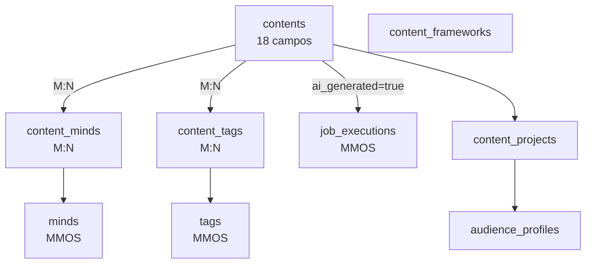

# CreatorOS Database Schema

> **Ultra-minimalista, multi-mind, universal content schema**

Design principles: KISS, zero duplicação, flexibilidade via JSONB, calculável não armazenado.

---

## 📋 Visão Geral

O schema CreatorOS foi redesenhado para ser:

- ✅ **Universal**: Uma tabela `contents` para conteúdo coletado + gerado
- ✅ **Multi-mind**: Suporte nativo a entrevistas, podcasts, debates (M:N via `content_minds`)
- ✅ **Minimalista**: 18 campos essenciais (vs 45 original) - redução de 60%
- ✅ **Zero duplicação**: LLM data em `job_executions`, source data em `sources`
- ✅ **Flexível**: Metadata JSONB para edge cases
- ✅ **Performático**: Índices otimizados, computed columns

---

## 🎯 Design Principles

### 1. KISS (Keep It Simple, Stupid)

**Antes (45 campos):**
```sql
-- Campos duplicados
source_url, source_platform, source_date  -- já existe em sources!
llm_provider, llm_model, tokens_*         -- já existe em job_executions!

-- Campos calculáveis
word_count, depth_level, fragments_count  -- pode calcular sob demanda
```

**Depois (18 campos):**
```sql
-- Links inteligentes
source_id → sources (JOIN)
generation_execution_id → job_executions (JOIN)

-- Campos flexíveis
metadata JSONB  -- tudo que é variável
```

### 2. Multi-Mind Support

**Problema:** Como representar uma entrevista com 2+ pessoas?

**Solução:** Junction table `content_minds` (M:N)

```sql
-- Podcast: Lex Fridman + Sam Altman
INSERT INTO contents (...) RETURNING id;  -- 'content_123'
INSERT INTO content_minds VALUES
  ('content_123', 'lex_fridman_uuid', 'host'),
  ('content_123', 'sam_altman_uuid', 'guest');
```

### 3. Universal Content Table

**Um discriminador:** `ai_generated BOOLEAN`

| ai_generated | Tipo | Fonte | Metadata |
|-------------|------|-------|----------|
| `false` | Collected | source_id → sources | source_url, platform, processing_status |
| `true` | Generated | generation_execution_id → job_executions | persona_config, frameworks, validation_scores |

---

## 📊 Schema Tables

### Core Tables



### Table: `contents` (18 campos)

| Campo | Tipo | Descrição |
|-------|------|-----------|
| **Discriminador** |
| `ai_generated` | BOOLEAN | false = collected, true = generated |
| `content_type` | TEXT | 'interview', 'podcast_transcript', 'course_lesson', etc. |
| **Hierarquia** |
| `parent_content_id` | UUID | Para cursos/livros (hierarquia) |
| `sequence_order` | SMALLINT | Ordem na hierarquia |
| **Identity** |
| `slug` | TEXT | Identificador único |
| `title` | TEXT | Título |
| **Content** |
| `content` | TEXT | Conteúdo principal |
| **Process Tracking** |
| `generation_execution_id` | UUID → job_executions | LLM metadata (model, tokens, cost) |
| **CreatorOS** |
| `project_id` | UUID → content_projects | Projeto (curso, livro, blog) |
| `fidelity_score` | NUMERIC(3,2) | Quão fiel ao source (0.0-1.0) |
| **Metadata** |
| `metadata` | JSONB | Flexível! |
| **Lifecycle** |
| `status` | TEXT | draft, reviewed, published, archived |
| `published_at` | TIMESTAMPTZ | |
| `published_url` | TEXT | |
| `file_path` | TEXT | |
| **Timestamps** |
| `created_at`, `updated_at`, `deleted_at` | TIMESTAMPTZ | |

### Table: `content_minds` (M:N)

Permite múltiplas minds por conteúdo.

| Campo | Tipo | Valores |
|-------|------|---------|
| `content_id` | UUID | |
| `mind_id` | UUID | |
| `role` | TEXT | creator, host, guest, interviewer, participant, etc. |

### Table: `content_frameworks`

Frameworks de criação (GPS, Bloom's, DIDÁTICA LENDÁRIA, etc.)

- 8 frameworks incluídos por padrão (seeds)
- `framework_schema` JSONB para estrutura/validação

### Table: `audience_profiles`

Perfis de público-alvo (demographics, psychographics, learning preferences)

### Table: `content_projects`

Projetos (cursos, livros, blog series) que agrupam conteúdos relacionados

---

## 🔍 Exemplo de Queries

### 1. Buscar conteúdos coletados de uma mind

```sql
SELECT c.*, s.url as source_url
FROM contents c
JOIN content_minds cm ON cm.content_id = c.id
LEFT JOIN sources s ON s.id = (c.metadata->>'source_id')::uuid
WHERE cm.mind_id = 'sam_altman_uuid'
  AND c.ai_generated = false;
```

### 2. Buscar entrevistas/podcasts (multi-mind)

```sql
SELECT
  c.title,
  ARRAY_AGG(m.display_name ORDER BY cm.role) as participants,
  ARRAY_AGG(cm.role ORDER BY cm.role) as roles
FROM contents c
JOIN content_minds cm ON cm.content_id = c.id
JOIN minds m ON m.id = cm.mind_id
WHERE c.content_type IN ('interview', 'podcast_transcript')
GROUP BY c.id
HAVING COUNT(cm.mind_id) > 1;
```

### 3. Custo total de geração por modelo

```sql
SELECT
  je.llm_model,
  COUNT(c.id) as contents_generated,
  SUM(je.tokens_total) as total_tokens,
  SUM(je.cost_usd) as total_cost
FROM contents c
JOIN job_executions je ON je.id = c.generation_execution_id
WHERE c.ai_generated = true
GROUP BY je.llm_model;
```

### 4. Hierarquia de curso (com depth_level calculado)

```sql
-- Use view v_content_hierarchy
SELECT
  slug,
  title,
  depth_level,
  path,
  sequence_order
FROM v_content_hierarchy
WHERE root_slug = 'dominando-obsidian'
ORDER BY path;
```

### 5. Conteúdos gerados com fidelidade alta

```sql
SELECT
  c.title,
  c.fidelity_score,
  p.name as project,
  m.display_name as creator
FROM contents c
JOIN content_projects p ON p.id = c.project_id
JOIN content_minds cm ON cm.content_id = c.id AND cm.role = 'creator'
JOIN minds m ON m.id = cm.mind_id
WHERE c.ai_generated = true
  AND c.fidelity_score >= 0.90
ORDER BY c.fidelity_score DESC;
```

---

## 📦 Instalação

### ⭐ Método Recomendado: Migration Completa com Data Migration

```bash
# 🚀 Migration completa que:
# - Faz backup automático de tabelas existentes
# - Cria novo schema corrigido
# - Migra dados de content_pieces → contents
# - Aplica seeds e views
# - Valida instalação

psql $SUPABASE_DB_URL -f migrations/002_creator_os_full_migration.sql
```

**📖 Documentação completa:** [MIGRATION_GUIDE.md](./MIGRATION_GUIDE.md)

### Opção 2: Migration Manual (Desenvolvimento)

```bash
# 1. Schema
psql $DATABASE_URL -f schema.sql

# 2. Seeds
psql $DATABASE_URL -f seeds.sql

# 3. Views
psql $DATABASE_URL -f views.sql
```

### Opção 3: Supabase Dashboard

1. Acesse Supabase Dashboard → SQL Editor
2. Cole conteúdo de `migrations/001_creator_os_schema.sql`
3. Execute
4. Cole conteúdo de `views.sql`
5. Execute

---

## 📁 Estrutura de Arquivos

```
expansion-packs/creator-os/database/
├── README.md                        # Este arquivo
├── schema.sql                       # Schema completo (tabelas, índices, triggers)
├── views.sql                        # Views úteis para analytics
├── seeds.sql                        # Dados iniciais (frameworks, audiences, projects)
└── migrations/
    └── 001_creator_os_schema.sql    # Migration Supabase-compatible (tudo-em-um)
```

---

## 🎓 Views Disponíveis

| View | Descrição |
|------|-----------|
| `v_collected_contents` | Conteúdos coletados com metadata extraído |
| `v_generated_contents` | Conteúdos gerados com LLM metadata |
| `v_multi_mind_contents` | Conteúdos com múltiplas minds (entrevistas, podcasts) |
| `v_generation_costs` | Analytics de custos por modelo LLM |
| `v_content_hierarchy` | Hierarquia completa (cursos, livros) com depth_level |
| `v_project_performance` | Performance de projetos (custos, qualidade, publicações) |
| `v_mind_content_stats` | Estatísticas de conteúdo por mind |
| `v_content_with_frameworks` | Conteúdos com frameworks aplicados |
| `v_recent_contents` | Conteúdos recentes (últimos 30 dias) |

---

## 🧪 Validação Pós-Instalação

```sql
-- 1. Verificar frameworks instalados
SELECT slug, name, framework_type FROM content_frameworks ORDER BY framework_type;
-- Expected: 8 frameworks

-- 2. Verificar audience profiles
SELECT slug, name, technical_level FROM audience_profiles;
-- Expected: 3 profiles

-- 3. Verificar projetos
SELECT p.slug, p.name, p.project_type, a.name as audience
FROM content_projects p
JOIN audience_profiles a ON a.id = p.target_audience_id;
-- Expected: 3 projects

-- 4. Test multi-mind insert
BEGIN;
  INSERT INTO contents (slug, title, content_type, ai_generated)
  VALUES ('test-interview', 'Test Interview', 'interview', false)
  RETURNING id;  -- save this id

  -- INSERT INTO content_minds VALUES ('<content_id>', '<mind_id_1>', 'host');
  -- INSERT INTO content_minds VALUES ('<content_id>', '<mind_id_2>', 'guest');
ROLLBACK;  -- or COMMIT to keep
```

---

## 🚀 Próximos Passos

### Fase 1: Pipeline Integration (CreatorOS)
- [ ] Modificar `lesson_generator.py` para usar `contents` table
- [ ] Criar função `insert_generated_content()` helper
- [ ] Vincular geração com `job_executions`

### Fase 2: MMOS Integration
- [ ] Migrar dados existentes de `sources` → `contents` (collected)
- [ ] Update `fragments` para referenciar `contents` (via `content_id`)
- [ ] Deprecar tabela `sources` (opcional)

### Fase 3: Analytics & Reporting
- [ ] Dashboard de custos de geração
- [ ] Dashboard de performance de projetos
- [ ] Quality score tracking (fidelity, readability)

### Fase 4: Advanced Features
- [ ] Versioning de conteúdo (regeneração)
- [ ] A/B testing de conteúdo gerado
- [ ] Automated quality validation
- [ ] Content performance tracking (views, engagement)

---

## 📊 Comparação: Antes vs Depois

| Aspecto | Antes | Depois | Melhoria |
|---------|-------|--------|----------|
| **Campos totais** | ~45 | 18 | ✅ 60% redução |
| **Campos obrigatórios** | ~20 | 8 | ✅ 60% redução |
| **Multi-mind** | ❌ Não | ✅ Sim (M:N) | ✅ 100% novo |
| **Duplicação** | ❌ Alta | ✅ Zero | ✅ 100% eliminado |
| **Flexibilidade** | Baixa | ✅ Alta (JSONB) | ✅ Infinita |
| **Normalização** | Baixa | ✅ Alta | ✅ 3NF |
| **Calculáveis** | ❌ Armazenados | ✅ Sob demanda | ✅ Eficiente |
| **Queries** | Complexas | ✅ Simples (views) | ✅ Otimizado |

---

## 🧠 Metadata JSONB Examples

### Collected Content (ai_generated = false)

```json
{
  "source_url": "https://youtube.com/watch?v=...",
  "source_platform": "YouTube",
  "source_date": "2024-10-15",
  "processing_status": "completed",
  "quality": "primary",
  "language": "pt",
  "duration_minutes": 120
}
```

### Generated Content (ai_generated = true)

```json
{
  "audience_id": "uuid...",
  "persona_type": "mmos_clone",
  "persona_config": {
    "tone": "conversational",
    "formality": "informal",
    "expertise_level": "expert"
  },
  "frameworks": ["gps", "blooms_taxonomy"],
  "readability_score": 0.85,
  "fidelity_report": {
    "lexical_similarity": 0.92,
    "structural_match": 0.88,
    "tone_consistency": 0.95
  },
  "format_subtype": "how_to",
  "generation_version": "v1.0",
  "regeneration_count": 0,
  "validation_scores": {
    "gps_validation": 0.95,
    "blooms_coverage": [1, 2, 3, 4],
    "tone_match": 0.88
  }
}
```

---

## 🔐 Security & RLS

Row Level Security policies are **commented out** in schema. Uncomment and adjust based on your auth system.

Example:
```sql
-- Collected content: público
CREATE POLICY "Collected content viewable by all" ON contents
  FOR SELECT USING (ai_generated = false AND deleted_at IS NULL);

-- Generated content: privado (owner only)
CREATE POLICY "Generated content managed by creator" ON contents
  FOR ALL USING (
    ai_generated = true
    AND EXISTS (
      SELECT 1 FROM content_minds cm
      WHERE cm.content_id = contents.id
        AND cm.mind_id = current_mind_id()
        AND cm.role IN ('creator', 'author')
    )
  );

ALTER TABLE contents ENABLE ROW LEVEL SECURITY;
```

---

## 🤝 Contributing

Schema changes should follow:

1. **Create proposal** in docs/architecture/proposals/
2. **Discuss with team** (DB Sage + Product Owner)
3. **Write migration** in migrations/
4. **Update README** (this file)
5. **Test thoroughly** before deploying

---

## 📚 References

- [MMOS PRD](../../../docs/prd/mmos-prd.md)
- [CreatorOS PRD](../PRD.md)
- [MMOS Architecture](../../../docs/architecture/)
- [Outputs Guide](../../../docs/guides/outputs-guide.md)

---

**Last Updated:** 2025-10-28
**Schema Version:** 001 (Ultra Minimalista)
**Author:** DB Sage
