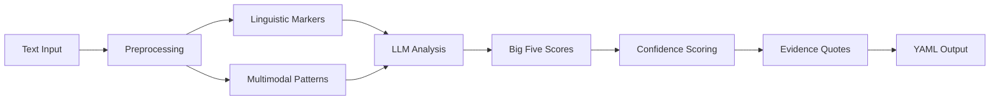

# InnerLens Lite - AIOS Expansion Pack

**Version:** 1.0.0-alpha
**Author:** Academia Lendar[IA] (Alan Nicolas)
**Type:** Universal Expansion Pack
**Status:** 📋 Planning Phase

> Fast Big Five personality analysis from digital content - the lite version of InnerLens Professional.

[]()
[]()
[]()

---

## 🎯 What is InnerLens Lite?

**InnerLens Lite** is an AIOS-FULLSTACK expansion pack that provides **fast Big Five personality analysis** (<2 min) from text, WhatsApp, emails, and code. It complements [InnerLens Professional](https://github.com/oalanicolas/innerlens) (the full 120-trait app) by offering quick screening for AIOS workflows.

### Positioning: Lite vs Professional

| Feature | InnerLens Lite (This Pack) | InnerLens Professional (v3.0 App) |
|---------|----------------------------|-----------------------------------|
| **Framework** | Big Five only | 120 psychological traits |
| **Speed** | <2 minutes | 60-90 minutes |
| **Cost** | ~$0.20 per profile | ~$3.50 per profile |
| **Evidence** | Simple quotes (3-5 per trait) | 300-500 detailed fragments |
| **Output** | YAML scores + evidence | Fragments, causality graph, PDF |
| **Use Case** | Quick screening, automation | Deep "Self Model" analysis |
| **Pricing** | Free (AIOS users) | $500/month unlimited |
| **Integration** | Native AIOS | Standalone app |

**When to use which?**
- ✅ **Use Lite** for: Quick screening, AIOS workflows, basic MMOS enhancement
- ✅ **Use Professional** for: Deep self-analysis, executive coaching, research

---

## 🚀 Quick Start

### Prerequisites

- AIOS-FULLSTACK 4.0+
- Node.js 20 LTS
- Anthropic Claude Sonnet 4 API key

### Installation

```bash
# Install expansion pack
npm run install:expansion innerlens

# Verify installation
@innerlens-orchestrator
*help
```

### Basic Usage

```bash
# 1. Activate orchestrator
@innerlens-orchestrator

# 2. Run quick analysis (Big Five only, <2min)
*detect-traits-quick --input transcript.txt

# 3. View results
# Output: bigfive-profile.yaml
```

---

## 📦 What's Included

### Agents (3)

| Agent | Role | When to Use |
|-------|------|-------------|
| `innerlens-orchestrator` | Master coordinator | Start here - guides workflows |
| `traits-analyst` | Big Five expert | Deep trait analysis & explanations |
| `privacy-guardian` | GDPR/LGPD compliance | Privacy validation |

### Tasks (3)

**Core Detection:**
- `detect-traits-quick` - Fast Big Five analysis (<2min)

**Integration:**
- `integrate-with-mmos` - Export to MMOS for AI cloning

**Compliance:**
- `validate-privacy` - GDPR/LGPD compliance check

### Framework: Big Five (OCEAN)

**The most validated personality framework in psychology (50+ years research):**

1. **O**penness to Experience (0-100)
   - Imagination, curiosity, creativity
   - *Example quote:* "I love exploring unconventional ideas"

2. **C**onscientiousness (0-100)
   - Organization, discipline, reliability
   - *Example quote:* "I always follow through on commitments"

3. **E**xtraversion (0-100)
   - Sociability, energy, assertiveness
   - *Example quote:* "I thrive in social settings"

4. **A**greeableness (0-100)
   - Cooperation, empathy, trust
   - *Example quote:* "I prioritize harmony in relationships"

5. **N**euroticism (0-100)
   - Emotional stability, stress response
   - *Example quote:* "I stay calm under pressure"

**Scientific Basis:** Costa & McCrae (1992), NEO-PI-R, validated across 50+ countries

---

## 🔧 Usage Examples

### Example 1: Quick Screening

```bash
@innerlens-orchestrator
*detect-traits-quick --input interview-transcript.txt

# Output: bigfive-profile.yaml
```

**Output:**
```yaml
profile_version: "1.0"
analyzed_date: "20250114-1400"
framework: "Big Five (OCEAN)"

traits:
  openness:
    score: 85
    level: "HIGH"
    confidence: 0.78
    evidence_quotes:
      - quote: "I love exploring new ideas and unconventional approaches"
        source: "transcript.txt:L42"
        relevance: "Direct expression of openness"

  conscientiousness:
    score: 72
    level: "HIGH"
    confidence: 0.81
    evidence_quotes:
      - quote: "I always deliver on time, no matter what"
        source: "transcript.txt:L89"
        relevance: "High achievement striving"

  extraversion:
    score: 55
    level: "AVERAGE"
    confidence: 0.75
    # ... (3 quotes per trait)

overall_confidence: 0.77
quality_score: "MEDIUM"
```

---

### Example 2: MMOS Integration (AI Cloning)

```bash
# Step 1: Run MMOS pipeline (Phases 1-3)
@mind-mapper
*execute-pipeline --mind naval_ravikant

# Step 2: Enhance with InnerLens
@innerlens-orchestrator
*integrate-with-mmos --mind naval_ravikant

# Output: minds/naval_ravikant/analysis/psychometric-profile.yaml
```

**Result:** MMOS Phase 4 (Synthesis) merges:
- `cognitive-spec.yaml` (DNA Mental™ 8 layers)
- `psychometric-profile.yaml` (Big Five from InnerLens)

**Fidelity improvement:** 94% → 96%+ (estimated)

---

### Example 3: Multimodal Analysis

```bash
@innerlens-orchestrator

# Analyze multiple sources
*detect-traits-quick \
  --text transcript.txt \
  --whatsapp whatsapp-export.json \
  --email email-threads.mbox

# Uses:
# - Text: Linguistic markers
# - WhatsApp: Message patterns, timing, emoji
# - Email: Formality, structure, response time
```

---

## 🔍 How It Works

### Detection Pipeline



### Linguistic Marker Example

**Input text:**
> "I'm constantly reading papers across 10+ disciplines just to find interesting connections. The status quo bores me."

**Detected markers:**
- ✅ "constantly reading" → High Openness (curiosity)
- ✅ "10+ disciplines" → High Openness (breadth)
- ✅ "find connections" → High Openness (abstract thinking)
- ✅ "status quo bores me" → High Openness (novelty-seeking)

**Output:**
```yaml
openness:
  score: 88
  level: "VERY_HIGH"
  confidence: 0.85
```

---

## 🔐 Privacy & Ethics

### 4-Level Privacy Classification

| Level | Description | Examples | Handling |
|-------|-------------|----------|----------|
| **PUBLIC** | Shareable, non-sensitive | Big Five scores | Open sharing with consent |
| **PRIVATE** | Personal but non-clinical | Communication patterns | Encrypted storage, consent required |
| **SENSITIVE** | Requires explicit consent | Emotional regulation | Double encryption, granular consent |
| **CLINICAL** | Regulated (HIPAA/LGPD) | Mental health diagnoses | **NOT STORED** - out of scope |

### GDPR/LGPD Compliance

✅ **Compliant Features:**
- Data minimization (only Big Five relevant)
- Purpose limitation (clear use case)
- Storage limitation (user-defined retention)
- Data portability (export to YAML/JSON)
- Right to deletion (cascade delete)
- Privacy by design (classification built-in)

### Ethical Guidelines

✅ **We do:**
- Transparent methodology
- User consent before profiling
- Show evidence for conclusions
- Clear confidence scores
- "Not a diagnostic tool" disclaimer

❌ **We don't:**
- Store clinical data
- Make employment decisions (tool only)
- Profile without consent
- Claim diagnostic accuracy
- Sell user data

---

## 🔗 Integration Patterns

### Standalone Mode (Default)

```bash
# Analyze any text
@innerlens-orchestrator
*detect-traits-quick --input mytext.txt

# Output: bigfive-profile.yaml
```

### MMOS Integration (Optional)

```yaml
# minds/person_name/analysis/psychometric-profile.yaml
# Generated by InnerLens, consumed by MMOS Phase 4 (Synthesis)

profile_version: "1.0"
mind_name: "Naval Ravikant"
analyzed_date: "20250114-1400"

big_five:
  openness: 95  # Extremely high
  conscientiousness: 85
  extraversion: 45
  agreeableness: 35  # Low (contrarian)
  neuroticism: 25  # Very low (stoic)

# MMOS synthesis merges this with cognitive-spec.yaml
# for ultra-high-fidelity system prompt
```

### ETL Integration (Optional)

```bash
# Collect data with ETL
@data-collector
*collect-all-sources --mind person_name

# Analyze with InnerLens
@innerlens-orchestrator
*detect-traits-quick --input sources/downloads/

# Output: sources/innerlens-analysis/bigfive-profile.yaml
```

---

## 📊 Output Format

### Big Five Profile (YAML)

**File:** `bigfive-profile.yaml`

```yaml
profile_version: "1.0"
analyzed_date: "YYYYMMDD-HHMM"
framework: "Big Five (OCEAN)"
source_text_length: 2847  # words

traits:
  openness:
    score: 85
    level: "HIGH"
    confidence: 0.78
    facets:
      imagination: 82
      artistic_interest: 75
      emotionality: 68
      adventurousness: 88
      intellect: 92
      liberalism: 78
    evidence_quotes:
      - quote: "Exact text from source"
        source: "file.txt:L42"
        relevance: "Why this shows trait"
      # ... (3-5 quotes per trait)

  # ... (other 4 traits)

overall_confidence: 0.77
quality_score: "MEDIUM | HIGH | LOW"
limitations:
  - "Limited text sample (<1000 words)"
  - "Single data source (no triangulation)"
```

---

## 🧪 Validation & Quality

### Accuracy Target

**MVP Goal:** 75%+ correlation with self-reported Big Five

**How we measure:**
1. Recruit 10 test subjects
2. Collect self-reported Big Five scores (validated questionnaire)
3. Analyze their writings with InnerLens Lite
4. Compute Pearson correlation: `r > 0.75`

### Confidence Scoring

```yaml
# High Confidence (85-100%)
- 5+ linguistic markers per trait
- Multiple data sources (text + WhatsApp + email)
- Consistent patterns across sources

# Medium Confidence (70-84%)
- 3-4 markers per trait
- Single or dual data sources
- Some pattern variation

# Low Confidence (<70%)
- <3 markers per trait
- Insufficient data
- Contradictory patterns
- ⚠️ User warned: "Collect more data"
```

### Quality Checklist

Before finalizing analysis:
- [ ] Minimum 500 words of source text
- [ ] At least 3 linguistic markers per trait
- [ ] Confidence scores >70% for all traits
- [ ] No contradictory patterns
- [ ] Privacy classification applied
- [ ] Evidence quotes extracted (3-5 per trait)

---

## 🛠️ Technical Architecture

### Tech Stack

**Core:**
- AIOS-FULLSTACK 4.0+ (expansion pack framework)
- Node.js 20 LTS (utilities)

**AI/NLP:**
- LangChain (orchestration)
- Anthropic Claude Sonnet 4 (primary LLM)
- OpenAI GPT-4 (fallback)

**Data Processing:**
- Zod (schema validation)
- js-yaml (YAML parsing)
- Regex engine (linguistic markers)

### Cost per Profile

| Component | Cost |
|-----------|------|
| Claude Sonnet 4 (single pass) | $0.15 |
| Infrastructure | $0.05 |
| **Total** | **$0.20** |

**Optimization:** Prompt caching saves 90% on system instructions

---

## 📚 Documentation

- **[PRD](./PRD.md)** - Product Requirements Document
- **[Design Decisions](./DESIGN_DECISIONS.md)** - Architecture & trade-offs
- **[Epic 0: Foundation](./epics/EPIC-0-FOUNDATION.md)** - MVP implementation plan
- **[Traits Taxonomy Guide](../../docs/mmos/taxonomy/traits-taxonomy-guide.md)** - Full framework reference

---

## 🗺️ Roadmap

### v1.0 (MVP) - Weeks 1-2 ✅ Current

- ✅ Big Five detection (<2min, 75%+ accuracy)
- ✅ Simple evidence quotes
- ✅ MMOS integration hook
- ✅ Privacy framework (4-level classification)

### v1.1 - Weeks 3-4

- ⏳ HEXACO (adds Honesty-Humility dimension)
- ⏳ Enhanced multimodal analysis
- ⏳ Improved confidence scoring

### v1.2 - Weeks 5-8

- ⏳ Schwartz Values (10 universal values)
- ⏳ VIA Character Strengths (24 strengths)
- ⏳ Cross-framework triangulation

### v2.0 - Future

- ⏳ Reiss 16 Basic Desires
- ⏳ Real-time analysis (<30sec streaming)
- ⏳ Multi-language support (pt-BR, es-ES)

---

## 🤝 Contributing

See [`CONTRIBUTING.md`](./CONTRIBUTING.md) for development guidelines.

### How to Contribute

1. **Beta Testing** - Help validate accuracy (need 10 testers)
2. **Linguistic Markers** - Add patterns for new languages
3. **Documentation** - Improve guides and examples
4. **Bug Reports** - GitHub Issues

---

## 📄 License

MIT License - See [LICENSE](../../LICENSE) for details.

---

## 📞 Support

- **Issues:** [GitHub Issues](https://github.com/academialendaria/mente-lendaria/issues)
- **Email:** alan@academialendaria.ai
- **Discord:** [AIOS Community](https://discord.gg/aios)

---

## 🔄 Version History

| Version | Date | Changes |
|---------|------|---------|
| 1.0.0-alpha | 2025-01-14 | Initial planning release |

---

<div align="center">

**Built with 🔍 and AI by Academia Lendar[IA]**

*"Making scientific psychometrics accessible to everyone"*

---

**© 2025 Academia Lendar[IA] - All rights reserved**

</div>
