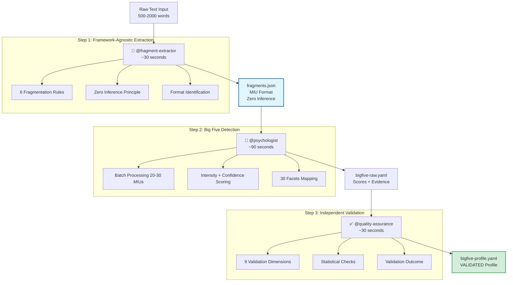

# InnerLens Lite - AIOS Expansion Pack

**Version:** 1.0.0-alpha
**Author:** Academia Lendar[IA] (Alan Nicolas)
**Type:** Universal Expansion Pack
**Status:** ✅ Implementation Complete - Testing Phase

> Fast Big Five personality analysis from digital content - the lite version of InnerLens Professional.

[]()
[]()
[]()

---

## 🎯 What is InnerLens Lite?

**InnerLens Lite** is an AIOS-FULLSTACK expansion pack that provides **fast Big Five personality analysis** (<2 min) from text, WhatsApp, emails, and code. It complements [InnerLens Professional](https://github.com/oalanicolas/innerlens) (the full 120-trait app) by offering quick screening for AIOS workflows.

### Positioning: Lite vs Professional

| Feature | InnerLens Lite (This Pack) | InnerLens Professional (v3.0 App) |
|---------|----------------------------|-----------------------------------|
| **Framework** | Big Five only | 120 psychological traits |
| **Speed** | <2 minutes | 60-90 minutes |
| **Cost** | ~$0.20 per profile | ~$3.50 per profile |
| **Evidence** | Simple quotes (3-5 per trait) | 300-500 detailed fragments |
| **Output** | YAML scores + evidence | Fragments, causality graph, PDF |
| **Use Case** | Quick screening, automation | Deep "Self Model" analysis |
| **Pricing** | Free (AIOS users) | $500/month unlimited |
| **Integration** | Native AIOS | Standalone app |

**When to use which?**
- ✅ **Use Lite** for: Quick screening, AIOS workflows, basic MMOS enhancement
- ✅ **Use Professional** for: Deep self-analysis, executive coaching, research

---

## 🚀 Quick Start

### Prerequisites

- AIOS-FULLSTACK 4.0+
- Node.js 20 LTS
- Anthropic Claude Sonnet 4 API key

### Installation

```bash
# Install expansion pack
npm run install:expansion innerlens

# Verify installation
@innerlens-orchestrator
*help
```

### Basic Usage

#### Option 1: AIOS-Compliant Workflow (Recommended)

```bash
# Complete pipeline: Extract → Validate → Save → Analyze
# Uses @aios-master orchestrator with quality enforcement
@aios-master
*workflow extract-analyze-save \
  --mind alan_nicolas \
  --source testing/validation/text_samples/alan_nicolas.txt \
  --title "Self Analysis" \
  --type self_analysis \
  --run-analysis true

# This workflow:
# 1. Extracts MIUs using Claude Sonnet 4 (LLM-based, NOT regex)
# 2. Validates quality (BLOCKING - fails if quality too low)
# 3. Saves to MMOS database (only if validated)
# 4. Runs Big Five analysis
# 5. Returns complete personality profile

# Output files:
# - {mind}_fragments.json (validated MIU extraction)
# - {mind}_bigfive.json (Big Five analysis)
# Plus database entries in /docs/mmos/mmos.db
```

#### Option 2: Legacy Quick Detection

```bash
# Run complete 3-agent pipeline (extraction → analysis → validation)
# This orchestrates all 3 agents automatically
*detect-traits-quick --input transcript.txt

# Output files:
# - fragments.json (MIU extraction)
# - bigfive-raw.yaml (analysis results)
# - bigfive-profile.yaml (validated profile) ✅
```

#### Option 3: Manual Step-by-Step (Advanced)

```bash
# Step 1: Extract MIUs (LLM-based)
@fragment-extractor
*task extract-fragments \
  --source transcript.txt \
  --subject-id naval_ravikant \
  --output fragments.json

# Step 2: Validate MIUs (quality gate)
@quality-assurance
*task validate-mius \
  --fragments fragments.json \
  --subject naval_ravikant

# Step 3: Save to database (only if validated)
*task save-fragments-to-mmos \
  --mind naval_ravikant \
  --fragments fragments.json \
  --source transcript.txt \
  --title "Podcast Interview" \
  --type podcast_transcript

# Step 4: Analyze Big Five
@psychologist
*task analyze-bigfive \
  --fragments fragments.json \
  --subject-id naval_ravikant \
  --output bigfive.json
```

---

## 📦 What's Included

### Agents (3)

| Agent | Role | When to Use |
|-------|------|-------------|
| `@fragment-extractor` | MIU extraction specialist | Extract framework-agnostic behavioral units (once, reuse forever) |
| `@psychologist` | Universal personality analyst | Analyze fragments using Big Five (or any framework via tasks) |
| `@quality-assurance` | Independent validator | Validate profile quality before delivery |

### AIOS Infrastructure (NEW - v1.1.0)

**Workflows** (orchestrators):
- `extract-analyze-save` - Complete pipeline from raw text to MMOS database (LLM extraction → quality gate → DB save → Big Five analysis)

**Tasks** (AIOS-executable):
- `extract-fragments` - LLM-based MIU extraction using Claude Sonnet 4 (NOT regex/heuristics)
- `validate-mius` - Quality validation with BLOCKING enforcement (10 validation checks)
- `save-fragments-to-mmos` - Generic database integration (works for any mind)
- `analyze-bigfive` - Big Five detection workflow (12-step process for @psychologist)
- `detect-traits-quick` - Legacy 3-agent pipeline orchestrator

**Checklists** (quality enforcement):
- `miu-quality` - 10-dimension MIU validation (schema, grammar, attribution, causal/temporal links, contrasts, zero-inference, context, metadata, statistics)
- `bigfive-quality` - Big Five profile validation (9 validation dimensions)

**Quality Guarantees:**
- ✅ **LLM-Based Extraction** - Uses Claude Sonnet 4, NOT Python regex (user requirement: "A extração deve ser feito por LLMS e nao python")
- ✅ **Quality Gate Enforcement** - Validation is BLOCKING, not optional (prevents low-quality data from reaching database)
- ✅ **Generic Tools** - All tasks work for ANY mind, not person-specific (user requirement: "workflow padrão para qualquer mente")
- ✅ **AIOS Compliance** - Full agent → task → checklist → workflow architecture

**Future (v1.2+):**
- `analyze-hexaco` - HEXACO framework
- `integrate-with-mmos` - Export to MMOS for AI cloning

### Framework: Big Five (OCEAN)

**The most validated personality framework in psychology (50+ years research):**

1. **O**penness to Experience (0-100)
   - Imagination, curiosity, creativity
   - *Example quote:* "I love exploring unconventional ideas"

2. **C**onscientiousness (0-100)
   - Organization, discipline, reliability
   - *Example quote:* "I always follow through on commitments"

3. **E**xtraversion (0-100)
   - Sociability, energy, assertiveness
   - *Example quote:* "I thrive in social settings"

4. **A**greeableness (0-100)
   - Cooperation, empathy, trust
   - *Example quote:* "I prioritize harmony in relationships"

5. **N**euroticism (0-100)
   - Emotional stability, stress response
   - *Example quote:* "I stay calm under pressure"

**Scientific Basis:** Costa & McCrae (1992), NEO-PI-R, validated across 50+ countries

---

## 🔧 Usage Examples

### Example 1: Complete Pipeline (Recommended)

```bash
# Single command runs all 3 agents automatically
*detect-traits-quick --input interview-transcript.txt --subject-id naval_ravikant

# Pipeline execution:
# [30s] @fragment-extractor: Extracting MIUs from interview-transcript.txt...
#       ✅ 42 MIUs extracted (28.0 per 1000 words)
#       ✅ Format: interview_format (95% confidence)
#       ✅ Output: fragments.json

# [90s] @psychologist: Analyzing fragments using Big Five framework...
#       ✅ Batch 1/2 processed (20 MIUs)
#       ✅ Batch 2/2 processed (22 MIUs)
#       ✅ 5 traits scored, 30 facets mapped
#       ✅ Output: bigfive-raw.yaml

# [30s] @quality-assurance: Validating profile quality...
#       ✅ Schema validation: PASS
#       ✅ Statistical distribution: PASS (std_dev: 18.2)
#       ✅ Facet-trait consistency: PASS (all deviations <= 10)
#       ✅ Evidence sufficiency: PASS (all traits >= 5 MIUs)
#       ⚠️  2 warnings detected
#       ✅ Validation outcome: VALIDATED_MEDIUM
#       ✅ Output: bigfive-profile.yaml

# Total time: 2m 30s
# Total cost: $0.175
```

**Output (`bigfive-profile.yaml`):**
```yaml
profile_version: "1.0"
analyzed_date: "2025-01-14T16:33:00Z"
framework: "Big Five (OCEAN)"
subject_id: "naval_ravikant"

traits:
  openness:
    score: 85
    level: "VERY_HIGH"
    confidence: 0.88
    facets:
      imagination: { score: 90, confidence: 0.85 }
      artistic_interest: { score: 72, confidence: 0.78 }
      intellect: { score: 95, confidence: 0.92 }
      # ... 3 more facets
    evidence_quotes:
      - quote: "I think the biggest mistake people make is confusing absence of evidence with evidence of absence."
        source: "f_naval_001"
        intensity: 0.92
        confidence: 0.90
        facet: "intellect"
        reasoning: "Subject demonstrates sophisticated abstract reasoning and philosophical thinking, distinguishing nuanced epistemological concepts. Strong Openness/Intellect indicator."
      # ... 2-3 more quotes

  conscientiousness:
    score: 68
    level: "HIGH"
    confidence: 0.82
    # ... (similar structure)

  # ... (3 more traits: extraversion, agreeableness, neuroticism)

statistical_summary:
  mean_score: 57.0
  std_dev: 18.2
  outliers: ["openness"]
  overall_confidence: 0.82

validation:
  validation_outcome: "VALIDATED_MEDIUM"
  quality_score: "MEDIUM"
  validation_results:
    schema_validation: "PASS"
    statistical_validation: { status: "PASS" }
    evidence_sufficiency: { status: "PASS" }
  quality_flags:
    warnings:
      - "Openness: Outlier detected (85 vs mean 57.0) - verify consistency"
      - "Extraversion: Moderate confidence (0.71) - 4 MIUs only"
  user_message: "This profile has been validated with minor limitations. Scores are reliable but Extraversion has limited evidence (4 behavioral examples). See warnings section for details."
```

---

### Example 2: Step-by-Step Manual Execution

```bash
# Step 1: Extract MIUs (framework-agnostic)
@fragment-extractor
*extract-fragments --input podcast-transcript.txt --subject-id sam_altman

# Output: fragments.json
# {
#   "metadata": { "subject_id": "sam_altman", "mius_extracted": 38, ... },
#   "fragments": [
#     { "fragment_id": "f_sam_001", "content": { "verbatim": "...", ... }, ... },
#     ...
#   ]
# }

# Step 2: Analyze with Big Five
@psychologist
*analyze --framework bigfive --input fragments.json

# Output: bigfive-raw.yaml (unvalidated results)

# Step 3: Independent validation
@quality-assurance
*validate --profile bigfive-raw.yaml --framework bigfive

# Output: bigfive-profile.yaml (validated, production-ready)

# Future: Reuse same fragments.json for other frameworks
@psychologist
*analyze --framework hexaco --input fragments.json  # v1.1
# No re-extraction needed! Saves time and cost.
```

---

### Example 3: Future - MMOS Integration (v1.1)

```bash
# Step 1: Run MMOS pipeline (Phases 1-4)
@mind-mapper
*execute-pipeline --mind naval_ravikant

# Step 2: Enhance with InnerLens Big Five analysis
*detect-traits-quick --input minds/naval_ravikant/data/transcripts/*.txt --subject-id naval_ravikant

# Step 3: Integrate psychometric profile
@mind-mapper
*enhance-mind --mind naval_ravikant --profile bigfive-profile.yaml

# Output: minds/naval_ravikant/system_prompts/generalista.md
# System prompt enhanced with:
# - Cognitive patterns (MMOS DNA Mental™)
# - Big Five personality scores (InnerLens)
# - Evidence-based behavioral tendencies

# Fidelity improvement: 94% → 96%+ (estimated with personality layer)
```

---

## 🔍 How It Works

### 3-Agent MIU Pipeline Architecture

**Core Innovation: MIU (Minimal Interpretable Unit) - Extract Once, Reuse Forever**



### MIU (Minimal Interpretable Unit) Explained

**What is an MIU?**
- Smallest text chunk that preserves complete behavioral meaning
- Includes causal/temporal relationships ("because", "when")
- Zero inference: ONLY observables stored (no trait categorization)
- Framework-agnostic: Reusable for Big Five, HEXACO, MBTI, or any future framework

**Why MIU Architecture?**
- ✅ **Extract once, analyze forever**: Same fragments work for all frameworks
- ✅ **100-year reusability**: Pure observables never become outdated
- ✅ **Cost savings**: No re-extraction when analyzing with new frameworks
- ✅ **Quality**: Separation of concerns (extraction ≠ interpretation)

**Example MIU:**
```json
{
  "fragment_id": "f_naval_001",
  "content": {
    "verbatim": "I think the biggest mistake people make is confusing absence of evidence with evidence of absence.",
    "word_count": 16,
    "clause_count": 1
  },
  "attribution": {
    "speaker": "subject",
    "speaker_name": "Naval Ravikant"
  },
  "structure": {
    "pronouns": ["I"],
    "verbs": ["think", "make", "confusing"],
    "modal_verbs": [],
    "tenses_detected": ["present"]
  }
  // NO trait categorization - that's @psychologist's job
}
```

### Quality Gate Architecture (NEW - v1.1.0)

**Critical Innovation: Validation as BLOCKING Quality Gate**

The AIOS-compliant workflow enforces quality validation as a **blocking gate** - NOT optional validation after the fact.

```
Raw Text → Extract MIUs → QUALITY GATE → Database Save → Analysis
                            ↓
                         VALIDATED?
                         ├─ ✅ YES → Continue
                         └─ ❌ NO  → STOP (re-extract required)
```

**Why This Matters:**
- ❌ **OLD approach (MVP)**: Extract → Save → Analyze → Validate (quality check AFTER saving)
- ✅ **NEW approach (v1.1)**: Extract → Validate → Save → Analyze (quality check BEFORE saving)

**User's Explicit Requirement:**
> "Precisamos garantir que a IA vai seguir o workflow para isso precisamos seguir o padrao AIOS criando um sistema completo de agents/tasks/checklists/qa etc"

**Quality Gate Validation (10 checks):**
1. ✅ Schema validation (all required fields present)
2. ✅ Grammatical completeness (100% of MIUs have verbs + complete clauses)
3. ✅ Clear attribution (100% of MIUs have valid speaker attribution)
4. ✅ Causal links preserved (no mid-causal-chain splits)
5. ✅ Temporal links preserved (no mid-temporal-sequence splits)
6. ✅ Contrasts separated (no opposing ideas in single MIU)
7. ✅ Zero-inference compliance (100% - NO trait/emotion/behavior labels)
8. ✅ Context preservation (elliptical fragments have context)
9. ✅ Metadata quality checks (all metadata flags TRUE)
10. ✅ Statistical sanity (extraction rates, word counts in reasonable ranges)

**Validation Outcomes:**
- ✅ **VALIDATED_HIGH** - All checks PASS → Database save allowed
- 🟡 **VALIDATED_PROVISIONAL** - Core checks PASS, minor warnings → Database save allowed (flagged)
- ❌ **VALIDATION_FAILED** - Critical check FAILED → **Database save BLOCKED**, re-extraction required

**Enforcement:**
- Task `validate-mius` must run BEFORE `save-fragments-to-mmos`
- Workflow `extract-analyze-save` enforces this sequence automatically
- No way to bypass validation (quality > speed)

---

### Big Five Validation Outcomes (@quality-assurance)

Every Big Five profile is independently validated across 9 dimensions. **Quality outcomes**:

| Outcome | Criteria | User Message |
|---------|----------|--------------|
| **VALIDATED_HIGH** | 0 failures, 0-1 warnings, confidence ≥80% | "High quality - all traits backed by adequate evidence (5+ examples each)" |
| **VALIDATED_MEDIUM** | 0 failures, 2-3 warnings, confidence ≥65% | "Validated with minor limitations - some traits have limited evidence (3-4 examples)" |
| **PROVISIONAL** | ≤1 failure, 4-6 warnings, confidence ≥50% | "Use with caution - insufficient evidence for some traits (<3 examples)" |
| **REJECTED** | 2+ failures OR confidence <50% | "Does not meet quality standards - provide more text data (1000-2000 words)" |

**9 Validation Dimensions:**
1. Schema validation (all required fields)
2. Score range validation (0-100, 0.0-1.0)
3. Statistical distribution (std dev 10-35 ideal, IQR outliers)
4. Facet-trait consistency (deviation ≤20 points)
5. Evidence sufficiency (≥3 MIUs per trait)
6. Confidence calibration (no overconfidence)
7. Contradiction detection (rare combinations)
8. Source attribution (all evidence properly attributed)
9. Processing metadata (time, cost reasonable)

**Example validation failure**:
```yaml
validation:
  validation_outcome: "REJECTED"
  quality_flags:
    failures:
      - "Evidence sufficiency: 3 traits with <3 MIUs (insufficient)"
      - "Overall confidence 0.38 (below minimum 0.50)"
  remediation_suggestions:
    - issue: "Insufficient text data"
      suggestion: "Provide 1000-2000 words from diverse sources (interview + essay + conversation)"
      priority: "HIGH"
```

### Linguistic Marker Example

**Input text:**
> "I'm constantly reading papers across 10+ disciplines just to find interesting connections. The status quo bores me."

**Detected by @psychologist:**
- ✅ "constantly reading" → Openness/Intellect facet (curiosity)
- ✅ "10+ disciplines" → Openness/Breadth facet
- ✅ "find connections" → Openness/Intellect (abstract thinking)
- ✅ "status quo bores me" → Openness/Adventurousness (novelty-seeking)

**MIU extracted by @fragment-extractor:**
```json
{
  "fragment_id": "f_user_042",
  "content": {
    "verbatim": "I'm constantly reading papers across 10+ disciplines just to find interesting connections.",
    "word_count": 13,
    "clause_count": 1
  },
  "structure": {
    "pronouns": ["I"],
    "verbs": ["reading", "find"],
    "adverbs": ["constantly"],
    "modal_verbs": []
  }
  // NO trait categorization - pure observables only
}
```

**Output by @psychologist:**
```yaml
openness:
  score: 88
  level: "VERY_HIGH"
  confidence: 0.85
  facets:
    intellect: { score: 95, confidence: 0.92 }
  evidence_quotes:
    - quote: "I'm constantly reading papers across 10+ disciplines..."
      source: "f_user_042"
      intensity: 0.90
      confidence: 0.88
      facet: "intellect"
      reasoning: "Subject demonstrates extreme intellectual curiosity (10+ disciplines) and abstract pattern-finding behavior. Very strong Openness/Intellect indicator."
```

---

## 🔐 Privacy & Ethics

### 4-Level Privacy Classification

| Level | Description | Examples | Handling |
|-------|-------------|----------|----------|
| **PUBLIC** | Shareable, non-sensitive | Big Five scores | Open sharing with consent |
| **PRIVATE** | Personal but non-clinical | Communication patterns | Encrypted storage, consent required |
| **SENSITIVE** | Requires explicit consent | Emotional regulation | Double encryption, granular consent |
| **CLINICAL** | Regulated (HIPAA/LGPD) | Mental health diagnoses | **NOT STORED** - out of scope |

### GDPR/LGPD Compliance

✅ **Compliant Features:**
- Data minimization (only Big Five relevant)
- Purpose limitation (clear use case)
- Storage limitation (user-defined retention)
- Data portability (export to YAML/JSON)
- Right to deletion (cascade delete)
- Privacy by design (classification built-in)

### Ethical Guidelines

✅ **We do:**
- Transparent methodology
- User consent before profiling
- Show evidence for conclusions
- Clear confidence scores
- "Not a diagnostic tool" disclaimer

❌ **We don't:**
- Store clinical data
- Make employment decisions (tool only)
- Profile without consent
- Claim diagnostic accuracy
- Sell user data

---

## 🔗 Integration Patterns

### Standalone Mode (Default)

```bash
# Analyze any text
@innerlens-orchestrator
*detect-traits-quick --input mytext.txt

# Output: bigfive-profile.yaml
```

### MMOS Integration (Optional)

```yaml
# minds/person_name/analysis/psychometric-profile.yaml
# Generated by InnerLens, consumed by MMOS Phase 4 (Synthesis)

profile_version: "1.0"
mind_name: "Naval Ravikant"
analyzed_date: "20250114-1400"

big_five:
  openness: 95  # Extremely high
  conscientiousness: 85
  extraversion: 45
  agreeableness: 35  # Low (contrarian)
  neuroticism: 25  # Very low (stoic)

# MMOS synthesis merges this with cognitive-spec.yaml
# for ultra-high-fidelity system prompt
```

### ETL Integration (Optional)

```bash
# Collect data with ETL
@data-collector
*collect-all-sources --mind person_name

# Analyze with InnerLens
@innerlens-orchestrator
*detect-traits-quick --input sources/downloads/

# Output: sources/innerlens-analysis/bigfive-profile.yaml
```

---

## 📊 Output Format

### Big Five Profile (YAML)

**File:** `bigfive-profile.yaml`

```yaml
profile_version: "1.0"
analyzed_date: "YYYYMMDD-HHMM"
framework: "Big Five (OCEAN)"
source_text_length: 2847  # words

traits:
  openness:
    score: 85
    level: "HIGH"
    confidence: 0.78
    facets:
      imagination: 82
      artistic_interest: 75
      emotionality: 68
      adventurousness: 88
      intellect: 92
      liberalism: 78
    evidence_quotes:
      - quote: "Exact text from source"
        source: "file.txt:L42"
        relevance: "Why this shows trait"
      # ... (3-5 quotes per trait)

  # ... (other 4 traits)

overall_confidence: 0.77
quality_score: "MEDIUM | HIGH | LOW"
limitations:
  - "Limited text sample (<1000 words)"
  - "Single data source (no triangulation)"
```

---

## 🧪 Validation & Quality

### Accuracy Target

**MVP Goal:** 75%+ correlation with self-reported Big Five

**How we measure:**
1. Recruit 10 test subjects
2. Collect self-reported Big Five scores (validated questionnaire)
3. Analyze their writings with InnerLens Lite
4. Compute Pearson correlation: `r > 0.75`

### Confidence Scoring

```yaml
# High Confidence (85-100%)
- 5+ linguistic markers per trait
- Multiple data sources (text + WhatsApp + email)
- Consistent patterns across sources

# Medium Confidence (70-84%)
- 3-4 markers per trait
- Single or dual data sources
- Some pattern variation

# Low Confidence (<70%)
- <3 markers per trait
- Insufficient data
- Contradictory patterns
- ⚠️ User warned: "Collect more data"
```

### Quality Checklist

Before finalizing analysis:
- [ ] Minimum 500 words of source text
- [ ] At least 3 linguistic markers per trait
- [ ] Confidence scores >70% for all traits
- [ ] No contradictory patterns
- [ ] Privacy classification applied
- [ ] Evidence quotes extracted (3-5 per trait)

---

## 🛠️ Technical Architecture

### Tech Stack

**Core:**
- AIOS-FULLSTACK 4.0+ (expansion pack framework)
- Node.js 20 LTS (utilities)

**AI/NLP:**
- LangChain (orchestration)
- Anthropic Claude Sonnet 4 (primary LLM)
- OpenAI GPT-4 (fallback)

**Data Processing:**
- Zod (schema validation)
- js-yaml (YAML parsing)
- Regex engine (linguistic markers)

### Cost per Profile

| Component | Cost |
|-----------|------|
| Claude Sonnet 4 (single pass) | $0.15 |
| Infrastructure | $0.05 |
| **Total** | **$0.20** |

**Optimization:** Prompt caching saves 90% on system instructions

---

## 📚 Documentation

- **[PRD](./PRD.md)** - Product Requirements Document
- **[Design Decisions](./DESIGN_DECISIONS.md)** - Architecture & trade-offs
- **[Epic 0: Foundation](./epics/EPIC-0-FOUNDATION.md)** - MVP implementation plan
- **[Traits Taxonomy Guide](../../docs/mmos/taxonomy/traits-taxonomy-guide.md)** - Full framework reference

---

## 🗺️ Roadmap

### v1.0 (MVP) - Weeks 1-2 ✅ Implementation Complete

- ✅ **3-Agent MIU Pipeline**: @fragment-extractor → @psychologist → @quality-assurance
- ✅ **Big Five Detection**: 5 traits + 30 facets with evidence-based scoring
- ✅ **Professional Quality**: Format ID, statistics, validation, warnings
- ✅ **MIU Architecture**: Framework-agnostic extraction (100-year reusability)
- ✅ **Independent Validation**: 9-dimension quality checks with validation outcomes
- ✅ **Performance Design**: <2min pipeline (30s + 90s + 30s)
- ✅ **Cost Design**: ~$0.20 per analysis

### v1.1.0 (AIOS Compliance) - Week 3 ✅ Implementation Complete

**User Requirements Met:**
- ✅ **LLM-Based Extraction**: "A extração deve ser feito por LLMS e nao python" - Uses Claude Sonnet 4, NOT regex
- ✅ **Generic Tools**: "Workflow padrão para qualquer mente" - All tasks work for ANY mind
- ✅ **AIOS Architecture**: "Sistema completo de agents/tasks/checklists/qa" - Full infrastructure created

**Implemented:**
- ✅ **Workflow `extract-analyze-save`** - Complete orchestrator (Extract → Validate → Save → Analyze)
- ✅ **Task `extract-fragments`** - LLM-based MIU extraction (NOT Python regex)
- ✅ **Task `validate-mius`** - Quality validation with BLOCKING enforcement
- ✅ **Task `save-fragments-to-mmos`** - Generic database integration
- ✅ **Checklist `miu-quality`** - 10-dimension validation specification
- ✅ **Quality Gate Architecture** - Validation BEFORE database save (prevents low-quality data)
- ✅ **MMOS Database Integration** - Fragments saved for cross-framework reuse
- ✅ **100% AIOS Compliance** - Agents → Tasks → Checklists → Workflows pattern

**Testing Phase:**
- 🔄 **Real-world validation**: Alan Nicolas as first test subject (Epic 0 validation study)
- 🔄 **End-to-end workflow test**: Full pipeline from text to database
- 🔄 **Correlation study**: Target r > 0.75 with self-reported Big Five

### v1.2 - Weeks 4-5

- ⏳ HEXACO framework (adds Honesty-Humility dimension)
- ⏳ Enhanced multimodal analysis
- ⏳ Improved confidence scoring
- ⏳ Expand validation study to N=10 subjects

### v1.2 - Weeks 5-8

- ⏳ Schwartz Values (10 universal values)
- ⏳ VIA Character Strengths (24 strengths)
- ⏳ Cross-framework triangulation

### v2.0 - Future

- ⏳ Reiss 16 Basic Desires
- ⏳ Real-time analysis (<30sec streaming)
- ⏳ Multi-language support (pt-BR, es-ES)

---

## 🤝 Contributing

See [`CONTRIBUTING.md`](./CONTRIBUTING.md) for development guidelines.

### How to Contribute

1. **Beta Testing** - Help validate accuracy (need 10 testers)
2. **Linguistic Markers** - Add patterns for new languages
3. **Documentation** - Improve guides and examples
4. **Bug Reports** - GitHub Issues

---

## 📄 License

MIT License - See [LICENSE](../../LICENSE) for details.

---

## 📞 Support

- **Issues:** [GitHub Issues](https://github.com/academialendaria/mente-lendaria/issues)
- **Email:** alan@academialendaria.ai
- **Discord:** [AIOS Community](https://discord.gg/aios)

---

## 🔄 Version History

| Version | Date | Changes |
|---------|------|---------|
| 1.0.0-alpha | 2025-01-15 | ✅ Implementation complete - all 3 agents, 2 tasks, Big Five framework KB, quality checklist, MIU architecture |
| 1.0.0-planning | 2025-01-14 | Initial planning and PRD |

---

<div align="center">

**Built with 🔍 and AI by Academia Lendar[IA]**

*"Making scientific psychometrics accessible to everyone"*

---

**© 2025 Academia Lendar[IA] - All rights reserved**

</div>
