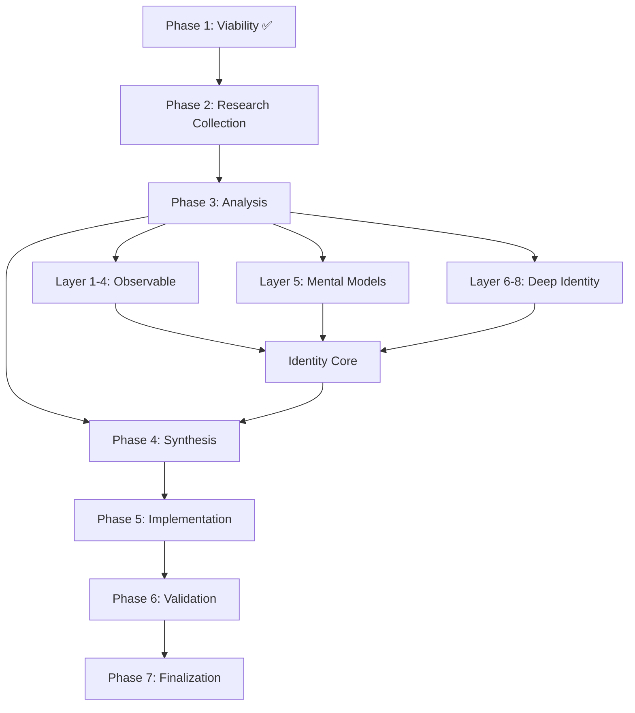

# Dependencies Map - Clone IA Alan Nicolas
## Self-Cloning Elite Tier Project

**Version:** 2.0
**Created:** 2025-10-16
**Project:** MMOS Pipeline - Alan Nicolas
**APEX Score:** 81/100
**Fidelity Target:** 93-97%

---

## 1. Phase Dependencies (Critical Path)



### Phase-Level Dependencies:

**Phase 1 → Phase 2**
- **Dependency:** GO/NO-GO decision
- **Status:** ✅ SATISFIED (GO approved, 84% viability)
- **Blocker Risk:** None

**Phase 2 → Phase 3**
- **Dependency:** Source tier classification complete
- **Status:** ✅ SATISFIED (sources_master.yaml v2.0 complete)
- **Blocker Risk:** None
- **Input Required:** 208 sources classified into Tier 1/2/3

**Phase 3 → Phase 4**
- **Dependency:** All 8 DNA Mental™ layers extracted
- **Status:** ⏳ PENDING
- **Blocker Risk:** Medium (if Tier 1 sources insufficient)
- **Required Outputs:**
  - `analysis/layer-1-behavioral-patterns.yaml`
  - `analysis/layer-2-communication-style.yaml`
  - `analysis/layer-3-routines.yaml`
  - `analysis/layer-4-recognition-patterns.yaml`
  - `analysis/layer-5-mental-models.yaml`
  - `analysis/layer-6-values-hierarchy.yaml`
  - `analysis/layer-7-core-obsessions.yaml`
  - `analysis/layer-8-paradoxes.yaml`
  - `analysis/identity-core.yaml`
  - `analysis/cognitive-spec.yaml`

**Phase 4 → Phase 5**
- **Dependency:** Synthesis documents complete
- **Status:** ⏳ PENDING
- **Blocker Risk:** Low
- **Required Outputs:**
  - `synthesis/frameworks.md`
  - `synthesis/communication-style.md`
  - `synthesis/decision-matrix.yaml`
  - `kb/` directory with structured chunks

**Phase 5 → Phase 6**
- **Dependency:** All system prompts generated
- **Status:** ⏳ PENDING
- **Blocker Risk:** Low
- **Required Outputs:**
  - `system_prompts/generalista.md`
  - `system_prompts/vida-legendaria.md`
  - `system_prompts/ia-expert.md`
  - `implementation/tools.md`
  - `implementation/memory-system.yaml`

**Phase 6 → Phase 7**
- **Dependency:** Fidelity target achieved (93-97%)
- **Status:** ⏳ PENDING
- **Blocker Risk:** Medium (may require iteration)
- **Required:** Average fidelity score across 50 test scenarios

**Phase 7 → PRODUCTION**
- **Dependency:** Documentation + deployment package complete
- **Status:** ⏳ PENDING
- **Blocker Risk:** Low
- **Required:** User guide, maintenance docs, deployment package

---

## 2. File Dependencies

### Source Files (Input)

```
sources/
├── alan-nicolas-profile.json [TIER 1] ─────┐
├── self-analysis/                          ├──> Phase 3 (All Layers)
│   ├── modelo-do-eu.md [TIER 1 - CROWN]   │
│   └── Q&A.md [TIER 1]                    │
├── cursos/ (78 files) [TIER 1-2] ─────────┤
├── newsletter/ (56 files) [TIER 2] ───────┤
├── podcast/ (36 files) [TIER 2] ──────────┤
├── videos/ (12 files) [TIER 1-2] ─────────┤
├── interviews/ (10 files) [TIER 3] ───────┤
└── articles/ (2 files) [TIER 3] ──────────┘
```

### Analysis Files (Intermediate)

```
analysis/
├── layer-1-behavioral-patterns.yaml ────┐
├── layer-2-communication-style.yaml ────┤
├── layer-3-routines.yaml ───────────────┼──> identity-core.yaml
├── layer-4-recognition-patterns.yaml ───┤
├── layer-5-mental-models.yaml ──────────┤
├── layer-6-values-hierarchy.yaml ───────┤
├── layer-7-core-obsessions.yaml ────────┤
└── layer-8-paradoxes.yaml ──────────────┘
                                          │
identity-core.yaml + cognitive-spec.yaml ─┴──> Phase 4 (Synthesis)
```

### Synthesis Files (Intermediate)

```
synthesis/
├── frameworks.md ─────────────────┐
├── communication-style.md ────────┼──> Phase 5 (Implementation)
└── decision-matrix.yaml ──────────┘
                                    │
kb/ (knowledge chunks) ─────────────┘
```

### Implementation Files (Intermediate)

```
system_prompts/
├── generalista.md ────────────┐
├── vida-legendaria.md ────────┼──> Phase 6 (Validation)
└── ia-expert.md ──────────────┘
                                │
implementation/                 │
├── tools.md ──────────────────┤
└── memory-system.yaml ────────┘
```

### Output Files (Final)

```
deployment/
├── system-prompts-package/
├── knowledge-base-export/
└── deployment-checklist.md

docs/
├── user-guide.md
└── maintenance.md

validation/
├── test-scenarios.yaml (50 scenarios)
├── fidelity-report.md
└── iteration-log.md
```

---

## 3. Layer Extraction Dependencies

### Layer 1: Behavioral Patterns
**Dependencies:**
- ✅ `self-analysis/Q&A.md` (direct behavioral evidence)
- ✅ `videos/` (unscripted moments)
- ✅ `podcast/` (conversational behaviors)

**Extraction Tools:**
- Pattern recognition from Q&A responses
- Video transcript analysis for decision moments
- Podcast conversation flow analysis

**Risk:** Low (abundant source material)

---

### Layer 2: Communication Style
**Dependencies:**
- ✅ All written content (newsletter, courses, self-analysis)
- ✅ All video/audio transcripts
- ✅ 56 newsletter editions

**Extraction Tools:**
- NLP analysis for vocabulary, tone, sentence structure
- Metaphor and analogy extraction
- Audience adaptation pattern recognition

**Risk:** Very Low (98% coverage predicted)

---

### Layer 3: Routines & Habits
**Dependencies:**
- ✅ `self-analysis/` materials
- ⚠️ May require direct elicitation (self-cloning advantage)

**Extraction Tools:**
- Pattern extraction from Q&A
- Work habit inference from content creation patterns
- **Fallback:** Direct questioning to Alan Nicolas

**Risk:** Medium (75% coverage, but self-cloning mitigates)

---

### Layer 4: Recognition Patterns
**Dependencies:**
- ✅ `cursos/` (pattern teaching demonstrates pattern recognition)
- ✅ `self-analysis/modelo-do-eu.md` (meta-cognition)

**Extraction Tools:**
- Extract patterns from course teaching examples
- Identify "signature insights" from content
- Map domain expertise boundaries

**Risk:** Low (90% coverage predicted)

---

### Layer 5: Mental Models
**Dependencies:**
- ✅ All `cursos/` materials
- ✅ `self-analysis/modelo-do-eu.md` (Section V: Núcleo Cognitivo)
- ✅ `newsletter/` (framework application examples)

**Extraction Tools:**
- Framework extraction from courses
- Mental model identification (80/20, systems thinking, etc.)
- Reasoning chain mapping from problem → solution

**Risk:** Low (95% coverage predicted)

---

### Layer 6: Values Hierarchy ⭐ PRE-VALIDATED
**Dependencies:**
- ✅ `self-analysis/modelo-do-eu.md` (Section I: Núcleo Essencial)
- ✅ `self-analysis/Q&A.md` (values in action)

**Extraction Tools:**
- Direct extraction from modelo-do-eu.md
- Cross-validation with behavioral evidence from Q&A

**Risk:** Very Low (100% coverage, pre-validated)

**ADVANTAGE:** Saves 2-4 hours of extraction work

---

### Layer 7: Core Obsessions ⭐ PRE-VALIDATED
**Dependencies:**
- ✅ `self-analysis/modelo-do-eu.md` (Sections II, V, VI)
- ✅ Course creation patterns (obsessions manifest as content themes)

**Extraction Tools:**
- Direct extraction from modelo-do-eu.md
- Thematic analysis of content creation patterns
- Identify recurring "why behind the why"

**Risk:** Very Low (100% coverage, pre-validated)

**ADVANTAGE:** Saves 2-3 hours of extraction work

---

### Layer 8: Productive Paradoxes ⭐ PRE-VALIDATED
**Dependencies:**
- ✅ `self-analysis/modelo-do-eu.md`
- ✅ `alan-nicolas-profile.json` (ISTP + teacher paradox)

**Extraction Tools:**
- Extract documented paradoxes from modelo-do-eu.md
- Identify apparent contradictions in psychometric profile vs. behavior
- Map "Alan Nicolas duality" (Vida Lendária + IA Expert)

**Risk:** Low (95% coverage, pre-validated)

**ADVANTAGE:** Saves 2-4 hours of extraction work

---

## 4. Tooling Dependencies

### Required Software

| Tool | Purpose | Phase | Status |
|------|---------|-------|--------|
| **Claude Code** | MMOS pipeline execution | All | ✅ Available |
| **YAML Parser** | Layer file generation | Phase 3 | ✅ Built-in |
| **Markdown Renderer** | Documentation generation | All | ✅ Built-in |
| **NLP Analysis** | Communication style extraction | Phase 3 | ✅ Available (Claude) |
| **RAG System** | Knowledge base structuring | Phase 4-5 | ⚠️ Design needed |
| **LLM API** | Clone deployment | Phase 7 | ⚠️ TBD (OpenAI/Anthropic) |

### MMOS Framework Files

| File | Purpose | Required For | Status |
|------|---------|--------------|--------|
| `expansion-packs/mmos-mind-mapper/tasks/viability-assessment.md` | Phase 1 template | Viability | ✅ Used |
| `expansion-packs/mmos-mind-mapper/tasks/research-collection.md` | Phase 2 template | Research | ⏳ Needed |
| `expansion-packs/mmos-mind-mapper/tasks/cognitive-analysis.md` | Phase 3 template | Analysis | ⏳ Needed |
| `expansion-packs/mmos-mind-mapper/tasks/synthesis-compilation.md` | Phase 4 template | Synthesis | ⏳ Needed |
| `expansion-packs/mmos-mind-mapper/tasks/system-prompt-creation.md` | Phase 5 template | Implementation | ⏳ Needed |
| `expansion-packs/mmos-mind-mapper/templates/layer-template.yaml` | Layer structure | Phase 3 | ⏳ Needed |

---

## 5. Resource Dependencies

### Time Resources

| Phase | Estimated Time | Dependencies | Blocker Risk |
|-------|----------------|--------------|--------------|
| Phase 1 | ✅ 6h (complete) | None | None |
| Phase 2 | 4-6h remaining | Phase 1 GO | ✅ Low |
| Phase 3 | 20-30h | Tier 1 sources | ⚠️ Medium |
| Phase 4 | 12-16h | Phase 3 complete | ✅ Low |
| Phase 5 | 16-24h | Phase 4 complete | ✅ Low |
| Phase 6 | 12-20h | Phase 5 complete | ⚠️ Medium |
| Phase 7 | 4-6h | Fidelity target | ✅ Low |

**Total:** 68-104 hours | **Wall Time:** 10-20 days

### Human Resources (Self-Cloning Advantage)

| Role | Responsibility | Availability | Impact |
|------|----------------|--------------|--------|
| **Subject (Alan Nicolas)** | Self-validation, gap filling, fidelity testing | ✅ Immediate | Critical |
| **Mind Mapper Agent (Claude)** | MMOS pipeline execution | ✅ Continuous | Critical |
| **QA Reviewer (Optional)** | Secondary validation | ⏳ TBD | Nice-to-have |

**ADVANTAGE:** Zero gatekeeping delay - Alan Nicolas can validate instantly

### Computational Resources

| Resource | Purpose | Requirement | Status |
|----------|---------|-------------|--------|
| **LLM API Credits** | Analysis + synthesis | 500K-1M tokens | ✅ Available |
| **Storage** | 208 source files + outputs | 500MB | ✅ Available |
| **Context Window** | Long document processing | 200K tokens | ✅ Available (Claude) |
| **RAG Infrastructure** | Knowledge base deployment | TBD | ⚠️ Design needed |

---

## 6. Knowledge Dependencies

### Domain Expertise Required

**For Analysis (Phase 3):**
- ✅ DNA Mental™ 8-Layer framework understanding
- ✅ Psychometric interpretation (DISC, Enneagram, MBTI, Big Five)
- ✅ NLP for communication style analysis
- ✅ Pattern recognition expertise

**For Synthesis (Phase 4):**
- ✅ Framework extraction methodology
- ✅ Knowledge base structuring (RAG design)
- ✅ Communication style codification

**For Implementation (Phase 5):**
- ✅ System prompt engineering (Claude/GPT-4)
- ⚠️ RAG architecture design
- ✅ Persona integration (dual persona handling)

**For Validation (Phase 6):**
- ✅ Fidelity testing methodology
- ✅ Turing test design
- ✅ Iteration strategy

### Cross-References

**Internal Documentation:**
- ✅ `PRD.md` - Product requirements and success criteria
- ✅ `TODO.md` - Detailed task breakdown
- ✅ `sources/sources_master.yaml` - Source inventory and classification
- ✅ `docs/logs/20251016-viability-full.yaml` - APEX + ICP data
- ✅ `docs/logs/20251016-viability-report.md` - Viability assessment

**MMOS Framework Docs:**
- ⏳ `docs/mmos/docs/PRD.md` - MMOS system documentation
- ⏳ `expansion-packs/mmos-mind-mapper/README.md` - Mind Mapper guide
- ⏳ `docs/mmos/architecture/` - MMOS architecture

**External References:**
- DNA Mental™ 8-Layer methodology documentation
- System prompt engineering best practices
- RAG architecture patterns

---

## 7. Data Flow Dependencies

```
┌─────────────────────────────────────────────────────────────┐
│                    INPUT: 208 Source Files                  │
│              (2.2M words, 8 categories, 3 tiers)            │
└────────────────────────┬────────────────────────────────────┘
                         │
                         ▼
┌─────────────────────────────────────────────────────────────┐
│              PHASE 3: DNA Mental™ Extraction                │
│         Extract behavioral, cognitive, identity data        │
└────────────────────────┬────────────────────────────────────┘
                         │
                         ├──> Layer 1-4 (Observable) ──┐
                         ├──> Layer 5 (Mental Models) ─┤
                         └──> Layer 6-8 (Deep Identity)┤
                                                        │
                                                        ▼
┌─────────────────────────────────────────────────────────────┐
│            INTERMEDIATE: identity-core.yaml                 │
│                    + cognitive-spec.yaml                    │
└────────────────────────┬────────────────────────────────────┘
                         │
                         ▼
┌─────────────────────────────────────────────────────────────┐
│         PHASE 4: Synthesis + Knowledge Structuring          │
│   Frameworks, communication style, decision matrix, KB      │
└────────────────────────┬────────────────────────────────────┘
                         │
                         ▼
┌─────────────────────────────────────────────────────────────┐
│          PHASE 5: System Prompt Engineering                 │
│    3 Personas: Generalista, Vida Lendária, IA Expert       │
└────────────────────────┬────────────────────────────────────┘
                         │
                         ▼
┌─────────────────────────────────────────────────────────────┐
│          PHASE 6: Validation + Iteration                    │
│            50 test scenarios → Fidelity 93-97%              │
└────────────────────────┬────────────────────────────────────┘
                         │
                         ▼
┌─────────────────────────────────────────────────────────────┐
│            OUTPUT: Production-Ready AI Clone                │
│         (System prompts + KB + Tools + Documentation)       │
└─────────────────────────────────────────────────────────────┘
```

---

## 8. Risk Dependencies

### High-Risk Dependencies (Could Block Project)

**Risk #1: Tier 1 Sources Insufficient for Layers 1-5**
- **Likelihood:** Low (sources_master.yaml shows 75-100% coverage for all layers)
- **Impact:** High (would require additional source collection)
- **Mitigation:** Self-cloning allows direct elicitation to fill gaps
- **Dependency:** `sources/self-analysis/modelo-do-eu.md` + `Q&A.md`

**Risk #2: Fidelity Target Not Achieved**
- **Likelihood:** Medium (93-97% is ambitious)
- **Impact:** High (may require multiple iteration cycles)
- **Mitigation:** High-quality Tier 1 sources + self-cloning validation bandwidth
- **Dependency:** Iteration time budget (included in Phase 6: 12-20h)

**Risk #3: Dual Persona Integration Failure**
- **Likelihood:** Low
- **Impact:** Medium (clone may not seamlessly switch between personas)
- **Mitigation:** Explicit persona testing in Phase 6
- **Dependency:** Clear persona boundaries defined in Phase 4 synthesis

### Medium-Risk Dependencies

**Risk #4: RAG System Design Complexity**
- **Likelihood:** Medium
- **Impact:** Medium (affects memory system performance)
- **Mitigation:** Use proven RAG patterns, iterate in Phase 6
- **Dependency:** Phase 5 memory-system.yaml design

**Risk #5: Context Window Limitations**
- **Likelihood:** Low (Claude has 200K context)
- **Impact:** Medium (long conversations may lose context)
- **Mitigation:** Efficient RAG chunking strategy
- **Dependency:** Phase 4 KB structuring

### Low-Risk Dependencies

**Risk #6: Timeline Overrun**
- **Likelihood:** Medium
- **Impact:** Low (no hard deadlines, self-cloning project)
- **Mitigation:** Flexible timeline, focus on quality over speed
- **Dependency:** None (self-paced project)

---

## 9. Critical Path Analysis

### Longest Path (Determines Minimum Timeline):

```
Phase 1 (6h) → Phase 2 (6h) → Phase 3 (30h max) → Phase 4 (16h) →
Phase 5 (24h max) → Phase 6 (20h max) → Phase 7 (6h)

TOTAL: 108 hours (upper bound)
WALL TIME: 15-20 days (assuming 6h/day)
```

### Fastest Path (Optimistic):

```
Phase 1 (6h) → Phase 2 (4h) → Phase 3 (20h min) → Phase 4 (12h) →
Phase 5 (16h min) → Phase 6 (12h min) → Phase 7 (4h)

TOTAL: 74 hours (lower bound)
WALL TIME: 10-12 days (assuming 6-8h/day)
```

### Bottleneck Phases:

1. **Phase 3 (Analysis): 20-30h** - Most time-consuming
   - **Dependency:** Quality of Tier 1 sources
   - **Mitigation:** modelo-do-eu.md saves 4-8h on Layers 6-8

2. **Phase 6 (Validation): 12-20h** - Iterative, unpredictable
   - **Dependency:** System prompt quality from Phase 5
   - **Mitigation:** Self-cloning allows rapid validation cycles

3. **Phase 5 (Implementation): 16-24h** - Technical complexity
   - **Dependency:** Synthesis quality from Phase 4
   - **Mitigation:** Use proven system prompt patterns

---

## 10. Dependency Satisfaction Checklist

### Phase 1 → Phase 2 ✅
- [x] Viability assessment complete
- [x] APEX score calculated (81/100)
- [x] ICP match scored (87%)
- [x] GO decision obtained (84% overall viability)

### Phase 2 → Phase 3 ✅
- [x] 208 sources inventoried
- [x] Source tier classification complete
- [x] Reading priority queue generated
- [x] Gap analysis performed
- [x] Tier 1 sources identified (modelo-do-eu.md, Q&A.md, profile, top courses)

### Phase 3 → Phase 4 ⏳
- [ ] Layer 1: Behavioral patterns extracted
- [ ] Layer 2: Communication style extracted
- [ ] Layer 3: Routines extracted (or gaps documented)
- [ ] Layer 4: Recognition patterns extracted
- [ ] Layer 5: Mental models extracted
- [ ] Layer 6: Values hierarchy extracted
- [ ] Layer 7: Core obsessions extracted
- [ ] Layer 8: Productive paradoxes extracted
- [ ] identity-core.yaml generated
- [ ] cognitive-spec.yaml generated

### Phase 4 → Phase 5 ⏳
- [ ] frameworks.md complete
- [ ] communication-style.md complete
- [ ] decision-matrix.yaml complete
- [ ] KB chunks structured

### Phase 5 → Phase 6 ⏳
- [ ] system_prompts/generalista.md generated
- [ ] system_prompts/vida-legendaria.md generated
- [ ] system_prompts/ia-expert.md generated
- [ ] implementation/tools.md defined
- [ ] implementation/memory-system.yaml designed

### Phase 6 → Phase 7 ⏳
- [ ] 50 test scenarios created
- [ ] Fidelity target achieved (93-97% average)
- [ ] All personas tested and validated
- [ ] Critical deviations addressed

### Phase 7 → PRODUCTION ⏳
- [ ] User guide written
- [ ] Maintenance documentation complete
- [ ] Deployment package created
- [ ] Handoff complete

---

## 11. Next Actions (Immediate Dependencies to Resolve)

### Priority 1: Complete Phase 2
- [x] Update `sources_master.yaml` with 208 sources ✅ DONE
- [x] Classify sources into Tier 1/2/3 ✅ DONE
- [x] Generate reading priority queue ✅ DONE

### Priority 2: Begin Phase 3 (Analysis)
- [ ] Read `self-analysis/modelo-do-eu.md` (2h) - **START HERE**
- [ ] Read `self-analysis/Q&A.md` (3h)
- [ ] Extract Layer 6-8 from modelo-do-eu.md (direct extraction)
- [ ] Begin Layer 1-5 extraction from remaining Tier 1 sources

### Priority 3: Validate Dependencies
- [ ] Confirm MMOS task templates are available
- [ ] Test RAG chunking strategy on sample content
- [ ] Verify LLM API access for deployment

---

## Summary

**Current Status:** Phase 2 (Research Collection) → 95% Complete

**Next Blocking Dependency:** Begin Phase 3 (Analysis)

**Critical Success Factor:** Quality of Tier 1 source extraction (modelo-do-eu.md as foundation)

**Self-Cloning Advantage:** Eliminates gatekeeping dependencies, allows instant validation and gap-filling

**Fidelity Confidence:** High (93-97% target achievable with current source quality + self-cloning advantages)

---

**Document Owner:** Mind Mapper Agent
**Last Updated:** 2025-10-16
**Next Review:** After Phase 3 begins
