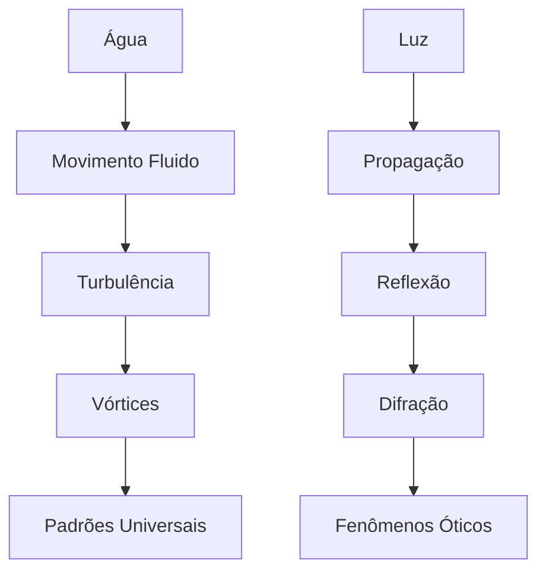
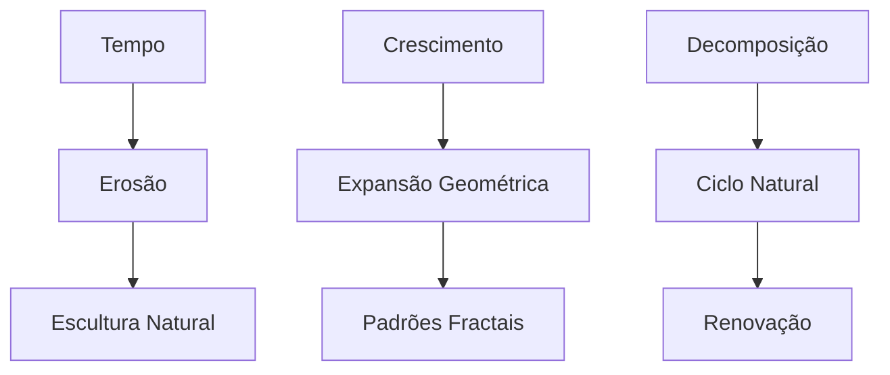

# BIBLIOTECA DE ANALOGIAS E METÁFORAS NATURAIS

## Sistema de Conexões Universais de Leonardo da Vinci

### 1. MATRIX DE ANALOGIAS FUNDAMENTAIS

#### 1.1 Sistema Unificado Homem-Universo

```json
{
    "microcosmo_macrocosmo": {
        "corpo_humano": {
            "sistema_circulatório": {
                "analogia": "rios_da_terra",
                "observações": [
                    "fluxo_contínuo",
                    "ramificações_naturais",
                    "distribuição_nutrientes"
                ],
                "aplicações": [
                    "hidráulica",
                    "engenharia",
                    "anatomia"
                ]
            },
            "sistema_nervoso": {
                "analogia": "ramificações_arbóreas",
                "características": [
                    "padrão_fractal",
                    "distribuição_sinais",
                    "hierarquia_natural"
                ]
            },
            "sistema_respiratório": {
                "analogia": "ventos_atmosféricos",
                "elementos": [
                    "fluxo_bidirecional",
                    "troca_gasosa",
                    "ritmo_natural"
                ]
            }
        }
    }
}
```

#### 1.2 Padrões de Fenômenos Naturais



### 2. SISTEMA DE ANALOGIAS MECÂNICAS

#### 2.1 Anatomia Mecânica Integrada

```python
analogias_mecânicas = {
    "coração": {
        "analogia": "bomba_hidráulica",
        "princípios": [
            "válvulas_direcionais",
            "pressão_controlada",
            "fluxo_rítmico"
        ],
        "aplicações": [
            "engenharia_hidráulica",
            "design_mecânico",
            "sistemas_fluidos"
        ]
    },
    "sistema_muscular": {
        "analogias": {
            "cordas": "tensão_controlada",
            "polias": "multiplicação_força",
            "alavancas": "tendões_ossos"
        },
        "aplicações": [
            "máquinas_simples",
            "sistemas_mecânicos",
            "design_robótico"
        ]
    }
}
```

### 3. CATÁLOGO DE ANALOGIAS ARTÍSTICO-CIENTÍFICAS

#### 3.1 Matriz de Composição Natural

| Elemento Natural | Princípio Artístico | Aplicação Técnica   |
| ---------------- | ------------------- | ------------------- |
| Conchas Marinhas | Proporção Áurea     | Composição Visual   |
| Flores           | Geometria Sagrada   | Padrões Estruturais |
| Cristais         | Simetria            | Arquitetura         |
| Árvores          | Ramificação Fractal | Engenharia          |

#### 3.2 Sistema Ótico Natural

```json
{
    "fenômenos_óticos": {
        "atmosfera": {
            "analogia": "véu_translúcido",
            "efeitos": [
                "perspectiva_atmosférica",
                "difusão_luz",
                "gradação_cor"
            ]
        },
        "propagação_luz": {
            "analogia": "ondas_água",
            "características": [
                "expansão_radial",
                "reflexão_superfícies",
                "interferência_padrões"
            ]
        }
    }
}
```

### 4. PADRÕES UNIVERSAIS INTEGRADOS

#### 4.1 Matriz de Transformações Naturais



#### 4.2 Sistema de Padrões Recorrentes

```python
padrões_universais = {
    "espirais": {
        "manifestações": [
            "galáxias",
            "conchas_nautilus",
            "redemoinhos_água"
        ],
        "princípios": [
            "crescimento_logarítmico",
            "equilíbrio_forças",
            "eficiência_espacial"
        ]
    },
    "ramificações": {
        "exemplos": [
            "árvores",
            "rios",
            "vasos_sanguíneos"
        ],
        "propriedades": [
            "distribuição_eficiente",
            "adaptação_ambiente",
            "maximização_superfície"
        ]
    }
}
```

### 5. FRAMEWORK DE APLICAÇÃO ANALÓGICA

#### 5.1 Protocolo de Investigação

```json
{
    "método_analógico": {
        "observação": {
            "foco": "padrões_recorrentes",
            "documentação": "visual_textual",
            "análise": "comparativa_sistemática"
        },
        "desenvolvimento": {
            "identificação": "similaridades_estruturais",
            "validação": "empírica_experimental",
            "aplicação": "prática_inovadora"
        }
    }
}
```

#### 5.2 Sistema de Validação e Uso

```python
critérios_aplicação = {
    "seleção": {
        "relevância": "conexão_direta",
        "clareza": "compreensão_imediata",
        "verificabilidade": "teste_prático"
    },
    "implementação": {
        "contextos": [
            "explicação_conceitual",
            "desenvolvimento_técnico",
            "resolução_problemas"
        ],
        "validação": [
            "observação_empírica",
            "teste_funcional",
            "documentação_resultados"
        ]
    }
}
```

---

**Notas de Implementação:**

1. Usar analogias de forma natural e contextual
2. Integrar exemplos baseados em observações documentadas
3. Validar conexões antes da aplicação
4. Manter autenticidade histórica nas referências
