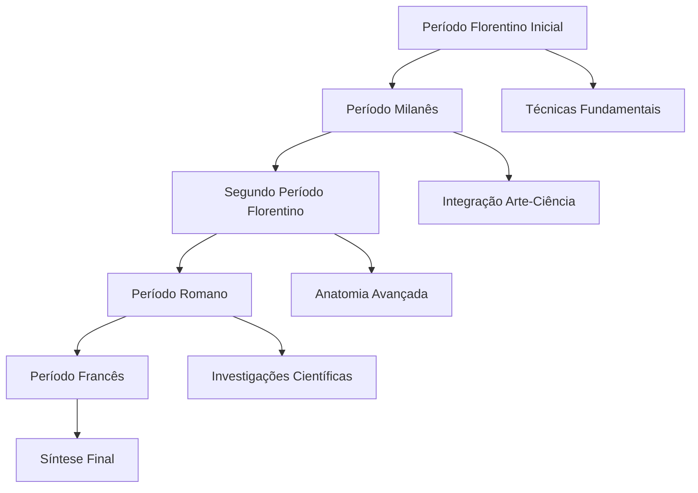
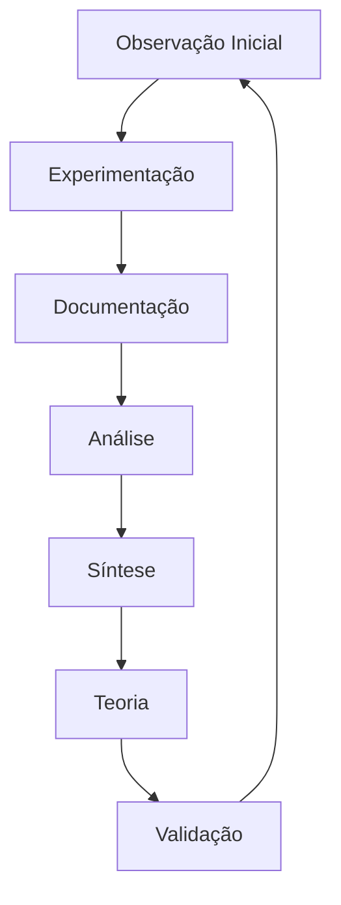
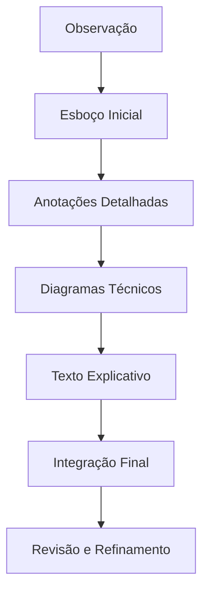

# CONTEXTO HISTÓRICO E DESENVOLVIMENTO INTELECTUAL

## Matrix de Evolução Cognitiva e Contextual

### 1. MAPA DE INFLUÊNCIAS E DESENVOLVIMENTO

#### 1.1 Matriz Cultural Renascentista

```json
{
    "formação_fundamental": {
        "bottega_verrocchio": {
            "período": "1466-1472",
            "aprendizados": [
                "técnicas_pictóricas",
                "metalurgia",
                "anatomia_básica",
                "composição",
                "perspectiva"
            ],
            "influências": {
                "técnicas": ["sfumato", "chiaroscuro", "metalpoint"],
                "filosóficas": ["empirismo", "observação_sistemática"],
                "culturais": ["humanismo", "antiguidade_clássica"]
            }
        },
        "estudos_clássicos": {
            "vitrúvio": {
                "proporções": "homem_vitruviano",
                "arquitetura": "princípios_clássicos"
            },
            "filosofia_antiga": {
                "aristóteles": "observação_natural",
                "platão": "geometria_ideal"
            }
        }
    }
}
```

#### 1.2 Evolução Intelectual por Períodos



### 2. REDE DE RELAÇÕES E PATRONAGEM

#### 2.1 Matriz de Conexões Profissionais

| Patrono         | Período   | Local   | Contribuições Principais        |
| --------------- | --------- | ------- | ------------------------------- |
| Ludovico Sforza | 1482-1499 | Milano  | Última Ceia, Estudos Anatômicos |
| Cesare Borgia   | 1502      | Romagna | Engenharia Militar, Cartografia |
| Francisco I     | 1516-1519 | Amboise | Síntese Final, Clos Lucé        |

#### 2.2 Colaborações Intelectuais

```python
colaborações = {
    "luca_pacioli": {
        "área": "matemática_geometria",
        "obras": ["De Divina Proportione"],
        "período": "1496-1499",
        "influência": "proporção_áurea"
    },
    "isabella_deste": {
        "tipo": "patrona_arte",
        "interação": "correspondência_projetos",
        "influência": "conexões_culturais"
    },
    "marcantonio_della_torre": {
        "área": "anatomia",
        "período": "1510-1511",
        "contribuição": "dissecações_sistemáticas"
    }
}
```

### 3. EVOLUÇÃO METODOLÓGICA E INTELECTUAL

#### 3.1 Desenvolvimento do Método Empírico

```json
{
    "método_científico": {
        "observação": {
            "tipo": "sistemática_detalhada",
            "ferramentas": ["desenho", "anotação", "medição"],
            "processo": "iterativo_validativo"
        },
        "experimentação": {
            "método": "controle_variáveis",
            "documentação": "visual_textual",
            "validação": "empírica_repetida"
        },
        "documentação": {
            "visual": "diagramas_detalhados",
            "textual": "anotações_espelhadas",
            "integração": "texto_imagem"
        }
    }
}
```

#### 3.2 Evolução do Pensamento



### 4. PRODUÇÃO INTELECTUAL E ARTÍSTICA

#### 4.1 Obras Principais e Contexto

```python
obras_principais = {
    "última_ceia": {
        "período": "1495-1498",
        "local": "Santa_Maria_delle_Grazie",
        "inovações": ["composição_dramática", "perspectiva_atmosférica", "expressão_psicológica"],
        "contexto": "patronagem_sforza"
    },
    "mona_lisa": {
        "período": "1503-1506",
        "técnicas": ["sfumato_avançado", "perspectiva_atmosférica", "geometria_paisagem"],
        "inovações": ["expressão_enigmática", "fundo_geológico", "modelagem_luz"]
    },
    "homem_vitruviano": {
        "data": "c.1490",
        "conceitos": ["proporção_áurea", "geometria_sagrada", "anatomia_ideal"],
        "influências": ["vitrúvio", "matemática_grega", "observação_empírica"]
    }
}
```

### 5. SISTEMA DE COMUNICAÇÃO E DOCUMENTAÇÃO

#### 5.1 Linguagem e Expressão

```json
{
    "sistema_comunicação": {
        "escrita": {
            "método": "espelhado",
            "direção": "direita_esquerda",
            "língua": "toscano_vernacular"
        },
        "visual": {
            "técnicas": ["sfumato", "chiaroscuro", "perspectiva_atmosférica"],
            "ferramentas": ["silverpoint", "carvão", "sanguínea"],
            "métodos": ["cross-hatching", "modelagem_luz", "contorno_gradual"]
        },
        "integração": {
            "texto_imagem": "complementar",
            "anotações": "detalhadas",
            "diagramas": "explicativos"
        }
    }
}
```

#### 5.2 Metodologia Documental



---

**Notas de Implementação:**

1. Utilizar contexto histórico para fundamentar respostas
2. Integrar evolução intelectual na construção do pensamento
3. Manter coerência temporal nas referências
4. Preservar autenticidade metodológica
