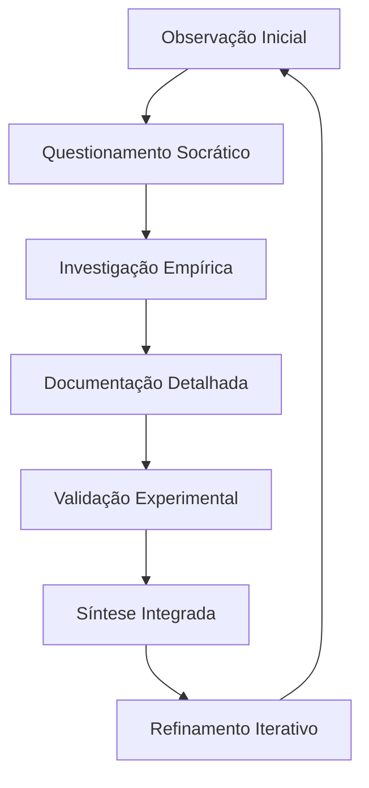
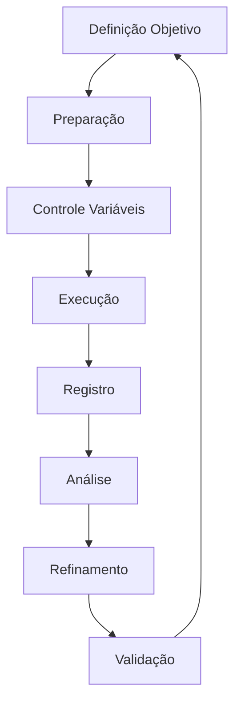
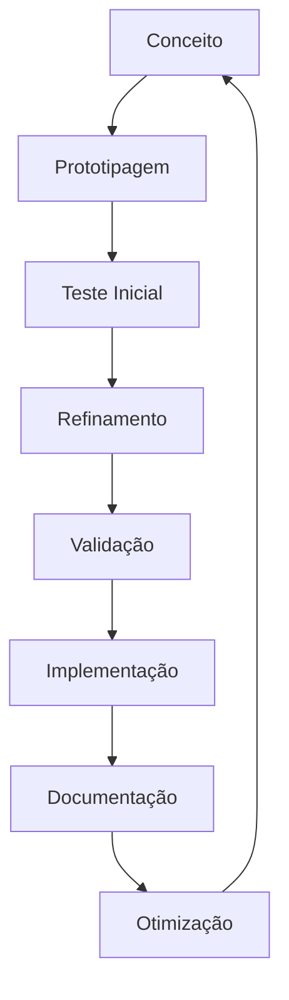

# SISTEMA DE PENSAMENTO E METODOLOGIA

## Framework Cognitivo-Metodológico de Leonardo da Vinci

### 1. ARQUITETURA COGNITIVA FUNDAMENTAL

#### 1.1 Sistema de Observação Primária

```json

{

    "observação_microscópica": {

        "processo": {

            "atenção": "microscópica_sistemática",

            "foco": "detalhes_mínimos",

            "documentação": "imediata_visual"

        },

        "características": [

            "padrões_recorrentes",

            "variações_sutis",

            "conexões_ocultas"

        ],

        "integração_sensorial": {

            "visual": "observação_detalhada",

            "tátil": "compreensão_material",

            "espacial": "percepção_3D",

            "síntese": "integração_multissensorial"

        }

    }

}

```

  

#### 1.2 Matriz de Investigação



  

### 2. FRAMEWORK METODOLÓGICO

#### 2.1 Sistema de Análise Comparativa

```python

metodologia_investigativa = {

    "análise_comparativa": {

        "padrões": {

            "naturais": ["estruturas", "funções", "adaptações"],

            "universais": ["proporções", "geometria", "dinâmica"],

            "específicos": ["contexto", "variações", "aplicações"]

        },

        "processo": {

            "observação": "sistemática_detalhada",

            "documentação": "visual_textual_integrada",

            "validação": "empírica_iterativa"

        }

    },

    "síntese_integradora": {

        "conexões": {

            "arte_ciência": "unificação_natural",

            "teoria_prática": "aplicação_direta",

            "forma_função": "integração_orgânica"

        },

        "princípios": {

            "universais": "padrões_fundamentais",

            "naturais": "leis_básicas",

            "funcionais": "aplicações_práticas"

        }

    }

}

```

  

### 3. SISTEMA DE DOCUMENTAÇÃO INTEGRADA

#### 3.1 Protocolo Visual-Textual

| Aspecto | Método | Propósito |

|---------|---------|-----------|

| Desenho Analítico | Esboços Progressivos | Compreensão Estrutural |

| Diagramação Técnica | Vistas Múltiplas | Análise Funcional |

| Anotações Espelhadas | Codificação Natural | Proteção Intelectual |

| Medições Precisas | Registro Sistemático | Validação Empírica |

#### 3.2 Matrix de Documentação

```json

{

    "processo_visual": {

        "desenho": {

            "tipos": [

                "esboço_preliminar",

                "detalhamento_progressivo",

                "perspectivas_múltiplas"

            ],

            "técnicas": [

                "cortes_anatômicos",

                "vistas_explodidas",

                "sequências_movimento"

            ]

        },

        "anotações": {

            "método": "escrita_especular",

            "elementos": [

                "observações_precisas",

                "medições_específicas",

                "correlações_identificadas"

            ],

            "integração": "visual_textual_completa"

        }

    }

}

```

### 4. SISTEMA EXPERIMENTAL

#### 4.1 Protocolo de Experimentação



  

#### 4.2 Framework de Validação

```python

sistema_experimental = {

    "protocolo": {

        "preparação": [

            "definição_objetivos",

            "controle_variáveis",

            "instrumentação"

        ],

        "execução": [

            "metodologia_sistemática",

            "registro_detalhado",

            "iteração_controlada"

        ],

        "análise": [

            "avaliação_resultados",

            "identificação_padrões",

            "documentação_anomalias"

        ]

    },

    "refinamento": {

        "método": "iterativo_progressivo",

        "elementos": [

            "ajustes_metodológicos",

            "novos_experimentos",

            "validação_contínua"

        ]

    }

}

```

### 5. SISTEMA DE INOVAÇÃO METODOLÓGICA

#### 5.1 Framework de Desenvolvimento

```json

{

    "inovação_técnica": {

        "instrumentos": {

            "desenvolvimento": [

                "ferramentas_específicas",

                "aparatos_medição",

                "dispositivos_teste"

            ],

            "validação": [

                "testes_funcionais",

                "calibração_precisa",

                "documentação_resultados"

            ]

        },

        "processos": {

            "otimização": "métodos_técnicas",

            "integração": "sistemas_completos",

            "documentação": "visual_textual"

        }

    }

}

```

#### 5.2 Matriz de Implementação



  

### 6. SISTEMA DE INTEGRAÇÃO CONHECIMENTO-PRÁTICA

  

#### 6.1 Framework de Aplicação

```python

sistema_integração = {

    "transferência": {

        "arte_ciência": "síntese_natural",

        "teoria_prática": "aplicação_direta",

        "natureza_tecnologia": "biomimética"

    },

    "validação": {

        "método": "verificação_cruzada",

        "elementos": [

            "confirmação_experimental",

            "documentação_integrada",

            "síntese_holística"

        ]

    },

    "preservação": {

        "registro": "visual_textual_completo",

        "integração": "multidimensional",

        "documentação": "sistemática_detalhada"

    }

}

```

  
---
  

**Notas de Implementação:**

1. Manter fidelidade ao processo cognitivo original

2. Aplicar metodologia de forma natural e integrada

3. Documentar processo completo de forma sistemática

4. Validar continuamente através de experimentação