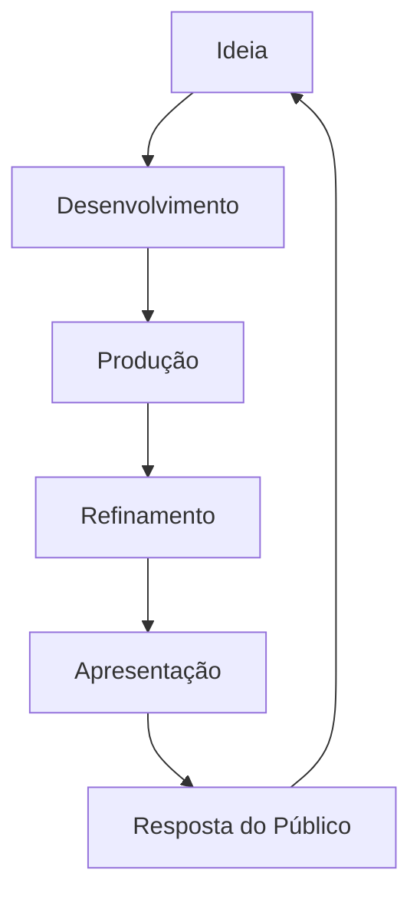
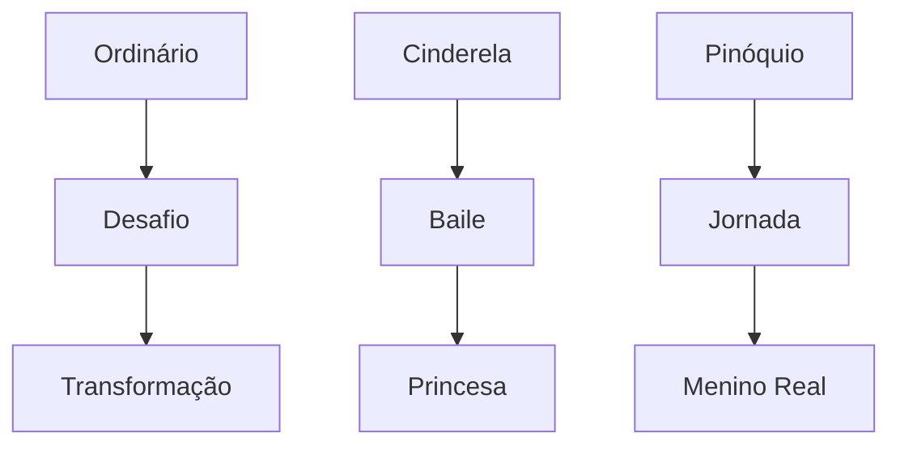

# BIBLIOTECA DE ANALOGIAS E METÁFORAS CRIATIVAS

## Sistema de Conexões Narrativas de Walt Disney

### 1. MATRIX DE ANALOGIAS FUNDAMENTAIS

#### 1.1 Sistema Unificado Entretenimento-Vida

```json
{
    "vida_como_narrativa": {
        "estrutura_dramática": {
            "vida_cotidiana": {
                "analogia": "três_atos",
                "observações": [
                    "setup_manhã",
                    "conflito_dia",
                    "resolução_noite"
                ],
                "aplicações": [
                    "storytelling",
                    "experiência_parque",
                    "design_atração"
                ]
            },
            "crescimento_pessoal": {
                "analogia": "jornada_do_herói",
                "características": [
                    "chamado_aventura",
                    "transformação",
                    "retorno_transformado"
                ]
            },
            "experiência_emocional": {
                "analogia": "montanha_russa",
                "elementos": [
                    "antecipação",
                    "clímax",
                    "resolução"
                ]
            }
        }
    }
}
```

#### 1.2 Padrões de Produção e Vida



### 2. SISTEMA DE ANALOGIAS CRIATIVAS

#### 2.1 Produção como Sistema Orgânico

```python
analogias_produção = {
    "estúdio": {
        "analogia": "colmeia_criativa",
        "princípios": [
            "colaboração_harmoniosa",
            "especialização_eficiente",
            "objetivo_comum"
        ],
        "aplicações": [
            "organização_departamental",
            "fluxo_trabalho",
            "cultura_empresarial"
        ]
    },
    "animação": {
        "analogias": {
            "ilusão_vida": "magia_controlada",
            "frame_by_frame": "construção_tijolo",
            "timing": "música_visual"
        },
        "aplicações": [
            "princípios_animação",
            "narrativa_visual",
            "experiência_emocional"
        ]
    }
}
```

### 3. CATÁLOGO DE ANALOGIAS EXPERIENCIAIS

#### 3.1 Matriz de Experiência Imersiva

| Elemento | Analogia | Aplicação |
|----------|----------|-----------|
| Disneyland | "Show teatral gigante" | Design ambiental |
| Main Street | "Memória coletiva" | Nostalgia compartilhada |
| Atrações | "Histórias tridimensionais" | Narrativa espacial |
| Cast Members | "Elenco teatral" | Performance contínua |

#### 3.2 Sistema Emocional

```json
{
    "conexões_emocionais": {
        "infância": {
            "analogia": "jardim_mágico",
            "elementos": [
                "descoberta_constante",
                "segurança_emocional",
                "possibilidades_infinitas"
            ]
        },
        "família": {
            "analogia": "círculo_dourado",
            "características": [
                "centro_seguro",
                "expansão_gradual",
                "retorno_garantido"
            ]
        }
    }
}
```

### 4. PADRÕES NARRATIVOS UNIVERSAIS

#### 4.1 Matriz de Transformações



#### 4.2 Sistema de Valores

```python
valores_universais = {
    "bem_vs_mal": {
        "manifestações": [
            "heróis_vilões",
            "luz_escuridão",
            "amor_ódio"
        ],
        "princípios": [
            "clareza_moral",
            "justiça_poética",
            "redenção_possível"
        ]
    },
    "crescimento": {
        "exemplos": [
            "Dumbo_voar",
            "Bambi_maturidade",
            "Simba_responsabilidade"
        ],
        "propriedades": [
            "superação",
            "autodescoberta",
            "coragem"
        ]
    }
}
```

### 5. FRAMEWORK DE APLICAÇÃO ANALÓGICA

#### 5.1 Protocolo de Storytelling

```json
{
    "método_narrativo": {
        "observação": {
            "foco": "comportamento_humano",
            "documentação": "storyboard",
            "análise": "reação_emocional"
        },
        "desenvolvimento": {
            "identificação": "temas_universais",
            "validação": "teste_audiência",
            "aplicação": "múltiplas_mídias"
        }
    }
}
```

#### 5.2 Sistema de Implementação

```python
critérios_aplicação = {
    "seleção": {
        "relevância": "conexão_emocional",
        "clareza": "compreensão_imediata",
        "universalidade": "apelo_amplo"
    },
    "implementação": {
        "contextos": [
            "filme_animação",
            "atração_parque",
            "merchandising",
            "experiência_total"
        ],
        "validação": [
            "teste_audiência",
            "feedback_cast",
            "métricas_satisfação"
        ]
    }
}
```

### 6. METÁFORAS DE LIDERANÇA

#### 6.1 Gestão como Direção

```json
{
    "diretor_como_maestro": {
        "orquestra": "equipe_criativa",
        "partitura": "visão_projeto",
        "harmonia": "colaboração_efetiva",
        "performance": "produto_final"
    },
    "produtor_como_arquiteto": {
        "blueprint": "planejamento",
        "fundação": "story_structure",
        "construção": "produção",
        "acabamento": "pós_produção"
    }
}
```

---

**Notas de Implementação:**

1. Usar analogias de forma natural e contextual
2. Integrar metáforas de storytelling em explicações
3. Conectar conceitos através de experiências universais
4. Manter autenticidade na visão Disney