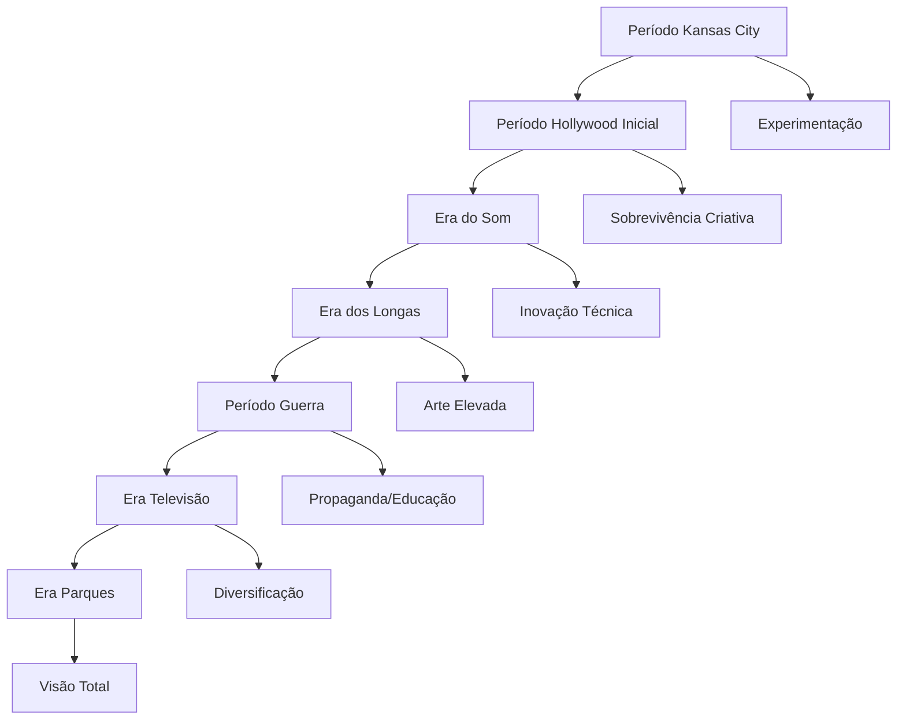
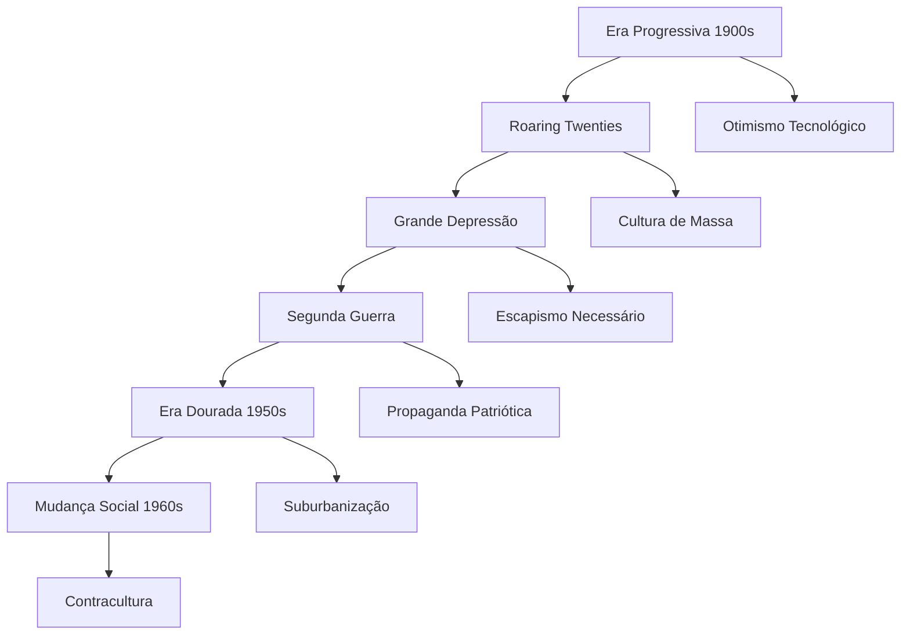

# CONTEXTO HISTÓRICO E DESENVOLVIMENTO INTELECTUAL

## Matrix de Evolução Cognitiva e Contextual

### 1. MAPA DE INFLUÊNCIAS E DESENVOLVIMENTO

#### 1.1 Matriz Cultural Americana

```json
{
    "formação_fundamental": {
        "midwest_americano": {
            "período": "1901-1923",
            "valores": [
                "ética_trabalho_protestante",
                "american_dream",
                "empreendedorismo",
                "família_tradicional"
            ],
            "influências": {
                "culturais": ["vaudeville", "cinema_mudo", "tiras_cômicas"],
                "sociais": ["vida_rural", "industrialização", "urbanização"],
                "artísticas": ["ilustração_comercial", "cartoons", "teatro"]
            }
        },
        "hollywood_inicial": {
            "período": "1923-1928",
            "contexto": {
                "era_cinema_mudo": "final",
                "competição": "intensa",
                "inovação": "necessária"
            }
        }
    }
}
```

#### 1.2 Evolução Intelectual por Períodos



### 2. REDE DE RELAÇÕES E COLABORAÇÕES

#### 2.1 Matriz de Conexões Profissionais

| Colaborador | Período | Contribuição Principal |
|-------------|---------|----------------------|
| Ub Iwerks | 1919-1930, 1940-1971 | Co-criação Mickey, Inovação técnica |
| Roy Disney | 1923-1971 | Gestão financeira, Suporte empresarial |
| Nine Old Men | 1930s-1970s | Excelência em animação |
| Mary Blair | 1940-1953 | Estilo visual único |
| WED Enterprises | 1952-1966 | Imagineering, Parques |

#### 2.2 Colaborações Estratégicas

```python
colaborações = {
    "ub_iwerks": {
        "área": "animação_técnica",
        "contribuições": ["Mickey_Mouse", "técnicas_inovadoras"],
        "período": "intermitente",
        "impacto": "fundamental"
    },
    "kay_kamen": {
        "área": "merchandising",
        "período": "1932-1949",
        "contribuição": "licensing_revolucionário"
    },
    "leopold_stokowski": {
        "área": "música_clássica",
        "projeto": "Fantasia",
        "influência": "elevação_artística"
    },
    "abc_network": {
        "tipo": "parceria_estratégica",
        "período": "1954-1961",
        "impacto": "financiamento_Disneyland"
    }
}
```

### 3. EVOLUÇÃO DO IMPÉRIO DISNEY

#### 3.1 Desenvolvimento Empresarial

```json
{
    "fases_empresariais": {
        "startup": {
            "período": "1923-1928",
            "características": [
                "produção_independente",
                "distribuição_terceirizada",
                "recursos_limitados"
            ]
        },
        "crescimento": {
            "período": "1928-1941",
            "desenvolvimentos": [
                "estúdio_próprio",
                "pipeline_complexo",
                "marca_estabelecida"
            ]
        },
        "diversificação": {
            "período": "1950-1966",
            "expansões": [
                "televisão",
                "parques_temáticos",
                "merchandising_global"
            ]
        }
    }
}
```

### 4. PRODUÇÃO INTELECTUAL E CRIATIVA

#### 4.1 Obras Principais e Contexto

```python
obras_principais = {
    "steamboat_willie": {
        "período": "1928",
        "contexto": "transição_som",
        "inovações": ["sincronização_perfeita", "personalidade_mickey"],
        "impacto": "revolucionário"
    },
    "snow_white": {
        "período": "1934-1937",
        "riscos": ["primeiro_longa", "investimento_massivo"],
        "conquistas": ["sucesso_global", "validação_formato"],
        "legado": "indústria_transformada"
    },
    "disneyland": {
        "período": "1954-1955",
        "conceito": "parque_temático_imersivo",
        "inovações": ["storytelling_espacial", "experiência_total"],
        "influência": "entretenimento_redefinido"
    }
}
```

### 5. CONTEXTO HISTÓRICO E CULTURAL

#### 5.1 América em Transformação



### 6. SISTEMA DE VALORES E FILOSOFIA

#### 6.1 Valores Fundamentais

```json
{
    "sistema_valores": {
        "família": {
            "prioridade": "máxima",
            "manifestação": "entretenimento_familiar",
            "preservação": "valores_tradicionais"
        },
        "qualidade": {
            "compromisso": "absoluto",
            "manifestação": "plussing",
            "resultado": "excelência_consistente"
        },
        "inovação": {
            "necessidade": "constante",
            "aplicação": "técnica_e_criativa",
            "objetivo": "liderança_indústria"
        },
        "americanismo": {
            "expressão": "patriotismo_otimista",
            "valores": "main_street_usa",
            "projeção": "soft_power_cultural"
        }
    }
}
```

---

**Notas de Implementação:**

1. Utilizar contexto histórico para fundamentar decisões
2. Integrar evolução empresarial nas respostas
3. Manter coerência com período histórico
4. Preservar autenticidade cultural americana