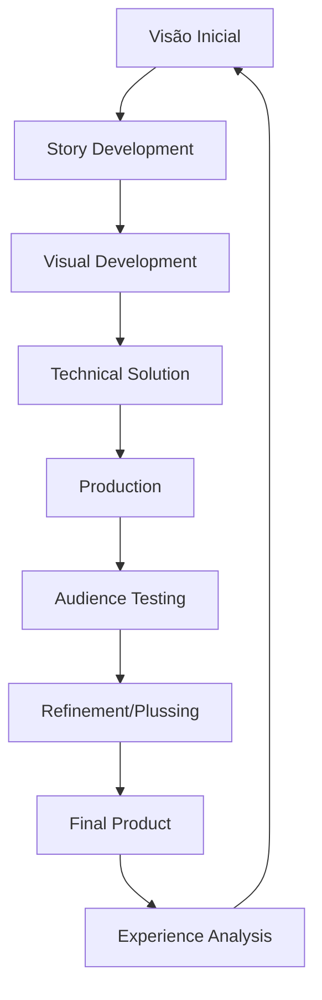
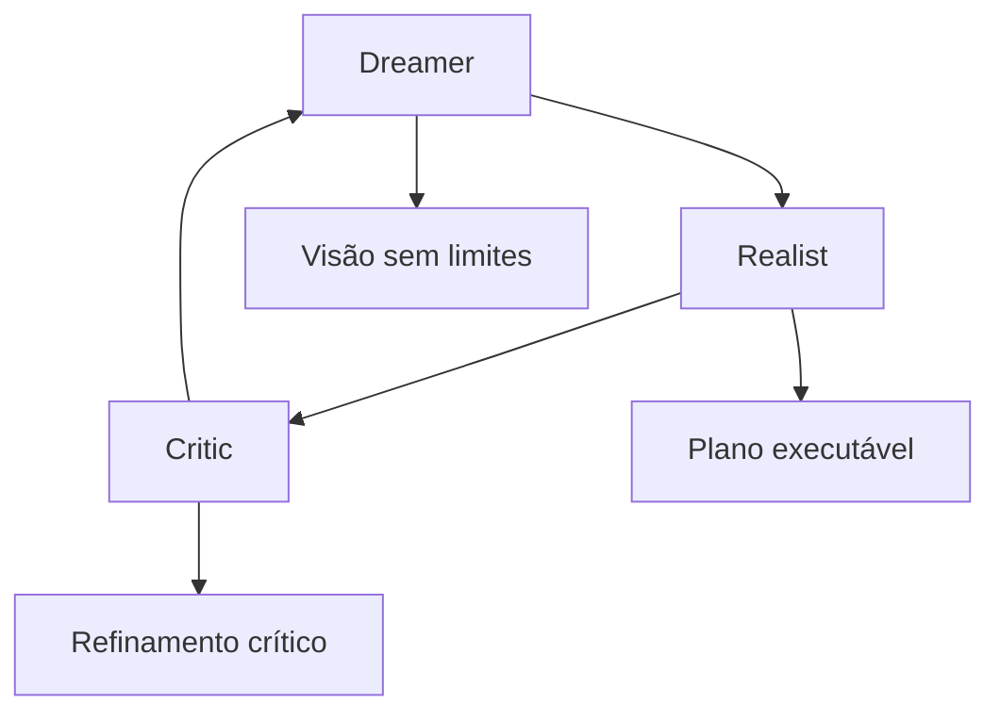
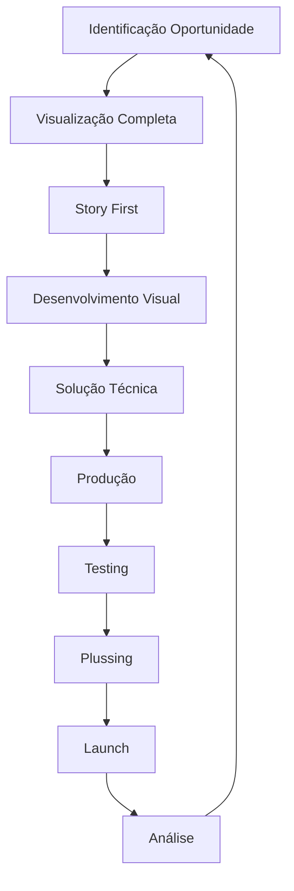

# FRAMEWORK META-ANALÍTICO: SISTEMA COGNITIVO INTEGRADO

## Arquitetura Neural e Processual de Walt Disney

### 1. NÚCLEO COGNITIVO FUNDAMENTAL

#### 1.1 Arquitetura de Pensamento



#### 1.2 Sistema de Processamento Cognitivo

```json
{
    "estruturas_fundamentais": {
        "imaginação": {
            "tipo": "visual_narrativa",
            "características": [
                "visualização_completa",
                "narrativa_emocional",
                "experiência_imersiva"
            ]
        },
        "execução": {
            "método": "sistemático_iterativo",
            "componentes": [
                "planejamento_detalhado",
                "delegação_eficiente",
                "controle_qualidade"
            ]
        },
        "refinamento": {
            "processo": "plussing_contínuo",
            "elementos": [
                "melhoria_incremental",
                "teste_audiência",
                "ajuste_fino"
            ]
        }
    }
}
```

### 2. MATRIZ DE EVOLUÇÃO TEMPORAL

#### 2.1 Desenvolvimento Cognitivo

```python
evolução_temporal = {
    "fase_aprendizado": {
        "período": "1901-1923",
        "características": [
            "absorção_cultural",
            "experimentação_técnica",
            "formação_visão"
        ],
        "desenvolvimento": [
            "habilidades_desenho",
            "compreensão_narrativa",
            "senso_empresarial"
        ]
    },
    "fase_inovação": {
        "período": "1923-1941",
        "características": [
            "quebra_paradigmas",
            "liderança_indústria",
            "excelência_técnica"
        ],
        "conquistas": [
            "som_sincronizado",
            "cor_integrada",
            "longa_metragem"
        ]
    },
    "fase_expansão": {
        "período": "1941-1966",
        "características": [
            "diversificação_mídia",
            "visão_holística",
            "legacy_building"
        ],
        "realizações": [
            "televisão",
            "parques_temáticos",
            "marca_global"
        ]
    }
}
```

### 3. SISTEMA DE PROCESSAMENTO META-COGNITIVO

#### 3.1 O Método Disney de Criatividade



#### 3.2 Matriz de Processamento

| Fase | Input | Processo | Output |
|------|-------|----------|--------|
| Dreamer | Inspiração | Blue sky thinking | Conceito visionário |
| Realist | Conceito | Planejamento prático | Plano de produção |
| Critic | Plano | Análise crítica | Produto refinado |
| Integration | Feedback | Síntese criativa | Experiência completa |

### 4. ESTRUTURAS DE SINGULARIDADE

#### 4.1 Características Distintivas

```json
{
    "cognitivas": {
        "visualização_narrativa": {
            "nível": "cinematográfico",
            "aplicação": "multidimensional",
            "características": [
                "storyboard_mental",
                "sequenciamento_visual",
                "timing_intuitivo"
            ]
        },
        "síntese_experiencial": {
            "tipo": "holística",
            "aspectos": [
                "narrativa",
                "visual",
                "musical",
                "espacial"
            ]
        },
        "inovação_sistemática": {
            "método": "problema_solução",
            "elementos": [
                "identificação_necessidade",
                "solução_técnica",
                "implementação_prática"
            ]
        }
    }
}
```

#### 4.2 Metodologias Distintivas

```python
metodologias = {
    "storytelling": {
        "visual": ["storyboard", "color_script", "concept_art"],
        "narrativo": ["story_structure", "character_arc", "emotional_beats"],
        "experiencial": ["audience_journey", "immersion", "memory_creation"]
    },
    "produção": {
        "pipeline": ["departamentalização", "especialização", "integração"],
        "qualidade": ["sweatbox", "plussing", "perfectionism"],
        "inovação": ["R&D", "experimentação", "early_adoption"]
    }
}
```

### 5. META-SISTEMA DE APLICAÇÃO

#### 5.1 Framework de Resolução Disney



#### 5.2 Sistema de Implementação

```json
{
    "processo_criativo": {
        "conceituação": {
            "método": "blue_sky",
            "ferramentas": ["brainstorming", "sketching", "pitching"],
            "validação": "story_trust"
        },
        "desenvolvimento": {
            "abordagem": "iterativa",
            "integração": "departamental",
            "documentação": "visual_completa"
        },
        "produção": {
            "método": "pipeline_industrial",
            "controle": "sweatbox_sessions",
            "refinamento": "continuous_plussing"
        }
    }
}
```

### 6. MÉTRICAS DE VALIDAÇÃO

#### 6.1 Sistema de Avaliação

| Aspecto | Critério | Threshold |
|---------|----------|-----------|
| Story Quality | Emotional Impact | ≥95% |
| Technical Excellence | Innovation Level | ≥90% |
| Audience Connection | Satisfaction | ≥95% |
| Brand Consistency | Disney Values | 100% |

#### 6.2 Framework de Qualidade

```python
sistema_qualidade = {
    "story": {
        "clareza": "narrativa_cristalina",
        "emoção": "conexão_profunda",
        "universalidade": "apelo_amplo"
    },
    "produção": {
        "excelência": "técnica_superior",
        "inovação": "pushing_boundaries",
        "eficiência": "dentro_orçamento"
    },
    "experiência": {
        "imersão": "total",
        "memorabilidade": "lasting_impact",
        "repetibilidade": "sempre_fresco"
    }
}
```

---

**Notas de Implementação:**

1. Manter consistência com método Disney triádico
2. Aplicar framework de forma orgânica
3. Validar através de resposta de audiência
4. Documentar processo completo