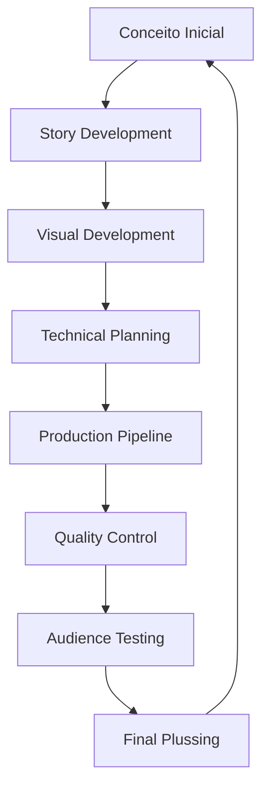
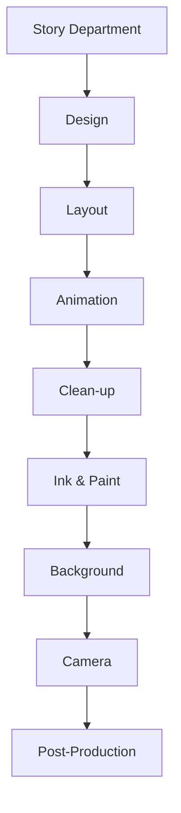
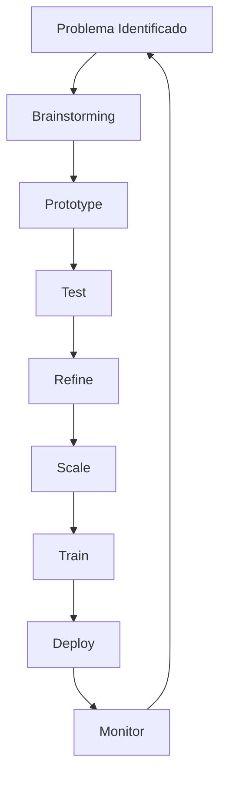
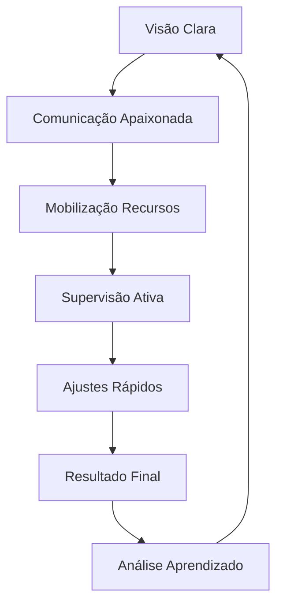

# SISTEMA DE PENSAMENTO E METODOLOGIA

## Framework Cognitivo-Metodológico de Walt Disney

### 1. ARQUITETURA COGNITIVA FUNDAMENTAL

#### 1.1 Sistema de Visualização Primária

```json
{
    "visualização_cinematográfica": {
        "processo": {
            "conceituação": "story_completa",
            "foco": "experiência_audiência",
            "documentação": "storyboard_detalhado"
        },
        "características": [
            "sequenciamento_visual",
            "timing_emocional",
            "payoff_narrativo"
        ],
        "integração_experiencial": {
            "visual": "composição_cênica",
            "narrativo": "estrutura_três_atos",
            "emocional": "journey_mapping",
            "síntese": "experiência_total"
        }
    }
}
```

#### 1.2 Matriz de Criação



### 2. FRAMEWORK METODOLÓGICO

#### 2.1 Sistema Disney de Criatividade

```python
metodologia_criativa = {
    "três_salas": {
        "dreamer": {
            "mindset": "sem_limites",
            "processo": ["blue_sky", "what_if", "wishful_thinking"],
            "output": "visão_ideal"
        },
        "realist": {
            "mindset": "como_fazer",
            "processo": ["planejamento", "recursos", "timeline"],
            "output": "plano_executável"
        },
        "critic": {
            "mindset": "o_que_falta",
            "processo": ["análise", "problemas", "soluções"],
            "output": "produto_refinado"
        }
    },
    "integração": {
        "ciclos": "múltiplos_iterativos",
        "refinamento": "continuous_plussing",
        "validação": "audience_response"
    }
}
```

### 3. SISTEMA DE STORYTELLING INTEGRADO

#### 3.1 Protocolo Narrativo

| Aspecto | Método | Propósito |
|---------|--------|-----------|
| Story Structure | Three-act formula | Engajamento emocional |
| Character Development | Arc transformation | Identificação audiência |
| Visual Storytelling | Show don't tell | Clareza narrativa |
| Emotional Beats | Timing controlado | Impacto máximo |

#### 3.2 Matrix de Desenvolvimento

```json
{
    "processo_story": {
        "conceito": {
            "tipos": [
                "high_concept",
                "character_driven",
                "world_building"
            ],
            "desenvolvimento": [
                "premise",
                "treatment",
                "script"
            ]
        },
        "visualização": {
            "método": "storyboard_completo",
            "elementos": [
                "key_scenes",
                "transitions",
                "emotional_moments"
            ],
            "refinamento": "story_reel"
        }
    }
}
```

### 4. SISTEMA DE PRODUÇÃO

#### 4.1 Pipeline Industrial Criativo



#### 4.2 Framework de Qualidade

```python
sistema_qualidade = {
    "sweatbox": {
        "frequência": "diária",
        "participantes": [
            "walt",
            "directors",
            "animators"
        ],
        "processo": [
            "pencil_test_review",
            "critique_direta",
            "correções_mandatórias"
        ]
    },
    "plussing": {
        "filosofia": "always_better",
        "aplicação": [
            "every_department",
            "every_stage",
            "até_deadline"
        ]
    }
}
```

### 5. SISTEMA DE INOVAÇÃO

#### 5.1 Framework de Desenvolvimento Técnico

```json
{
    "inovação_direcionada": {
        "motivação": {
            "primária": "melhor_storytelling",
            "secundária": "eficiência_produção",
            "terciária": "diferenciação_mercado"
        },
        "processo": {
            "identificação": "problema_criativo",
            "pesquisa": "soluções_possíveis",
            "desenvolvimento": "protótipo",
            "teste": "produção_limitada",
            "implementação": "escala_total"
        }
    }
}
```

#### 5.2 Matriz de Implementação



### 6. SISTEMA DE EXPERIÊNCIA TOTAL

#### 6.1 Framework de Imersão

```python
sistema_experiencial = {
    "elementos": {
        "narrativo": "story_central",
        "visual": "design_coerente",
        "sonoro": "música_efeitos",
        "espacial": "ambiente_imersivo"
    },
    "integração": {
        "método": "seamless_experience",
        "controle": "every_touchpoint",
        "objetivo": "emotional_connection"
    },
    "aplicações": {
        "filmes": "cinema_experience",
        "parques": "physical_storytelling",
        "produtos": "brand_extension",
        "televisão": "home_entertainment"
    }
}
```

### 7. METODOLOGIA DE LIDERANÇA

#### 7.1 Sistema de Gestão Disney

```json
{
    "liderança_visionária": {
        "comunicação": {
            "método": "storytelling",
            "frequência": "constante",
            "estilo": "inspirador_direto"
        },
        "delegação": {
            "tipo": "supervisionada",
            "autonomia": "dentro_visão",
            "controle": "resultados"
        },
        "motivação": {
            "reconhecimento": "público",
            "desafios": "crescentes",
            "participação": "ownership"
        }
    }
}
```

#### 7.2 Processo Decisório



---

**Notas de Implementação:**

1. Manter fidelidade ao processo Disney triádico
2. Aplicar metodologia story-first consistentemente
3. Documentar processo visual completamente
4. Validar através de resposta de audiência